# 《OpenGauss一体化平台》		

版本修订记录

|**序号**|**修改后版本号**|**生效日期**|**变更记录**|**更改人**|**审核**|**备注**|
| :-: | :-: | :-: | :-: | :-: | :-: | :-: |
|1|V1.0|2022-12-01||arkin|||
||||||||
||||||||
||||||||

## 1. 引言
 ### 1.1  编写目的
本文档主要描述软件操作使用方法。本文档适用于管理员、各角色数据使用人员。

 ### 1.2  适用范围
使用该软件的所有技术人员与客户人员。
## 2.  客户端环境要求
 ### 2.1  硬件设备要求

|**用途**|**性能要求**|
| :-: | :-: |
|客户端|CPU：4核8G 2.0GHz 内存：128GB|
 ### 2.2  支撑软件
支持软件,包括要用到的操作系统、浏览器等。

|**用途**|**支撑软件**|**操作系统**|
| :-: | :-: | :-: |
|客户端|Chrome|Windows 10 |
## 3. 业务功能使用方法
 ### 3.1  AZ管理
左侧菜单栏点击【资源中心】-【AZ管理】进入该页面。

搜索栏：点击“搜索栏”，输入关键词进行查询。

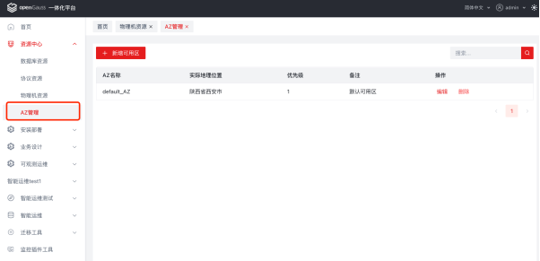

 #### 3.1.1  新增
点击【新增可用区】按钮，弹出新增可用区窗口，填写有效即可新增可用区。

注：AZ名称不能重复。

“新增可用区”弹窗，输入有效内容后点击【确定】即可新增成功。

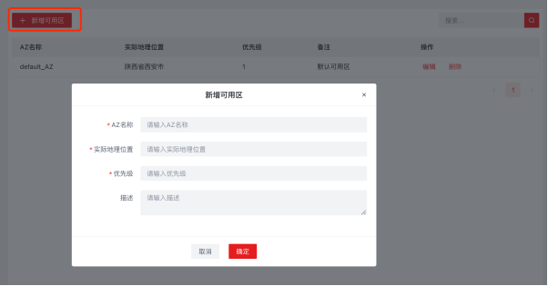

 ####3.1.2  编辑
列表选择可用区，点击操作项【编辑】，弹出“编辑可用区”窗口，即可编辑该可用区信息。

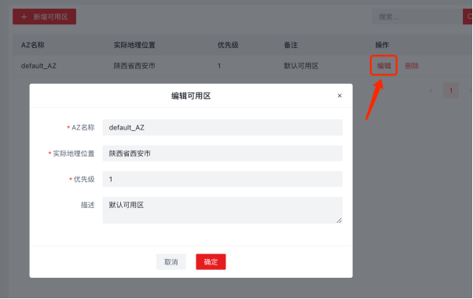

 #### 3.1.3  删除
列表选择可用区，点击操作项【删除】，删除确认框内点击【确定】，即可删除该可用区。

 ### 3.2  物理机资源
左侧菜单栏点击【资源中心】-【物理机资源】进入该页面。

搜索栏：点击“搜索栏”，输入关键词进行查询。

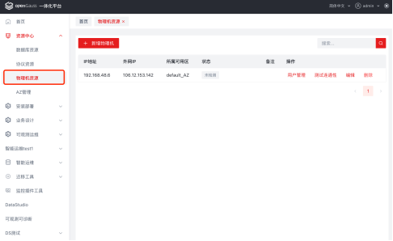

 #### 3.2.1  新增物理机
点击【新增物理机】按钮，弹出新增物理机窗口，填写有效即可新增物理机。

注：IP地址+外网地址唯一判断，不能重复。

“新增物理机”弹窗，输入内容后点击【连通性测试】测试当前IP是否可连接。

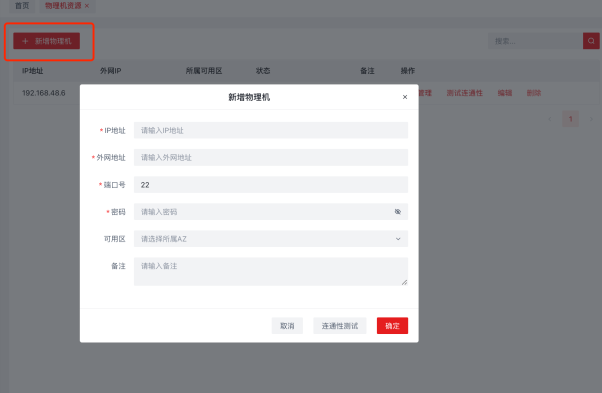

 #### 3.2.2  用户管理
列表选择物理机，点击操作项【用户管理】，弹出“用户管理”窗口，显示该物理机用户列表，可以管理该物理机所有用户，添加、编辑、删除用户。

注：root用户无法删除。

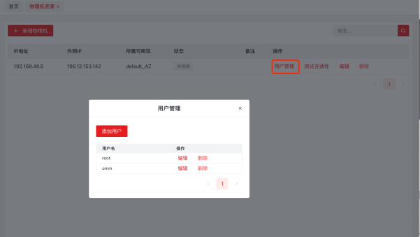
 #### 3.2.3  测试连通性
列表选择物理机，点击操作项【测试连通性】，弹出“安全检验”窗口，密码输入有效并确定，验证通过后自动连接该物理机。

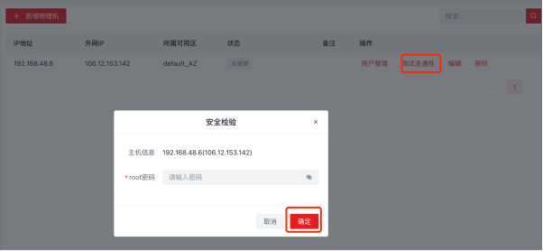

 #### 3.2.4  编辑
列表选择物理机，点击操作项【编辑】，弹出“编辑物理机”窗口，即可编辑该物理机信息。

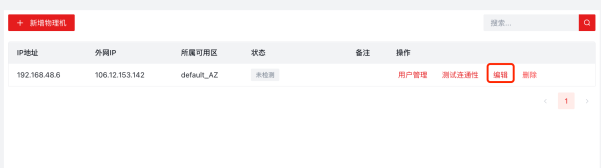
 #### 3.2.5 删除
列表选择物理机，点击操作项【删除】，删除确认框内点击【确定】，即可删除该物理机。

 ### 3.3  安装包管理
左侧菜单栏点击【可观测运维】-【安装包管理】进入该页面。

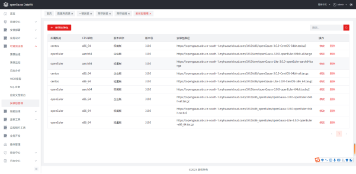
 #### 3.3.1  新增安装包
点击【新增安装包】按钮，弹出新增安装包窗口，填写有效即可新增安装包。

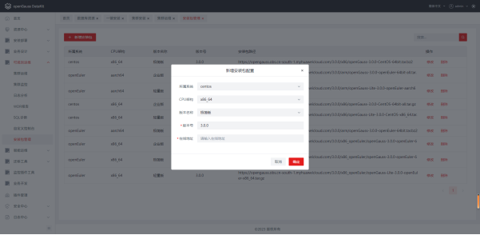
 #### 3.3.2  编辑
列表选择安装包，点击操作项【修改】，弹出“修改”窗口，即可编辑该安装包信息。

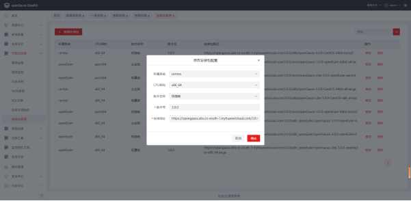
 #### 3.3.3  删除
列表选择安装包，点击操作项【删除】，删除确认框内点击【确定】，即可删除该安装包。

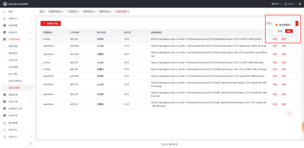

 ### 3.4  一键安装
左侧菜单栏点击【安装部署】-【一键安装】进入该页面。
 #### 3.4.1  安装-选择主机
选择主机IP，root密码输入有效，点击【一键安装】进入安装页面。

主机IP：默认显示所有物理机。

root密码：安全校验，需填写物理机对应密码。

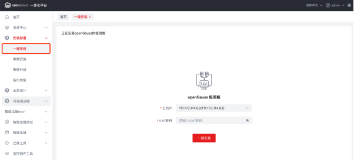

 #### 3.4.2  安装中
选择主机IP，root密码输入有效，点击【一键安装】进入安装中页面。

显示安装实时进程信息。

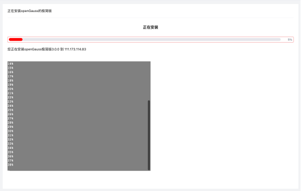
 #### 3.4.3  安装失败
安装失败后，左侧控制台显示安装失败信息。右侧显示自定义控制台、重试按钮。

重试：点击后自动重新安装。

自定义控制台：可以输入命令并执行，手动安装。

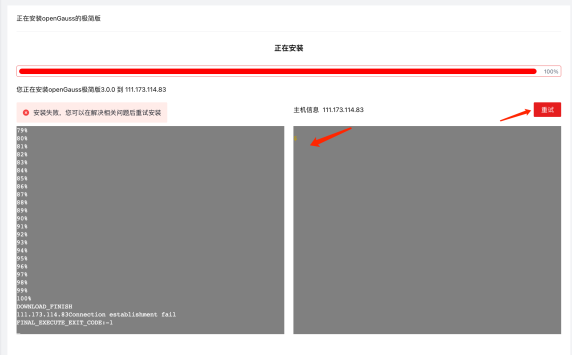

 #### 3.4.4  安装成功
安装成功时，跳转安装成功页面，点击【集群运维】跳转集群运维页面。

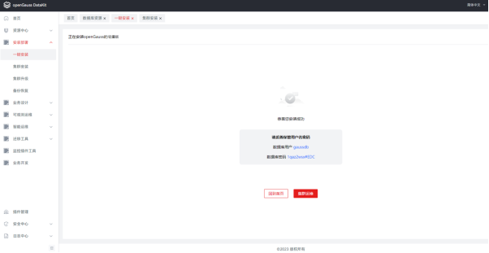
 ### 3.5  集群安装
左侧菜单栏点击【安装部署】-【集群安装】进入该页面。

 #### 3.5.1  选择版本

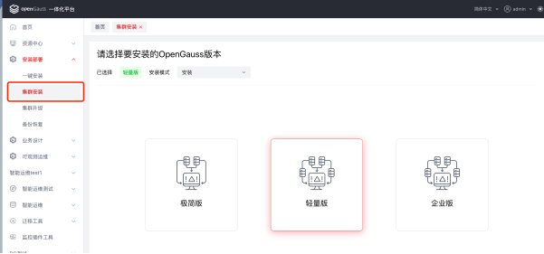
 #### 3.5.2  选择安装方式
安装模式：安装、导入，默认选择「安装」

默认安装模式，选择安装版本，点击【下一步】跳转选择“选择安装方式”页面。

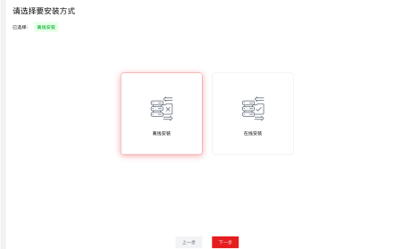

1. 离线安装：选择后，跳转安装包选择页面。支持输入目录选择安装包文件。

2. 在线安装：选择后，跳转安装包下载页面，支持【下载】安装包，下载后成功【下一步】跳转安装步骤页面。

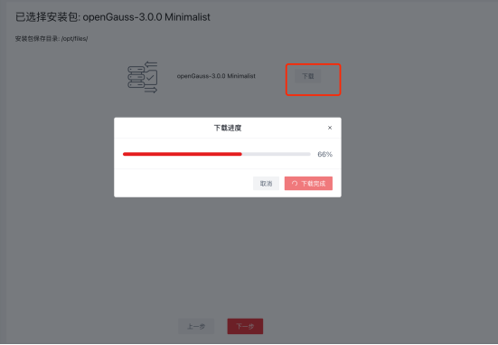

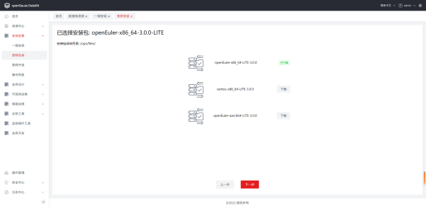
 #### 3.5.3  部署方式
安装模式选择导入，选择安装版本，点击【下一步】跳转选择安装步骤页面

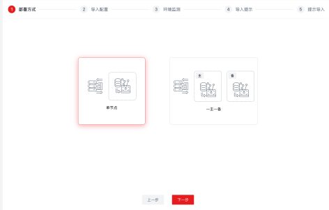

 #### 3.5.4  极简版安装
安装版本页面，选择「极简版版」点击【下一步】，选择安装方式后下一步

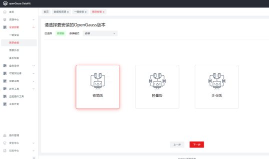

1. 安装步骤-部署方式

安装步骤页面，部署方式选择单节点或一主一备，点击【下一步】跳转安装配置页面

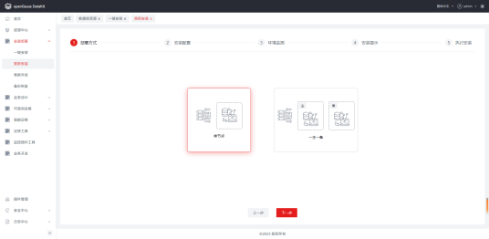

2. 安装步骤-安装配置

安装配置页面，填写配置信息有效，点击【下一步】校验通过后，跳转环境检测页面。

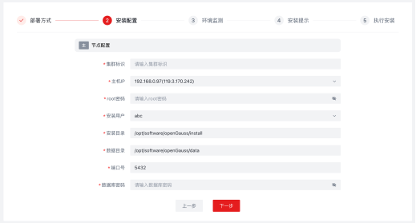

3. 安装步骤-环境检测

安装配置页面，填写配置信息有效，点击【下一步】校验通过后，跳转环境检测页面。

自动检测当前安装主机硬件环境、软件环境，检测完成后弹出对应提示信息。

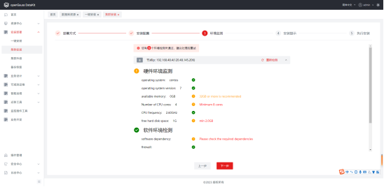

4. 安装步骤-安装提示

安装提示页面，显示安装提示信息，点击【下一步】校验通过后，跳转执行页面。

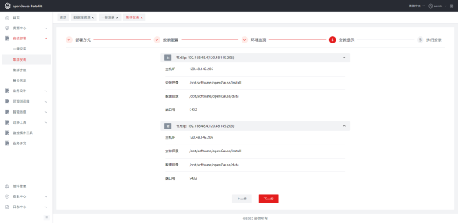

5. 安装步骤-执行安装

安装页面，自动进行安装显示安装进度及进程。

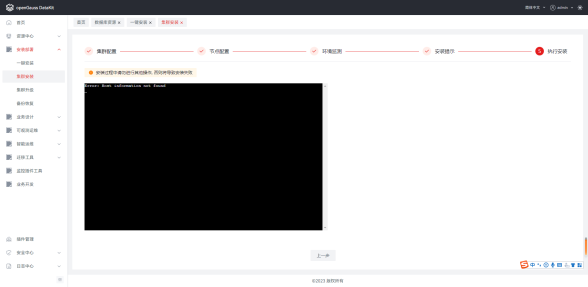

安装成功后，点击下方【集群运维】按钮即可跳转[集群运维]页面，进行集群管理。

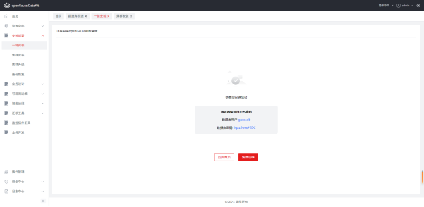
 #### 3.5.5  轻量版安装
安装版本页面，选择「轻量版」点击【下一步】

1. 安装步骤-部署方式

选择单节点或一主一备，进行安装配置。

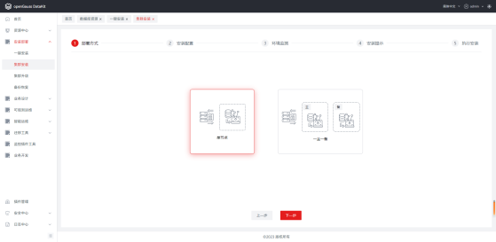

2. 安装步骤-安装配置

安装配置页面，填写配置信息有效，点击【下一步】校验通过后，跳转环境检测页面。

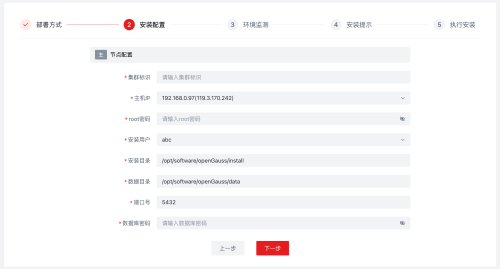

3. 安装步骤-环境检测

安装配置页面，填写配置信息有效，点击【下一步】校验通过后，跳转安装提示页面。

自动检测当前安装主机硬件环境、软件环境，检测完成后弹出对应提示信息。

4. 安装步骤-安装提示

安装提示页面，显示安装提示信息，点击【下一步】校验通过后，跳转执行页面。

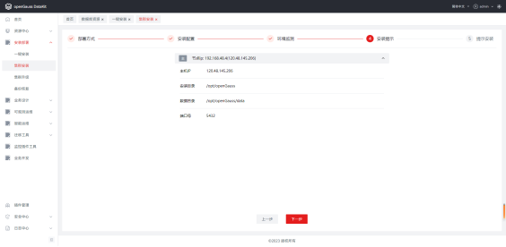

5. 安装步骤-执行安装

安装页面，自动进行安装显示安装进度及进程。

安装成功后，点击下方【集群运维】按钮即可跳转[集群运维]页面，进行集群管理。

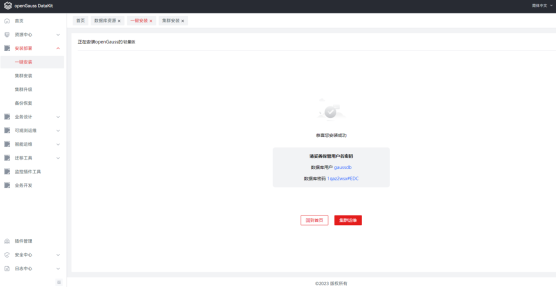

若安装失败时，可右侧自定义控制台输入命令或点击【重试】按钮

 #### 3.5.6 企业版安装

1. 安装版本页面，安装方式选择“安装”，版本选择「企业版」点击【下一步】进入安装步骤。

1.1  安装步骤-集群配置

集群配置页面，输入配置信息，点击【下一步】校验通过后跳转节点配置步骤。

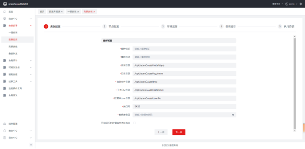

1.2  安装步骤-节点配置：

节点配置页面，填写配置信息有效，点击【下一步】校验通过后，跳转环境检测页面。

点击「添加节点」可以直接新增节点。

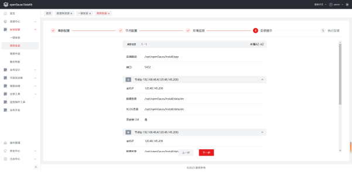

1.3  安装步骤-环境检测

安装配置页面，填写配置信息有效，点击【下一步】校验通过后，跳转安装提示页面。

自动检测当前安装主机硬件环境、软件环境，检测完成后弹出对应提示信息。

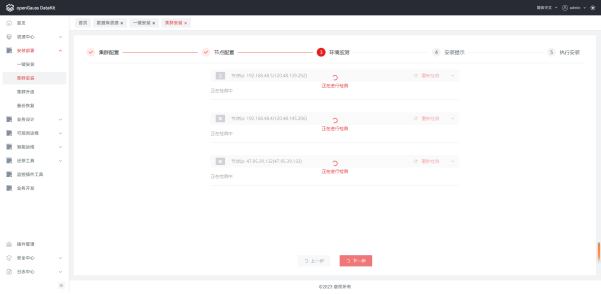

1.4  安装步骤-安装提示

安装提示页面，显示安装提示信息，点击【下一步】校验通过后，跳转执行页面。

1.5  安装步骤-执行安装

安装页面，自动进行安装显示安装进度及进程。

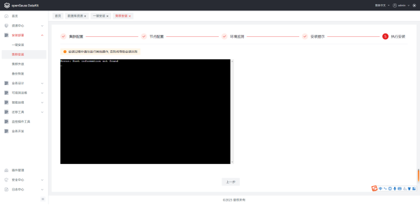

安装成功后，点击下方【集群运维】按钮即可跳转[集群运维]页面，进行集群管理。

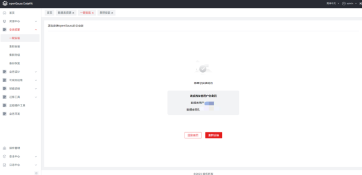

若安装失败时，可右侧自定义控制台输入命令或点击【重试】按钮

2. 安装版本页面，安装方式选择“导入”，版本选择「企业版」点击【下一步】进入安装步骤。

2.1  安装步骤-集群配置

集群配置页面，输入配置信息，点击【下一步】校验通过后跳转节点配置步骤。

2.2  安装步骤-节点配置：

节点配置页面，填写配置信息有效，点击【下一步】校验通过后，跳转环境检测页面。

点击「添加节点」可以直接新增节点。

2.3  安装步骤-环境检测

安装配置页面，填写配置信息有效，点击【下一步】校验通过后，跳转安装提示页面。

自动检测当前安装主机硬件环境、软件环境，检测完成后弹出对应提示信息。

2.4  安装步骤-安装提示

安装提示页面，显示安装提示信息，点击【下一步】校验通过后，跳转执行页面。

2.5  安装步骤-执行安装

安装页面，自动进行安装显示安装进度及进程。

安装成功后，点击下方【集群运维】按钮即可跳转[集群运维]页面，进行集群管理。

若安装失败时，可右侧自定义控制台输入命令或点击【重试】按钮

 ### 3.6  集群运维
左侧菜单栏点击【可观察运维】-【集群运维】进入该页面。

显示所有集群信息，也可以对集群、主机、实例进行操作。

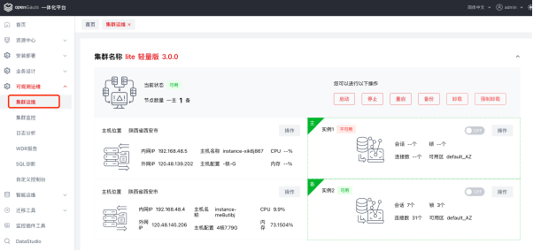

 #### 3.6.1  集群操作
启动：点击后可启动该集群。

停止：点击后可停止该集群。

重启：点击后可重新启动该集群。

备份：点击后自动生成备份。

卸载：点击后可卸载该集群。

强制卸载：点击后可强制卸载该集群。

集群操作区域，点击按钮后弹出执行窗口

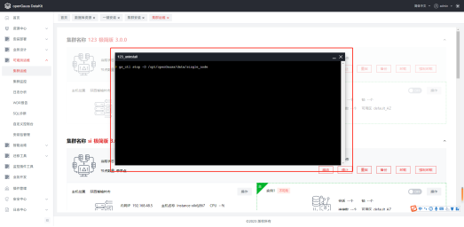

 #### 3.6.2  实例操作
1. 集群区域内，选择主机点击操作，可进行【启动所有实例、停止所有实例】

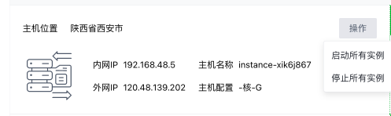

2. 集群区域内，选择实例点击开启、关闭实例，点击操作-可以进行【重启】

 ### 3.7  集群监控
左侧菜单栏点击【可观察运维】-【集群监控】进入该页面。

搜索区域：集群名称、主机IP筛选，其中集群名称、主机IP均默认第一项。
1. #### CPU使用率
横轴：当前主机CPU使用率占比（%）
纵轴：当前时间格式，MM:SS

2. #### 内存占用率
横轴：当前主机内存占用率（%）

纵轴：当前时间格式，MM:SS

3. #### 网络状态
横轴：当前主机网络状态（G）

纵轴：当前时间格式，MM:SS

4. #### 锁
横轴：当前主机锁（pcs）

纵轴：当前时间格式，MM:SS

5. #### 会话
横轴：当前主机会话（pcs）

纵轴：当前时间格式，MM:SS

6. #### 连接数
横轴：当前主机连接数（pcs）

纵轴：当前时间格式，MM:SS

7. #### 占用内存最多的会话TOP10
横轴：会话sessionID

纵轴：占用内存

按照占用内存大小倒序。

 ### 3.8  日志分析
左侧菜单栏点击【可观察运维】-【日志分析】进入该页面。

搜索区域：集群名称、IP地址-均默认选择第一项。

包含tab：系统日志、操作日志、审计日志、性能日志、黑匣子日志
 #### 3.8.1  系统日志
系统日志tab页面，默认显示当前集群对应主机的系统日志。切换集群及IP地址后，页面刷新显示对应IP地址的系统日志信息。

 #### 3.8.2  操作日志
操作日志tab页面，默认显示当前集群对应主机的操作日志。切换集群及IP地址后，页面刷新显示对应IP地址的操作日志信息。可点击查看操作日志信息。

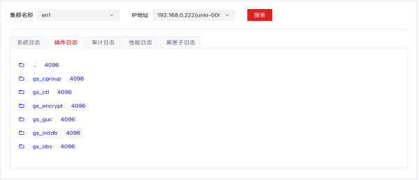
 #### 3.8.3  审计日志
审计日志tab页面，默认显示当前集群对应主机的审计日志。支持日期时间筛选，切换集群及IP地址后，页面刷新显示对应IP地址的审计日志信息。可点击查看操作日志信息。

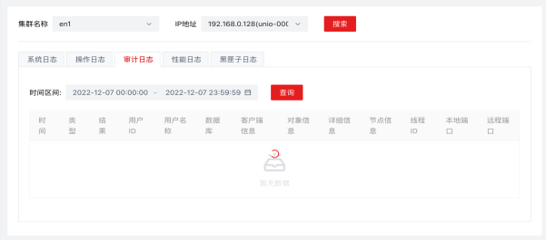

 #### 3.8.4  性能日志
性能日志tab页面，默认显示当前集群对应主机的性能日志。切换集群及IP地址后，页面刷新显示对应IP地址的性能日志信息。可点击查看、下载日志信息。

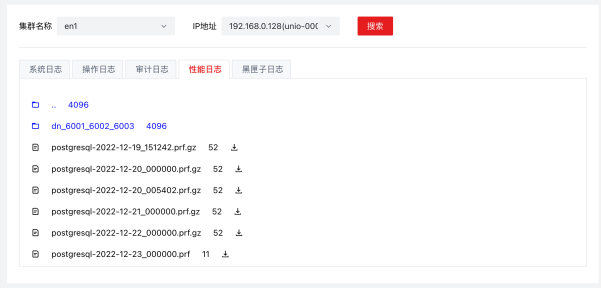

 #### 3.8.5  黑匣子日志
黑匣子日志tab页面，默认显示当前集群对应主机的黑匣子日志。切换集群及IP地址后，页面刷新显示对应IP地址的黑匣子日志信息。可点击查看、下载日志信息。

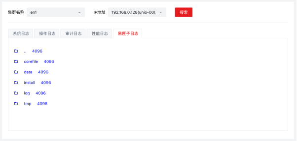

 ### 3.9  WDR报告
左侧菜单栏点击【可观察运维】-【WDR报告】进入该页面。

搜索区域：通过集群名称、报告范围、报告类型、生产时间条件进行筛选。

列表显示所有WDR报告信息。

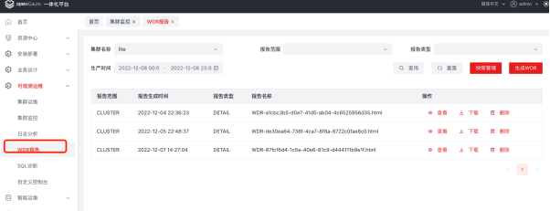
 #### 3.9.1  查看报告
列表选择报告数据，操作项点击【查看】

打开新tab页面，显示该报告

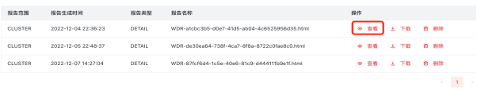
 #### 3.9.2  下载
列表选择报告数据，操作项点击【下载】

下载该报告文件。

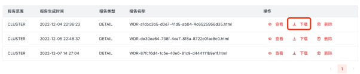
 #### 3.9.3  删除
列表选择报告数据，操作项点击【删除】

删除确认框内点击【确定】，即可删除该报告。

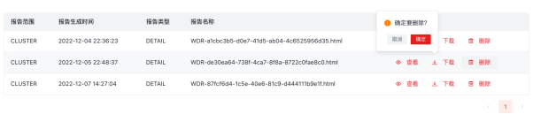

 #### 3.9.4  快照管理
WDR报告页面左上角，点击【快照管理】，弹出“快照管理”窗口。

快照管理页面，可以创建快照、筛选快照。

1. 筛选区域：集群名称、主机IP

集群名称、主机IP：均默认选择第一项，即列表默认显示该集群主机IP下对应快照信息。

2. 创建快照：

点击【创建快照】按钮，自动为当前集群&主机IP-生成快照信息。

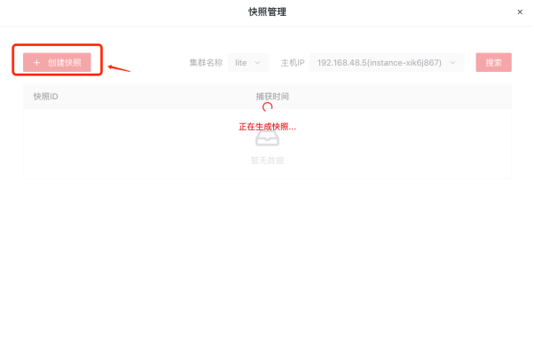

 ### 3.10  SQL诊断
左侧菜单栏点击【可观察运维】-【SQL诊断】进入该页面，显示当前主机SQL诊断信息。

集群名称及默认选择第一项，时间控件默认选择当天。

集群名称：点击可选择所有集群

主机IP：点击后展开显示已选择集群下所有主机

时间：点击后可选择开始时间及结束时间

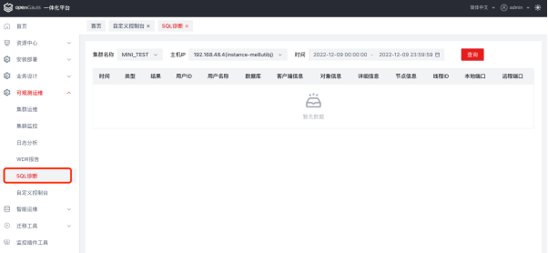

 ### 3.11  自定义控制台
左侧菜单栏点击【可观察运维】-【自定义控制台】进入该页面。

主机IP默认选择第一项，需要输入root密码进行安全校验。

root密码校验成功后，自动连接该主机；连接成功后，控制台可直接输入命令执行。

