**数据建模产品使用手册**

# **文档历史**

|**修订日期**|**修订内容**|**版本号**|**编写人**|
| :-: | :-: | :-: | :-: |
|2022/12/10|初稿|1.0|贺帅|
|2023/1/13|修改MD版本|1.1|贺帅|
|||||

# **关于本手册**

## **产品介绍**
基于WEB开发openGauss的数据流可视化编辑工具，实现零编程数据建模，通过拖拽、连接的方式完成简单的数据流设计。通过构建不同的数据流实例，并使用一体化平台中管理的数据库实例作为数据源，支持每一步节点的数据调试、生成图表及分享，可以快速方便的对各个业务库进行测试、数据采集、报表生成。

随着openGauss开源数据库的逐渐普及，有许多新用户可能由于语法差异、学习成本等原因放弃尝试。本特性希望让任何没有实际使用过openGauss的用户都可以通过平台快速完成数据操作体验，降低其上手难度，从而提升用户的兴趣度和深入探索的可能性。

## **主要功能介绍**
1. 可视化编辑，提供拖拽、连线的操作方式完成数据流算子的组装、配置，并根据算子组合生成对应的sql及运行结果；
1. 实时图表生成，支持读取单步算子执行结果为用户生成自定义图表，并可以记录快照；
1. 可将一个或多个图表快照通过自由排布的方式构建报表，并可通过外链分享给游客用户

## **预期读者**
测试人员

开发人员

普通用户

## **版本及功能列表**

|**版本号**|**新增功能**|**发布时间**|
| :-: | :-: | :-: |
|V1.0|首次发布|2022-12-10|

# **插件的安装**

## **一体化平台插件管理页面**
### **概述**
可在本页面对数据建模插件进行安装、升级、卸载。
### **角色**
拥有插件添加权限的角色可以访问
### **界面**
1、安装插件

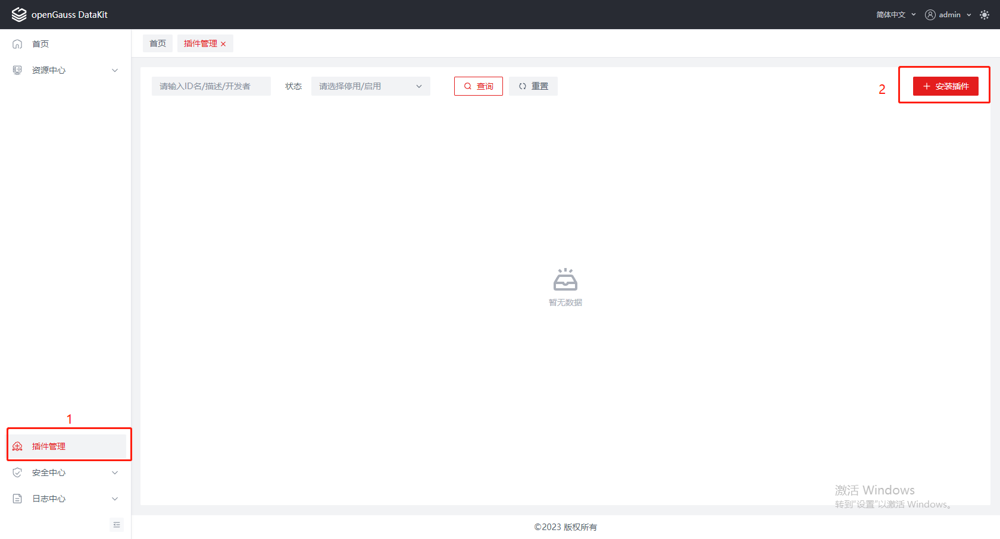

**说明：**

1) 左侧下方点击插件管理菜单；
1) 点击右上安装插件按钮。

2、选择安装包（通过编译打包脚本获得）

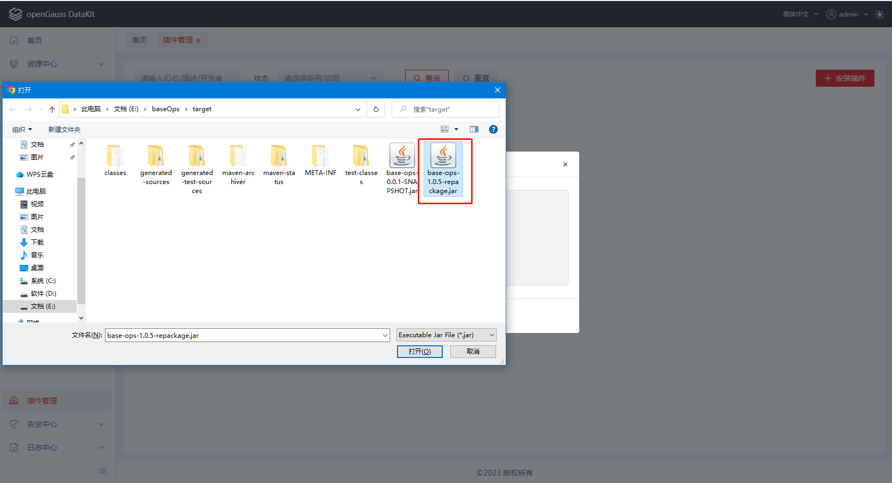

**说明：**

1) 在弹出框中点击上传按钮；
1) 选择插件包目录，选中插件包，上传完成后点击确定即可。

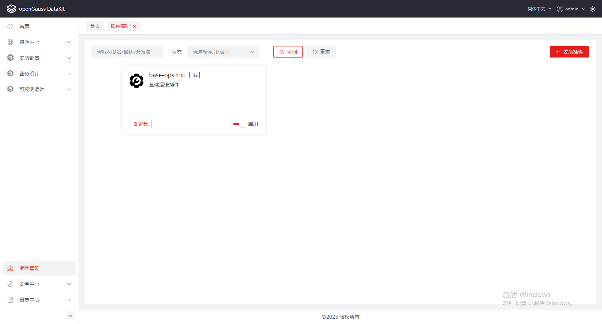

**说明：**

1. 等待安装完成后页面会自动刷新，可以在左侧菜单栏看到（1）处的菜单项，在（2）处看到base-ops插件卡片，即为安装成功；

   

## **物理机管理页面**
### **概述**
在本页面可以完成对物理机实例的新增、编辑、删除等操作，本功能属于一体化基座提供的基础功能，本插件依赖该服务所提供的实例，在使用本数据建模插件之前必须完成至少一个物理机实例的配置。
### **角色**
拥有物理机实例管理权限的角色可以访问
### **界面**
1. 新增物理机
## 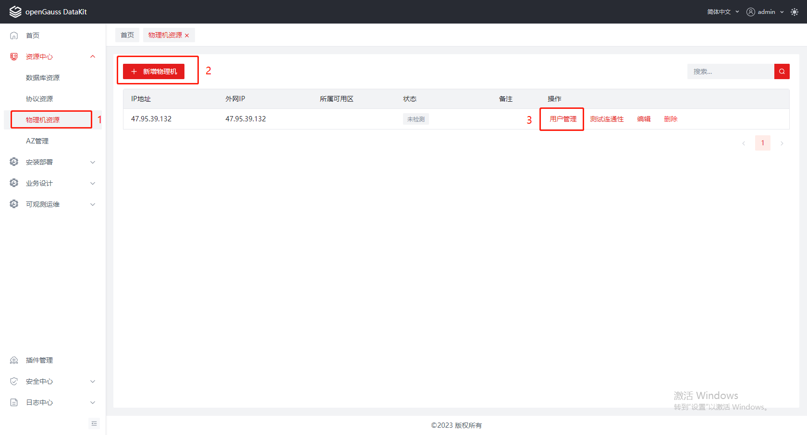

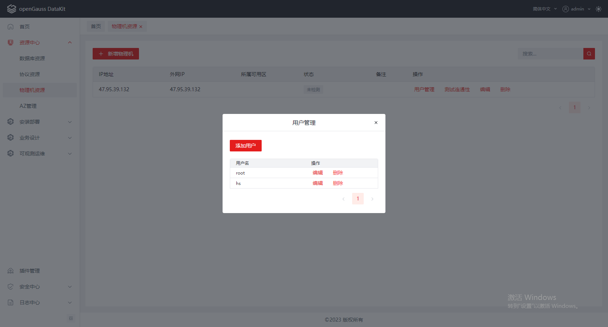

**说明：**

1左侧菜单栏找到【资源中心】-【物理机资源】菜单，点击打开管理页面；

2点击新增物理机，并填写IP、端口等信息。

3在新增好的物理机实例上点击用户管理，编辑root用户密码，并添加对openGauss数据库拥有访问权限的系统用户（如安装用户）。

## **集群安装页面**
### **概述**
在本页面可以完成对集群实例的安装、导入等操作，本功能属于一体化基座提供的基础功能，本插件依赖该服务所提供的实例，在使用本数据建模插件之前必须完成至少一个集群实例的配置。
### **角色**
拥有集群管理权限的角色可以访问
### **界面**
1、导入已有集群实例

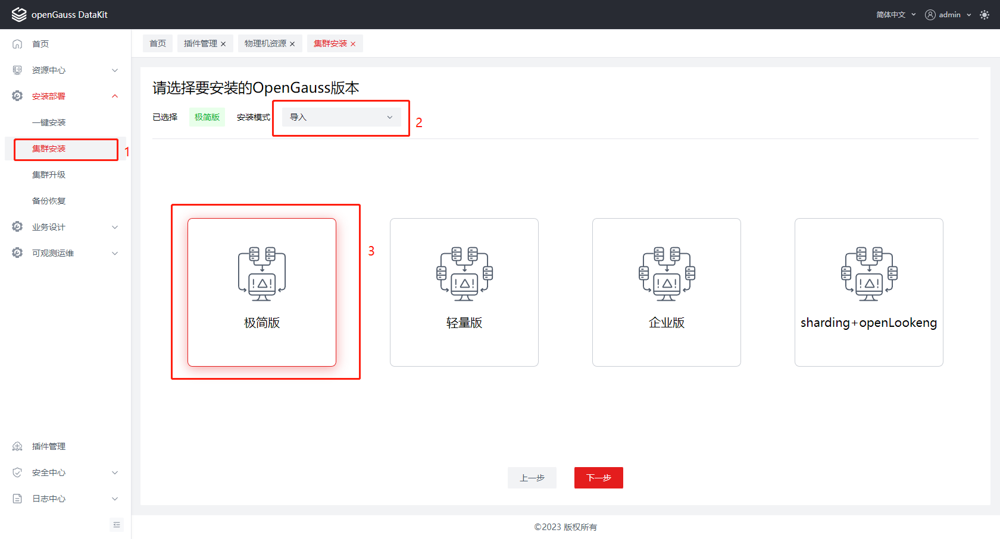

**说明：**

1左侧菜单栏找到【安装部署】-【集群安装】菜单，点击打开安装详情页面；

2本手册默认用户已有数据库实例（如需全新安装集群，请参考运维插件使用手册），此处安装模式选择【导入】，在下方选择对应的数据库版本。

3点击下一步。

2、填写导入配置

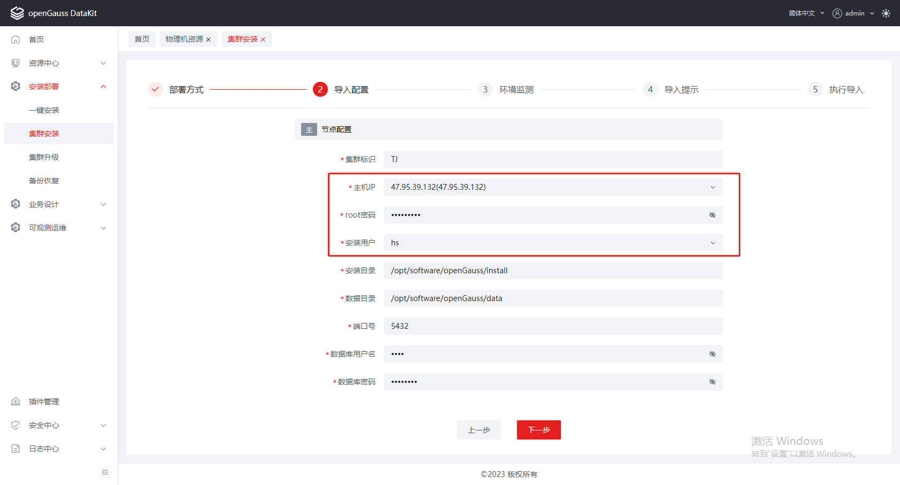

**说明：**

1在主机IP处选择之前新建的物理机实例，并输入该实例的root密码；

2安装用户选择对该数据库拥有管理权限的用户，此处为之前添加的系统用户hs。

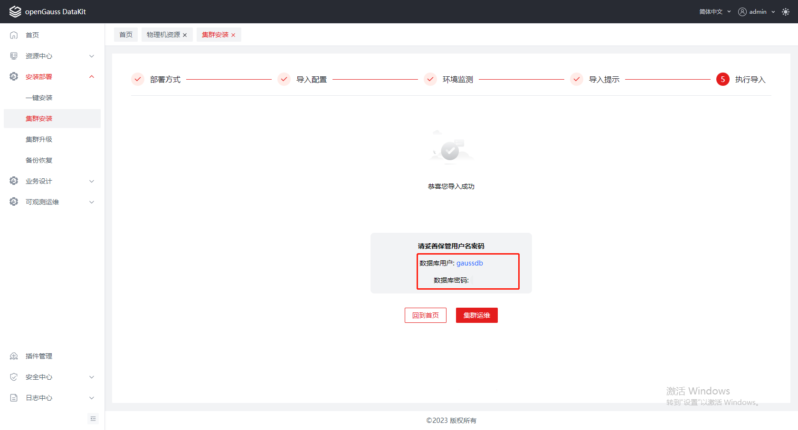

3依次点击后续下一步，直到导入完成。

## **数据流管理页面**

### **概述**
在本页面可以完成对数据流实例的新增、编辑、删除等操作，支持名称模糊搜索，支持分页动态加载。
### **角色**
拥有数据流设计权限的角色可以访问
### **界面**
1、新增数据流

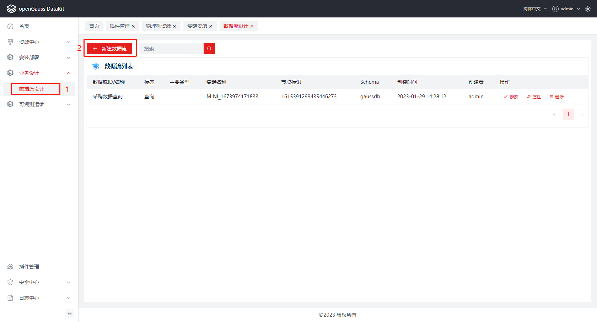

**说明：**

1左侧菜单栏找到【业务设计】-【数据流设计】菜单，点击打开管理页面；

2点击上方新建数据流按钮

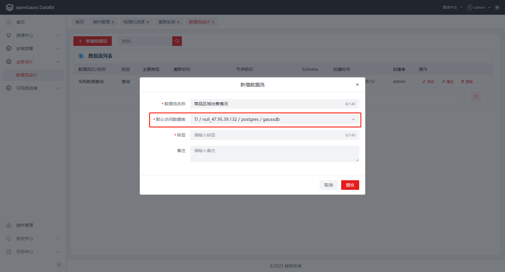

3在弹出框中填写数据流名称，在默认数据库一栏中选择之前导入的数据库实例，点确认即可完成新建，页面自动刷新并在列表中看到刚才新增的数据流即为添加成功。

## **数据流详情页面（算子菜单区）**
### **概述**
在本页面可以完成对数据流内算子的组装，运行，可视化等操作。本页面通过数据流管理页任意实例的【修改】按钮进入。
### **角色**
拥有数据流设计权限的角色可以访问
### **界面**
1、算子菜单

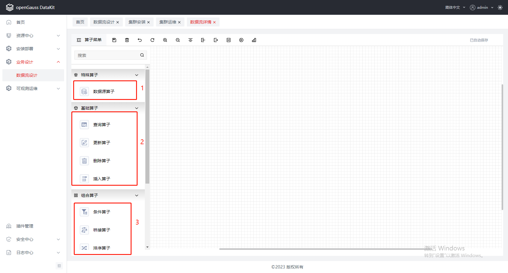

**说明：**

1数据源算子（可选算子），如果一个算子序列的开头连接了该算子，则会使用数据源算子中配置的数据库连接来执行SQL，否则会使用数据流新建时配置的默认数据库连接；

2基础算子，包含四大基础类型增删改查，一个有效算子序列有且只能有一个基础算子。

3组合算子，在符合规则的前提下（规则详见后续算子配置篇）可以在基础算子下方连接任意数量的组合算子。

## **数据流详情页面（快捷操作区）**
### **概述**
快捷操作区主要提供对右侧绘制面板的便捷操作，如保存、放大、缩小、撤销、恢复、导入导出等功能。
### **角色**
拥有数据流设计权限的角色可以访问
### **界面**
1、快捷操作区

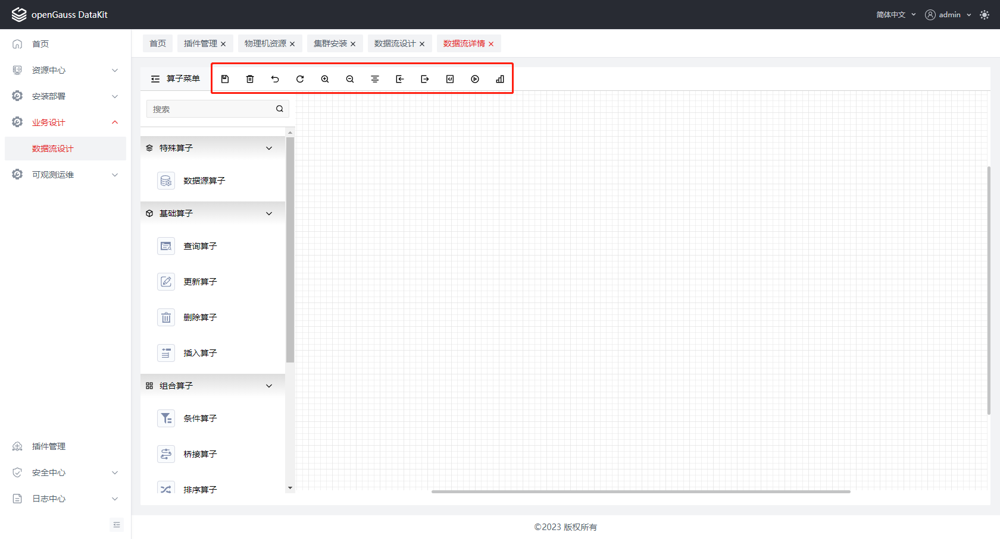**说明：**

1进入工作区后会定时执行自动保存，也可通过点击（1）处保存按钮手动保存。

2选择任意算子后，点击删除按钮，即可删除该算子以及与之相连的箭头。

3点击撤销按钮可回退一步操作，点击恢复按钮可将上一次撤销行为恢复。

4点击放大、缩小按钮可对工作区视图进行放大缩小。

5点击居中按钮会使工作焦点回到中心。

6点击导出按钮可以将完整的算子配置导出为json文件，或导出为png、svg图片。

7点击导入按钮可以将之前导出的json文件上传并导入。

## **数据流详情页面（算子绘制区）**
### **概述**
改区域用来组装各个拖入其中的算子，按用户所需绘制数据流结构。
### **角色**
拥有数据流设计权限的角色可以访问
### **界面**
1、算子工作区

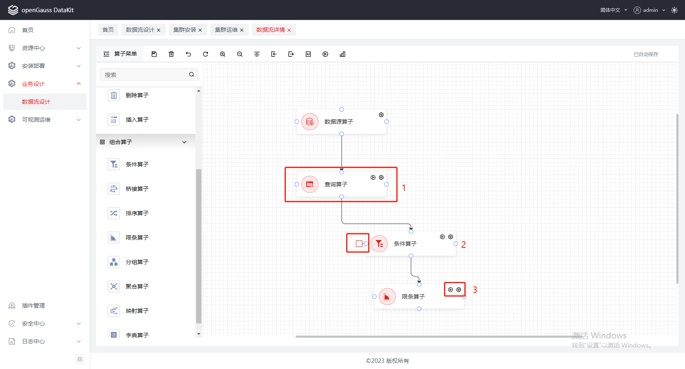

**说明：**

1每个算子通过四周4个圈点拖出箭头连接。

2每个算子前面有个复选框，勾选之后会使得算子无效，但并不会删除该算子，可以用来进行一些临时调试。

3每个算子上有两个按钮，分别为齿轮状的配置按钮，以及播放状的可视化按钮。

## **数据流详情页面（SQL运行及预览）**
### **概述**
该页面用来展示SQL查询结果，如果有多个查询结果，则通过多个tab标签的方式呈现。
### **角色**
拥有数据流设计权限的角色可以访问
### **界面**
1. SQL运行界面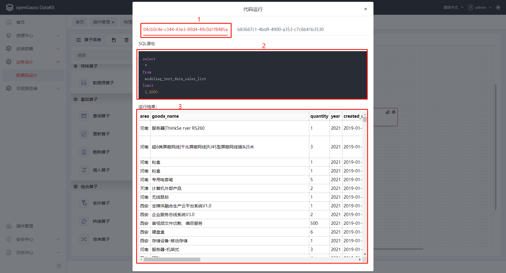

**说明：**

1配置好算子流之后，点击快捷操作栏中的【播放】按钮，可以看到SQL语句以及对应的查询结果。

2（1）处为tab标签页，如果存在多个查询语句，则会分为多个标签点击切换。

3.（2）处为SQL语句预览区

4（3）处为查询结果区

## **可视化图表新增**
### **概述**
在本页面可以对执行到该算子的查询结果进行可视化展示，可以通过配置一个或多个图表信息，支持的图表类型有：柱状图、折线图、混合图、热力图、饼图、地理图、关系图。
### **角色**
拥有数据流设计权限的角色可以访问
### **界面**
1、算子菜单

**说明：**

1点击任意算子上的播放按钮，可以进入该算子的独立可视化配置界面。

2在（1）处点击新建图表弹出可以新建的所有图表类型，选择任意一个即可开始配置可视化参数，每个算子可以新增多个图表。

## **可视化图表配置页面**
### **概述**
在本页面可以对执行到该算子的可视化图表进行配置，对同一组查询数据根据不同的参数会得到完全不同的图表。
### **角色**
拥有数据流设计权限的角色可以访问
### **界面**
1、图表配置项

**说明：**

1 X轴配置即图表的横坐标下标分组的来源依据，仅出现在柱状图、折线图中，此类配置分为根据数据字段排列，或对时间类型的字段排列（需配置粒度）

2 统计指标为每个分组类别中Y轴的值来源，可以从查询结果中类型为整型、浮点型的字段中选择。

3 统计维度，在X轴分组的基础之上，再次进行多个维度的分组可在此处配置

4.点击预览按钮后，会出现生成快照按钮，点击则会保存一份独立图表快照信息到历史记录中。

## **可视化图表快照管理**
### **概述**
在本页面可以对之前生成的快照进行预览管理，并使用它们生成多个不同的报表来进行分享展示。
### **角色**
拥有数据流设计权限的角色可以访问
### **界面**
1. 可视化展示

   

   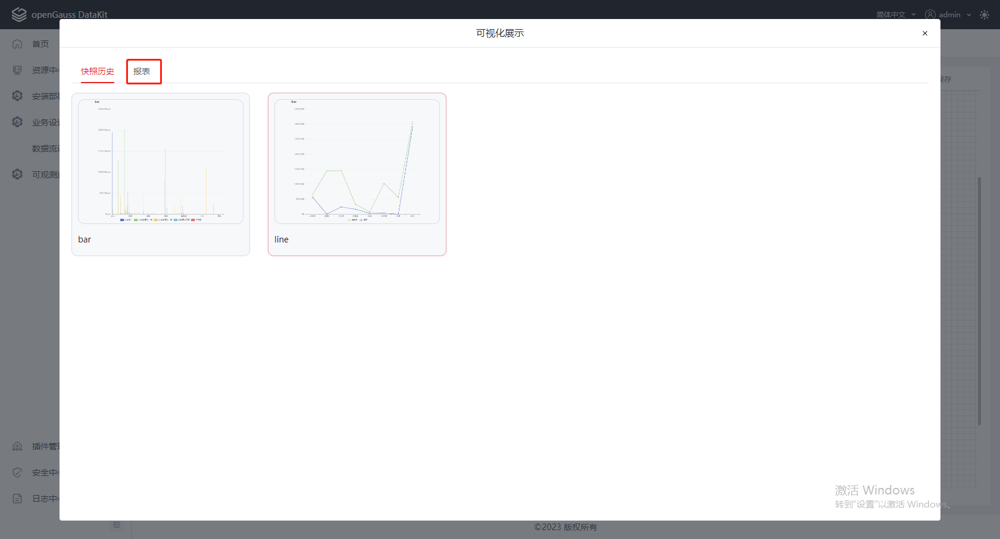

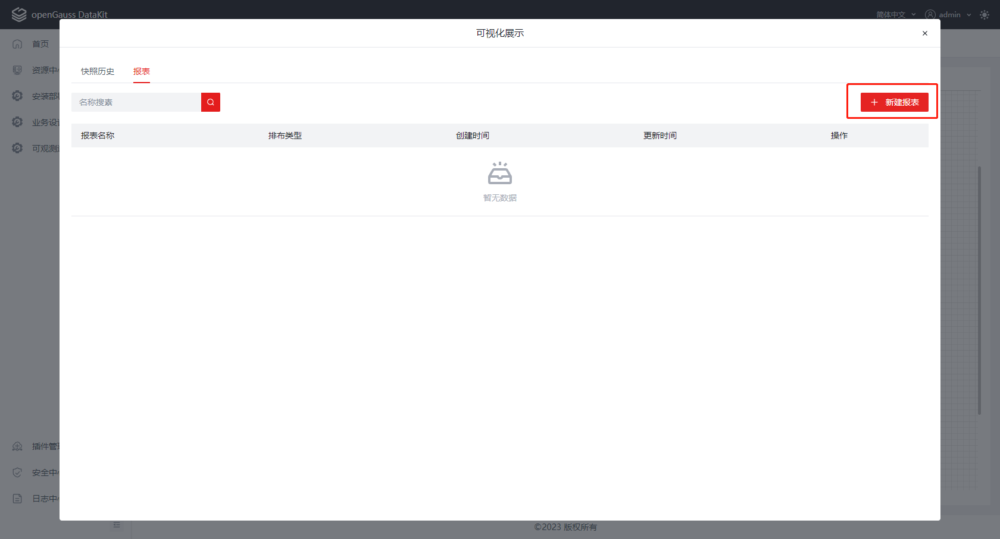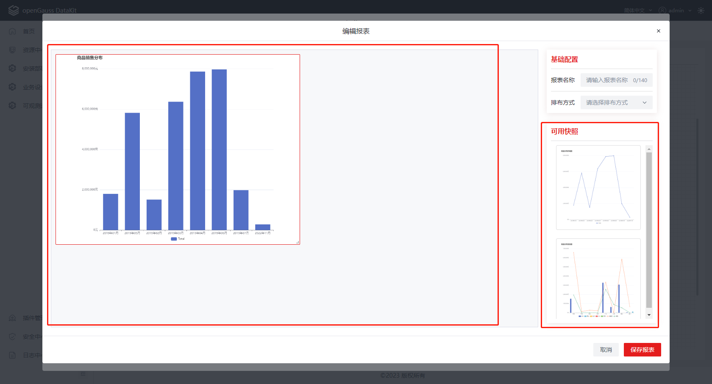

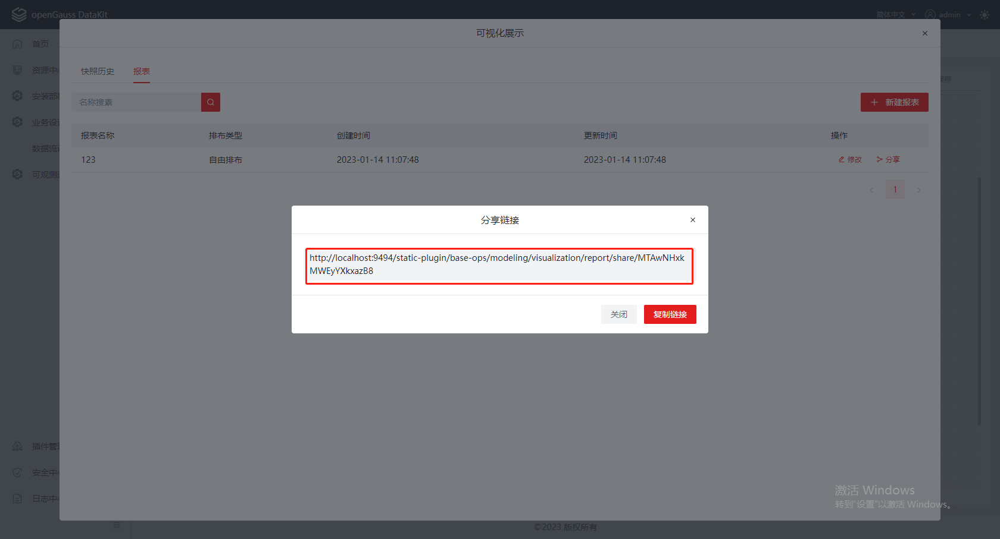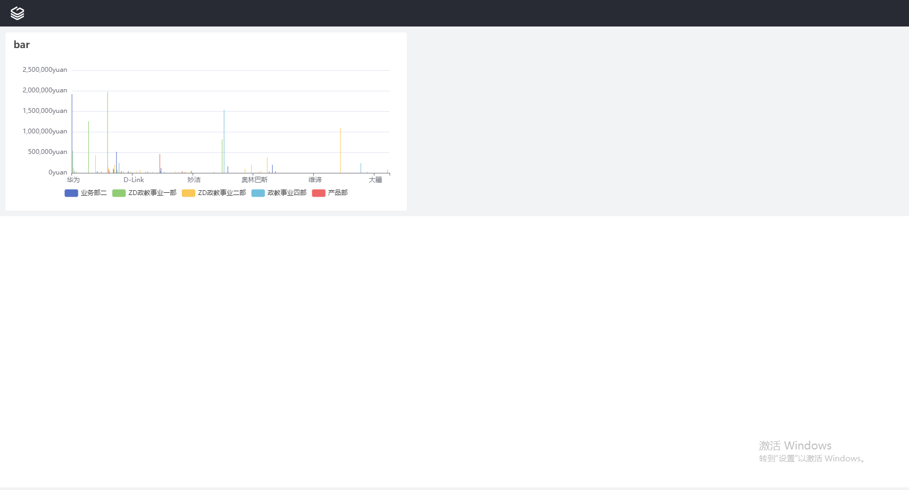

**说明：**

1 在工作区快捷操作栏最后找到可视化按钮，点击即可打开可视化页面。

2 进入页面默认显示本数据流所生成的所有快照预览

3 点击（2）处tab切换即可进入报表管理页面。

4 点击新建报表按钮开始绘制一个报表。

5 在右侧快照拾取区中，点击需要使用的快照，则会自动进入左侧绘制区。

6 在绘制区中调整快照的位置，大小等信息后点击保存按钮。

7 在报表管理页面点击分享会自动生成分享连接。

8 游客可访问分享链接

