# PostgreSQL数据迁移

# 环境准备

## 数据库服务准备

### openGauss数据库

请参考[openGauss安装指南](https://docs.opengauss.org/zh/docs/latest/installation_guide/installation_overview.html)安装企业版数据库，版本要求为6.0.0-RC1及以上（如6.0.5）。

### PostgreSQL数据库

安装PostgreSQL数据库，支持迁移9.4.26及以上版本。

## 迁移工具部署

### 安装DataKit

1. 准备Java 17+运行环境
2. 参考[DataKit安装步骤](https://gitcode.com/opengauss/openGauss-workbench#安装步骤)完成Datakit服务安装
3. 确保DataKit所在网络环境可正常访问PostgreSQL和openGauss数据库，无网络连通性问题

### 安装数据迁移插件

登录DataKit页面，进入“插件管理”菜单，确认“数据迁移插件”已安装。如未安装，点击“安装插件”完成安装。

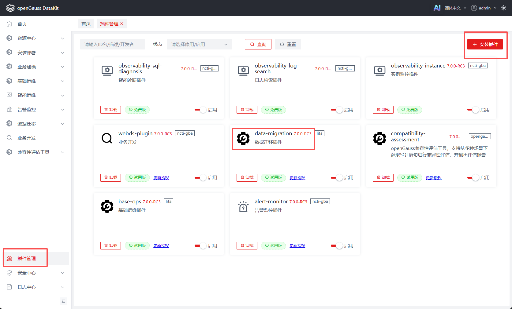

### 安装Portal

Portal是数据迁移门户工具，负责执行迁移任务，需单独安装。同样需要确保portal所在网络环境可正常访问PostgreSQL和openGauss数据库。

1. **添加服务器**

   在DataKit页面中，进入“资源中心”→“服务器管理”菜单，添加服务器。添加时请使用拥有sudo免密权限的普通用户。Portal支持安装的操作系统及架构如下：

   | 操作系统        | 架构            |
      | :-------------- | :-------------- |
   | CentOS 7        | x86_64          |
   | openEuler 20.03 | x86_64、aarch64 |
   | openEuler 22.03 | x86_64、aarch64 |
   | openEuler 24.03 | x86_64、aarch64 |

   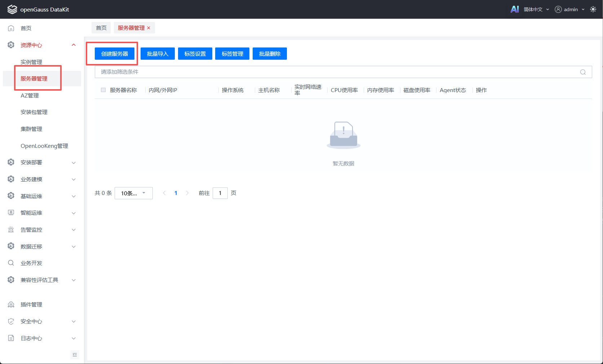

   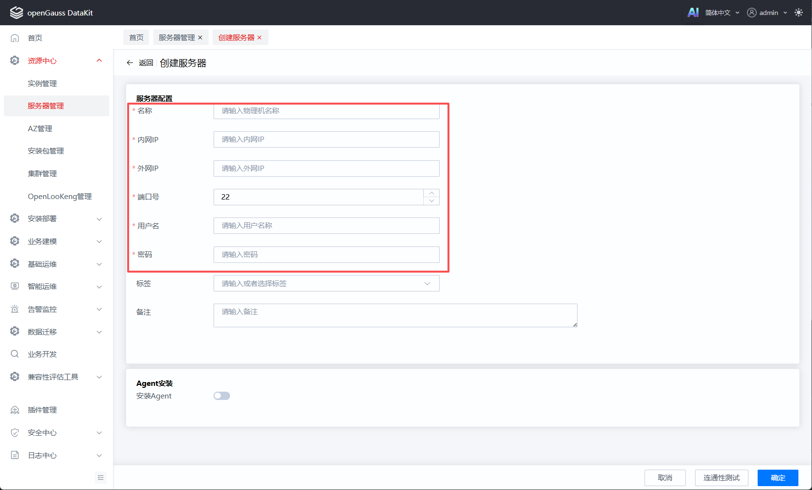

2. **安装Portal**

   进入“数据迁移”→“迁移工具管理”菜单，选择已添加的服务器，点击“开始安装”。

   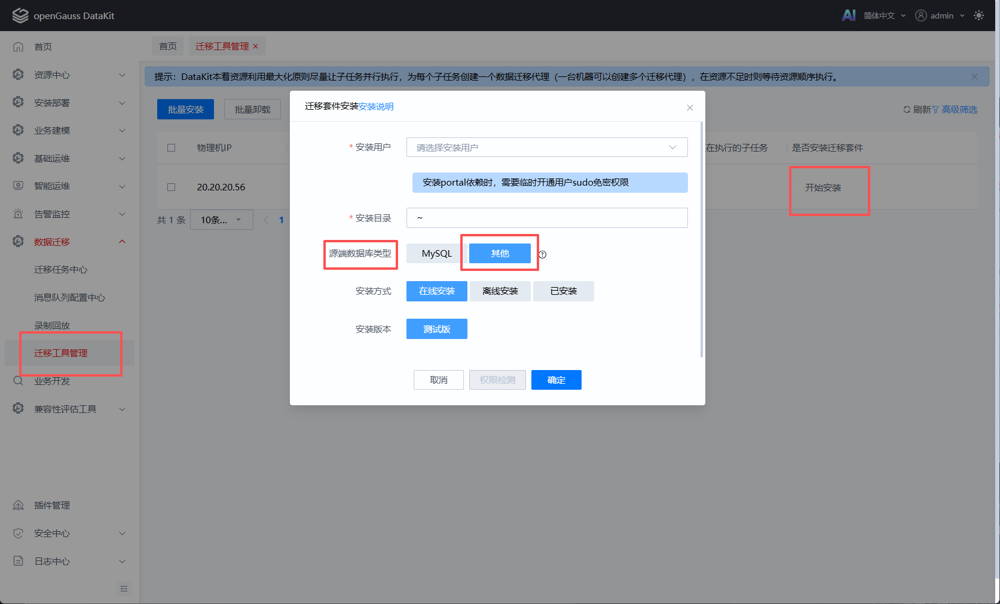

> [!NOTE] 说明
>
> Portal安装过程中会在环境中安装运行所需的依赖，因此需使用具备sudo免密权限的普通用户，否则安装可能失败。安装完成后可取消sudo权限，Portal运行时不再依赖此权限。

## openGauss数据库配置

### 创建连接用户

在openGauss安装用户下，使用gsql连接openGauss，执行以下SQL创建用户并授予sysadmin权限：

```sql
CREATE USER username WITH PASSWORD '******';
GRANT ALL PRIVILEGES TO username;
```

### 配置白名单

openGauss需要配置白名单，才允许用户远程连接数据库，否则连接会报错。请在openGauss安装用户下执行如下命令，完成配置：

```bash
# 配置白名单
gs_guc set -N all -I all -c "listen_addresses = '*'"
gs_guc set -N all -I all -h "host all all 0.0.0.0/0 sha256"

# 重启数据库使配置生效
gs_om -t restart
```

> [!NOTE] 说明
>
> 上述白名单配置允许任意用户在所有IP通过密码连接所有数据库。如需更细粒度的访问控制，请参考：[配置客户端接入认证](https://docs.opengauss.org/zh/docs/latest/database_administration_guide/configuring_client_access_authentication.html)。

### 开启openGauss逻辑复制权限

反向迁移需开启逻辑复制连接权限。请在openGauss安装用户下执行以下命令，完成配置：

```bash
gs_guc set -N all -I all -h "host replication all 0.0.0.0/0 sha256"
gs_guc set -N all -I all -c "wal_level = logical"

# 6.0.5及之后版本需配置，低版本无需配置
gs_guc set -N all -I all -c "enable_subscription = on"

# 重启数据库使配置生效
gs_om -t restart
```

### 创建目标数据库

在openGauss中创建PG兼容模式数据库作为迁移目标库：

```sql
CREATE DATABASE target_db WITH DBCOMPATIBILITY = 'PG';
```

> [!NOTE] 说明
>
> 仅PG兼容模式数据库可作为PostgreSQL迁移的目标库。

## PostgreSQL数据库配置

### 创建连接用户

在PostgreSQL安装用户下，使用psql连接PostgreSQL，执行以下SQL创建用户并授予Superuser权限：

```sql
CREATE USER username WITH PASSWORD '******';
ALTER USER username WITH SUPERUSER;
```

### 配置白名单

PostgreSQL需配置白名单，才允许用户远程连接数据库，否则连接会报错。

1. 修改 `pg_hba.conf` 文件

   在PostgreSQL数据目录下的`pg_hba.conf`文件末尾添加以下规则：

   ```bash
   host all all 0.0.0.0/0 scram-sha-256
   ```

   > [!NOTE] 说明
   >
   > 上述配置允许任意用户在所有IP通过密码连接所有数据库。如需更细粒度的访问控制，请自行查阅相关资料后配置。

2. 修改`postgresql.conf` 文件

   在PostgreSQL数据目录下的`postgresql.conf`文件中，将`listen_addresses`参数修改为`*`：

   ```ini
   listen_addresses = '*'
   ```

3. 重启数据库使配置生效

   ```bash
   pg_ctl -D $PGDATA restart
   ```

### 开启PostgreSQL逻辑复制权限

增量迁移阶段需开启PostgreSQL的逻辑复制连接权限。

1. 修改 `pg_hba.conf` 文件

   在PostgreSQL数据目录下的`pg_hba.conf`文件末尾添加以下规则，开启复制权限：：

   ```bash
   host replication all 0.0.0.0/0 scram-sha-256
   ```

2. 修改`postgresql.conf` 文件

   PostgreSQL数据目录下的`postgresql.conf`文件中，将`wal_level`参数修改为`logical`：

   ```ini
   wal_level = logical
   ```

3. 重启数据库使配置生效

   ```bash
   pg_ctl -D $PGDATA restart
   ```

---

# 迁移执行流程

## 添加实例

在DataKit页面中，进入“资源中心”→“实例管理”菜单，添加源PostgreSQL数据库和目标openGauss数据库。

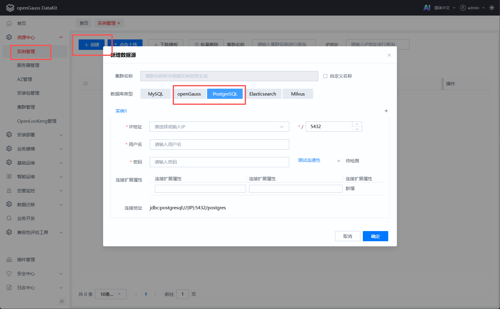

## 创建迁移任务

进入“数据迁移”→“迁移任务中心”菜单，点击“创建数据迁移任务”，按页面提示完成配置。

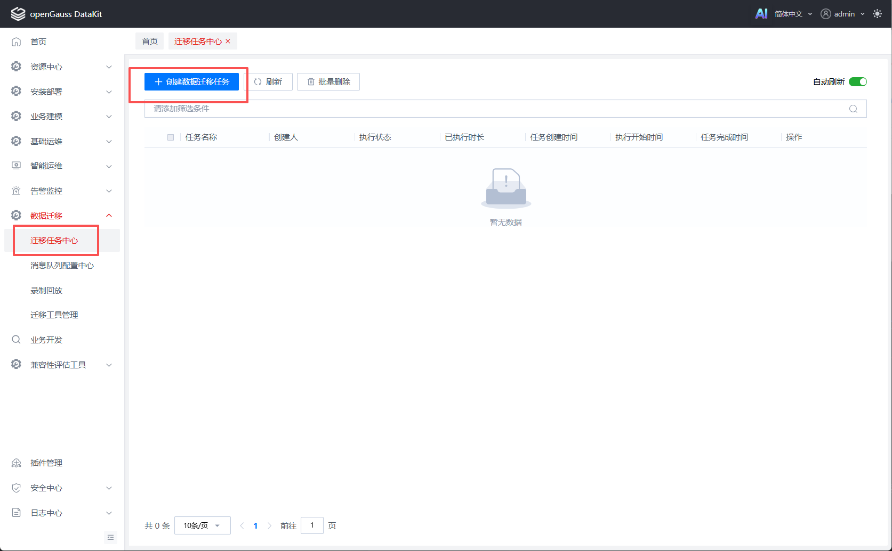

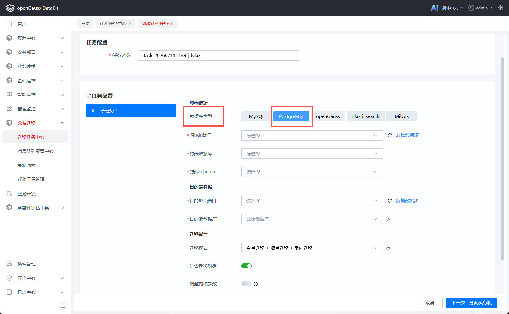

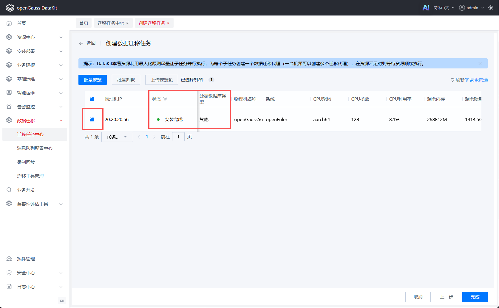

> [!TIP] 须知
>
> - **全量迁移**：迁移PostgreSQL中的表、视图、触发器、函数、存储过程，迁移完成后自动停止。
> - **增量迁移**：持续迁移PostgreSQL侧的新增数据，需手动停止。
> - **反向迁移**：持续将openGauss侧新增数据迁移回PostgreSQL，需手动停止。

## 启动与监控

1. **启动任务**

   在“迁移任务中心”找到创建的任务，点击“启动”。

   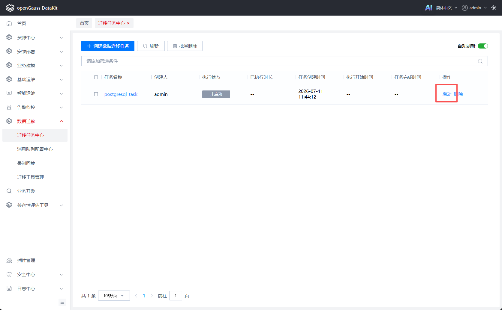

2. **查看详情**

   点击已启动任务，可下拉查看详情，再次点击“子任务ID”可查看表级迁移进度。

   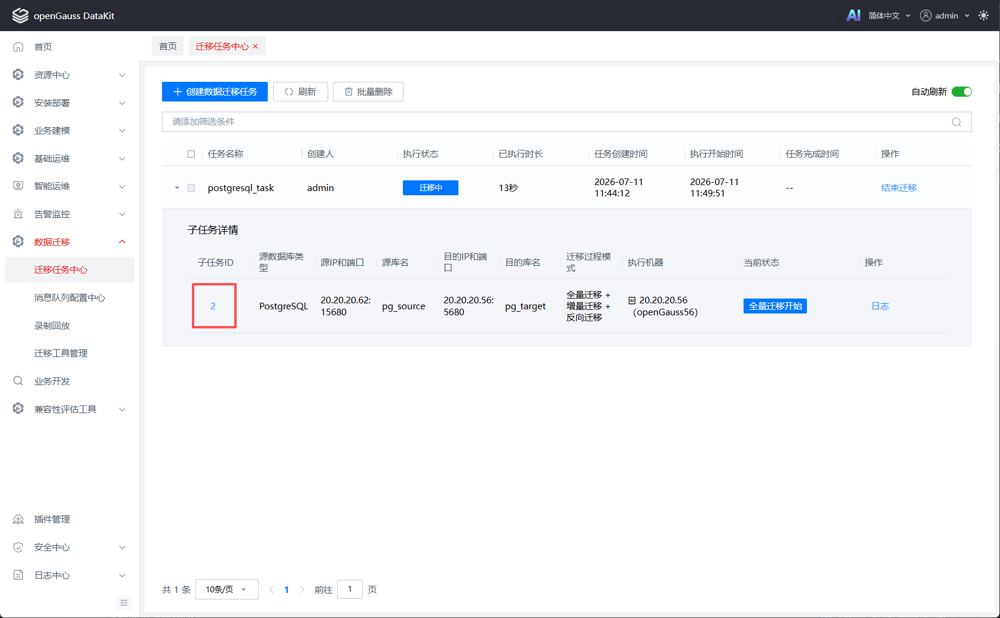

   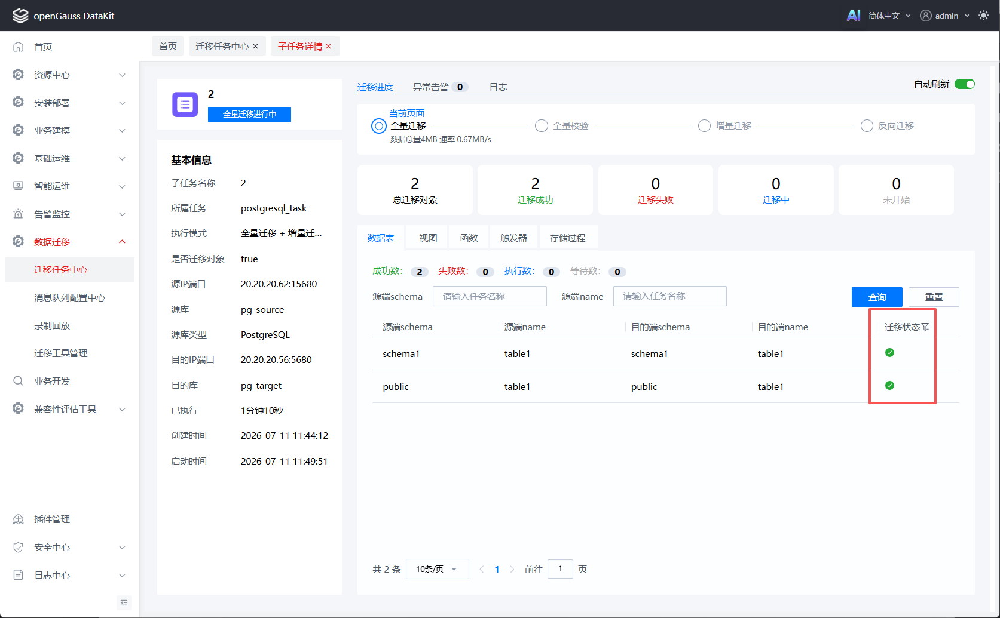

3. 前置校验失败

   若任务状态为“前置校验失败”，请参考[前置校验失败处理](##前置校验失败处理)章节进行处理。处理完成后，点击“结束迁移”，再点击“重置”即可重新启动任务。

   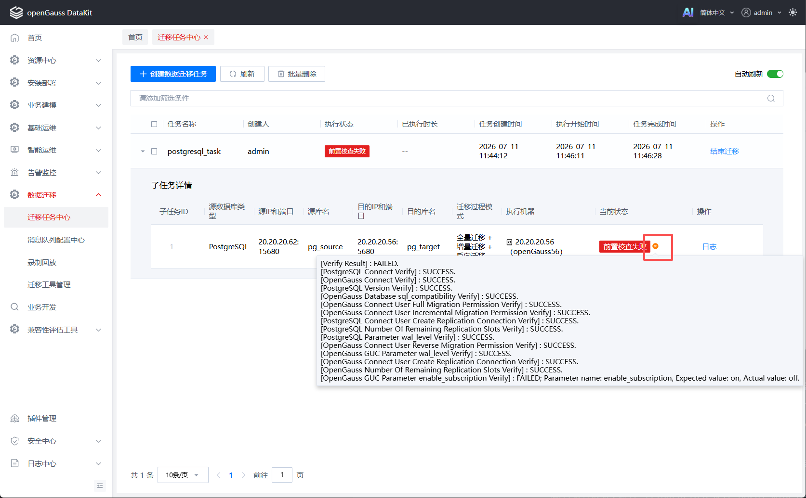

## 迁移阶段操作

### 停止增量迁移

仅当任务包含增量迁移时涉及此操作。任务执行至增量阶段时，可在“迁移任务中心”或“子任务详情”页点击“停止增量”。

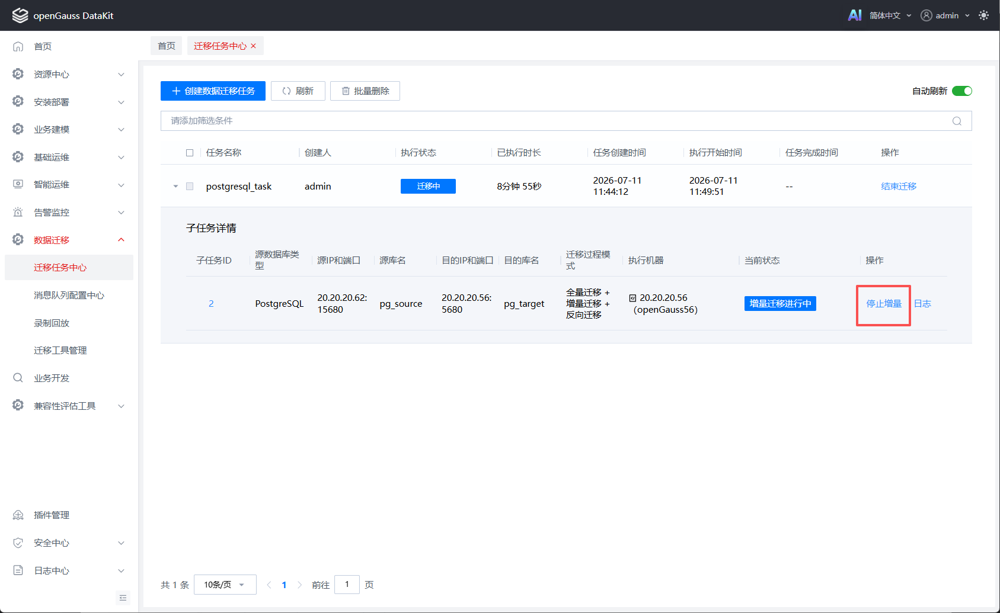

### 启动反向迁移

仅当任务包含反向迁移时涉及此操作。增量迁移停止成功后，可在“迁移任务中心”或“子任务详情”页点击“启动反向”。


### 结束迁移任务

在“迁移任务中心”选择已启动任务，点击“结束迁移”。

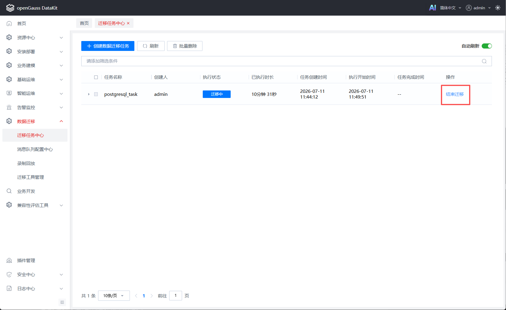

---

## 前置校验失败处理

### PostgreSQL连通性

请检查PostgreSQL白名单配置是否正确，并确保Portal所在网络环境可正常连通PostgreSQL。详细报错信息可通过Portal日志查看，日志可在子任务详情页下载。

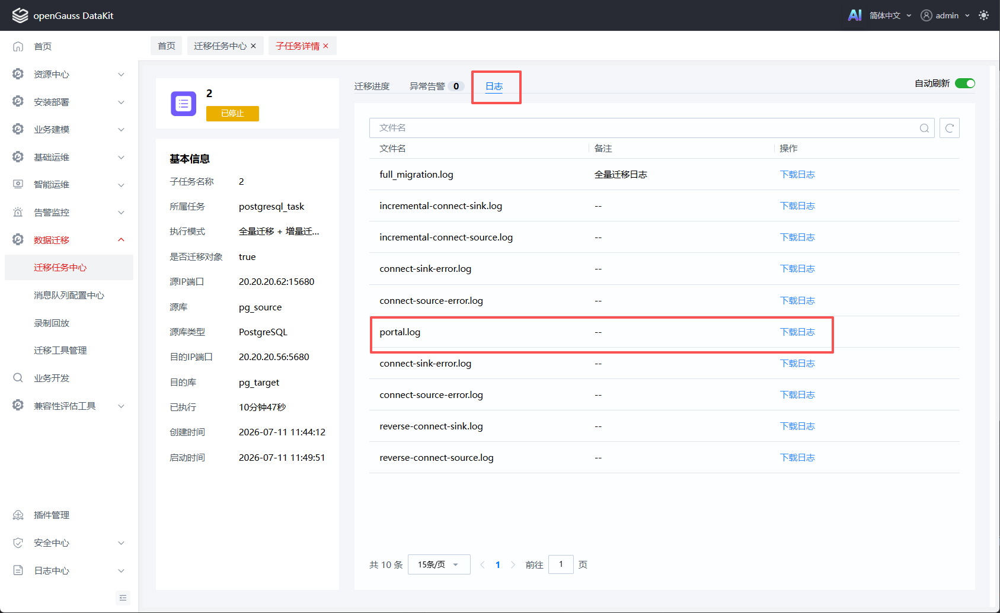

### OpenGauss连通性

请检查openGauss白名单配置是否正确，并确保Portal所在网络环境可正常连通openGauss。详细报错信息可通过Portal日志查看。

### PostgreSQL版本

迁移工具仅支持迁移PostgreSQL 9.4.26及以上版本。

### OpenGauss数据库兼容模式

openGauss数据库兼容模式校验，PostgreSQL迁移要求目标端数据库的兼容模式为PG。创建PG兼容模式数据库的语法如下：

```sql
CREATE DATABASE target_db WITH DBCOMPATIBILITY = 'PG';
```

### OpenGauss用户权限相关校验

openGauss连接用户权限相关校验，赋权语句参考如下：

```sql
-- 赋予用户目标数据库操作权限
GRANT ALL ON DATABASE target_db TO username;

-- 反向迁移需赋予复制权限
ALTER ROLE username REPLICATION;
```

也可以直接赋予用户sysadmin权限，一键解决权限问题：

```sql
GRANT ALL PRIVILEGES TO username;
```

### PostgreSQL复制连接权限

增量迁移时，PostgreSQL需要[开启逻辑复制权限](###开启PostgreSQL逻辑复制权限)，同时赋予连接用户`Replication`权限或`Superuser`权限，赋权语句参考如下：

```sql
ALTER USER username WITH REPLICATION;
```

### PostgreSQL逻辑复制槽数量

增量迁移需在PostgreSQL侧创建逻辑复制槽。若槽位已满，则无法启动增量迁移。遇到此问题时，需删除已有逻辑复制槽或扩充槽位数量。

### PostgreSQL wal_level参数

请参考[开启PostgreSQL逻辑复制权限](###开启PostgreSQL逻辑复制权限)章节，完成`wal_level`参数配置。

### openGauss wal_level / enable_subscription参数

请参考[开启openGauss逻辑复制权限](###开启openGauss逻辑复制权限)章节，完成`wal_level`和`enable_subscription`参数配置。

### openGauss复制连接权限

反向迁移时，openGauss需要[开启逻辑复制权限](###开启openGauss逻辑复制权限)，同时赋予连接用户`Replication`权限或`Sysadmin`权限：

```sql
ALTER USER username REPLICATION;
```

### openGauss逻辑复制槽数量

反向迁移需在openGauss侧创建逻辑复制槽。若槽位已满，则无法启动反向迁移。参考[逻辑复制函数](https://docs.opengauss.org/zh/docs/latest/sql_reference/logical_replication_functions.html)进行处理。
