# Datakit third-party-tools 子项目设计

## 1 概述

### 1.1 项目定位

在 DataKit 中新增 `third-party-tools` 子模块，核心目标为：**在卸载 DataKit 时，支持通过选项控制是否同步卸载已安装的工具**（如 Prometheus、Migration Portal、Instance Exporter 等）。

### 1.2 核心问题

DataKit 运行期间会依赖并安装多种工具，这些工具可能分布在不同的主机上。当用户卸载 DataKit 时，需要一套统一且可扩展的机制来管理这些工具的卸载工作，避免用户手动逐个卸载的繁琐操作。

## 2 总体设计思路

采用 Shell 脚本实现 DataKit 及已安装工具的卸载功能，核心设计如下：

- 编写 DataKit 卸载脚本，脚本作为卸载功能的统一入口，除卸载 DataKit 自身外，还支持通过命令行选项控制是否同时卸载已安装的工具。
- 每个工具安装时，将其安装信息以 CSV 格式持久化到文件系统中。多条安装信息时，则逐行追加到CSV文件中。
- 卸载脚本执行时，读取文件系统中的安装信息，依次完成各工具的卸载。
- 对于安装在远程主机上的工具，卸载脚本执行时会需要用户交互式输入远程主机的密码。

## 3 详细设计

### 3.1 工具安装信息存储

工具在安装完成后，将其安装信息以 CSV 格式持久化到文件系统中。每个工具使用独立的 CSV 文件存储其安装信息，CSV 文件字段结构如下：

**基础字段**

所有工具安装信息均包含的字段

| 字段            | 类型    | 说明               |
|:--------------| :------ | :----------------- |
| `id`          | String  | 唯一标识           |
| `ip`          | String  | 安装机器的 IP 地址 |
| `port`        | Integer | 机器连接端口       |
| `user`        | String  | 执行安装的用户     |
| `install_dir` | String  | 工具的安装目录     |

**自定义字段**

各工具根据卸载需要，自定义一些工具的特有字段。

| 工具名称              | 自定义字段    | 字段说明                                     |
|:------------------| :------------ | :------------------------------------------- |
| Migration Portal  | `portal_type` | Portal 类型，取值：`MYSQL_ONLY` / `MULTI_DB` |
| Prometheus        | `server_port` | Prometheus 服务端口                        |
| Instance Exporter | —             | —                                      |

### 3.2 工具信息注册机制

每个工具在首次安装时执行注册操作：将工具名称、安装信息 CSV 文件路径写入到工具注册文件。

工具注册文件采用 CSV 格式，多个工具注册时，则逐行追加到文件中。

DataKit 卸载脚本运行时，仅卸载工具注册文件中已注册的工具。

### 3.3 工具卸载方法

每个工具在 DataKit 卸载脚本中编写独立卸载方法，方法通过处理对应工具安装信息 CSV 文件中的数据，对工具进行逐个卸载。

DataKit 卸载脚本运行时，读取工具注册文件中已注册的工具信息，依次调用其卸载方法完成工具卸载。

### 3.4 DataKit 卸载脚本

脚本功能及命令选项设计如下：

| 命令格式                                            | 说明                                                         |
|:------------------------------------------------| :----------------------------------------------------------- |
| `sh uninstall.sh`                               | 默认行为：卸载 DataKit 自身及所有已安装的工具（同 `--all`）  |
| `sh uninstall.sh -s\|--self`                    | 仅卸载 DataKit 自身                                          |
| `sh uninstall.sh -a\|--all`           | 卸载 DataKit 自身及所有已安装的工具                          |
| `sh uninstall.sh -h\|--help` | 显示帮助信息，列出所有支持的命令选项                         |

### 3.5 支持卸载的工具定义

代码中使用 `ThirdPartyToolEnum` 枚举类定义所有支持卸载的工具，枚举包含的核心字段：**工具名称**、**安装信息 CSV 路径**。

| 枚举值              | 工具名称          | 安装信息 CSV 文件路径                                       |
| ------------------- | ----------------- | ----------------------------------------------------------- |
| `MIGRATION_PORTAL`  | migration-portal  | `data/third-party-tools/migration-portal-install-info.csv`  |
| `PROMETHEUS`        | prometheus        | `data/third-party-tools/prometheus-install-info.csv`        |
| `INSTANCE_EXPORTER` | instance-exporter | `data/third-party-tools/instance-exporter-install-info.csv` |

### 3.6 管理器

`ThirdPartyToolManager` 是 `third-party-tools` 模块的统一入口，对外提供以下方法：

- `save`：保存某工具的安装信息到文件系统。若该工具为首次保存，方法内部会自动完成该工具注册。
- `deleteById`：根据唯一 ID 删除某工具已保存的安装信息。各工具保存的安装信息需自行保证 ID 的唯一性。

## 4 消息序列图

```mermaid
sequenceDiagram
    participant User
    participant DatakitUninstall as Datakit卸载脚本
    participant FileSystem as 文件系统

    User->>DatakitUninstall: 调用 Datakit 卸载脚本
    DatakitUninstall->>DatakitUninstall: 判断是否卸载三方工具

    alt 不卸载三方工具
        rect rgb(230, 255, 230)
            Note over DatakitUninstall,FileSystem: 清理 Datakit 自身
            DatakitUninstall->>DatakitUninstall: 停止 Datakit 进程
            DatakitUninstall->>FileSystem: 清理 Datakit 安装目录
        end
        DatakitUninstall-->>User: 执行结束
    else 卸载三方工具
        rect rgb(230, 240, 255)
            Note over DatakitUninstall,FileSystem: 读取工具注册信息
            DatakitUninstall->>FileSystem: 读取工具信息注册文件
            FileSystem-->>DatakitUninstall: 返回工具信息列表
        end

        rect rgb(240, 255, 240)
            Note over DatakitUninstall,FileSystem: 获取每个工具的安装信息
            loop 遍历已注册的工具信息列表
                DatakitUninstall->>FileSystem: 读取该工具的安装信息文件
                FileSystem-->>DatakitUninstall: 返回安装信息列表
            end
        end

        rect rgb(255, 245, 230)
            Note over DatakitUninstall,User: 统一处理所有安装机器
            
            DatakitUninstall->>DatakitUninstall: 汇总所有工具的安装机器信息并去重
            loop 遍历去重后的安装机器列表
                DatakitUninstall->>DatakitUninstall: 判断机器是否为远程机器
            
                alt 本机（与 Datakit 同 IP 同用户）
                    DatakitUninstall->>DatakitUninstall: 标记为本机，无需密码
                else 远程机器
                    DatakitUninstall->>User: 提示输入该机器密码
                    User-->>DatakitUninstall: 输入密码
                    
                    rect rgb(240, 255, 240)
                        Note over User,DatakitUninstall: 测试连接远程机器
                        DatakitUninstall->>DatakitUninstall: SSH 测试连接
                        
                        alt 连接失败
                            loop 直到成功或跳过
                                DatakitUninstall->>User: 提示是否重新输入密码(y/n)
                                
                                alt 用户选择n
                                    DatakitUninstall->>DatakitUninstall: 标记该机器为跳过，后续卸载时忽略
                                    
                                else 用户选择y
                                    DatakitUninstall->>User: 提示输入该机器密码
                                    User-->>DatakitUninstall: 输入新密码
                                    DatakitUninstall->>DatakitUninstall: 重新 SSH 测试
                                end
                            end
                        else 连接成功
                            DatakitUninstall->>DatakitUninstall: 缓存该机器的密码
                        end
                    end
                end
            end
            Note over DatakitUninstall: 所有机器连接信息准备完成
        end

        rect rgb(255, 240, 245)
            Note over DatakitUninstall: 逐个工具执行实际卸载
            loop 遍历已注册的工具信息列表
                Note over DatakitUninstall: 执行工具卸载方法
                
                loop 遍历该工具的安装信息列表
                    alt 该安装机器已被标记为跳过
                        DatakitUninstall->>DatakitUninstall: 跳过该机器，打印告警日志
                    else 本机
                        DatakitUninstall->>DatakitUninstall: 本地执行卸载命令
                    else 远程机器
                        DatakitUninstall->>DatakitUninstall: 使用缓存的密码，SSH 执行卸载命令
                    end
                    
                    alt 卸载失败
                        DatakitUninstall->>DatakitUninstall: 打印失败日志，继续下一个
                    else 卸载成功
                        DatakitUninstall->>DatakitUninstall: 打印成功日志
                    end
                end
                Note over DatakitUninstall: 当前工具卸载完成
            end
        end

        rect rgb(230, 255, 230)
            Note over DatakitUninstall,FileSystem: 清理 Datakit 自身
            DatakitUninstall->>DatakitUninstall: 停止 Datakit 进程
            DatakitUninstall->>FileSystem: 清理 Datakit 安装目录
        end

        DatakitUninstall-->>User: 执行结束
    end
```

## 5 扩展指南

新增支持卸载的工具时，按以下步骤操作：

1. **定义实体类**  
   在 `entity/` 包下新建 `XxxInstallInfo.java`，继承 `BaseInstallInfo`，添加自定义字段并实现 `CsvExportable` 接口。

2. **新增枚举值**  
   在 `ThirdPartyToolEnum.java` 中新增枚举项，指定工具名称、实体类及 CSV 文件路径。

3. **编写卸载方法**  
   在 DataKit 卸载脚本中新增该工具的卸载方法。逻辑模板：逐行处理 CSV 文件数据 -> SSH 或本地执行卸载命令。  
   需处理异常场景：单条安装信息卸载失败时不应阻塞整体卸载流程，须继续卸载后续安装信息。

4. **调用管理器方法**  
   在工具的安装和删除逻辑中，分别调用管理器的 `save` 和 `deleteById` 方法，完成安装信息的持久化和及时删除。
