# 告警通知插件用户手册


## 1介绍

​		告警通知插件主要目的是为 openGauss 用户提供告警通知能力。它作为一体化平台的可插拔插件开发，本特性依赖于openGauss一体化平台的插件特性。

## 2 前言


### 2.1 概述

​	本章介绍手册相关信息。


### 2.2 读者对象

​	本手册主要适用于以下人员：

- 数据库开发人员
- 数据库管理员


### 2.3 修订记录

| 日期       | 版本   | 变更说明     | 修改人 | 审核人 |
| ---------- | ------ | ------------ | ------ | ------ |
| 2023/06/12 | v1.0.0 | 新增编译初版 | 巫悦彬 | 曾色亮 |


### 2.4 文档约定

​	本节描述了本手册的（内容、符号、GUI 和文本）约定。 

**图形化界面格式约定**

​    	本手册中可能出现下列图形化界面格式约定，它们所代表的含义如下。

| 格式 | 说明                                                         |
| ---- | ------------------------------------------------------------ |
| 粗体 | 按钮、菜单、参数、页签、窗口及对话框标题均使用【】括起来。例如，单击【确定】。 |


### 2.5 第三方许可证

​	本节包含适用于该插件的第三方许可证。

​	**表2-1 第三方软件列表**

| 第三方软件     |
| -------------- |
| 木兰宽松许可证 |


### 2.6 参考文档

无

​	

## 3简介


### 3.1 概述

​	告警通知插件主要目的是为 openGauss 用户提供告警通知能力。它作为一体化平台的可插拔插件开发，本特性依赖于openGauss一体化平台的插件特性。

​	告警通知功能主要分监控告警和通知配置两大功能。其中监控告警分告警记录、告警配置、告警模板、告警规则；通知配置分通知模板和通知方式，而通知方式又分为通知方式和通知渠道。


### 3.2 支持的功能

​	告警通知插件(alert-center)提供的功能如下：

​    **告警记录**

- 展示prometheus发送过来的告警信息。
- 统计告警信息。
- 显示关联视图：根据告警规则获取指标的告警数据，通过图表展示。

​	**告警配置**

- 展示告警配置列表。
- 支持为单个或者批量实例配置模板。
- 也可以直接为实例配置规则。

​	**告警模板**

- 展示告警模板列表。
- 支持增删改查。
- 可以对告警模板中的规则进行修改。

​	**告警规则**

- 展示告警规则列表，可查询规则详细。
- 已内置规则：CPU使用率、内存使用率、磁盘使用量、IO、数据库LOCK个数和锁时间的告警。

​	**通知模板**

- 展示通知模板列表，支持增删改查。

​	**通知方式**

- 展示通知方式列表，支持增删改查。
- 目前只支持邮箱的通知方式。

​	**通知渠道**

- 展示发送人的邮箱、企业微信和钉钉相关信息，支持修改。
- 提供通知渠道是否有效的测试功能，目前只支持邮箱测试。
- 通知渠道目前只支持通过邮箱去发送告警信息。


### 3.3 约束和限制

**安装插件前提**

安装该插件之前，必须先安装实例监控插件，并在插件中安装prometheus。

**第一次使用**

第一次安装该插件时，需要设置告警接口的IP地址和端口号（默认值：9494），IP是DataKit一体化平台IP地址。

**项目运行**

本项目依赖一体化主平台，若需要使用本项目所有功能，只能通过编译成 jar 包的形式作为插件运行在主平台上。


### 3.4 项目结构

下载告警通知插件(alert-center)项目代码

```
git clone https://gitee.com/opengauss/openGauss-workbench
```

告警通知插件(alert-center)项目结构如下图所示：

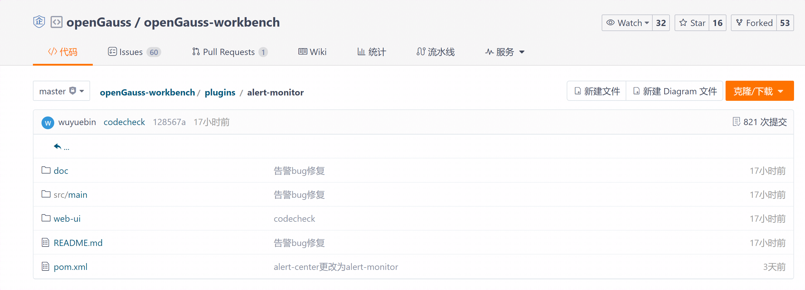

告警通知插件项目结构说明如下：

| 文件夹/文件 | 说明                   |
| ----------- | ---------------------- |
| src         | 保存后端代码及资源文件 |
| web-ui      | 保存前端代码           |
| pom.xml     | 后端依赖项             |
| doc         | readme.md资源图        |
| readme.md   | 插件的操作手册         |


### 3.5 系统要求

​	本节介绍使用告警通知插件(alert center)的最低系统要求。

**浏览器兼容性**

| 内置对象 \ 浏览器及版本                                      | Chrome | Edge | Firefox | Opera | Safari |
| :----------------------------------------------------------- | :----: | :--: | :-----: | :---: | :----: |
| `Proxy`                                                      |   49   |  12  |   18    |  36   |   10   |
| [`Proxy()` constructor](https://developer.mozilla.org/en-US/docs/Web/JavaScript/Reference/Global_Objects/Proxy/Proxy) |   49   |  12  |   18    |  36   |   10   |
| [`revocable`](https://developer.mozilla.org/en-US/docs/Web/JavaScript/Reference/Global_Objects/Proxy/revocable) |   63   |  12  |   34    |  50   |   10   |

参考资料：https://developer.mozilla.org/en-US/docs/Web/JavaScript/Reference/Global_Objects/Proxy

**系统要求**

| 操作系统 | 版本            |
| -------- | --------------- |
| Windows  | Windows 7及以上 |

**软件要求**

| 软件 | 规格        |
| ---- | ----------- |
| Java | jdk 8及以上 |

**数据库版本要求**

| 数据库    | 版本 |
| --------- | ---- |
| openGauss | 所有 |


## 4 集成开发环境（改）

​	 本章详细介绍如何部署告警通知插件(alert-center)。

​     前端技术栈：Vue3.0 + TS + Element plus

​     后端技术栈：Java + Spring boot

### 4.1 编译与部署

**前置条件：**① 安装 node.js，建议使用 v16 以上版本

​                   ② 安装Java jdk （建议使用v8及以上版本） 和 maven 3.X

**步骤 1：** 检查自动构建前端项目的配置是否为false

```
在 plugins > alert-center > pom.xml 下将以下值设为false：
<web.build.skip>false</web.build.skip>
<web.clean.skip>false</web.clean.skip>
```

**步骤 2：** 启动打包命令

```
mvn clean package -P prod
```

**步骤 3：**在target目录下找到生成的alert-center-5.0.0-repackage.jar，安装到一体化平台


### 4.2本地启动（改）

下面介绍如何在本地启动项目进行开发调试。

#### 4.2.1 启动后端

**前置条件**：安装Java jdk （建议使用v8及以上版本） 和 maven 3.X。

**步骤 1：**使用idea打开项目，并配置好maven

**步骤 2：**将pom.xml文件中的的<scope>provided</scope>注释，刷新maven

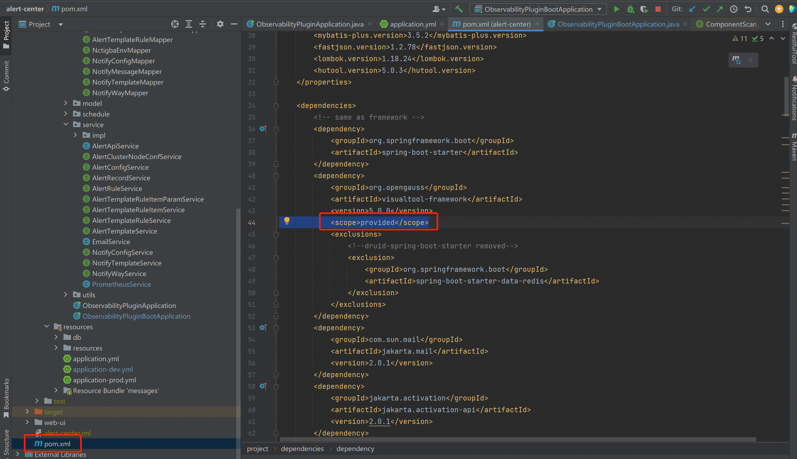

**步骤 3：**注释application.yml中的

```
context:
  listener:
    classes: listener.com.nctigba.alert.monitor.PluginListener
```

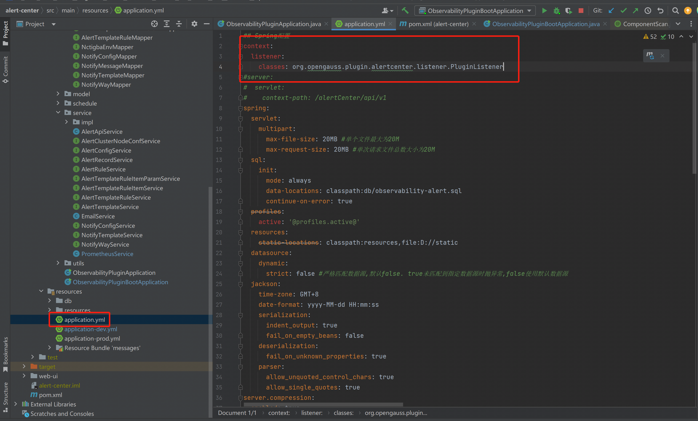


**步骤 4：**修改application-dev.yml中数据库信息，改为自己开发环境的数据库

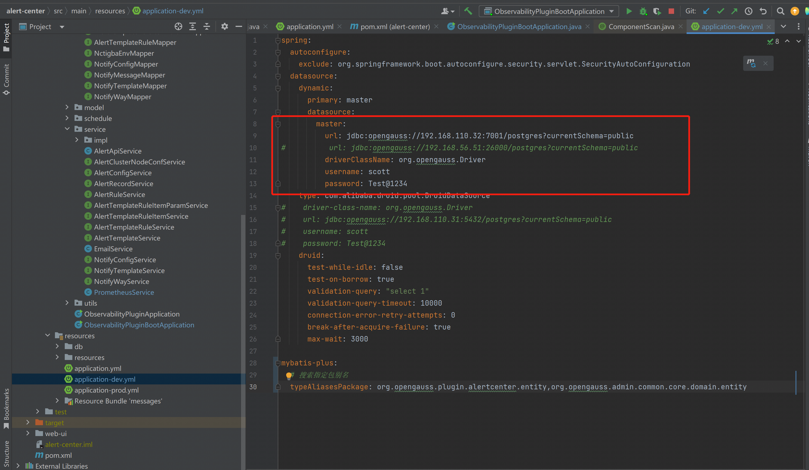


**步骤 5：**在PrometheusService中添加代码：

```
encryptionUtils.refreshKeyPair()
```

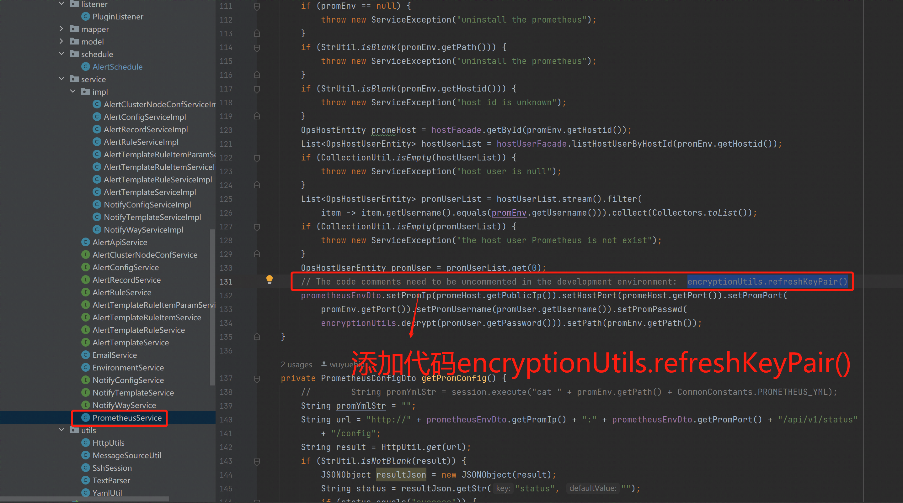


**步骤 6：**修改CommonConstants的部分常量

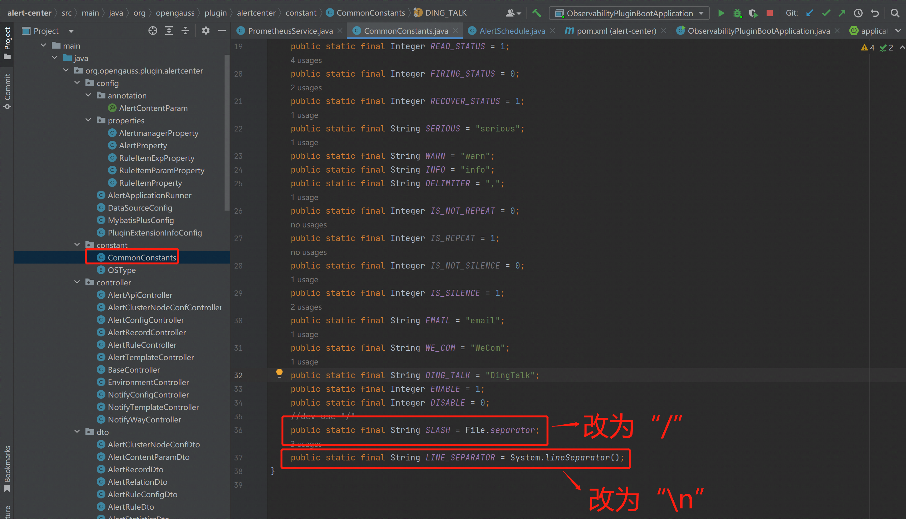


**步骤 7：**启动ObservabilityPluginBootApplication的main函数，启动时，带上--spring.profiles.active=dev，启动时可能会报一些错误，但不会影响系统启动。

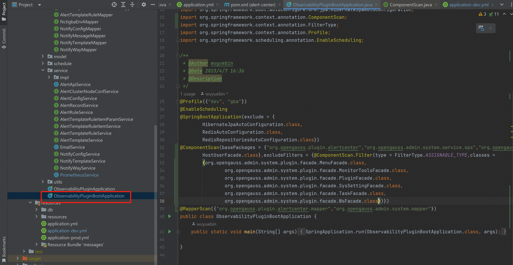


#### 4.2.2 启动前端

**前置条件：**安装 node.js，建议使用 v16 以上版本。

**步骤 1：**下载依赖包 

```
 任选以下一种命令：
 npm install
 yarn install
```

**步骤 2：**启动前端项目

```
 根据package.json配置任选以下一种命令：
 npm run dev
 npm run lint
 npm run lint:prettier
```

**步骤 3：** 根据启动提示进入对应的URL地址，如下图所示：

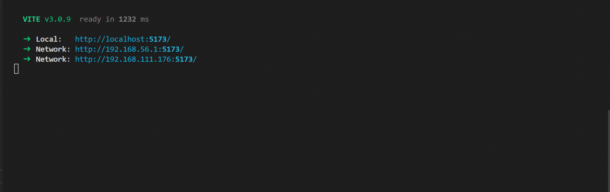


## 5 使用指导

### 5.1 概述

​		本章详细介绍如何使用告警通知插件(alert-center) 的功能。

### 5.2  告警记录

​		当触发告警后，Prometheus将告警信息推送到平台，平台将告警信息记录下来，并在告警记录页面展示出来。同时，告警记录支持查看告警详细以及告警的相关指标的关联视图。

#### 5.2.1 告警记录列表

**步骤 1：**点击DataKit菜单【监控告警】-【告警记录】，进入告警记录列表，显示告警统计信息、饼图和列表，支持【集群/实例】、【告警时间范围】查询，同时支持将数据标记为“未读”和“已读”。	

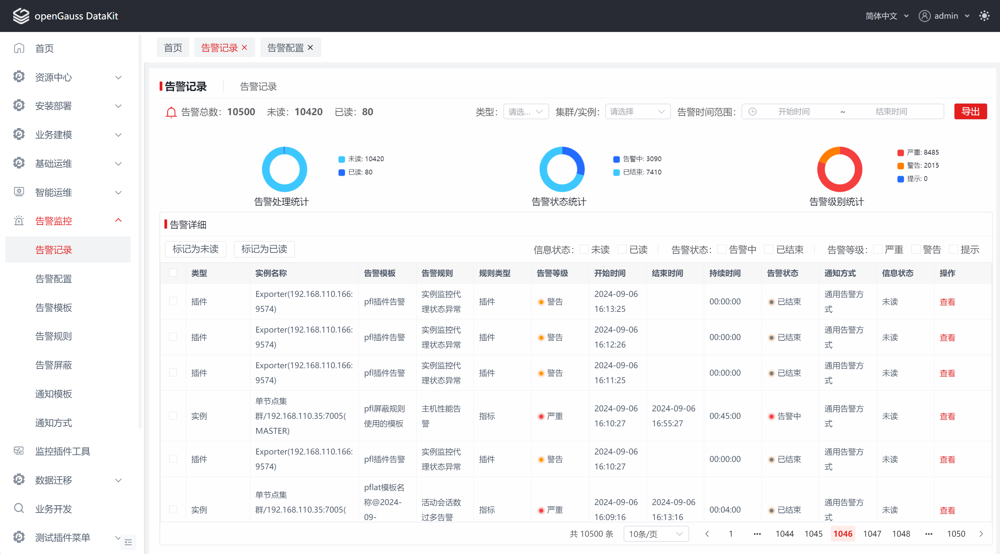

#### 5.2.2告警详情

**步骤 1：**点击上面的告警记录列表数据中的【查看】按钮，进入告警详情。


### 5.3 告警配置

​		为实例配置告警模板（包含多个告警规则），并展示在告警配置页面中。同时将实例的告警规则配置到prometheus配置文件中，prometheus将根据配置的规则对实例进行监控。

#### 5.3.1 告警配置列表显示

**步骤 1：**点击DataKit菜单【监控告警】-【告警配置】，进入告警配置列表，显示告警配置列表，支持根据实例名称进行查询。


#### 5.3.2 告警配置

**步骤 1：** 在上面的告警配置列表中，选择数据，点击列表上方的【配置】按钮，或者直接列表点击【配置】按钮，进入告警配置页面。


**步骤 2：**告警配置可根据告警模板进行配置，也可以直接选择告警规则进行配置。

1、告警模板配置：在【选择告警模板】tab中，选择告警模板，点击【确定】，即可为实例配置告警模板。


2、告警规则配置：点击【选择告警规则】tab,选择规则，点击【确定】，提示生成告警模板，再点击【确定】，即可为实例配置新生成的告警模板。


若选择规则的过程中需要对规则进行编辑，点击【选择告警规则】tab中，列表的【操作】列中【编辑】按钮，对规则进行编辑。

| 配置项       | 必填 | **组件形式**   | 配置说明                                                     |
| ------------ | ---- | -------------- | ------------------------------------------------------------ |
| 规则名称     | 是   | 输入框         | 禁止输入，置灰状态                                           |
| 规则类型     | 是   | 单选框         | 禁止选择，置灰状态，分指标和日志两种类型，目前只支持指标类型 |
| 告警级别     | 是   | 单选框         | 分严重、警告、提示三个等级                                   |
| 告警规则     | 是   | 输入框和下拉框 | 禁止输入，置灰状态                                           |
| 告警规则组合 | 是   | 输入框和下拉框 | 禁止输入，置灰状态                                           |
| 告警内容     | 是   | 输入框         | 根据【告警内容说明】对告警内容进行设置，告警触发时，发送给用户 |
| 统计周期     | 是   | 输入框和下拉框 | 告警统计时长，即告警超过该统计周期后，将通知用户。禁止输入，置灰状态 |
| 告警描述     | 否   | 输入框         | 对该告警规则进行描述或者备注                                 |
| 告警通知     | 是   | 多选框         | 分告警时和告警恢复时。告警时：指发生告警向用户发通知；告警恢复时：指告警恢复时，向用户发通知 |
| 是否重复告警 | 是   | 单选框         | 已经进行告警通知后，再次触发告警，是否需要继续发送通知       |
| 是否静默     | 是   | 单选框         | 是否设置静默时间，选择【是】之后，需要选择对应的静默时间段，即在该时间段内发生了告警，也不会进行通知 |
| 通知方式     | 是   | 下拉框         | 可选择多个通知方式                                           |


### 5.4 告警模板

​		告警模板统一组合多个告警规则，为实例提供统一配置告警规则的模板。同时支持对告警规则的再次编辑（比如对告警规则的阈值更改）。告警模板展示模板列表，支持对模板进行增删改查。

#### 5.4.1 告警模板列表

**步骤 1：**点击DataKit菜单【监控告警】-【告警模板】，进入告警模板列表，显示告警模板列表。告警模板列表支持【模板名称】模糊搜索；告警规则列表支持【规则名称】模糊搜索。


#### 5.4.2 新增或者修改模板

**步骤 1：**在上面的告警模板页面左侧的告警模板列表中，点击【新增】或者直接点击列表中的【编辑】按钮，进入编辑页面。

**步骤 2：** 输入【模板名称】，选择【告警规则】，点击【确定】，即可新增或者修改告警模板。

 			**说明：** 所有必选参数均需要填写。必填参数用星号（*）标识。

​						点击【确定】按钮后，保存告警模板信息。

​						点击【取消】按钮后，取消本次新增或者编辑告警信息。

| 配置项   | 必填 | **组件形式** | 配置说明                                           |
| -------- | ---- | ------------ | -------------------------------------------------- |
| 模板名称 | 是   | 输入框       | 输入模板名称，不能为空                             |
| 选择规则 | 是   | 可选列表     | 规则列表，支持对规则进行编辑，点击【编辑】按钮即可 |


**步骤 2（可省略）：**对告警规则再次编辑，可修改告警级别、告警内容、告警规则阈值、告警描述、告警通知、是否重复通知、是否静默、通知方式等等。

​			**说明：**  点击【确定】按钮后，保存告警规则信息。

​						点击【取消】按钮后，取消本次告警规则的修改。

| 配置项       | 必填 | **组件形式**   | 配置说明                                                     |
| ------------ | ---- | -------------- | ------------------------------------------------------------ |
| 规则名称     | 是   | 输入框         | 禁止输入，置灰状态                                           |
| 规则类型     | 是   | 单选框         | 禁止选择，置灰状态，分指标和日志两种类型，目前只支持指标类型 |
| 告警级别     | 是   | 单选框         | 分严重、警告、提示三个等级                                   |
| 告警规则     | 是   | 输入框和下拉框 | 禁止输入，置灰状态                                           |
| 告警规则组合 | 是   | 输入框和下拉框 | 禁止输入，置灰状态                                           |
| 告警内容     | 是   | 输入框         | 根据【告警内容说明】对告警内容进行设置，告警触发时，发送给用户 |
| 统计周期     | 是   | 输入框和下拉框 | 告警统计时长，即告警超过该统计周期后，将通知用户。禁止输入，置灰状态 |
| 告警描述     | 否   | 输入框         | 对该告警规则进行描述或者备注                                 |
| 告警通知     | 是   | 多选框         | 分告警时和告警恢复时。告警时：指发生告警向用户发通知；告警恢复时：指告警恢复时，向用户发通知 |
| 是否重复告警 | 是   | 单选框         | 已经进行告警通知后，再次触发告警，是否需要继续发送通知       |
| 是否静默     | 是   | 单选框         | 是否设置静默时间，选择【是】之后，需要选择对应的静默时间段，即在该时间段内发生了告警，也不会进行通知 |
| 通知方式     | 是   | 下拉框         | 可选择多个通知方式                                           |


#### 5.4.3 删除告警模板

**步骤 1：**在5.4.1的告警模板页面左侧的告警模板列表中，点击列表中的【删除】按钮，弹出删除提示，点击【确定】按钮，即可删除告警模板。

​		**说明：** 【删除】操作不可逆。

​					当实例已配置告警模板时，无法删除已配置的告警模板。


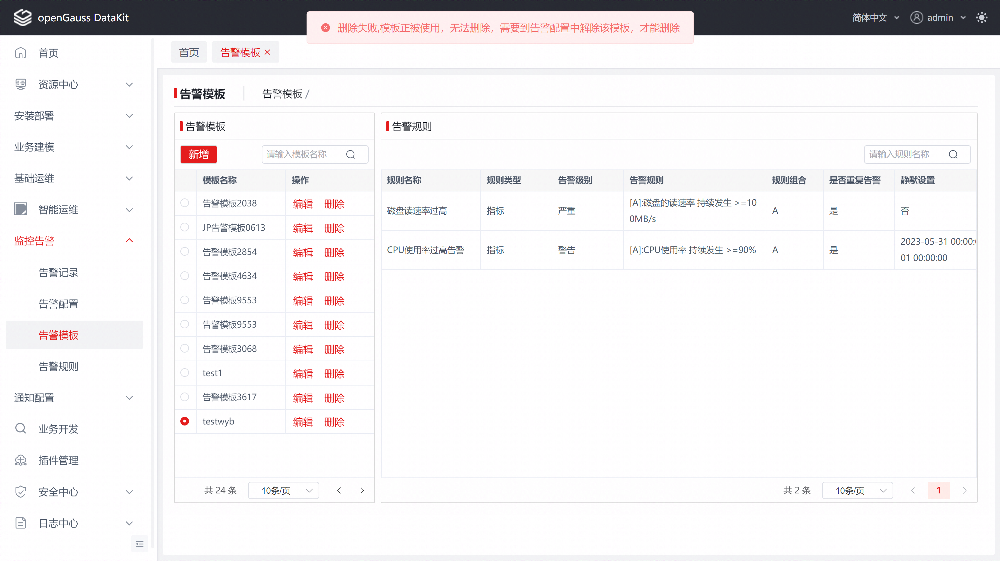

### 5.5 告警规则

​		告警规则主要内置多种规则，提供给告警模板进行配置。告警规则页面展示告警规则列表，并能支持查看功能。

#### 5.5.1 告警规则列表

 **步骤 1：**点击DataKit菜单【监控告警】-【告警规则】，进入告警规则页面，显示告警规则列表。支持【规则名称】、【规则类型】、【告警级别】查询。

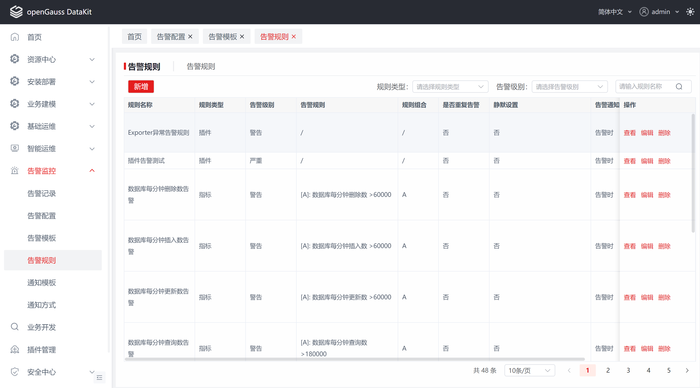

#### 5.5.2 告警规则详细

 **步骤 1：**点击5.5.1告警规则列表中的某个数据的【**查看**】按钮，进入规则详细页面。

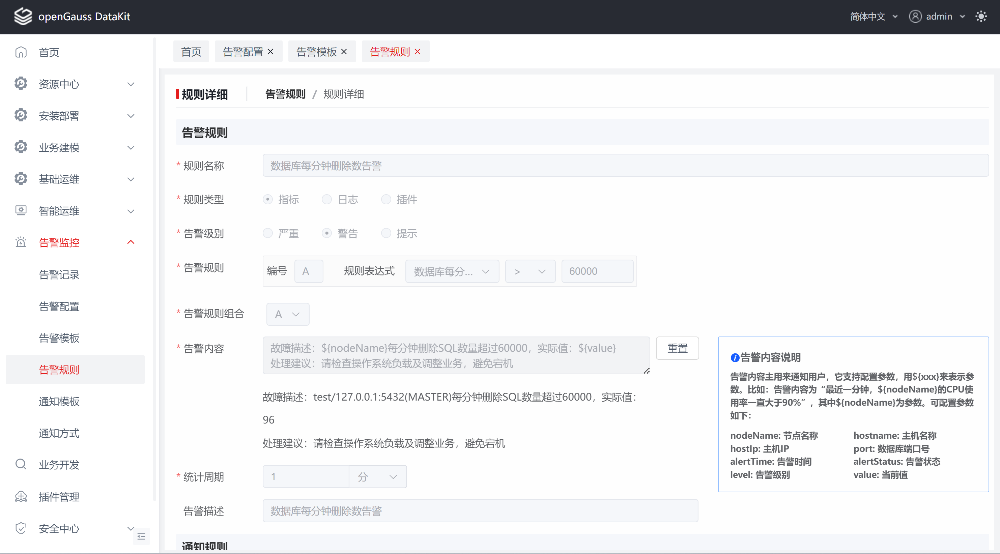


### 5.6 通知模板

​		对告警通知的内容进行个性化包装，当出现告警时，将包装后的内容发给用户。支持增删改查，用于通知方式设置。

#### 5.6.1 通知模板列表

 **步骤 1：**点击DataKit菜单【通知配置】-【通知模板】，进入通知模板页面，显示通知模板列表。支持【模板名称】、【模板类型】查询。


#### 5.6.2 新增/修改通知模板

**步骤 1：**点击5.6.1 通知模板页面中的【新增】按钮或者点击通知模板列表中的【修改】按钮，进入模板修改页面。

**步骤 2：** 输入表单，点击【确定】，即可新增或者修改通知模板。

 			**说明：** 所有必选参数均需要填写。必填参数用星号（*）标识。

​						点击【确定】按钮后，保存通知模板信息。

​						点击【取消】按钮后，取消本次新增或者编辑通知模板信息。

| 配置项   | 必填 | **组件形式** | 配置说明                                                     |
| -------- | ---- | ------------ | ------------------------------------------------------------ |
| 模板名称 | 是   | 输入框       | 通知模板名称，必填                                           |
| 模板类型 | 是   | 下拉框       | 分邮箱、企业微信、钉钉，必选                                 |
| 模板描述 | 否   | 输入框       | 对模板进行描述或者备注                                       |
| 通知主题 | 是   | 输入框       | 必填                                                         |
| 通知内容 | 是   | 文本框       | 发送给用户的内容，主要对告警内容进行包装，支持参数配置，具体参考【消息内容说明】，必填 |
| 消息预览 | 否   | 文本框       | 主要是对通知内容的预览，禁止输入                             |


#### 5.6.3 删除通知模板

**步骤 1：**点击5.6.1 通知模板列表中的【删除】按钮，弹出删除提示，点击【确定】按钮，即可对通知模板进行删除。

​		**说明：** 【删除】操作不可逆。

​					当通知方式已配置通知模板时，无法删除已配置的通知模板。


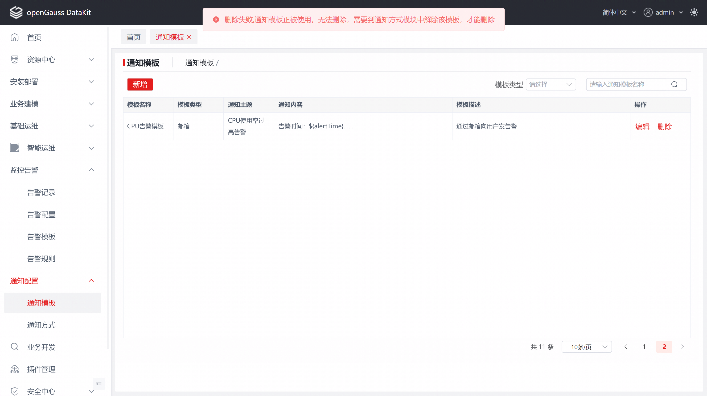

### 5.7 通知方式

​		配置通知人的相关信息（邮件、钉钉、企业微信）和通知模板，为告警规则提供通知方式，支持增删改查。

#### 5.6.1 通知方式列表

 **步骤 1：**点击DataKit菜单【通知配置】-【通知方式】，默认选择【通知方式】tab，进入通知方式页面，显示通知方式列表,支持【通知方式名称】、【发送方式】查询。


#### 5.6.2 新增/修改通知方式

 **步骤 1：**点击5.6.2 通知方式页面中的【**新增**】按钮或者点击列表中的【**修改**】按钮，进入通知方式修改页面。

**步骤 2：** 输入表单，点击【确定】，即可新增或者修改通知方式。

 			**说明：** 所有必选参数均需要填写。必填参数用星号（*）标识。

​						点击【确定】按钮后，保存通知方式信息。

​						点击【取消】按钮后，取消本次新增或者编辑通知方式信息。

| 配置项       | 必填 | **组件形式** | 配置说明                                                     |
| ------------ | ---- | ------------ | ------------------------------------------------------------ |
| 通知方式名称 | 是   | 输入框       | 通知模板名称，必填                                           |
| 发送方式     | 是   | 下拉框       | 分邮箱、企业微信、钉钉，必选                                 |
| 邮箱         | 否   | 输入框       | 当发送方式为邮箱时显示，必填                                 |
| 用户ID       | 否   | 输入框       | 当发送方式为企业微信或者钉钉时显示，且用户ID和部门ID其中有一个必填 |
| 部门ID       | 否   | 输入框       | 当发送方式为企业微信或者钉钉时显示，且用户ID和部门ID其中有一个必填 |
| 通知模板     | 是   | 下拉框       | 分邮箱模板、企业微信模板、钉钉模板，必填                     |


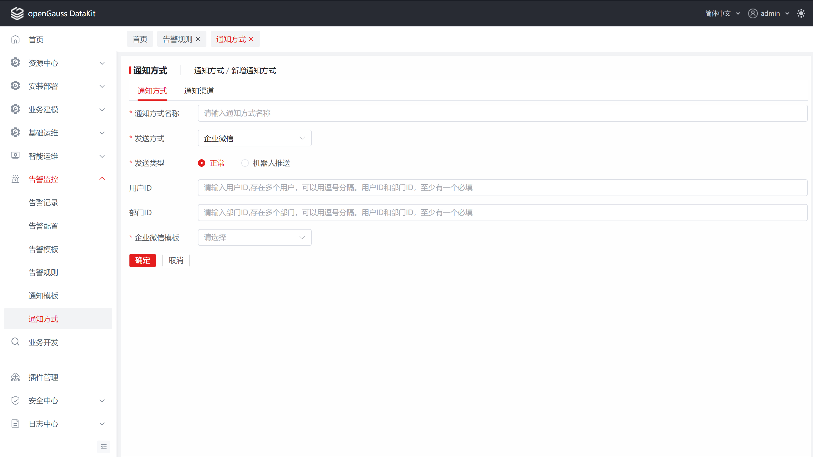


#### 5.6.3 删除通知方式

 **步骤 1：**点击5.6.2 通知方式列表中的【**删除**】按钮，弹出删除提示，点击【确定】按钮，即可对通知方式进行删除。

​		**说明：** 【删除】操作不可逆。

​					当告警规则已配置通知方式时，无法删除已配置的通知方式。


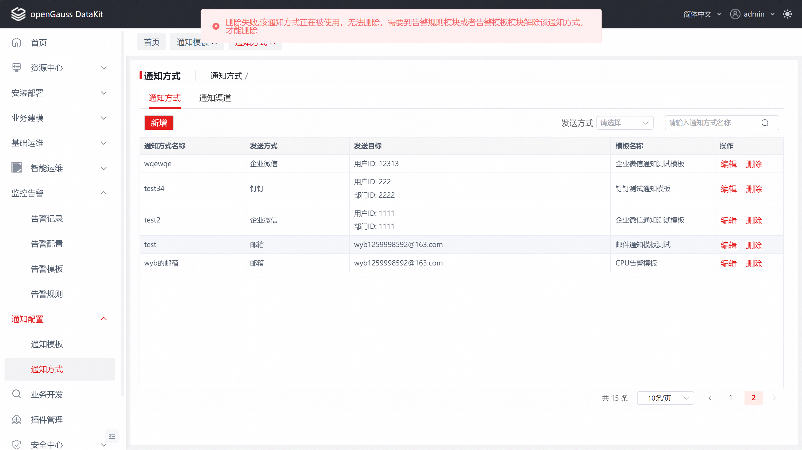

### 5.8 通知渠道

​		配置发送人的邮箱、企业微信、钉钉等等，目前只支持邮箱。

#### 5.6.1 通知渠道页面

 **步骤 1：**点击DataKit菜单【通知配置】-【通知方式】，选择【通知渠道】Tab，进入通知渠道页面。

**步骤 2：**修改相关配置，点击【**确定**】按钮，可修改通知渠道。		


**步骤 3：**点击右边的【**测试**】按钮，弹出弹框，选择【通知方式】，点击【确定】按钮，对通知渠道进行测试，目前只支持邮箱。


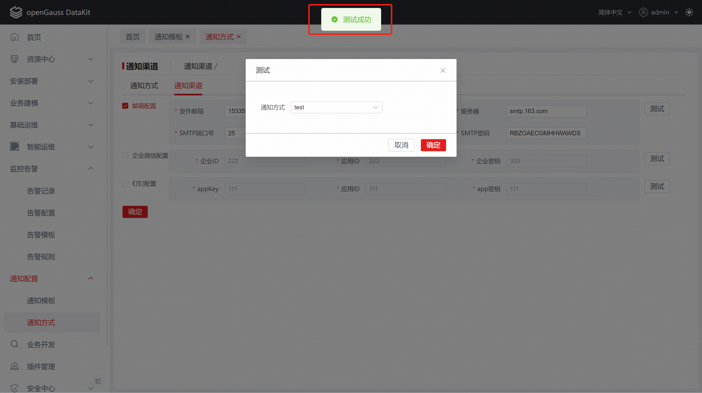


## 6 FAQS

1、第一次安装平台时，需要设置告警接口，IP为平台IP,端口后为后端的端口号。

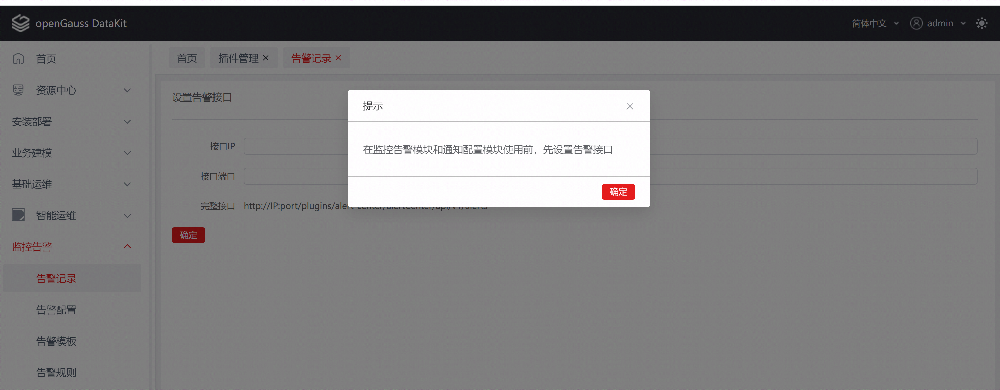

