**数据建模产品使用手册**

# **文档历史**

| **修订日期** |  **修订内容**  | **版本号** | **编写人** |
| :----------: | :------------: | :--------: | :--------: |
|  2022/12/10  |      初稿      |    1.00    |    贺帅    |
|  2023/1/13   |   修改MD版本   |    1.01    |    贺帅    |
|  2023/1/28   | 内容更新与补充 |    1.05    |    贺帅    |
|  2023/3/10   |    内容更新    |    1.06    |    贺帅    |

# **关于本手册**

## **产品介绍**
基于WEB开发openGauss的数据流可视化编辑工具，实现零编程数据建模，通过拖拽、连接的方式完成简单的数据流设计。通过构建不同的数据流实例，并使用一体化平台中管理的数据库实例作为数据源，支持每一步节点的数据调试、生成图表及分享，可以快速方便的对各个业务库进行测试、数据采集、报表生成。

随着openGauss开源数据库的逐渐普及，有许多新用户可能由于语法差异、学习成本等原因放弃尝试。本特性希望让任何没有实际使用过openGauss的用户都可以通过平台快速完成数据操作体验，降低其上手难度，从而提升用户的兴趣度和深入探索的可能性。

## **主要功能介绍**
1. 可视化编辑，提供拖拽、连线的操作方式完成数据流算子的组装、配置，并根据算子组合生成对应的SQL及运行结果。
1. 实时图表生成，支持读取单步算子执行结果为用户生成自定义图表，并可以记录快照。
1. 可将一个或多个图表快照通过自由排布的方式构建报表，并可通过外链分享给用户。

## **预期读者**
测试人员

开发人员

普通用户

## **版本及功能列表**

| **版本号** |  **新增功能**  | **发布时间** |
| :--------: | :------------: | :----------: |
|   V1.00    |    首次发布    |  2022/12/10  |
|   V1.05    | 内容更新与补充 |  2023/1/28   |

# **插件的安装**

## **一体化平台插件管理页面**
### **概述**
可在本页面对数据建模插件进行安装、升级、卸载。
### **角色**
拥有插件添加权限的角色可以访问。
### **界面**
1、安装插件

**说明：**

1) 左侧下方点击插件管理菜单。
1) 点击右上安装插件按钮。

2、选择安装包（通过编译打包脚本获得）

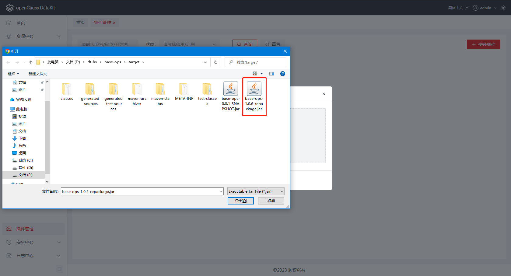

**说明：**

1) 在弹出框中点击上传按钮。
1) 选择插件包目录，选中插件包，上传完成后点击确定即可。

**说明：**

1. 等待安装完成后页面会自动刷新，可以在左侧菜单栏看到（1）处的菜单项，在（2）处看到base-ops插件卡片，即为安装成功。

   

## **物理机管理页面**
### **概述**
在本页面可以完成对物理机实例的新增、编辑、删除等操作，本功能属于一体化基座提供的基础功能，本插件依赖该服务所提供的实例，在使用本数据建模插件之前必须完成至少一个物理机实例的配置。
### **角色**
拥有物理机实例管理权限的角色可以访问。
### **界面**
1. 新增物理机
## 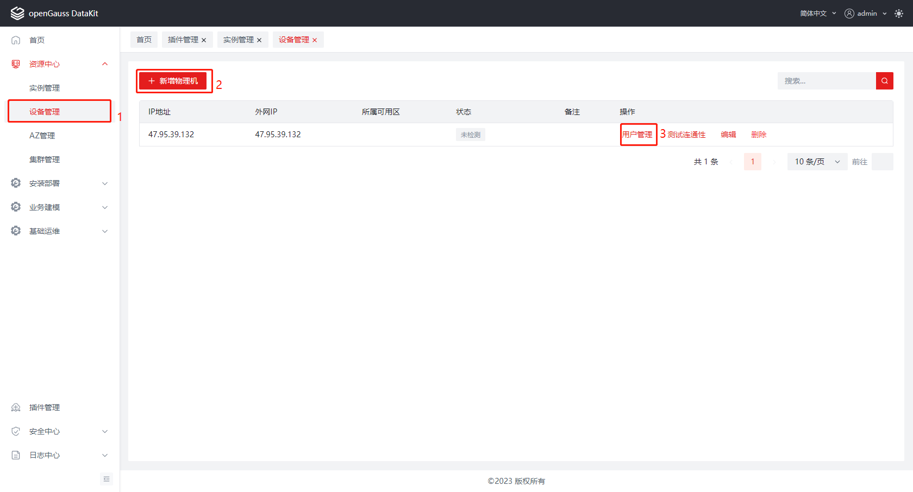

**说明：**

1.左侧菜单栏找到【资源中心】-【设备管理】菜单，点击打开管理页面。

2.点击新增物理机，并填写IP、端口等信息。

3.在新增好的物理机实例上点击用户管理，编辑root用户密码，并添加对openGauss数据库拥有访问权限的系统用户（如安装用户）。

## **集群安装页面**
### **概述**
在本页面可以完成对集群实例的安装、导入等操作，本功能属于一体化基座提供的基础功能，本插件依赖该服务所提供的实例，在使用本数据建模插件之前必须完成至少一个集群实例的配置。
### **角色**
拥有集群管理权限的角色可以访问。
### **界面**
1、导入已有集群实例

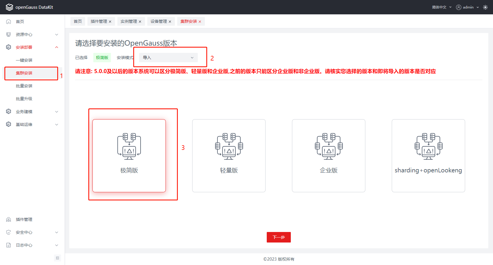

**说明：**

1.左侧菜单栏找到【安装部署】-【集群安装】菜单，点击打开安装详情页面。

2.本手册默认用户已有数据库实例（如需全新安装集群，请参考运维插件使用手册），此处安装模式选择【导入】，在下方选择对应的数据库版本。

3.点击下一步。

2、填写导入配置

**说明：**

1.在主机IP处选择之前新建的物理机实例，并输入该实例的root密码。

2.安装用户选择对该数据库拥有管理权限的用户，此处为之前添加的系统用户hs。

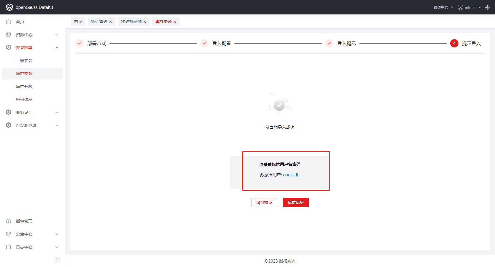

3.依次点击后续下一步，直到导入完成。

## **数据流管理页面**

### **概述**
在本页面可以完成对数据流实例的新增、编辑、删除等操作，支持名称模糊搜索，支持分页动态加载。
### **角色**
拥有数据流设计权限的角色可以访问。
### **界面**
1、新建数据流

**说明：**

1.左侧菜单栏找到【业务设计】-【数据流设计】菜单，点击打开管理页面。

2.点击上方新建数据流按钮。

3.在弹出框中填写数据流名称，在默认数据库一栏中选择之前导入的数据库实例，点确认即可完成新建，页面将自动跳转到该业务流的详情页。

## **数据流详情页面（算子菜单区）**
### **概述**
在本页面可以完成对数据流内算子的组装，运行，可视化等操作。本页面通过数据流管理页任意实例的【修改】按钮进入。
### **角色**
拥有数据流设计权限的角色可以访问
### **界面**
1、算子菜单

**说明：**

1.数据源算子（可选算子），如果一个算子序列的开头连接了该算子，则会使用数据源算子中配置的数据库连接来执行SQL，否则会使用数据流新建时配置的默认数据库连接。

2.基础算子，包含四大基础类型增删改查，一个有效算子序列有且只能有一个基础算子。

3.组合算子，在符合规则的前提下（规则详见后续算子配置篇）可以在基础算子下方连接任意数量的组合算子。

## **数据流详情页面（快捷操作区）**
### **概述**
快捷操作区主要提供对右侧绘制面板的便捷操作，如保存、放大、缩小、撤销、恢复、导入导出等功能。
### **角色**
拥有数据流设计权限的角色可以访问
### **界面**
1、快捷操作区

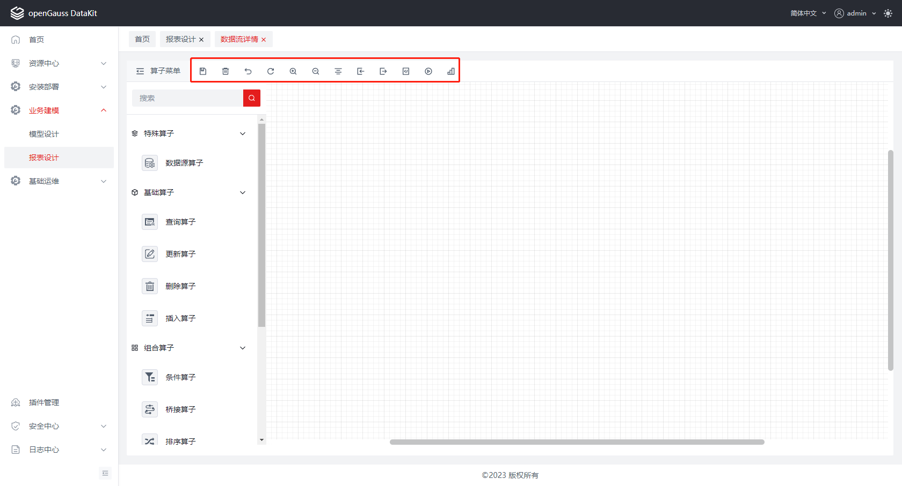**说明：**

1.进入工作区后会定时执行自动保存，也可通过点击【保存按钮】手动保存。

2.选择任意算子后，点击【删除按钮】，即可删除该算子以及与之相连的箭头。

3.点击【撤销按钮】可撤销一步算子操作，如在新拖入一个算子后，点击撤销按钮，则该算子会被删除。

4.点击【恢复按钮】可将上次撤销操作恢复，如拖入一个算子后，通过撤销按钮将其删除后，再点击恢复按钮，则该算子会重新出现。

5.点击【放大按钮】、【缩小按钮】可对工作区视图比例进行放大缩小。。

5点击【居中按钮】会使工作焦点回到画布中心。

6点击【导出按钮】可以将完整的算子配置导出为json文件（该类型文件用于后续的导入功能使用），或导出为jpeg，png、svg图片。点击导出按钮后会出现类型选择弹框，再次点击即可从浏览器自动下载。

7.点击【导入按钮】可以将之前通过【导出按钮】导出的json文件上传并导入。

8.点击【预览代码按钮】可以在不运行数据流的情况下查看当前算子生成的对应SQL语句

9.点击【运行按钮】可以查看数据流真实运行的SQL、查询结果及返回数据（详细使用在后续章节说明）

10.点击【可视化展示按钮】可以查看本数据流所有已生成图表快照，以及制作的报表内容（详细使用在后续章节说明）

## **数据流详情页面（算子绘制区）**
### **概述**
改区域用来组装各个拖入其中的算子，按用户所需绘制数据流结构。
### **角色**
拥有数据流设计权限的角色可以访问
### **界面**
1、算子工作区

**说明：**

1.每个算子通过四周4个圈点拖出箭头连接。

2.每个算子前面有个复选框，勾选之后会使得算子无效，但并不会删除该算子，可以用来进行一些临时调试。

3.每个算子上有两个按钮，分别为齿轮状的配置按钮，以及柱状图样式的可视化按钮。

## **数据流详情页面（SQL运行及预览）**
### **概述**
该页面用来展示SQL查询结果，如果有多个查询结果，则通过多个tab标签的方式呈现。
### **角色**
拥有数据流设计权限的角色可以访问。
### **界面**
1. SQL运行界面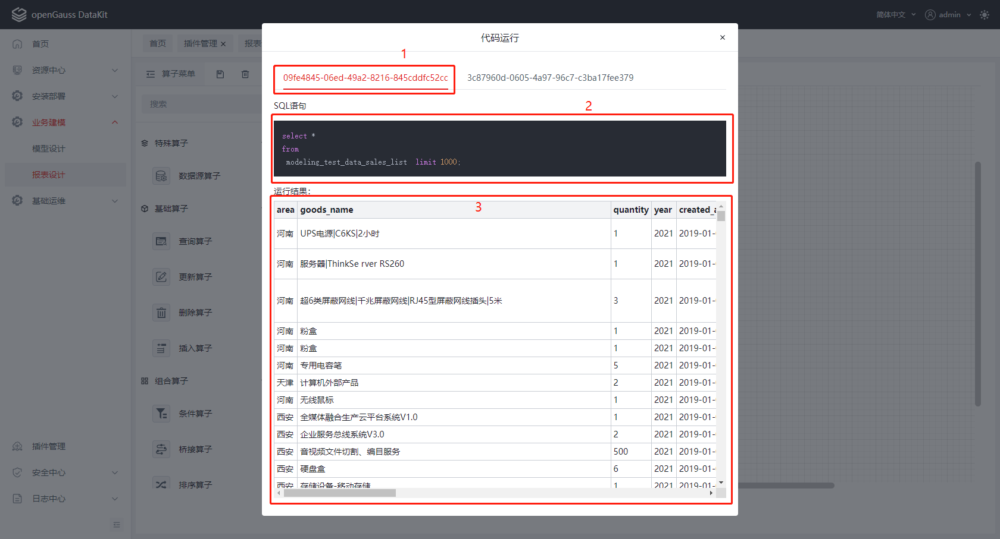

**说明：**

1.配置好算子流之后，点击快捷操作栏中的【播放】按钮，可以看到SQL语句以及对应的查询结果。

2.（1）处为tab标签页，如果存在多个查询语句，则会分为多个标签点击切换。tab标签页的命名来源于该序列的基础算子的UUID，如查询算子，删除算子，该UUID为antv-X6组件随机生成。

3.（2）处为SQL语句预览区

4.（3）处为查询结果区

## **数据流算子配置篇**

### **概述**

本工具当前支持特殊算子1个，基础算子4个，组合算子8个，共计13个不同类型的算子。本章节将逐个介绍每个算子的配置说明，以及相互之间的连接、约束关系。

### **角色**

拥有数据流设计权限的角色可以访问。

### **界面**

1、特殊算子-数据源算子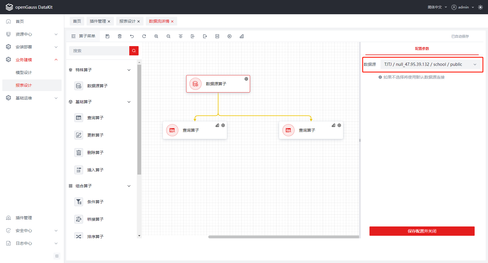

**说明：**

1.数据源算子只有一个下拉框配置项，用于指定一体化平台中已经配置好的集群/节点/数据库/schema信息。

2.数据源算子可以指向多个基础算子，且只能指向基础算子，所有与之相连的基础算子，在执行增删改查等操作时，都会在该数据源算子配置的数据库中执行SQL。

3.数据源算子不是必要算子，若一个基础算子没有对应的数据源算子与之相连，则会使用新建数据流时配置的默认数据源进行SQL的执行。

4.如果修改一个已经连接使用的数据源算子，将有可能导致与之相连的后续所有算子不可用，比如：修改数据源后，新的数据库中不存在之前数据库中的表名，字段等。所以在修改数据源算子时，将会对用户进行二次确认的提示，并需要用户自行检查后续算子的配置是否可用。

2、基础算子-查询算子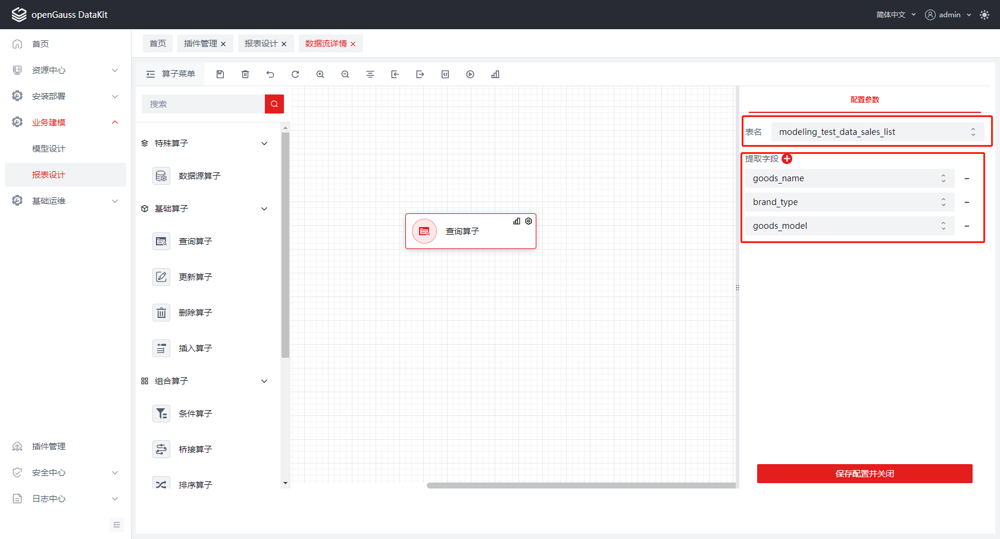

**说明：**

1.查询算子的配置包含一个必选下拉框-表名，用户可以从下拉框中选择数据源中包含的所有表名。

2.查询算子可以用过点击加号配置提取字段，效果等同于`SELECT goods_name , brand_type , goods_model from modeling_test_data_sales_list` ,如果不配置提取字段，则默认会提取所有字段，效果等同于`SELECT * from modeling_test_data_sales_list` 。

3.查询算子下方可以连接多个组合算子，但是不可以连接其他基础算子。后续描述中【基础算子为查询算子的序列】即以查询算子作为某条算子流的开始的一系列算子组合。

3、基础算子-更新算子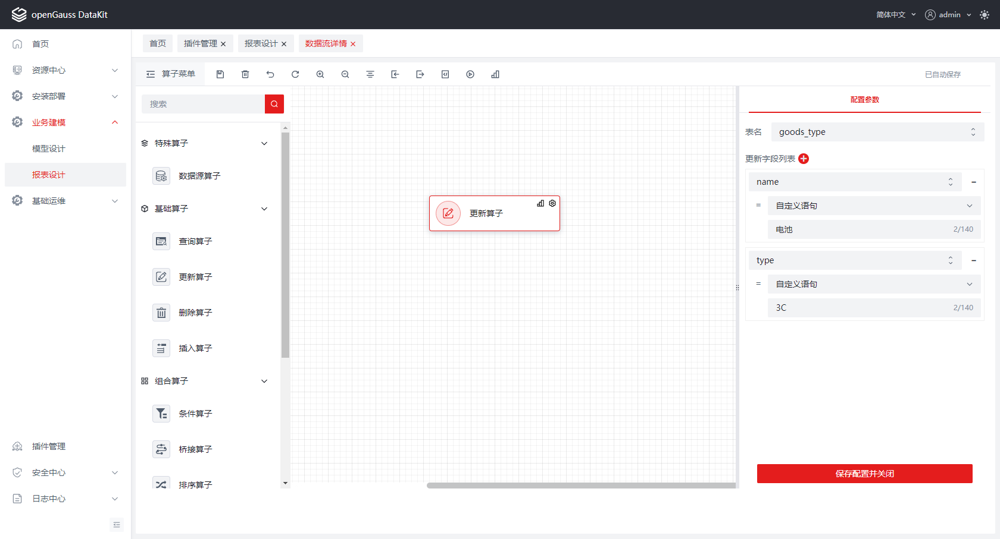

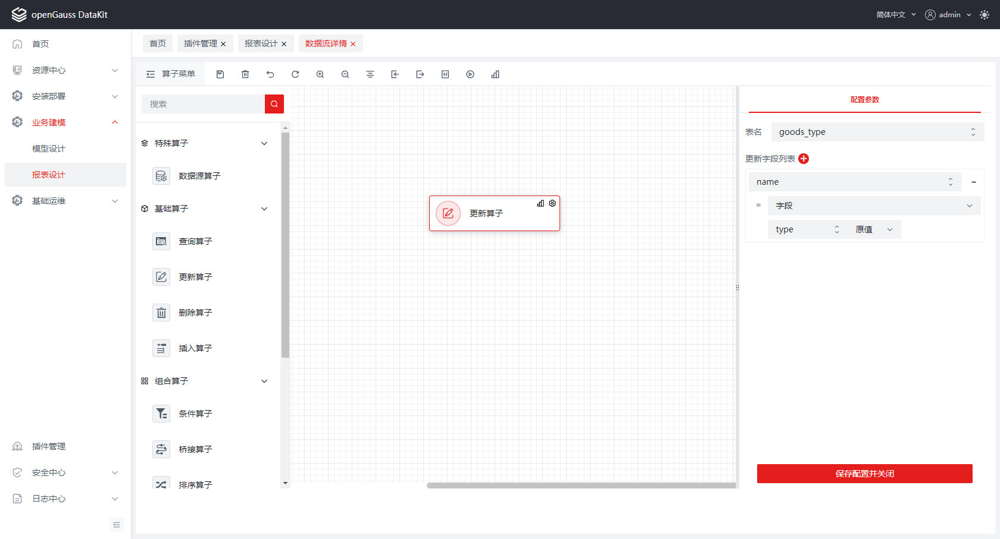

**说明：**

1.更新算子的配置包含一个必选下拉框-表名，用户可以从下拉框中选择数据源中包含的所有表名。

2.更新算子可以用过点击加号配置一个或多个更新字段，更新方式有两种，第一种默认为自定义语句，即将指定字段的值更新为输入框内的内容。另一种为字段模式，可以使用表内其他字段来进行更新操作，通过选择后置字段后方的下拉框（原值、拼接）可以将后置字段的原值覆盖或拼接更新到目标字段上。

3.更新算子一般需要搭配条件算子使用，如果更新算子不连接任何条件算子，则会对整表进行更新。

4.更新算子下方可以连接多个组合算子，但是不可以连接其他基础算子。后续描述中【基础算子为更新算子的序列】即以更新算子作为某条算子流的开始的一系列算子组合。

4、基础算子-删除算子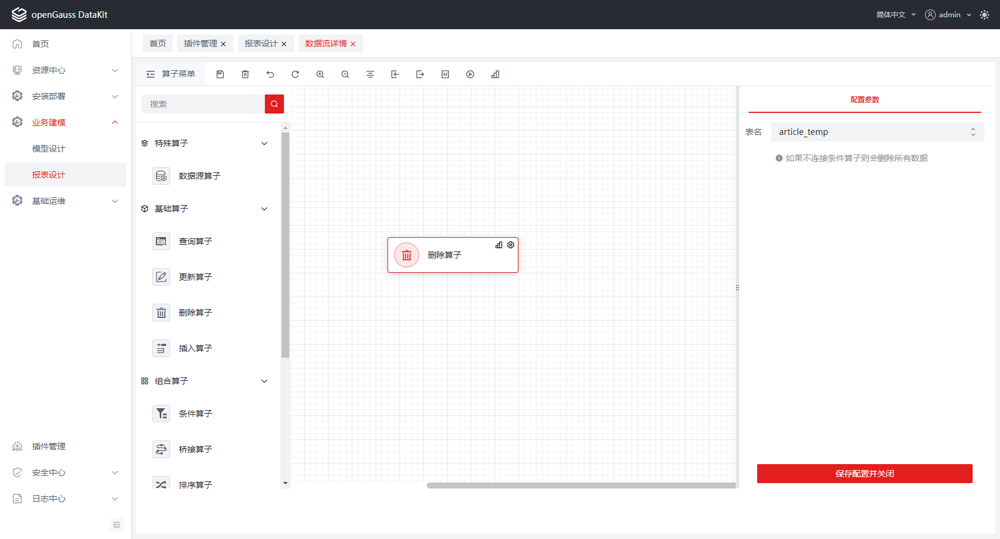

**说明：**

1.删除算子的配置包含一个必选下拉框-表名，用户可以从下拉框中选择数据源中包含的所有表名。

2.删除算子一般需要搭配条件算子使用，如果更新算子不连接任何条件算子，则会删除整张表数据。

3.删除算子下方可以连接多个组合算子，但是不可以连接其他基础算子。后续描述中【基础算子为删除算子的序列】即以删除算子作为某条算子流的开始的一系列算子组合。

5、基础算子-插入算子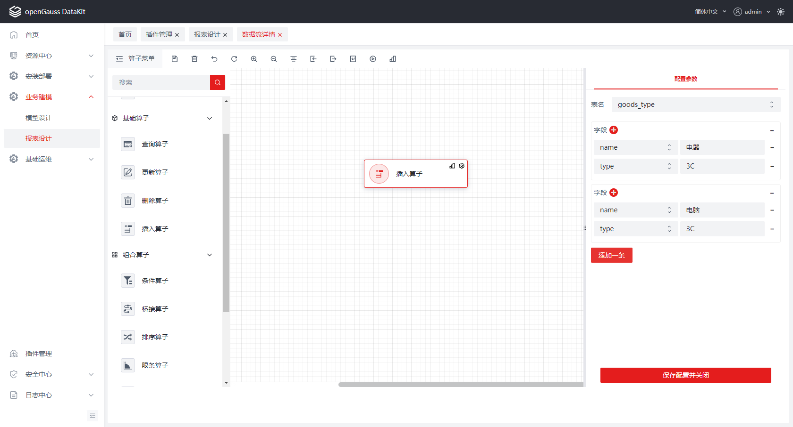

**说明：**

1.插入算子的配置包含一个必选下拉框-表名，用户可以从下拉框中选择数据源中包含的所有表名。

2.插入算子可以通过点击【添加一条】按钮，添加多条插入数据。

3.插入算子下方可以连接多个组合算子，但是不可以连接其他基础算子。后续描述中【基础算子为插入算子的序列】即以插入算子作为某条算子流的开始的一系列算子组合。

6、组合算子-条件算子

**说明：**

1.条件算子的配置至少需要包含一个或条件，每个或条件内至少包含一个或多个且条件。

2.每个条件由3个部分组成，字段、条件类型、值。其中条件类型和值为用户手动选择或输入，字段将从条件算子上下游连接的算子中获取所有表的字段，举例：在查询算子-条件算子-桥接算子这样的连接序列中，查询算子选择的查询表为USER，而桥接算子将ROLE表桥接进来，那么在条件算子中，可以选择的字段将同时包含USER表和ROLE表的所有字段。

3.条件算子可以同时连接多个，并会同时生效。

7、组合算子-桥接算子

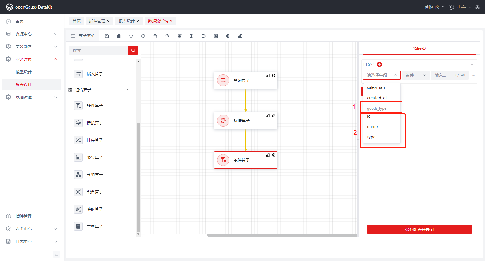

**说明：**

1.桥接算子的配置包含需要桥接的表名，用户可以从下拉框中选择数据源中包含的所有表名。

2.桥接算子需要选择桥接类型，桥接类型包含内连接，左外连接，右外连接，全外连接，桥接条件。分别对应`join，left join，right join，full join` 四种语法。

3.桥接条件的选择由3个下拉框组成，第一个为基础算子中选择的表字段，第二个为条件类型一般选择等于即可，第三个为桥接表中的字段。如图示中配置将会得到如下的join语句：`left join  goods_type  on  ( modeling_test_data_sales_list.brand_type = goods_type.type )`  

4.桥接算子可以同时连接多个，并会同时生效。

5.连接桥接算子后，会使得其他组合算子在选择配置字段时，可以使用桥接表中的字段，如条件算子。在图示2中可以看到，使用桥接算子后，后续连接的条件算子中选择字段的下拉框（1）处出现了桥接表的表名（灰色字体），在表名下方的（2）处即为桥接表拥有的字段。

8、组合算子-排序算子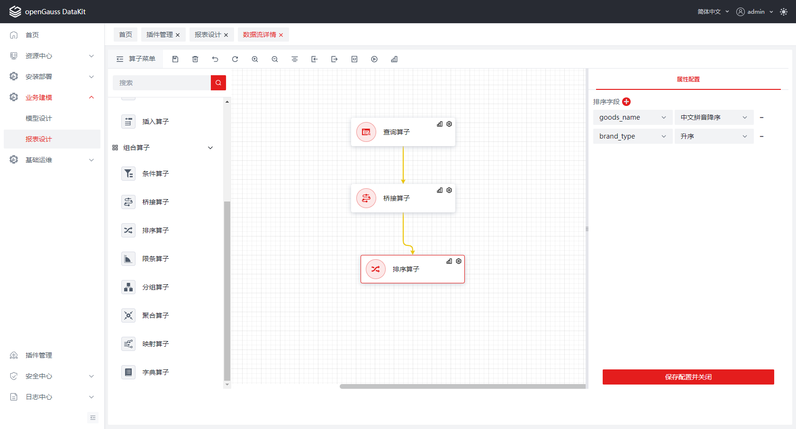

**说明：**

1.排序算子的配置至少需要包含一个或多个字段排序设置。

2.每个排序条件由2个部分组成，字段、排序类型。字段将从算子序列中包含的所有字段中选择，排序类型分为三种，升序，降序，中文拼音降序。

3.其中中文拼音降序选项需要数据库有对应的格式支持，具体请查阅openGauss使用手册。

4.排序算子可以同时连接多个，并会同时生效。

9、组合算子-限条算子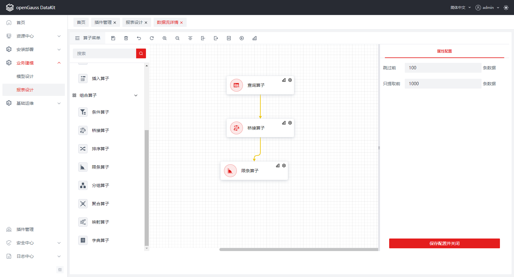

**说明：**

1.限条算子的配置由两个输入框组成，跳过前N条记录，以及只提取前M条记录。

2.如图示配置得到的语法结果如下：`select * from modeling_test_data_sales_list limit 1000 offset 100;`

10、组合算子-分组算子和聚合算子

**说明：**

1.分组算子和聚合算子都为组合算子，这两种算子需要搭配使用，所以放在一起说明。

2.分组算子需要至少配置一个或多个字段对数据进行分组，即GROUP BY语法，每个聚合字段的配置包含三个部分，字段名、聚合类型、别名。

3.在分组算子后使用聚合算子，可以对分组后的数据中的其他字段进行聚合函数操作，目前支持三种类型的聚合，求和、最大值、平均值，分别对应语法`SUM(),MAX(),AVG()`

4.分组算子和聚合算子应该在基础算子为查询算子的序列中使用。

11、组合算子-映射算子

**说明：**

1.映射算子的配置至少包含一条或多条映射规则，每条规则由3部分组成，原字段，映射类型（目前只有as），映射别名。

2.映射算子只在基础算子为查询算子的序列中生效。

3.如上图配置得到的语法结果如下：`select goods_name as g_name` ...

12、组合算子-字典算子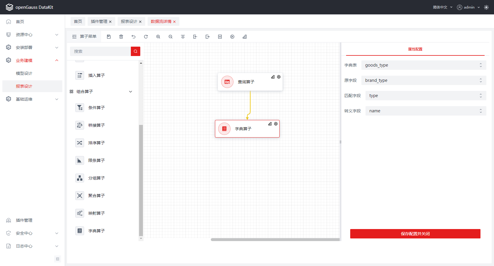

**说明：**

1.字典算子的配置包含4个下拉框选择，分别为字典表表名，原字段，匹配字段，转义字段。

2.举例说明，字典表goods_type中包含了每种商品名称(name)、商品类型(type)，而主查询的结果中只包含了商品名称(goods_name)，在这种情况下我们想要查询结果中出现的是商品类型，而不是商品名称，那么我们就可以使用字典算子来完成字典转义的功能。我们在字典算子中首先选择字典表的表名（goods_type)，然后选择需要替换掉的原表字段（goods_name)，然后在匹配字段下拉框中选择字典表中与(goods_name)一一对应的字段（name），到此已经完成字典表和原字段的匹配，最后在转义字段中选择需要从字典表中用来替换的字段即可，这里我们选择商品类型（type）。

3.字典算子的转义过程由left join语法完成，以上配置结果得到的完整语句如下：`select *,"goods_type".type as goods_name from modeling_test_data_sales_list left join "goods_type" on "goods_type".name = goods_name ;`

## **可视化图表新增**
### **概述**
在本页面可以对执行到该算子的查询结果进行可视化展示，可以通过配置一个或多个图表信息，支持的图表类型有：柱状图、折线图、混合图、热力图、饼图、地理图、关系图。
### **角色**
拥有数据流设计权限的角色可以访问。
### **界面**
1、新建图表

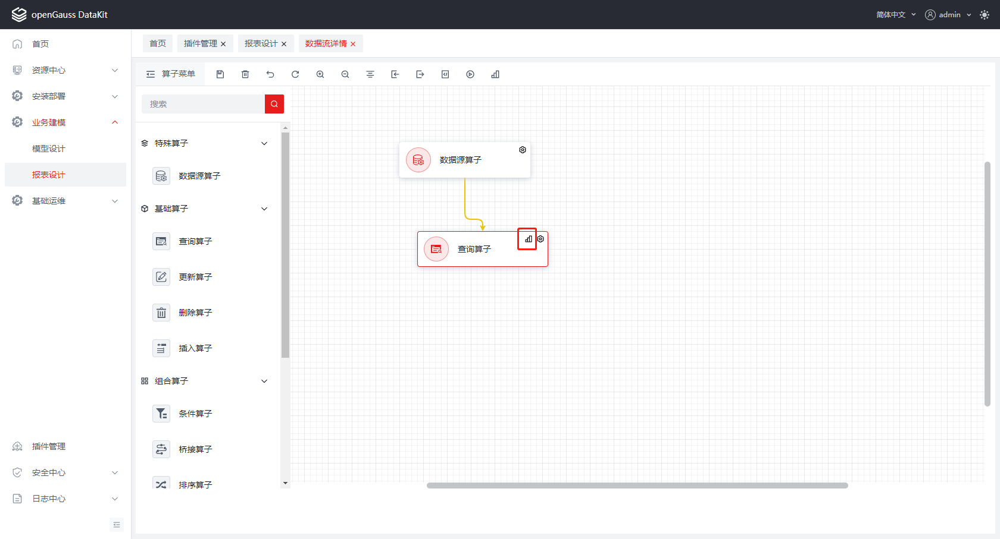

**说明：**

1.点击任意算子上的柱状图按钮，可以进入该算子的独立可视化配置界面。

2.在（1）处点击新建图表弹出可以新建的所有图表类型，选择任意一个即可开始配置可视化参数，每个算子可以新增多个图表。

## **可视化图表配置页面**
### **概述**
在本页面可以对执行到该算子的可视化图表进行配置，对同一组查询数据根据不同的参数会得到完全不同的图表。本章节将对柱状图、折线图、混合图、热力图、饼图、地理图、关系图的配置一一进行说明。
### **角色**
拥有数据流设计权限的角色可以访问。
### **界面**

本章节使用测试数据表结构和部分内容如下：

| area | goods_name                                           | quantity | year | created_at                    | tax_rate | price_unit | goods_model                                            | salesman | id   | present | department     | brand_type | price_total |
| ---- | ---------------------------------------------------- | -------- | ---- | ----------------------------- | -------- | ---------- | ------------------------------------------------------ | -------- | ---- | ------- | -------------- | ---------- | ----------- |
| 河南 | UPS电源\|C6KS\|2小时                                 | 1        | 2021 | 2019-01-02T17:06:43.000+08:00 | 16%      | 19000      | UPS电源 \|C6KS\|2小时                                  | 史宗宗   | 428  | 销售品  | 业务部二       | 华为       | 19000       |
| 河南 | 服务器\|ThinkSe rver RS260                           | 1        | 2021 | 2019-01-03T10:13:43.000+08:00 | 16%      | 7950       | 服务器 \|ThinkSe rver RS260                            | 史宗宗   | 443  | 销售品  | 业务部二       | 华为       | 7950        |
| 河南 | 超6类屏蔽网线\|千兆屏蔽网线\|RJ45型屏蔽网线插头\|5米 | 3        | 2021 | 2019-01-03T10:57:08.000+08:00 | 16%      | 29.74      | 超6类屏蔽网线\|千兆屏蔽网线 \|RJ45型屏蔽网线 插头\|5米 | 史宗宗   | 445  | 销售品  | 业务部二       | 华为       | 89.22       |
| 河南 | 粉盒                                                 | 1        | 2021 | 2019-01-03T13:16:48.000+08:00 | 16%      | 1040       | 3503                                                   | 马曙光   | 200  | 销售品  | ZD政教事业一部 | 理光       | 1040        |

某项图表的绘制需要特定类型的字段内容，将在后续说明，如无特殊说明则任意查询结果都可以正常使用绘制；各类图表的展示有其侧重点，但没有办法像excel一样将全部数据展示，需根据实际情况选择图表类型及修改配置项使用。

1、柱状图配置-示例1

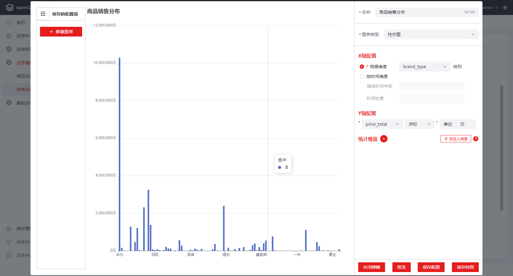

2、柱状图配置-示例2

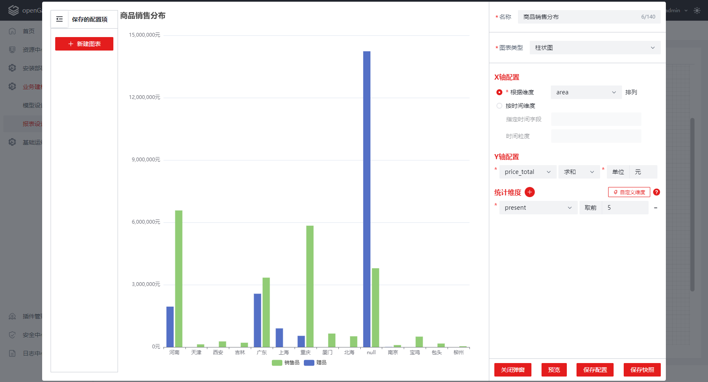

3、柱状图配置-示例3

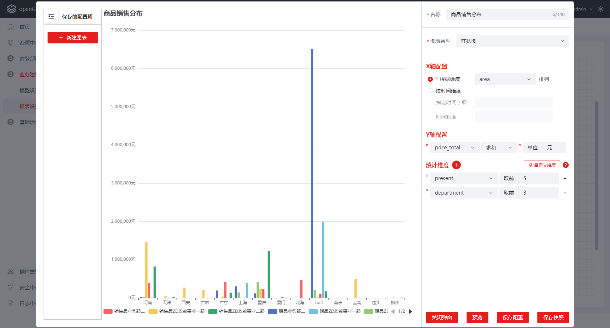

4、柱状图配置-示例4

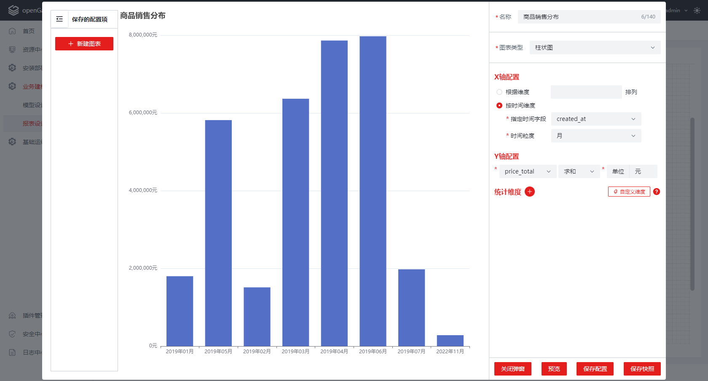

**说明：**

1.X轴配置需要选择一个字段作为X轴下标的分布，可理解为对数据按某字段进行分组，如分类统计不同品牌的销量，则应该在X轴选择品牌字段（brand_type)。

2.Y轴配置中需要选择一个字段，作为柱体高度值的来源，可以从查询结果中类型为整型、浮点型的字段中选择，如想统计不同品牌的销售金额总价，则在Y轴配置字段选择商品总价(price_total)。

3.统计维度，在X轴分组的基础之上，再次进行多个维度的分组可在此处配置，维度字段为必填项，每个维度可以设置只取前N条，避免条目过多展示效果不好。如在X轴选择了品牌字段（brand_type)后，还想在看到不同品牌内赠品和非赠品的销售情况差异，则可以在统计维度添加一条，选择是否赠品字段（present）。

4.自定义维度：可以通过自定义配置，对某个字段的所有枚举值进行分类，并形成一个新的统计维度，该统计维度使用方法与常规字段一致，用户完成新增自定义维度并保存后，则可以在该算子中任意图表使用。

5.点击预览按钮后，会出现生成快照按钮，点击则会保存一份独立图表快照信息到历史记录中。

**举例：**

示例1-最简配置只需要选择X轴字段，Y轴字段，如示例1中，只需进行最简配置即可得到以品牌（brand_type）为X轴，以销售总价(price_total)为Y轴的二维数据展示。

示例2-当最简单的X轴配置不能满足我们需求时，可以通过添加统计维度来增加X轴分布的粒度，如示例2中，X轴我们选择了area进行不同地区销售情况的统计，然后再统计维度中我们新增了一项present（是否赠品），这样我们生成的柱状图中，每个X轴下标都会包含多组不同颜色的柱体，即得到了不同地区中，赠品和非赠品的销售情况。

示例3-在图示2的基础上，如果需要更加细的统计粒度，可以再继续添加统计维度，示例3中我们又添加了一个department（部门）维度，可以看到图表的结果中展现了更多的不同颜色柱体，分别对应了不同部门的赠品、非赠品销售情况。

示例4-在X轴配置中可以选择按时间维度分布，该类型的X轴字段需要满足通用日期格式YYYY-MM-DD，图表会根据选择的时间粒度（年、月、日）进行图表X轴下标的绘制。

5、折线图配置-示例1

6、折线图配置-示例2

7、折线图配置-示例3

8、折线图配置-示例4

**说明：**

1.X轴配置需要选择一个字段作为X轴下标的分布，可理解为对数据按某字段进行分组，如分类统计不同品牌的销量，则应该在X轴选择品牌字段（brand_type)。

2.Y轴配置中需要选择一个字段，作为折线高度值的来源，可以从查询结果中类型为整型、浮点型的字段中选择。如想统计不同品牌的销售金额总价，则在Y轴配置字段选择商品总价(price_total)。

3.统计维度，在X轴分组的基础之上，再次进行多个维度的分组可在此处配置，维度字段为必填项，每个维度可以设置只取前N条，避免条目过多展示效果不佳。如在X轴选择了地区字段（area)后，还想在看到不同品牌内赠品和非赠品的销售情况差异，则可以在统计维度添加一条，选择是否赠品字段（present）。

4.自定义维度：可以通过自定义配置，对某个字段的所有枚举值进行分类，并形成一个新的统计维度，该统计维度使用方法与常规字段一致，用户完成新增自定义维度并保存后，则可以在该算子中任意图表使用。

5.点击预览按钮后，会出现生成快照按钮，点击则会保存一份独立图表快照信息到历史记录中。

**举例：**

示例1-最简配置只需要选择X轴字段，Y轴字段，如示例1中，只需进行最简配置即可得到以品牌（brand_type）为X轴，以销售总价(price_total)为Y轴的二维数据展示。

示例2-当最简单的X轴配置不能满足我们需求时，可以通过添加统计维度来增加X轴分布的粒度，如示例2中，X轴我们选择了area进行不同地区销售情况的统计，然后再统计维度中我们新增了一项present（是否赠品），这样我们生成的折线图中，每个X轴下标都会包含多组不同颜色的折线，即得到了不同地区中，赠品和非赠品的销售情况。

示例3-在图示2的基础上，如果需要更加细的统计粒度，可以再继续添加统计维度，示例3中我们又添加了一个department（部门）维度，可以看到图表的结果中展现了更多的不同颜色折线，分别对应了不同部门的赠品、非赠品销售情况。

示例4-在X轴配置中可以选择按时间维度分布，该类型的X轴字段需要满足通用日期格式YYYY-MM-DD，图表会根据选择的时间粒度（年、月、日）进行图表X轴下标的绘制。

9、混合图配置-示例1

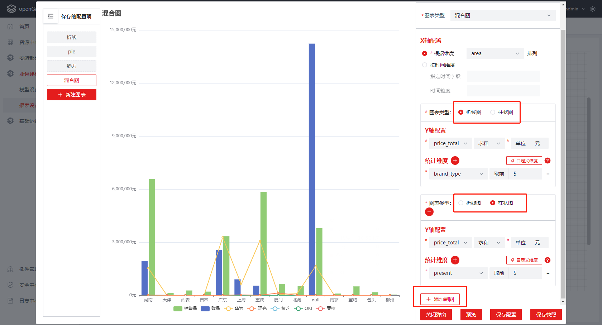

**说明：**

1.混合图的配置是通过添加多个副图（副图类型只能是柱状图或折线图），通过统一的X轴配置，将多个副图的Y轴内容叠加显示。

2.首先需要配置X轴维度，配置方式与前述柱状图和折线图的方式一致。

3.接着需要点击【添加副图】按钮，增加一个或多个副图，每个副图需要选择图表类型（柱状图，折线图），剩下的Y轴配置与统计维度配置，与与前述柱状图和折线图的方式一致。

4.自定义维度：可以通过自定义配置，对某个字段的所有枚举值进行分类，并形成一个新的统计维度，该统计维度使用方法与常规字段一致，用户完成新增自定义维度并保存后，则可以在该算子中任意图表使用。

5.点击预览按钮后，会出现生成快照按钮，点击则会保存一份独立图表快照信息到历史记录中。

**举例：**

示例1-在该示例中，我们选择区域（area）字段作为X轴下标，然后点击【添加副图】按钮添加两个副图，并将第一个副图设置为折线图，Y轴为商品总价（price_total），统计维度添加一条品牌（brand_type)，第二个副图设置为柱状图，Y轴同样配置为商品总价（price_total)，如果此处配置的Y轴字段与其他副图不同，则在绘制的时候会出现多个Y坐标系，此处需要注意。统计维度我们选择是否赠品（present)。通过如上配置，我们可以得到的图表呈现如图所示，是两个独立的折线图和柱状图叠加显示在同一个坐标系中。

10、饼图配置-示例1

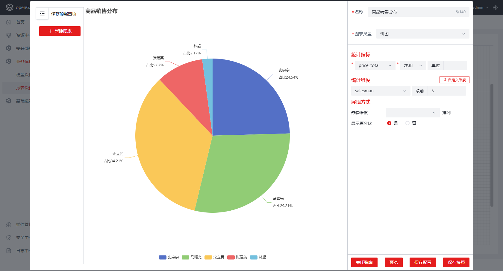

11、饼图配置-示例2

**说明：**

1.饼图的配置包含两个必填属性，统计指标和统计维度，统计维度是将饼图按照某个字段进行分组，统计指标是用来计算每个维度所占百分比的求和字段。

2 .饼图还可选择内部嵌套一个维度展示，通过配置【展现方式】-【嵌套维度】使用，此为选填项，配置之后会在饼图内部镂空并绘制一个独立的饼图。

3.自定义维度：可以通过自定义配置，对某个字段的所有枚举值进行分类，并形成一个新的统计维度，该统计维度使用方法与常规字段一致，用户完成新增自定义维度并保存后，则可以在该算子中任意图表使用。

4.点击预览按钮后，会出现生成快照按钮，点击则会保存一份独立图表快照信息到历史记录中。

**举例：**

示例1-在简单配置的情况下，我们只选择统计维度为业务员（salesman），统计指标为销售总价（price_total），我们可以得到一个简单的饼图，它将展示每个业务员的销售金额（求和）在同一个饼图上，所占百分比的不同。

示例2-在示例1的基础之上，如果我们想看到另一个维度的统计分布，比如该销售批次中，赠品和非赠品的占比，我们可以选择使用嵌套维度的方式，选择字段是否赠品（present），则可以看到我们的饼图中间出现一个独立的内嵌饼图，它将展示赠品和非赠品的统计占比。

12、热力图配置-示例1

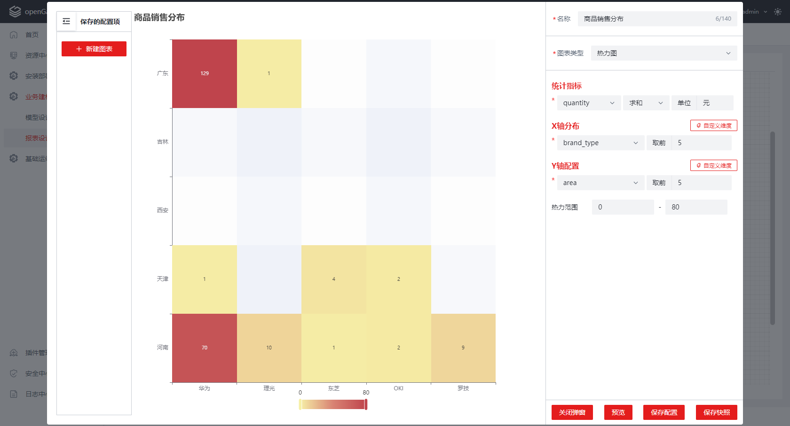

**说明：**

1.热力图配置包含三个主要配置项，X轴字段，Y轴字段，统计指标字段。

2.统计指标中需要选择一个字段，作为热力值计算的来源（目前只支持【求和】方式统计），可以从查询结果中类型为整型、浮点型的字段中选择。

3.X轴字段与Y轴字段即对应热力图横纵坐标系的下标 。

4.热力范围是选填项，主要根据实际数据范围来调整，使得热力图颜色分布更合理。

5.自定义维度：可以通过自定义配置，对某个字段的所有枚举值进行分类，并形成一个新的统计维度，该统计维度使用方法与常规字段一致，用户完成新增自定义维度并保存后，则可以在该算子中任意图表使用。

6.点击预览按钮后，会出现生成快照按钮，点击则会保存一份独立图表快照信息到历史记录中。

**举例：**

示例1-在示例中我们选择数量（quantity）作为统计指标，X轴我们选择品牌（brand_type)，Y轴数据选择销售区域（area)，我们可以得到一张热力图呈现，各区域对不同品牌的销售热度。

13、地理图配置-上传地图geo文件

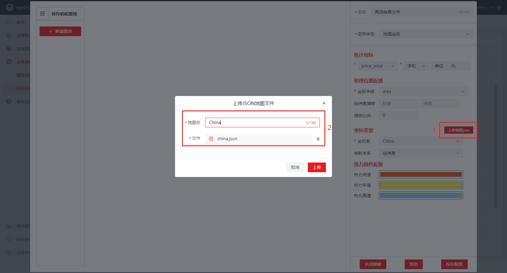

14、地理图配置-示例1

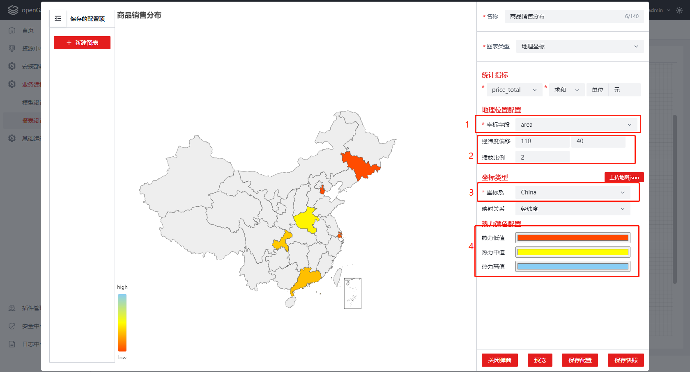

**说明：**

1.地理关系图的配置首选需要准备对应地区的geo地图文件（json格式），比如中国的省份地图（https://geojson.cn/api/data/china.json），在图1中点击（1）处调出上传弹窗，在（2）处输入地图别名，并选择下载好的geo文件点击上传即可，在同一个数据流中上传过的geo文件可以被其他算子重复使用，无需再次上传。

2.统计指标中需要选择一个字段，作为地图上每个区域统计值累加的来源（目前只支持【求和】方式统计），可以从查询结果中类型为整型、浮点型的字段中选择。

3 .在图2中，地理位置配置项的（1）处，需要选择一个地理名称字段，并且要求该字段内容与geo地图文件中的区域名称一致，如：商品销售区域（area）字段中存储的为省份信息的中文全称（山东、天津、广东、广西等），geo文件信息中也需要包含这些名称的省份的经纬度等信息。

4.在图2中，地理位置配置项的（2）处【经纬度偏移】【缩放比例】是可选配置，用来调整不同地图的偏移，缩放比例等呈现信息，如不配置也可通过鼠标滚轮，鼠标拖拽来做后续调整。【高亮前N条】选项则是将数值最大的统计区域做一个颜色的高亮区分。

5.在图2中，地理位置配置项的（3）处是必选配置，此处可选项即为第一步我们上传的geo文件，在下拉框中显示内容为上传时输入的地图名而非文件名。

6.在图2中，地理位置配置项的（4）处是选配配置，此处可更改左下角热力值色带的高，中，低颜色区域值。

7.点击预览按钮后，会出现生成快照按钮，点击则会保存一份独立图表快照信息到历史记录中。

**举例：**

示例1-在本示例中我们选择使用的是中国省份地图，并且确认我们的测试数据中包含省份信息（area），统计指标我们选择销售总价（price_total)，坐标系我们选择刚刚上传的地图（cc），通过调整偏移和缩放比例（非必须）得到在中国不同省份中，销售情况的分布，并且可以看到销售量最高的前5个区域颜色是处于橙色状态。

15、关系图配置-示例1

关系图所使用的查询数据结果应该至少包含如下结构：

| node_type | size | node_name | x    | y    | from | id   | to   | category | value | node_id |
| --------- | ---- | --------- | ---- | ---- | ---- | ---- | ---- | -------- | ----- | ------- |
| A         | 10   | 接口001   | 200  | 300  | n1   | 65   | n4   | 1        | 0     | n1      |
| A         | 10   | 接口001   | 200  | 500  | n6   | 1122 | n4   | 5        | 59.51 | n6      |
| A         | 10   | 接口002   | 20   | 3    | n1   | 383  | n2   | 1        | 195   | n11     |
| A         | 10   | 接口003   | 20   | 3    | n1   | 335  | n2   | 6        | 300   | n13     |
| A         | 10   | 接口005   | 20   | 50   | n1   | 58   | n2   | 3        | 345   | n15     |
| A         | 10   | 接口006   | 20   | 50   | n1   | 132  | n2   | 1        | 530   | n16     |
| A         | 10   | 接口007   | 200  | 500  | n7   | 445  | n13  | 3        | 89.22 | n7      |
| A         | 10   | 接口007   | 200  | 500  | n8   | 52   | n13  | 5        | 100   | n8      |
| A         | 10   | 接口007   | 200  | 500  | n9   | 375  | n13  | 1        | 135   | n9      |

**说明：**

1.关系图的配置主要分为两部分，节点配置和关系配置。其中节点配置中的信息用来绘制图表中每个点的相对位置、名称、尺寸信息。关系配置用来绘制节点之间连线的信息，粗细程度。

2.使用关系图需保证查询结果中包含所有对应的字段。

3.点击预览按钮后，会出现生成快照按钮，点击则会保存一份独立图表快照信息到历史记录中。

**举例：**

示例1-如图示1中将每项配置对应的字段选择好之后，工具会根据数据中对应的值直接绘制相应的关系图，该绘制过程属于直接绘制，工具不做额外处理。

## **可视化图表快照管理**
### **概述**
在本页面可以对前述章节生成的快照进行预览管理，快照的生成方式为：任意图表配置完成后，点击预览按钮后，会在左侧绘制图表同时在右侧下方出现【生成快照按钮】，点击则会保存一份独立图表快照信息到快照管理列表中，后续可使用它们生成多个不同的报表来进行分享展示。
### **角色**
拥有数据流设计权限的角色可以访问。
### **界面**
1. 可视化展示

   

   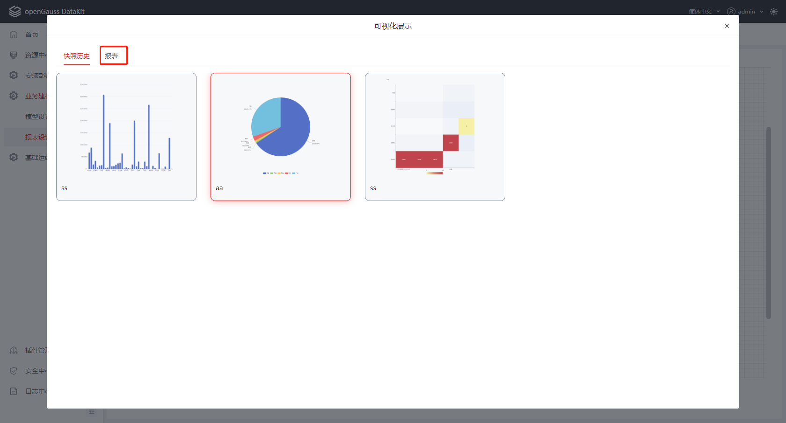

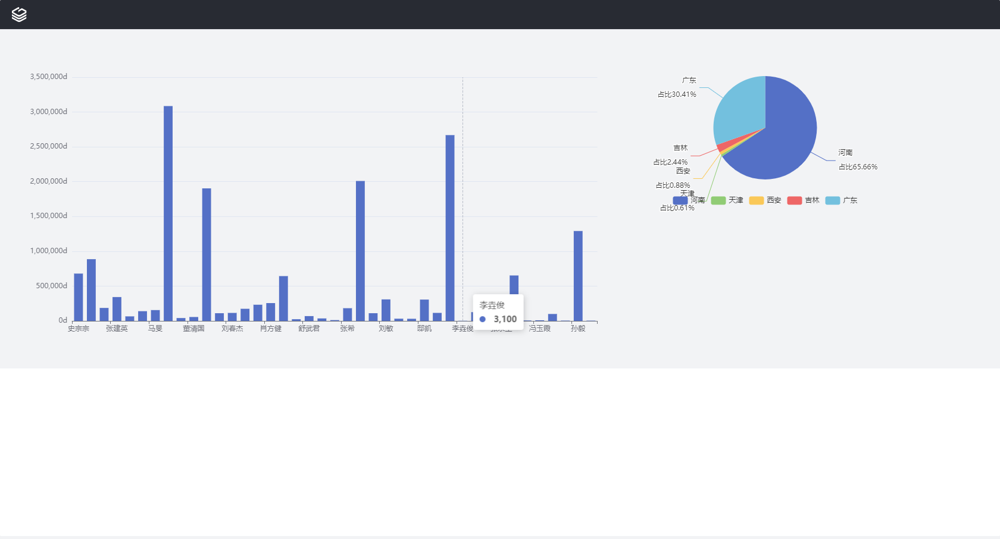

**说明：**

1. 如图示1在工作区快捷操作栏最后找到可视化按钮，点击即可打开可视化页面。

2. 进入图示2页面默认显示本数据流所生成的所有快照预览。

3. 在图示2页面点击（2）处tab切换即可进入报表管理页面。

4. 图示3页面中点击新建报表按钮开始绘制一个报表。

5. 在图示4中，右侧快照拾取区中，【鼠标单击】需要使用的快照，则会自动进入左侧绘制区。

6. 在左侧绘制区中调整快照的位置，大小等信息后点击保存按钮。

7. 在报表管理页面点击分享会自动生成分享链接。

8. 任意用户访问该链接即可看到绘制的报表内容。
