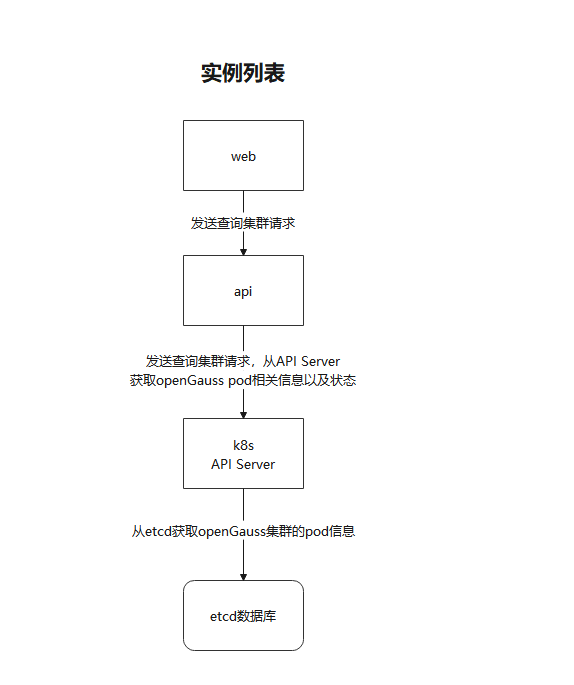

# container-management 容器管理插件介绍


## 项目介绍

container-management datakit插件项目目前版本为1.0.0，主要目的是提供容器化opengauss数据库可视化管理能力。
本项目需要与[cm-operator](https://gitee.com/opengauss/open-gauss-cm-operator)配合使用，以提供完整的集群管理能力。


## 功能特性介绍

本项目提供以下功能可视化
- 集群信息展示
    + 集群列表
    + 集群详情
    + 实例列表
- 集群操作
    + 集群创建
    + 集群删除
    + 实例关闭
    + 主从切换
    + 滚动重启
    + 资源规格调整
- 监控管理


## 版本使用注意事项

- container-management项目是作为openGauss一体化平台datakit插件进行开发，使用本项目必须依赖一体化平台。
- 需要配合[cm-operator](https://gitee.com/opengauss/open-gauss-cm-operator)部署获取完整集群操作。
- v1.0.0版本k8s表数据维护需要外部调用/k8s/cluster接口进行，后续版本将提供页面操作入口。

## 安装说明

- ```
  #下载源码：
  
  #编译打包
  mvn clean package -P prod -Dmaven.test.skip

- 打包完成后在plugins/container-management-plugin/target目录中找到container-management-plugin-7.0.0-RC2-repackage.jar即为插件安装包。

- 打开并登陆openGauss一体化平台，点击插件管理-安装插件，将上诉步骤获得的安装包上传并安装。

- 刷新页面可在右侧菜单栏看到**容器管理**一级菜单即为安装成功。

## 使用说明

### 1 集群信息展示
#### 1.1 集群列表

<div style="text-align: center;">图1-1 集群列表</div>


<div style="text-align: center;">图1-2 集群列表流程图</div>

#### 1.2 集群详情

<div style="text-align: center;">图1-3 集群详情</div>


<div style="text-align: center;">图1-4 集群详情流程图</div>

#### 1.3 实例列表

<div style="text-align: center;">图1-5 实例列表</div>


<div style="text-align: center;">图1-6 实例列表流程图</div>

### 2 集群操作
#### 2.1 集群创建

<div style="text-align: center;">图2-1 集群创建</div>


<div style="text-align: center;">图2-2 集群创建流程图</div>

#### 2.2 集群删除

<div style="text-align: center;">图2-4 集群删除</div>


<div style="text-align: center;">图2-5 集群删除流程图</div>

#### 2.3 实例关闭

<div style="text-align: center;">图2-6 实例关闭</div>


<div style="text-align: center;">图2-7 实例关闭流程图</div>

#### 2.4 主从切换

<div style="text-align: center;">图2-8 主从切换</div>


<div style="text-align: center;">图2-9 主从切换流程图</div>

#### 2.5 滚动重启

<div style="text-align: center;">图2-10 滚动重启</div>


<div style="text-align: center;">图2-11 滚动重启流程图</div>

#### 2.6 资源规格调整

<div style="text-align: center;">图2-12 资源规格调整</div>


<div style="text-align: center;">图2-13 资源规格调整流程图</div>

### 3 监控管理

<div style="text-align: center;">图3-1 监控管理</div>


