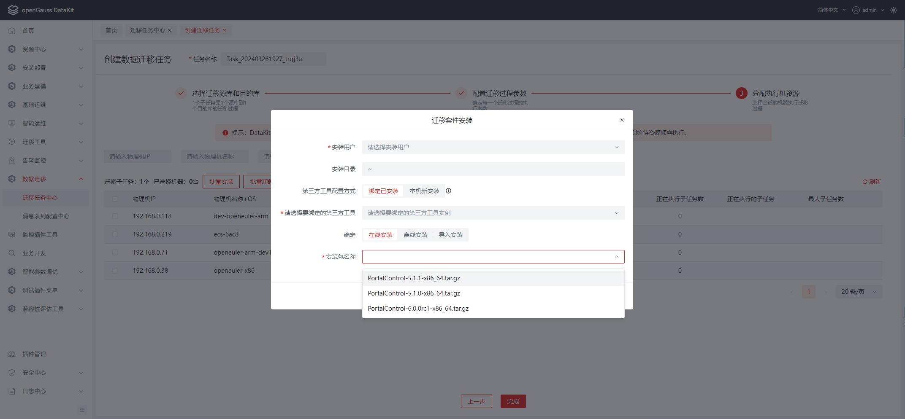
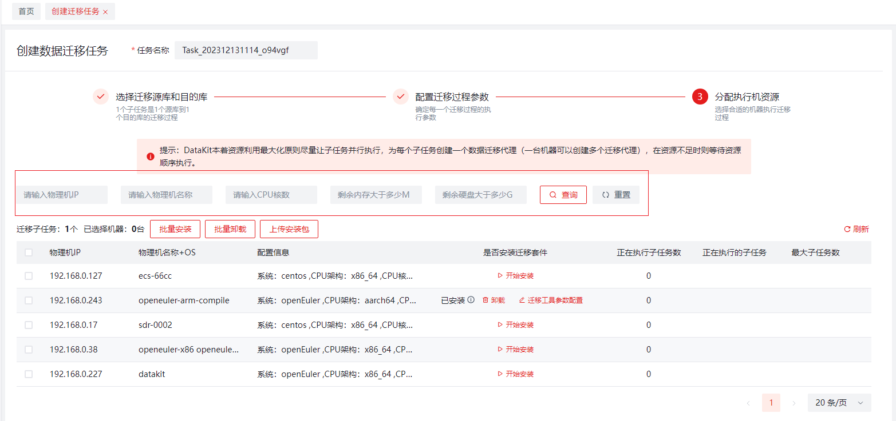
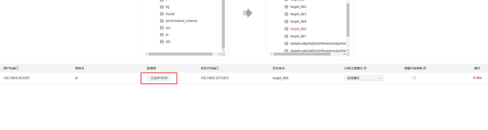

**openGauss DataKit Data Migration产品使用手册**

# **文档历史**

| **修订日期**   | **修订内容** | **版本号** | **编写人** |
|------------| --- | --- | -- |
| 2023/03/20 | 初稿  | 1.0 | 谢立波 |

# **关于本手册**

## **主要功能介绍**
该功能是为了将基于MySQL数据库的数据迁移到OpenGauss数据库而开发，并且支持数据的反向迁移。迁移模式包括在线模式（全量迁移+全量校验+增量迁移+增量校验+反向迁移）和离线模式（全量迁移+全量校验），同时可以批量创建任务进行并行迁移。

1、迁移任务管理：用户可以通过配置迁移任务，将单个或多个源端数据源中的数据迁移至目标数据源。

2、支持全量和增量数据的迁移：用户可以选择在线迁移（全量迁移+全量校验+增量迁移+增量校验+反向迁移）和离线迁移（全量迁移+全量校验）两种迁移模式。

3、支持数据的反向迁移：用户可以将openGauss数据库中的数据迁移至MySQL数据库。

4、迁移过程监控：用户可以实时查看迁移进度、日志和错误信息，并进行相应的处理。

5、并发执行：用户可以创建多个迁移任务并行执行，以提高迁移效率。

6、资源动态分配：系统能够根据最大化利用原则，合理分配运行机器，以实现多任务并行迁移。

## 特性说明
1、离线模式即为全量将数据迁移到目标端数据库，全量数据迁移及校验完成后，任务完成。

2、在线模式在离线模式的基础上，增加了增量数据的迁移和反向增量数据的迁移。全量数据迁移及校验完成后自动启动增量数据迁移，增量迁移停止后，可启动反向迁移。

3、主任务状态包含：未启动、迁移中、已完成、前置检查失败（此状态是在迁移前检查的，检查迁移过程中必要的kafka服务、数据库连接、数据库权限、数据库参数、磁盘空间是否满足要求）。

4、子任务状态包含：全量迁移开始、全量迁移进行中、全量迁移完成、全量校验开始、全量校验中、全量校验完成、增量迁移开始、增量迁移进行中、增量迁移已停止、反向迁移开始、反向迁移进行中、反向迁移已停止、迁移失败、前置检查失败。

5、任务进度算法说明

+ 总任务进度算法
> 总进度 = 子任务数量 * 4
>
> 完成进度 = （全量迁移中数量 * 1 + 全量迁移完成数量 * 2 + 增量和反向迁移中数量 * 3 + 迁移完成数量 * 4）/ 总进度
>
> 全量迁移中包含状态：全量迁移开始、全量迁移进行中、全量迁移完成
>
> 全量迁移完成包含状态：全量校验开始、全量校验中、全量校验完成
>
> 增量和反向迁移中包含状态：增量迁移开始、增量迁移进行中、增量迁移已停止、反向迁移开始、反向迁移进行中、反向迁移已停止
>
> 迁移完成包含状态：离线模式的全量校验完成、迁移完成

+ 离线子任务进度算法

  离线子任务通过底层迁移工具的全量迁移进度数据计算状态以及进度。进度状态包含：待迁移、迁移中、迁移完成（待校验）、校验中、校验完成、错误

  > 总进度 = 表数量 * 10 + 视图数量 + 函数数量 + 存储过程数量 + 触发器数量
  >
  > 完成进度 = （表完成数量 * 10 +  视图完成数量 + 函数完成数量 + 存储过程完成数量 + 触发器完成数量）/  总进度
  >
  > + 表完成状态包含：迁移完成（待校验）、校验中、校验完成
  > + 视图完成状态包含：迁移完成（待校验）
  > + 函数完成状态包含：迁移完成（待校验）
  > + 存储过程完成状态包含：迁移完成（待校验）
  > + 触发器完成状态包含：迁移完成（待校验）

+ 在线子任务完成

  > 在线子任务只有在人工触发结束迁移才会全部完成。因此进度的计算是根据当前状态在离线迁移进度基础上乘以固定系数计算。
  >
  > 当前状态是增量迁移开始、增量迁移进行中时，完成进度 = 离线进度 * 0.85
  >
  > 当前状态是反向迁移开始、反向迁移进行中，完成进度 = 离线进度 * 0.95

## **预期读者**
测试人员

开发人员

普通用户

## **迁移前置检查**
1、Kafka服务可用性检查：

>使用jps在portal执行机上执行查看，保证红框中的三个服务进程存在
>
>
>如果在portal以正常安装的情况下，三个服务进程异常终止，可使用如下命令启动三个服务进程。
>
>```shell
>java -Dpath=/{portal_path}/portal/ -Dorder=start_kafka -Dskip=true -jar /{portal_path}/portal/portalControl-*-exec.jar
>```
>
>启动成功，显示类似如下日志：
>
>```tex
>log4j: reset attribute= "false".
>log4j: Threshold ="null".
>log4j: Level value for root is  [debug].
>log4j: root level set to DEBUG
>log4j: Class name: [org.apache.log4j.ConsoleAppender]
>log4j: Parsing layout of class: "org.apache.log4j.PatternLayout"
>log4j: Setting property [conversionPattern] to [%d{HH:mm:ss,SS} %-5p (%C{1}:%M) - %m%n].
>log4j: Setting property [levelMin] to [INFO].
>log4j: Setting property [levelMax] to [ERROR].
>log4j: Setting property [acceptOnMatch] to [true].
>log4j: Adding filter of type [class org.apache.log4j.varia.LevelRangeFilter] to appender named [log.console].
>log4j: Adding appender named [log.console] to category [root].
>log4j: Class name: [org.apache.log4j.DailyRollingFileAppender]
>log4j: Setting property [file] to [/data/dgq/portal/portal//logs/portal_.log].
>log4j: Setting property [append] to [true].
>log4j: Setting property [datePattern] to [yyyy-MM-dd].
>log4j: Parsing layout of class: "org.apache.log4j.PatternLayout"
>log4j: Setting property [conversionPattern] to [%d{HH:mm:ss,SS} %-5p (%C{1}:%M) - %m%n].
>log4j: Setting property [levelMin] to [INFO].
>log4j: Setting property [levelMax] to [ERROR].
>log4j: Setting property [acceptOnMatch] to [true].
>log4j: Adding filter of type [class org.apache.log4j.varia.LevelRangeFilter] to appender named [log.file].
>log4j: setFile called: /data/dgq/portal/portal//logs/portal_.log, true
>log4j: setFile ended
>log4j: Appender [log.file] to be rolled at midnight.
>log4j: Adding appender named [log.file] to category [root].
>19:35:00,492 INFO  (ParamsUtils:initMigrationParamsFromProps) - properties = {awt.toolkit=sun.awt.X11.XToolkit, java.specification.version=11, sun.cpu.isalist=, sun.jnu.encoding=UTF-8, java.class.path=/data/dgq/portal/portal/portalControl-6.0.0rc1-exec.jar, java.vm.vendor=BiSheng, sun.arch.data.model=64, path=/data/dgq/portal/portal/, java.vendor.url=https://gitee.com/openeuler/bishengjdk-11/, user.timezone=Asia/Shanghai, os.name=Linux, java.vm.specification.version=11, sun.java.launcher=SUN_STANDARD, user.country=US, order=start_kafka, sun.boot.library.path=/data/dgq/env/java/bisheng-jdk-11.0.20/lib, sun.java.command=/data/dgq/portal/portal/portalControl-6.0.0rc1-exec.jar, jdk.debug=release, sun.cpu.endian=little, user.home=/home/dgq, user.language=en, java.specification.vendor=Oracle Corporation, java.version.date=2023-07-18, java.home=/data/dgq/env/java/bisheng-jdk-11.0.20, file.separator=/, java.vm.compressedOopsMode=Zero based, line.separator=
>, java.specification.name=Java Platform API Specification, java.vm.specification.vendor=Oracle Corporation, java.awt.graphicsenv=sun.awt.X11GraphicsEnvironment, java.protocol.handler.pkgs=org.springframework.boot.loader, sun.management.compiler=HotSpot 64-Bit Tiered Compilers, java.runtime.version=11.0.20+11, user.name=dgq, skip=true, path.separator=:, os.version=4.19.90-2110.8.0.0119.oe1.aarch64, java.runtime.name=OpenJDK Runtime Environment, file.encoding=UTF-8, java.vm.name=OpenJDK 64-Bit Server VM, java.vendor.version=BiSheng, java.vendor.url.bug=https://gitee.com/openeuler/bishengjdk-11/issues/, java.io.tmpdir=/tmp, java.version=11.0.20, user.dir=/data/dgq/portal, os.arch=aarch64, java.vm.specification.name=Java Virtual Machine Specification, java.awt.printerjob=sun.print.PSPrinterJob, sun.os.patch.level=unknown, java.library.path=/data/dgq/portal/portal/tools/chameleon/chameleon-6.0.0rc1:/data/dgq/portal/portal/tools/chameleon/chameleon-5.1.1:/data/dgq/portal/portal/tools/chameleon/chameleon-6.0.0rc1:/data/dgq/portal/portal/tools/chameleon/chameleon-6.0.0rc1:/data/dgq/portal/portal/tools/chameleon/chameleon-6.0.0rc1:/data/dgq/portal/portal/tools/chameleon/chameleon-6.0.0:/data/xz_u2/base/opt/huawei/install/om/lib:/data/xz_u2/base/opt/huawei/install/om/script/gspylib/clib::/usr/java/packages/lib:/lib:/usr/lib:/usr/lib64:/lib64, java.vm.info=mixed mode, java.vendor=BiSheng, java.vm.version=11.0.20+11, java.specification.maintenance.version=2, sun.io.unicode.encoding=UnicodeLittle, java.class.version=55.0}
>19:35:00,567 INFO  (MigrationConfluentInstanceConfig:getSystemParamAndParseEntity) - get MigrationConfluentInstanceConfig from system param = MigrationConfluentInstanceConfig(id=null, zookeeperPort=null, kafkaPort=null, zkIp=null, kafkaIp=null, installDir=null, bindPortalId=null, zkIpPort=null, kafkaIpPort=null, schemaRegistryIpPort=null, schemaRegistryIp=null, schemaRegistryPort=null, bindPortalHost=null, thirdPartySoftwareConfigType=null)
>19:35:00,569 INFO  (KafkaUtils:changeConfluentDirFromSysParam) - no need change param
>19:35:00,576 INFO  (FileUtils:createFile) - File /data/dgq/portal/portal/portal.portId.lock already exists.
>19:35:00,587 INFO  (FileUtils:createFile) - File /data/dgq/portal/portal/workspace/1 already exists.
>19:35:00,587 INFO  (FileUtils:createFile) - File /data/dgq/portal/portal/workspace/1/tmp/ already exists.
>19:35:00,592 INFO  (FileUtils:createFile) - File /data/dgq/portal/portal/workspace/1/logs already exists.
>19:35:00,631 INFO  (FileUtils:createFile) - File /data/dgq/portal/portal/workspace/1/status/ already exists.
>19:35:00,632 INFO  (FileUtils:createFile) - File /data/dgq/portal/portal/workspace/1/status/incremental/ already exists.
>19:35:00,632 INFO  (FileUtils:createFile) - File /data/dgq/portal/portal/workspace/1/status/portal.txt already exists.
>19:35:00,632 INFO  (FileUtils:createFile) - File /data/dgq/portal/portal/workspace/1/status/full_migration.txt already exists.
>19:35:00,632 INFO  (FileUtils:createFile) - File /data/dgq/portal/portal/workspace/1/status/incremental_migration.txt already exists.
>19:35:00,632 INFO  (FileUtils:createFile) - File /data/dgq/portal/portal/workspace/1/status/reverse_migration.txt already exists.
>19:35:00,632 INFO  (FileUtils:createFile) - File /data/dgq/portal/portal/workspace/1/logs/debezium/ already exists.
>19:35:00,633 INFO  (FileUtils:createFile) - File /data/dgq/portal/portal/workspace/1/logs/datacheck/ already exists.
>19:35:00,650 INFO  (ParamsUtils:changeDatacheckLogLevel) - global log level param is empty
>19:35:00,796 INFO  (MigrationConfluentInstanceConfig:getSystemParamAndParseEntity) - get MigrationConfluentInstanceConfig from system param = MigrationConfluentInstanceConfig(id=null, zookeeperPort=null, kafkaPort=null, zkIp=null, kafkaIp=null, installDir=null, bindPortalId=null, zkIpPort=null, kafkaIpPort=null, schemaRegistryIpPort=null, schemaRegistryIp=null, schemaRegistryPort=null, bindPortalHost=null, thirdPartySoftwareConfigType=null)
>19:35:00,851 INFO  (RuntimeExecUtils:executeStartOrder) - start command = /data/dgq/portal//portal/tools/debezium/confluent-5.5.1/bin/zookeeper-server-start -daemon /data/dgq/portal//portal/tools/debezium/confluent-5.5.1/etc/kafka/zookeeper.properties
>19:35:00,938 INFO  (RuntimeExecUtils:executeStartOrder) - Start zookeeper.
>19:35:02,964 INFO  (MqTool:start) - kafkaOrder====/data/dgq/portal//portal/tools/debezium/confluent-5.5.1/bin/kafka-topics --list --bootstrap-server 192.168.0.118:9092
>19:35:03,07 INFO  (RuntimeExecUtils:executeStartOrder) - start command = /data/dgq/portal//portal/tools/debezium/confluent-5.5.1/bin/kafka-server-start -daemon /data/dgq/portal//portal/tools/debezium/confluent-5.5.1/etc/kafka/server.properties
>19:35:03,93 INFO  (RuntimeExecUtils:executeStartOrder) - Start kafka.
>19:35:05,102 INFO  (RuntimeExecUtils:removeFile) - Remove file /data/dgq/portal/portal/tmp/test_.txt finished.
>19:35:07,108 INFO  (RuntimeExecUtils:removeFile) - Remove file /data/dgq/portal/portal/tmp/test_.txt finished.
>19:35:07,174 INFO  (RuntimeExecUtils:executeStartOrder) - start command = /data/dgq/portal//portal/tools/debezium/confluent-5.5.1/bin/schema-registry-start -daemon /data/dgq/portal//portal/tools/debezium/confluent-5.5.1/etc/schema-registry/schema-registry.properties
>19:35:07,181 INFO  (RuntimeExecUtils:executeStartOrder) - Start kafka schema registry.
>19:35:10,281 INFO  (MqTool:start) - Start kafka success.
>```

2、检查源端和目标端数据库是否可以连接：

>MySQL: mysql -h ip -P port -u user -ppassword -S /~/mysql.sock\
>OpenGauss: gsql -r -d database -p port -U user -W password

3、权限检查

**Mysql连接用户权限要求**如下：

为确认数据的顺利迁移，源端数据库（Mysql）的数据源添加时，请按照迁移需要添加所需权限，也可以直接给all权限；

1）全量迁移： select 、reload、 lock tables 、replication client

2）增量迁移： select 、replication client 、replication slave

3）反向迁移： select 、update 、insert 、delete

查询和修改用户权限的命令如下，如果连接用户权限不满足，请修改对应权限值。

```sql
-- 查询用户权限的命令
SELECT * FROM mysql.user WHERE USER = '{用户名}';
-- 修改用户权限的命令语法格式如下，其中privileges：用户的操作权限，如SELECT，INSERT，UPDATE等，如果要授予所的权限则使用ALL；databasename：数据库名；tablename：表名，如果要授予该用户对所有数据库和表的相应操作权限则可用*表示，如*.*。
GRANT privileges ON databasename.tablename TO '{用户名}';
-- 赋予用户全量迁移权限的命令
GRANT SELECT, RELOAD, LOCK TABLES, REPLICATION CLIENT ON *.* TO '{用户名}';
-- 赋予用户增量迁移权限的命令
GRANT SELECT, REPLICATION CLIENT, REPLICATION SLAVE ON *.* TO '{用户名}';
-- 赋予用户反向迁移权限的命令
GRANT SELECT, UPDATE, INSERT, DELETE ON *.* TO '{用户名}';
-- 赋予所有权限的命令
GRANT ALL ON *.* TO '{用户名}';
-- 在赋权后，确保刷新权限以使更改生效
FLUSH PRIVILEGES;
```

**openGauss连接用户权限要求**如下：

通过Datakit平台安装的目标端数据库（openGauss）可以直接迁移，导入的数据库以及在创建任务时添加的自定义openGauss数据源，需要提前将用户权限改为SYSADMIN角色；


>反向迁移需要将rolreplication设置为true


修改openGauss用户权限的方式如下：

##### *方式一：（推荐，符合最小权限）*

```shell
#给要迁移的目标库target_source赋all权限给迁移用户openGauss_test
grant all on database target_source to openGauss_test;
```

##### *方式二：（不推荐）*
```shell
#修改用户角色为SYSADMIN
alter user {用户名} SYSADMIN;
#查询用户角色，字段值为t时说明具有sysadmin角色，f时则没有
select rolsystemadmin from PG_ROLES where rolname='{用户名}';
```

> 有sysadmin角色权限

> 
>无sysadmin角色权限
>

4、日志参数检查

##### *增量迁移时，源数据库Mysql需要开启复制功能，在配置中增加以下配置参数，并重启*
> log_bin=ON
> 
> binlog_format= ROW
>
> binlog_row_image=FULL

查询参数值是否设置成功的命令如下：

```sql
SHOW VARIABLES LIKE 'log_bin';
SHOW VARIABLES LIKE 'binlog_format';
SHOW VARIABLES LIKE 'binlog_row_image';
```

##### *反向迁移时，需要在openGauss数据库增加如下配置，并重启*
> 调整pg_hba.conf以允许复制
>
> ```sql
> -- 根据连接用户和实际网络配置命令
> gs_guc set -D /opt/datakit/opengauss/datanode/dn1 -h "host replication {connected username} {ip/port} sha256"
> -- 允许ipv4所有用户和网络配置命令
> gs_guc set -D /opt/datakit/opengauss/datanode/dn1 -h "host replication all 0.0.0.0/0 sha256"
> -- 允许ipv6所有用户和网络配置命令
> gs_guc set -D /opt/datakit/opengauss/datanode/dn1 -h "host replication all ::/0 sha256"
> ```
>
> 调整wal_level参数命令：
>
> ```sql
> -- 修改参数的sql语句
> alter system set wal_level to logical;
> -- 或直接修改配置文件中的参数，其中“/opt/datakit/opengauss/datanode/dn1”为实际数据库节点目录
> gs_guc set -D /opt/datakit/opengauss/datanode/dn1 -c "wal_level = logical"
> ```

查询参数值是否设置成功的命令如下：

```sql
-- 查询是否允许复制的参数，为1表示设置成功
select rolreplication from pg_roles where rolname='{用户名}'
-- 查询wal_level参数
show variables like 'wal_level';
```

5、大小写参数检查

需确保Mysql和OpenGauss的大小写参数一致，查询大小写参数的命令如下：

```sql
-- 查询Mysql的大小写参数
show variables like 'lower_case_table_names';
-- 查询openGauss的大小写参数
show dolphin.lower_case_table_names;
```

修改大小写参数，使两者保持一致，修改方式如下：

修改Mysql的大小写参数

```tex
更改数据库参数文件my.cnf
在mysqld下添加或修改 lower_case_table_names = 1 之后重启数据库
```

```sql
-- 修改openGauss的大小写参数
alter user {用户名} set dolphin.lower_case_table_names to 0;
```

6、磁盘空间校验

迁移过程中会产生一些临时文件，需要占用一定的磁盘空间，要求磁盘满足---源端单表的最大数据量。

7、B库校验

迁移的目标数据库要求是B库，查询是否为B库的命令如下：

```sql
show sql_compatibility;
```

创建B库的命令

```sql
create database {dbname} with dbcompatibility = 'b';
```

8、Mysql加密方式校验

查询系统默认加密方式的命令

```sql
select @@default_authentication_plugin;
```

修改系统默认加密方式

```tex
更改数据库参数文件my.cnf
在mysqld下添加或修改 default-authentication-plugin=mysql_native_password 之后重启数据库
```

9、复制参数校验

启动反向迁移会占用逻辑复制槽位，需要确保openGauss有可使用的槽位。

```sql
-- 查询当前使用的槽位
select count(*) from pg_get_replication_slots();
-- 查询系统最大槽位
show max_replication_slots;
```

槽位很少出现被占满的情况，如若被占满，请参考openGauss社区寻找解决措施，社区地址：https://opengauss.org/zh/。

10、迁移过程中，请勿关闭源数据库或目标数据库；

11、执行迁移任务的服务器应具备一定的性能和配置，以保证迁移过程的顺利执行；

12、迁移任务是在非root用户下执行，任务的执行机器来源于平台资源中心的设备管理，因此需要在设备管理的用户管理中添加非root用户；

## 内核参数调整说明

1、 数据库用户为管理员时才能勾选“调整内核参数”；

2、 目前支持调整的内核参数仅为fsync=off，后续如需增加可以在portal/config/databaseAdjustParams.properties中增加；
## 功能说明

### 迁移任务中心
该页面将展示所有的主任务，可以启动、删除、结束迁移以及查看任务详情，同时可以创建迁移任务。

#### 任务筛选
可以通过任务名称、创建用户、任务状态、执行时间、完成时间进行筛选。


任务名称：模糊匹配任务名称包含输入内容的任务。

创建用户：筛选下拉框选中的用户创建的任务。

任务状态：筛选下拉框选中的状态的任务。

执行时间：筛选任务执行时间在选择的时间段内的任务。

完成时间：筛选任务完成时间在选择的时间段内的任务。
#### 任务创建

该任务是主任务，宏观层面的任务单元，包括若干个迁移过程（子任务），子任务为具体将数据从源端迁移到目的端的执行过程。子任务支持两种迁移模式，分别是在线模式和离线模式。
> **离线模式**：只会将现有已存在的全量数据迁移，全量数据迁移完成后，迁移任务结束。
>
> **在线模式**：将现有已存在的全量数据迁移完成后，任务会进入增量迁移状态，此时会监听源端数据的变化，如果有增量数据，会将增量数据进行迁移，在该模式下，可以停止增量迁移，之后启动反向迁移，任务会进入反向迁移状态，此时会监听目标端数据的变化，如果有反向增量数据，会将增量数据进行反向迁移。

迁移迁移任务创建任务总共分为3个步骤，分别是**配置迁移任务源库和目的库**、**源库和目的库可以直接新增数据源**、**配置迁移过程参数**。

##### **配置迁移任务源库和目的库**
该步骤需要配置迁移数据的源端和目标端数据库。首先在左侧选择源端数据库后，鼠标移动到右侧数据库上即可出现添加子任务按钮，点击按钮后，可以添加一条子任务，随后再配置子任务的迁移模式。


源库和目的库可以直接点击新增数据源进行添加。新增openGauss数据源的用户，需要提前将权限改为SYSADMIN。

##### **配置迁移过程参数**

该步骤可以配置任务全局参数和子任务参数。全局参数为所有子任务共享，作用于所有子任务，子任务参数只作用于自己，子任务参数优先级大于全局参数。


##### **分配执行机资源**
该步骤是配置任务运行的机器列表，数据来源于datakit平台资源中心的设备管理。机器会检测是否安装了底层迁移工具，如果未安装，可以在该步骤给机器安装迁移工具，安装时需要选择安装用户以及安装目录，对于kafka、zookeeper 
、schemaRegistory等第三方工具的安装可以选择绑定已安装的，也可以选择本机新安装 ；未安装迁移工具的机器不能执行迁移任务。 迁移工具的安装用户即为迁移任务的执行用户，该用户必须是非root用户，因此需要在datakit平台资源中心的设备管理中，添加非root用户。



该页面可以根据执行机器的IP、物理机名称、CPU核数、剩余内存空间、剩余硬盘空间进行筛选。

物理机IP：模糊匹配机器IP包含输入内容的机器。

物理机名称：模糊匹配物理机名称包含输入内容的机器。

CPU核数：筛选配置信息中CPU核数等于输入核数的机器。

内存空间：筛选配置信息中剩余内存空间大于输入数量的机器。

硬盘空间：筛选配置信息中剩余硬盘容量大于输入数量的机器。

点击迁移工具参数配置按钮后会弹出此页面，此页面用于配置迁移工具的参数，支持新增、修改、查看，只有新增的参数支持删除，工具自带的参数不支持删除。

点击完成按钮后，任务将创建完成，随后将跳转到迁移任务中心页面。

#### 任务启动
点击启动，系统将为该任务中的所有子任务，分配具体执行机器，给执行机器上的底层迁移工具下发指令，先进行迁移前检查，前置检查失败则不启动迁移，执行状态显示为前置检查失败，前置检查成功则启动迁移，状态改为迁移中。


#### 任务详情
如果任务未启动，打开详情将进入任务创建页面，可对任务进行修改。

如果任务已经启动，打开任务详情将进入任务详情信息页，可查看任务的进度信息以及所有子任务的迁移进度信息。

任务状态以及进度信息是从底层迁移工具执行结果中获取并且计算得出，此过程耗时较长，尤其是大批量任务的场景，因此进入详情页面后会获取一次所有子任务的状态，如果需要获取最新的状态，需要手动点击页面的刷新按钮获得。


如果校验失败，将鼠标放在错误图标上会显示具体校验失败的内容，其中"-"表示数据库连接不上。


在此页面可点击右侧停止按钮，让主任务结束迁移；同时可对子任务进行结束迁移、查看详情、查看日志、停止增量、启动反向、连接子任务执行机器等操作。
#### 查看详情
通过右侧抽屉弹出，将展示子任务的迁移详细数据，此时会实时获取子任务迁移数据（表、视图、存储过程、函数、触发器）的迁移进度信息，如果是在线模式，还会显示迁移的过程记录以及增量迁移速度等信息。


#### 查看日志
查看迁移相关日志列表，可下载日志，进行问题跟踪与分析。

#### 连接任务执行机器
点击子任务执行机器信息，将会打开webShell，登录该服务器。


#### 停止增量
停止增量：将正在增量迁移的任务进行停止，状态改为增量迁移已停止，在线模式下增量迁移开始、增量迁移进行中状态才会显示该功能。

#### 启动反向
启动反向：启动反向增量数据迁移，状态改为反向迁移开始，在线模式下增量迁移已停止状态才会显示该功能。

#### 结束迁移
结束迁移：主任务结束迁移将对所有子任务进行停止，对底层迁移工具发起结束迁移指令，任务状态改为完成。
#### 指定表迁移
该功能适用于仅需迁移某个库中部分表而非全量表的场景。操作过程如下：                 
选中某个库，点击"选择数据库"按钮，按业务需要勾选迁移的表，再选中目的端某个库创建迁移任务，迁移任务中显示已选表的数量。 




迁移任务只迁移选中的表以及与选中表相关的视图、函数等。


注1：全量迁移和增量迁移过程中，如果创建了新表，而该表不在选中的表名单中，但该表也会迁移过去。此外，对选中表的表结构的相关修改操作也会同步到目的端。因此，除非业务需要，否则迁移过程中应尽量避免进行建表、修改表结构等操作，以免影响迁移结果。

注2：在指定表迁移功能中，关于视图和触发器，会把与迁移表相关的视图和触发器迁移到目的端，不相关的则不迁移；关于函数和存储过程，则会全部迁移成功，但若函数/存储过程中关联的表未迁移，则该函数/存储过程会因缺少关联表而在目的端无法使用。

注3：在两次迁移任务中，如果分别选择了相同的源端库和目的端库，则后一次迁移的schema会覆盖前一次的迁移。例如，第一次迁移将mysql源端库test中的表tab1迁移到目的端的target_db下，第二次迁移将mysql源端库test中的表tab1迁移到目的端的target_db下，第二次迁移将mysql源端库test中的表tab2迁移到目的端的target_db下，则最终target_db库下的test中只有表tab2，不包含tab1，即第二次迁移覆盖第一次迁移结果。原因：datakit每次迁移会将目的端中同名的schema删除，重新创建schema进行迁移。

## 相关文档
[chameleon说明文档]( https://gitee.com/opengauss/openGauss-tools-chameleon/blob/master/chameleon%E4%BD%BF%E7%94%A8%E6%8C%87%E5%8D%97.md )

[debezium说明文档]( https://gitee.com/opengauss/debezium/blob/master/README.md )