# 业务开发用户手册


## 1 介绍

​	业务开发是一个基于 Browser/Server 通用集成开发环境，它以插件形式安装部署于 openGauss 一体化平台，简化了openGauss 数据库的开发和管理。

​	帮助数据库开发人员便捷地构建应用程序，以图形化界面形式提供数据库关键特性。它允许数据库开发人员仅需掌握少量的编程知识，即可使用该工具进行数据库对象操作，如：

- 创建和管理数据库对象

- 执行 SQL 语句或 SQL 脚本

- 编辑和执行 PL/SQL 语句

  

## 2 前言


### 2.1 概述

​	本章介绍手册相关信息。


### 2.2 读者对象

​	本手册主要适用于以下人员：

- 数据库开发人员
- 数据库管理员


### 2.3 修订记录

| 日期       | 版本   | 变更说明                    | 作者 | 检视 |
| ---------- | ------ | --------------------------- | ------ | ------ |
| 2022/12/15 | v1.0.0 | 新增 1230 版本所有初版内容  | 曾色亮 | 杨子浩     |
| 2023/3/15 | v1.1.0 | 新增 330 版本功能模块 | 曾色亮 |  杨子浩      |
| 2023/6/5 | v1.2.0 | 新增 630 版本功能模块 | 曾色亮 | 罗梦 |


### 2.4 文档约定

​	本节描述了本手册的（内容、符号、GUI 和文本）约定。 

**图形化界面格式约定**

​    	本手册中可能出现下列图形化界面格式约定，它们所代表的含义如下。

| 格式 | 说明                                                         |
| ---- | ------------------------------------------------------------ |
| 粗体 | 按钮、菜单、参数、页签、窗口及对话框标题均使用粗体并用引号括起来。例如，单击“**确定**”。 |


### 2.5 第三方许可证

​	本节包含适用于该插件的第三方许可证。

​	**表2-1 第三方软件列表**

| 第三方软件     |
| -------------- |
| 木兰宽松许可证 |


### 2.6 参考文档

​	使用可参考下表中文档：

​	**表2-2 参考文档**

| 文档名称           | 目的       |
| ------------------ | ---------- |
| openGauss 产品文档 | 数据库参考 |


## 3 简介


### 3.1 概述

​	通过提供图形化界面来展示数据库的主要功能，简化了数据库开发和应用构建任务。

​	数据库开发人员可以使用所提供的特性：

- 创建和管理数据库对象

- 执行 SQL 语句或 SQL 脚本

- 编辑和执行 PL/SQL 语句

   管理数据库对象包括：

   - 函数
   - 存储过程
   - 表
   - 序列
   - 视图
   - 同义词


### 3.2 支持的功能

​	支持 openGauss 数据库。

​	对 openGauss 数据库提供的功能如下：

​    **连接信息**

- 新建连接
- 编辑连接
- 查看连接属性
- 删除连接

​    **表**

- 查看表
  - 查看 DDL
  - 查看一般
  - 查看列
  - 查看约束
  - 查看索引
  - 查看数据

- 创建表
  - 管理列
  - 管理约束
  - 管理索引

- 管理表
  - 查询相关序列
  - 重建索引
  - 清理
  - 截断
  - 设置表模式
  - 设置表空间
  - 设置表描述
  - 重命名表
  - 删除表

- 管理表数据
  - 编辑表数据
  - 导出表 DDL
  - 导出表 DDL 和数据
  - 导出表数据


​	**序列**

- 创建序列
- 删除序列
- 查看 DDL
- 导出序列 DDL
- 导出序列 DDL 和数据

​	**视图**

- 创建视图
- 删除视图
- 查看 DDL
- 查看数据
- 导出视图 DDL

​	**同义词**

- 创建同义词
- 删除同义词
- 查看同义词属性

​	**SQL 终端**

- 打开多个"SQL 终端"页签
- 使用 SQL 查询
  - 使用 SQL 单条查询
  - 执行多条函数/过程或查询
  - 注释/取消注释
  - 插入空格/取消插入空格
  - 格式化

​	**函数/过程**

- 创建函数/过程

- 使用函数/过程
  - 删除函数/过程

  - 执行函数/过程
  - 导出函数/过程 DDL

- 调试函数/过程
  - 使用断点
  - 控制执行
  - 查看堆栈信息

- 覆盖率统计
  - 显示覆盖率
  - 导出覆盖率报表
  - 删除覆盖率记录

​    **数据库管理**

- 创建数据库
- 断开所有连接
- 打开连接
- 断开连接
- 编辑数据库属性
- 删除数据库
- 查看数据库属性
- 打开新终端

​    **模式**

- 创建模式
- 编辑模式
- 删除模式
- 导出模式 DDL
- 导出模式 DDL 和数据


### 3.3 约束和限制

**函数/过程**

在“**SQL** **终端**”或“**创建函数**/**过程**”向导创建的函数/过程须以“/”结尾，表示函数/过程的结尾。函数/过程随后输入的语句结尾如果没有“/”，语句会被视为单条查询，执行过程中可能会报错。


**调试**

前置条件：① 安装openGauss3.1.0  ② 安装 pldebugger 插件

仅支持plpgsql语言的调试


**项目运行**

本项目依赖主平台的web-socket，若需要使用本项目所有功能，只能通过编译成 jar 包的形式作为插件运行在主平台上，若需单独运行将影响 SQL 终端语句执行、调试函数/过程等功能的使用。


### 3.4 项目结构

下载 DataKit 项目代码

```
git clone https://gitee.com/opengauss/openGauss-workbench.git
```

项目结构如下图所示：


项目结构说明如下：

| 文件夹/文件 | 说明                   |
| ----------- | ---------------------- |
| src         | 保存后端代码及资源文件 |
| web-ui      | 保存前端代码           |
| .gitignore  | 提交git忽略的目录      |
| pom.xml     | 后端依赖项             |
| LICENSE     | 许可证                 |

### 3.5 系统要求

​	本节介绍使用的最低系统要求。

**浏览器兼容性**

| 内置对象 \ 浏览器及版本                                      | Chrome | Edge | Firefox | Opera | Safari |
| :----------------------------------------------------------- | :----: | :--: | :-----: | :---: | :----: |
| `Proxy`                                                      |   49   |  12  |   18    |  36   |   10   |
| [`Proxy()` constructor](https://developer.mozilla.org/en-US/docs/Web/JavaScript/Reference/Global_Objects/Proxy/Proxy) |   49   |  12  |   18    |  36   |   10   |
| [`revocable`](https://developer.mozilla.org/en-US/docs/Web/JavaScript/Reference/Global_Objects/Proxy/revocable) |   63   |  12  |   34    |  50   |   10   |

**软件要求**

| 软件 | 规格         |
| ---- | ------------ |
| Java | jdk 11及以上 |

**数据库版本要求**

| 数据库    | 版本                             |
| --------- |--------------------------------|
| openGauss | 所有（debug功能需3.0.0以上），企业版不支持创建函数 |


## 4 集成开发环境

​	 本章详细介绍如何部署。

​     前端技术栈：Vue3.0 + TS + Element plus

​     后端技术栈：Java + Spring boot

### 4.1 编译与部署

**前置条件：** ① 安装 node.js，建议使用 v16 以上版本  ② 安装Java jdk （建议使用v11及以上版本） 和 maven 3.X

**步骤 1：** 检查自动构建前端项目的配置是否为false

```
在 plugins > data-studio > pom.xml 下将以下值设为false：
<web.build.skip>false</web.build.skip>
<web.clean.skip>false</web.clean.skip>
```

**步骤 2：** 启动打包命令

```
mvn clean package -P prod
```

**步骤 3：** 在target目录下找到生成的jar，安装到一体化平台


### 4.2 本地启动

​          下面介绍如何在本地启动项目进行开发调试。

​          **说明：** 目前插件依赖平台插件运行，暂不支持本地调试。

#### 4.2.1 启动后端

**前置条件：** 安装Java jdk （建议使用v11及以上版本） 和 maven 3.X。

**步骤 1：** 使用idea打开项目，并配置好maven

**步骤 2：** 通过启动后端命令与前端命令的方式进入，此方式受限制，详情请参见 3.3 约束和限制

​                **步骤 2-1：** 找到 DataStudioPluginApplication 类，执行 main 函数


​             **步骤2-2：** 启动前端项目，请参见 4.2.2 启动前端。

#### 4.2.2 启动前端

**前置条件：** 安装 node.js，建议使用 v16 以上版本。

**步骤 1：** 下载依赖包 

```
 任选以下一种命令：
 npm install
 cnpm install
 yarn 
```

**步骤 2：** 启动前端项目

```
 根据package.json配置任选以下一种命令：
 npm run dev
 npm run lint
 npm run lint:prettier
```

**步骤 3：** 根据启动提示进入对应的URL地址，如下图所示：


## 5 使用指导

### 5.1 概述

​	     本章详细介绍如何使用插件的功能。建立有效的数据库连接后，方可对数据库执行操作。

### 5.2 连接信息

​	      启动后，默认打开 **“新建连接”** 对话框。要执行数据库操作，需连接至少一个数据库。


#### 5.2.1 新建连接

**步骤 1：** 若不存在连接，默认弹出 **"新建连接"** 对话框；若已存在连接，可在数据库列表选择 **“新建连接”** 弹出 **"新建连接"** 对话框。 

**步骤 2：** 该连接对话框的左侧列表中显示已有的连接信息和服务器信息。

​			    **说明：** 单击连接名称，可自动填充 “**名称**”、“**主机名**” 和 “**端口号**” 等连接参数。

**步骤 3：** 设置如下参数，创建数据库连接。

​			   **说明：** 所有必选参数均需要填写。必填参数用星号（*）标识。

​                            支持连接名称、连接信息、连接来源筛选。

​                            支持删除选中左侧连接来源为 "自定义连接" 的连接信息。

| 配置项     | 必填 | **组件形式** | 配置说明                                                     |
| ---------- | ---- | ------------ | ------------------------------------------------------------ |
| 数据库类型 | 是   | 下拉框       | 1）该配置项用于选择数据库类型  2）默认为openGauss，不可选，置灰状态 |
| 名称       | 是   | 输入框       | 1）该配置项用于填写连接名称  2）默认为空  3）限制字符个数不大于30 |
| 主机       | 是   | 输入框       | 1）该配置项用于填写ip地址    2）默认为空   3）输入内容需要符合ip地址规范，若填写内容不符合规范，则配置项组件标红且提示“填写内容不符合ip地址规范，请确认是否填写有误” |
| 端口号     | 是   | 输入框       | 1）该配置项用于填写数据库端口  2）默认为5432  3）输入内容需要符合端口号范围，即0-65535，若填写内容不符合规范，则配置项组件标红且提示“填写内容不符合端口范围，请确认是否填写有误” |
| 数据库     | 是   | 输入框       | 1）该配置项用于填写数据库名  2）默认为postgres  3）若填写内容不符合规范，则配置项组件标红且提示“数据库名不能为空” |
| 用户名     | 是   | 输入框       | 1）该配置项用于填写连接数据库的用户名  2）默认为空  3）若填写内容不符合规范，则配置项组件标红且提示“用户名不能为空” |
| 密码       | 是   | 输入框       | 1）该配置项用于填写连接数据库的密码  2）默认为空  3）支持显示和隐藏密码3）若填写内容不符合规范，则配置项组件标红且提示“密码不能为空” |


#### 5.2.2 编辑连接

​	            执行以下步骤编辑数据库连接属性：

**步骤 1：** 在 "**数据库列表**" 窗格中，右键单击连接名称，选择 "**编辑连接**" ，弹出 "**编辑连接**" 对话框。

**步骤 2：** 单击 "**确定**" 即可继续，或单击 "**取消**" 即可退出操作。

**步骤 3：** 编辑连接参数详细说明，请参见 5.2.1 添加连接。

​			   **说明**：单击 "**确定**" 将保存更新后的连接信息。

​                          单击 "**重置**" 即可重置 "编辑连接"对话框中的所有字段。

​                          单击 "**取消**" 即可退出本次对话框操作。


#### 5.2.3 查看连接属性

​               执行以下步骤编辑数据库连接属性：

**步骤 1：** 在 "**数据库列表**" 窗格中，右键单击连接名称，选择 "**连接属性**" ，弹出 "**连接属性**" 对话框，对话框将显示所选连接的属性。


#### 5.2.4 删除连接

​               执行以下步骤删除数据库连接：

**步骤 1：** 在 "**数据库列表**" 窗格中，右键单击连接名称，选择 "**删除连接**" ，弹出确认对话框。

**步骤 2：** 单击 "**确定**" 删除连接。

​              状态栏显示已完成操作的状态。

​              此操作将从 "数据库列表" 中删除与当前服务器的连接，任何未保存的数据将会丢失。


### 5.3 表

#### 5.3.1 查看表 

​			支持查看表属性，查看内容包含 DDL、一般、列、约束、索引、数据6大维度。

##### 5.3.1.1 查看 DDL

​             执行以下步骤查看 DDL：

**步骤 1：** 在 "**数据库列表**" 窗格中，单击普通表列表，将显示所选表对应的6大维度内容，默认显示 DDL。

​               **说明**：当前显示数据仅在首次加载时自动获取，若需更新数据请点击刷新按钮。


##### 5.3.1.2 查看一般

​               执行以下步骤查看列：

**步骤 1：** 在 "**数据库列表**" 窗格中，单击普通表列表，将显示所选表对应的6大维度内容，选中 "**一般**"。

​               **说明**：当前显示数据仅在首次加载时自动获取，若需更新数据请点击刷新按钮。


##### 5.3.1.3 查看列

​               执行以下步骤查看列：

**步骤 1：** 在 "**数据库列表**" 窗格中，单击普通表列表，将显示所选表对应的6大维度内容，选中 "**列**"。

​               **说明**：当前显示数据仅在首次加载时自动获取，若需更新数据请点击刷新按钮。


##### 5.3.1.4 查看约束

​               执行以下步骤查看约束：

**步骤 1：** 在 "**数据库列表**" 窗格中，单击普通表列表，将显示所选表对应的6大维度内容，选中 "**约束**"。

​               **说明**：当前显示数据仅在首次加载时自动获取，若需更新数据请点击刷新按钮。

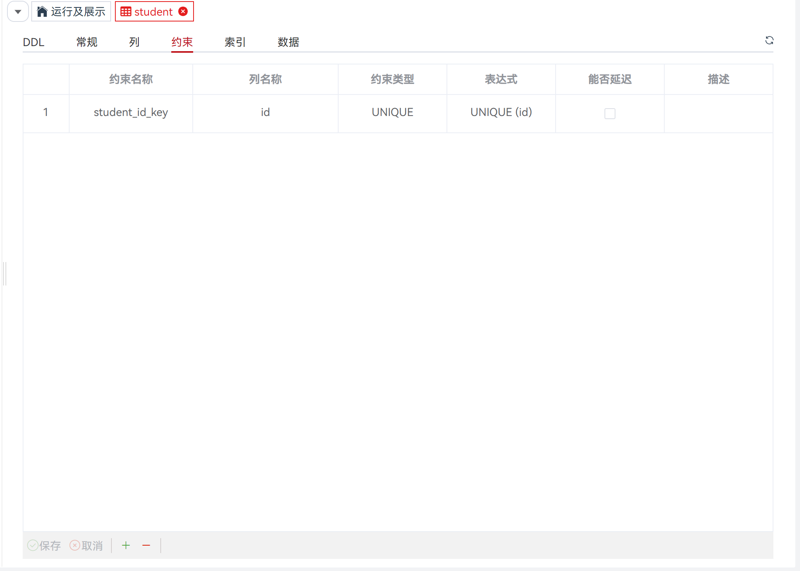

##### 5.3.1.5 查看索引

​               执行以下步骤查看索引：

**步骤 1：** 在 "**数据库列表**" 窗格中，单击普通表列表，将显示所选表对应的6大维度内容，选中 "**索引**"。

​               **说明**：当前显示数据仅在首次加载时自动获取，若需更新数据请点击刷新按钮。


##### 5.3.1.6 查看数据

​              执行以下步骤查看数据：

**步骤 1：** 在 "**数据库列表**" 窗格中，单击普通表列表，将显示所选表对应的6大维度内容，选中 "**数据**"。

​               **说明：** 当前显示数据仅在首次加载时自动获取，若需更新数据请点击刷新按钮。


#### 5.3.2 创建表

​			执行如下步骤在数据库中定义表：

**步骤 1：** 在 "**数据库列表**" 窗格中，右键 "**普通表**" ，选择 "**创建表**" ，弹出 "**创建表**" 对话框。 

**步骤 2：** 点击 "**常规**" ，定义基本表信息，如表名称、表空间、表类型等。详情请参见 **定义常规** 。

**步骤 3：** 点击 "**列**" ，定义列相关信息，如列名、数据类型模式、数据类型、列约束等。详情请参见 **定义列** 。

**步骤 4：** 点击 "**约束**" ，为不同约束类型定义列约束。约束类型包含主键（PRIMARY KEY）、唯一（UNIQUE）、检查（CHECK）、外键（FOREIGN KEY）。详情请参见 **定义约束** 。

**步骤 5：** 点击 "**索引**" ，定义表索引信息，如索引名称、访问方法、表空间等。详情请参见 **定义索引** 。

**步骤 6：** 若在 "**常规**" 勾选 "**是否分区表**" 则可点击 "**分区**" ，定义分区表信息，如表分区类型、间隔值、分区名称、表空间等。详情请参见 **定义分区** 。

**步骤 7：** 点击 "**DDL 预览**" ，查看输入所自动生成的 SQL 查询。详情请参见 **DDL 预览** 。


**定义常规**

​        设置如下参数：

​        **说明：** 所有必选参数均需要填写。必填参数用星号（*）标识。

​                     若点击 "**创建**" ，tab 将自动切换至   "**列**" ，待补全列信息后才可执行创建操作。

| **配置项** | **必填** | **组件形式** | **限制** | **默认值** | **配置说明**                                                 |
| ---------- | -------- | ------------ | -------- | ---------- | ------------------------------------------------------------ |
| 表名       | 是       | 输入框       | 字符串   | 空         | 该配置项用于定义表名称                                       |
| 如果不存在 | 否       | 勾选框       | -        | 不勾选     | 该配置项用于定义表是否判断是否已存在，如果不存在则进行创建操作 |
| 表类型     | 否       | 下拉框       | 单选     | 常规       | 该配置项用于定义表类型，选项分别为常规/UNLOGGED              |
| 带OIDS     | 否       | 勾选框       | -        | 不勾选     | 该配置项用于定义表是否带有oids                               |
| 表空间     | 否       | 下拉框       | 单选     | pg_default | 该配置项用于定义表所在表空间                                 |
| 填充因子   | 否       | 输入框       | 10 - 100 | 空         | 该配置项用于定义填充因子                                     |
| 存储方式   | 否       | 下拉框       | 单选     | ROW        | 该配置项用于定义表存储方式，选项分别为ROW、COLUMN            |
| 是否分区表 | 否       | 勾选框       | -        | 不勾选     | 该配置项用于定义是否为分区表，默认不勾选为普通表，勾选后需要在”分区”栏填写分区信息 |
| 描述       | 否       | 文本框       | 字符串   | 空         | 该配置项用于说明列信息，最多不超过5000个字符                 |

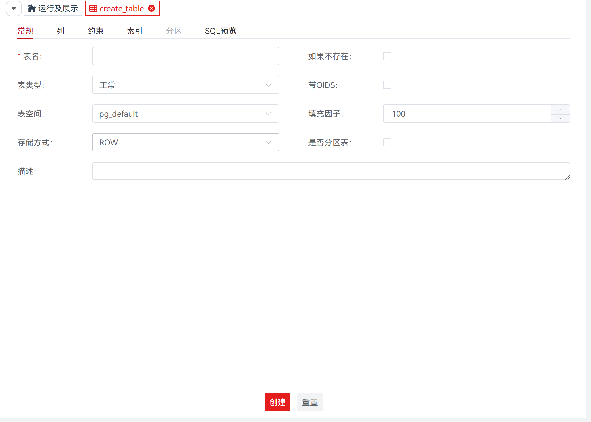


**定义列**

​        设置如下参数：

​        **说明：** 所有必选参数均需要填写。必填参数用星号（*）标识。

| **配置项** | **必填** | **组件形式** | **限制**  | **默认值** | **配置说明**                                                 |
| ---------- | -------- | ------------ | --------- | ---------- | ------------------------------------------------------------ |
| 列名称     | 是       | 输入框       | 字符串    | 空         | 该配置项用于定义列名称                                       |
| 数据类型   | 是       | 下拉框       | 单选      | 首选项     | 该配置项用于配置数据库常用数据类型，默认为第一个数据类型2）配置项数据由后端返回 |
| 能否为NULL | 否       | 勾选框       | -         | 不勾选     | 该配置项用于定义列约束，指该列不能包含空值                   |
| 默认值     | 否       | 输入框       | 字符串    | 空         | 该配置项用于定义列约束，指定该列未定义值的情况下使用的默认值 |
| 是否唯一   | 否       | 勾选框       | -         | 不勾选     | 该配置项用于定义列约束，指列可能仅包含唯一值                 |
| 精度/大小  | 否       | 数字         | 0和正整数 | 空         | 该配置项用于定义数据类型的精度/大小                          |
| 范围       | 否       | 数字         | 0和正整数 | 空         | 该配置项用于定义数据类型的范围                               |
| 描述       | 否       | 文本框       | 字符串    | 空         | 该配置项用于说明列信息，最多不超过5000个字符                 |


**定义约束**

​        设置如下参数：

​        **说明：** 所有必选参数均需要填写。必填参数用星号（*）标识。

| **配置项** | **必填** | **组件形式** | **限制** | **默认值** | **配置说明**                                                 |
| ---------- | -------- | ------------ | -------- | ---------- | ------------------------------------------------------------ |
| 约束名称   | 是       | 输入框       | 字符串   | 空         | 该配置项用于定义约束名称                                     |
| 列名称     | 是       | 下拉框       | 多选     | 空         | 该配置项用于选择定义约束的列名称；配置项数据由后端返回       |
| 约束类型   | 是       | 下拉框       | 级联     | 空         | 1）该配置项用于选择定义约束的类型  2）配置项：CHECK、UNIQUE、PRIMARY KEY、FOREIGN KEY、PARTIAL CLUSTER KEY，以上数据由前端固定配置，其中FOREIGN KEY选项下一级分别需要配置命名空间、表、列，对应数据由后端返回3）如果选择多个列，配置项中的FOREIGN KEY选项置灰不可选，一个外键只能设置一个列 |
| 表达式     | 否       | 输入框       | 字符串   | 空         | 该配置项用于定义约束的表达式                                 |
| 能否延迟   | 否       | 勾选框       | -        | 不勾选     | 该配置项用于定义约束延迟检查功能，设置延迟类型为IMMEDIATE    |
| 描述       | 否       | 输入框       | 字符串   | 空         | 配置项用于定义约束信息，最多不超过5000个字符                 |

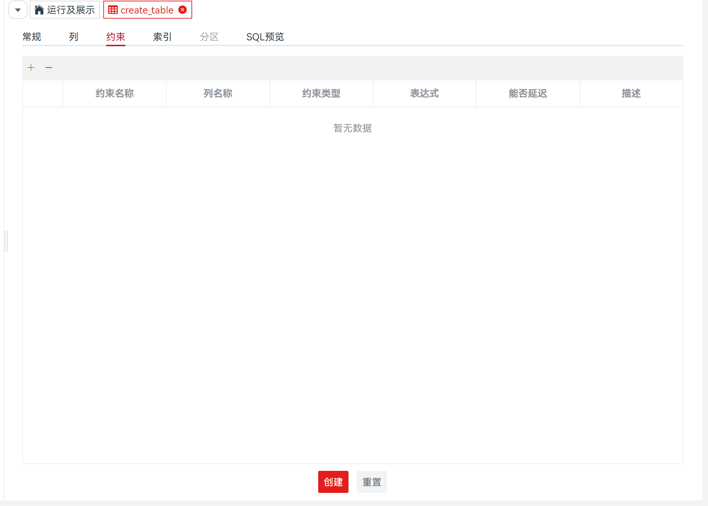


**定义索引**

​        设置如下参数：

​        **说明：** 所有必选参数均需要填写。必填参数用星号（*）标识。

| **配置项** | **必填** | **组件形式** | **限制** | **默认值** | **配置说明**                                             |
| ---------- | -------- | ------------ | -------- | ---------- | -------------------------------------------------------- |
| 索引名称   | 是       | 输入框       | 字符串   | 空         | 该配置项用于定义索引名称                                 |
| 是否唯一   | 否       | 勾选框       | -        | 勾选框     | 该配置项用于定义索引的唯一性                             |
| 访问方式   | 否       | 下拉框       | 单选     | 空         | 该配置项用于选择使用的索引方法名称；配置项数据由后端返回 |
| 列名称     | 否       | 下拉框       | 多选     | 空         | 该配置项用于选择定义索引的列名称；配置项数据由后端返回   |
| 表达式     | 否       | 输入框       | 字符串   | 空         | 该配置项用于输入用户自定义表达式                         |
| 描述       | 否       | 输入框       | 字符串   | 空         | 该配置项用于定义索引信息，最多不超过5000个字符           |

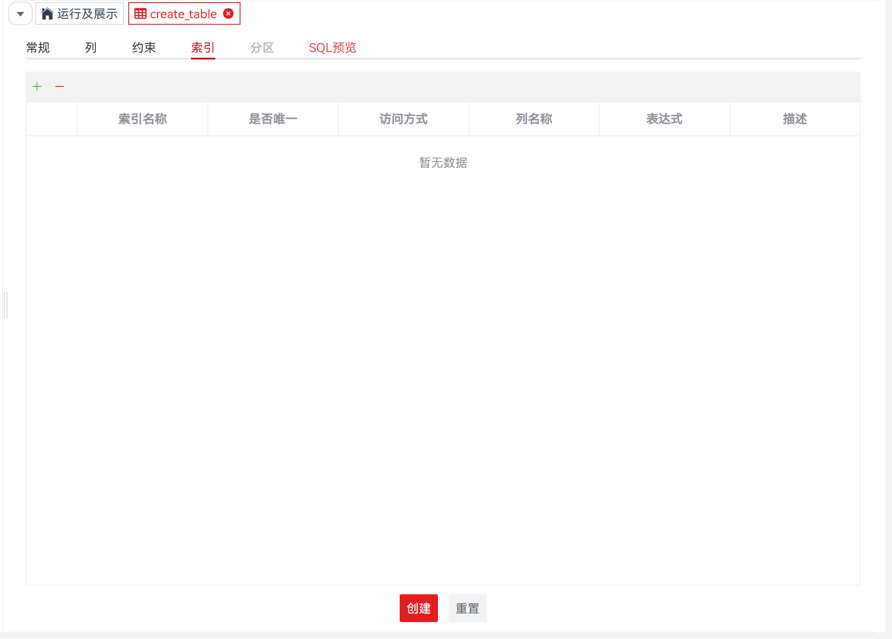


**定义分区**

​        设置如下参数：

​        **说明：** 所有必选参数均需要填写。必填参数用星号（*）标识。

| **配置项** | **必填** | **组件形式** | **限制**     | **默认值** | **配置说明**                                   |
| ---------- | -------- | ------------ | ------------ | ---------- | ---------------------------------------------- |
| 分区类型   | 否       | 下拉框       | 字符串       | 空         | 该配置项用于定义分区类型                       |
| 间隔值     | 否       | 输入框       | 字符串的数值 | 首选项     | 该配置项用于配置分区类型为 interval 时的间隔值 |
| 分区名称   | 是       | 输入框       | -            | 不勾选     | 该配置项用于定义分区名称                       |
| 表空间     | 否       | 输入框       | 字符串       | 空         | 该配置项用于定义分区所在表空间                 |
| 分区列     | 是       | 下拉框       | -            | 不勾选     | 该配置项用于定义分区列                         |
| 分区值     | 是       | 输入框       | 0和正整数    | 空         | 该配置项用于定义分区列的分区值                 |


**DDL 预览**

​        按照输入的内容，生成一个DDL 语句。

​        **说明：** 该 DDL 语句仅支持查看、选择、复制，不支持编辑。


##### 5.3.2.1 管理列

​             创建表后，可以在该表中添加新的列。可对当前列执行添加、修改、删除操作。


**创建列**

​             执行以下步骤创建列：

**步骤 1：** 在 "**数据库列表**" 窗格中，单击表名称，选择 "**列**"。 

**步骤 2：** 点击添加按钮 将显示新增列数据行。

**步骤 3：** 双击新增列数据行的每个表格即可启用编辑状态，定义列详情请参见 **定义列** 。

**步骤 4：** 新增列数据编辑完成后，点击  将保存新增列数据行；若点击  将关闭新增列数据行，恢复至未创建前的操作状态。


**修改列**

​             执行以下步骤修改列：

**步骤 1：** 在 "**数据库列表**" 窗格中，单击表名称，选择 "**列**"。 

**步骤 2：** 双击已有列数据行的每个表格即可启用编辑状态，已修改数据背景将高亮。定义列详情请参见 **定义列** 。

**步骤 3：** 已有列数据修改完成后，点击  将保存修改列数据行；若点击  将取消修改列数据行操作，恢复至未修改前的操作状态。


**删除列**

​             执行以下步骤删除列：

**步骤 1：** 在 "**数据库列表**" 窗格中，单击表名称，选择 "**列**"。 

**步骤 2：** 单击选择已有列数据行，点击 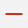 将使所需删除列数据行背景高亮。

**步骤 3：** 所需删除列数据行选择完毕后，点击  将删除所选列数据行；若点击  将取消删除列数据行操作，恢复至未修改前的操作状态。


##### 5.3.2.2 管理约束

​             创建表后，可以在该表中添加新的约束。可对当前约束执行添加、修改、删除操作。


**创建约束**

​             执行以下步骤创建约束：

**步骤 1：** 在 "**数据库列表**" 窗格中，单击表名称，选择 "**约束**"。 

**步骤 2：** 点击添加按钮 将显示新增约束数据行。

**步骤 3：** 双击新增约束数据行的每个表格即可启用编辑状态，定义约束详情请参见 **定义约束** 。

**步骤 4：** 新增约束数据编辑完成后，点击  将保存新增约束数据行；若点击  将关闭新增约束数据行，恢复至未创建前的操作状态。


**修改约束**

​             执行以下步骤修改约束：

**步骤 1：** 在 "**数据库列表**" 窗格中，单击表名称，选择 "**约束**"。 

**步骤 2：** 双击已有约束数据行的每个表格即可启用编辑状态，已修改数据背景将高亮。定义约束详情请参见 **定义约束** 。

**步骤 3：** 已有约束数据修改完成后，点击  将保存修改约束数据行；若点击  将取消修改约束数据行操作，恢复至未修改前的操作状态。


**删除约束**

​             执行以下步骤删除约束：

**步骤 1：** 在 "**数据库列表**" 窗格中，单击表名称，选择 "**约束**"。 

**步骤 2：** 单击选择已有约束数据行，点击  将使所需删除约束数据行背景高亮。

**步骤 3：** 所需删除约束数据行选择完毕后，点击  将删除所选约束数据行；若点击  将取消删除约束数据行操作，恢复至未修改前的操作状态。


##### 5.3.2.3 管理索引

​            创建表后，可以在该表中添加新的索引。可对当前索引执行添加、修改、删除操作。


**创建索引**

​             执行以下步骤创建索引：

**步骤 1：** 在 "**数据库列表**" 窗格中，单击表名称，选择 "**索引**"。 

**步骤 2：** 点击添加按钮 将显示新增索引数据行。

**步骤 3：** 双击新增索引数据行的每个表格即可启用编辑状态，定义索引详情请参见 **定义索引** 。

**步骤 4：** 新增索引数据编辑完成后，点击  将保存新增索引数据行；若点击  将关闭新增索引数据行，恢复至未创建前的操作状态。


**修改索引**

​             执行以下步骤修改索引：

**步骤 1：** 在 "**数据库列表**" 窗格中，单击表名称，选择 "**索引**"。 

**步骤 2：** 双击已有索引数据行的每个表格即可启用编辑状态，已修改数据背景将高亮。定义索引详情请参见 **定义索引** 。

**步骤 3：** 已有索引数据修改完成后，点击  将保存修改索引数据行；若点击  将取消修改索引数据行操作，恢复至未修改前的操作状态。


**删除索引**

​             执行以下步骤删除索引：

**步骤 1：** 在 "**数据库列表**" 窗格中，单击表名称，选择 "**索引**"。 

**步骤 2：** 单击选择已有索引数据行，点击  将使所需删除索引数据行背景高亮。

**步骤 3：** 所需删除索引数据行选择完毕后，点击  将删除所选索引数据行；若点击  将取消删除索引数据行操作，恢复至未修改前的操作状态。


#### 5.3.3 管理表

​			创建表后，可在表中执行操作。右键单击表，选择要执行的管理表操作。

##### 5.3.3.1 查询相关序列

​             openGauss 支持显示表和序列之间的依赖关系。

​             执行以下步骤查询相关序列：

**步骤 1：** 在 "**数据库列表**" 窗格中，右键表名称，选择 "**查询相关序列**" ，进入显示相关序列页面。

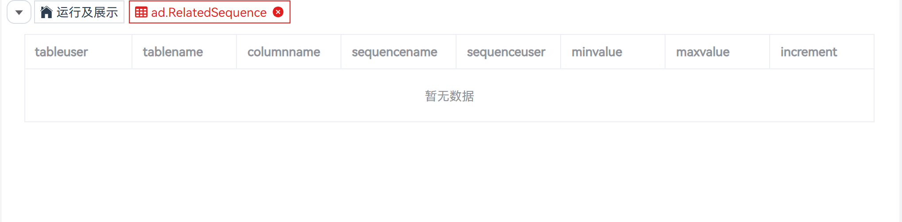

##### 5.3.3.2 重建索引

​             使用索引可帮助用户更快地查找数据。以下场景需要重建索引：

- 索引已破坏，不再包含任何有效数据。虽然理论上不会发生，但事实上，索引可能由于软件或硬件故障而被破坏重建索引提供恢复方法。
- 索引包含很多空的或几乎为空的页面，这种情况会在一些非通用访问类型下PostgreSQL 中的 B-tree 索引中出现重建索引提供一种通过写新版本的方式减少索引消耗的方法。新版本中无空页面。
- 已修改索引的存储参数（如“填充因子”），且希望保证修改完全生效。

​             执行以下步骤重建索引：

**步骤 1：** 在 "**数据库列表**" 窗格中，右键表名称，选择 "**重建索引**" ，弹出确认对话框。

**步骤 2：** 单击 "**确定**" 重建索引。

​               状态栏显示已完成操作的状态。


##### 5.3.3.3 清理

​             用于收回空间，便于重复利用。

​             执行以下步骤清理表：

**步骤 1：** 在 "**数据库列表**" 窗格中，右键表名称，选择 "**清理**" ，弹出确认对话框。

**步骤 2：** 单击 "**确定**" 重建索引。

​               状态栏显示已完成操作的状态。


##### 5.3.3.4 截断

​             删除当前表的所有数据。

​             执行以下步骤截断表：

**步骤 1：** 在 "**数据库列表**" 窗格中，右键表名称，选择 "**截断**" ，弹出确认对话框。

**步骤 2：** 单击 "**确定**" 截断表。

​               状态栏显示已完成操作的状态。


##### 5.3.3.5 设置表模式

​             执行以下步骤设置表模式：

**步骤 1：** 在 "**数据库列表**" 窗格中，右键表名称，选择 "**设置表模式**" ，弹出设置表模式对话框。

**步骤 2：** 从下拉列表中选择模式名称，单击 "**确定**" 已选表将被移动到新模式。

​                状态栏显示已完成操作的状态。


##### 5.3.3.6 设置表空间

​             执行以下步骤设置表空间：

**步骤 1：** 在 "**数据库列表**" 窗格中，右键表名称，选择 "**设置表空间**" ，弹出设置表空间对话框。

**步骤 2：** 从下拉列表中选择名称，单击 "**确定**" 已选表将被移动到新的表空间。

​                状态栏显示已完成操作的状态。


##### 5.3.3.7 设置表描述

​             执行以下步骤设置表描述：

**步骤 1：** 在 "**数据库列表**" 窗格中，右键表名称，选择 "**设置表描述**" ，弹出设置表描述对话框。

**步骤 2：** 根据对话框提示输入表描述，单击 "**确定**" 已选表将更新表描述。

​                状态栏显示已完成操作的状态。


##### 5.3.3.8 重命名表

​             执行以下步骤重命名表：

**步骤 1：** 在 "**数据库列表**" 窗格中，右键表名称，选择 "**重命名表**" ，弹出重命名表对话框。

**步骤 2：** 根据对话框提示输入表的新名称，单击 "**确定**" 已选表将更新表名称。

​                状态栏显示已完成操作的状态。


##### 5.3.3.9 删除表

​            执行以下步骤删除表：

**步骤 1：** 在 "**数据库列表**" 窗格中，右键表名称，选择 "**删除表**" ，弹出确认对话框。

**步骤 2：** 单击 "**确定**" 即可继续，或单击 "**取消**" 即可退出操作。

​                **说明：** 单击 "**确定**" 将删除表，此操作不可逆。


#### 5.3.4 管理表数据

​			支持编辑表数据、导出表 DDL、导出表 DDL 和数据、导出表数据。

##### 5.3.4.1 编辑表数据

​            创建表后，可以在该表中添加新的数据。可对当前数据执行新增、修改、删除操作。

​            **说明：** 仅支持编辑普通表数据，暂不支持编辑分区表数据。

**新增数据**

​             执行以下步骤新增数据：

**步骤 1：** 在 "**数据库列表**" 窗格中，单击表名称，选择 "**数据**"。 

**步骤 2：** 点击添加按钮 将显示新增数据行。

**步骤 3：** 双击新增数据行的每个表格即可启用编辑状态。

**步骤 4：** 新增数据编辑完成后，点击  将保存新增数据行；若点击  将关闭新增数据行，恢复至未创建前的操作状态。

​               **说明：** 若所操作表未设置主键，将显示 "**自定义唯一键**" 对话框，详情请参见 **自定义唯一键** 。

**修改数据**

​             执行以下步骤修改数据：

**步骤 1：** 在 "**数据库列表**" 窗格中，单击表名称，选择 "**数据**"。 

**步骤 2：** 双击已有数据行的每个表格即可启用编辑状态，已修改数据背景将高亮。

**步骤 3：** 已有数据修改完成后，点击  将保存修改数据行；若点击  将取消修改数据行操作，恢复至未修改前的操作状态。

​                **说明：** 若所操作表未设置主键，将显示 "**自定义唯一键**" 对话框，详情请参见 **自定义唯一键** 。

**删除数据**

​             执行以下步骤删除数据：

**步骤 1：** 在 "**数据库列表**" 窗格中，单击表名称，选择 "**数据**"。 

**步骤 2：** 单击选择已有数据行，点击  将使所需删除数据行背景高亮。

**步骤 3：** 所需删除数据行选择完毕后，点击  将删除所选数据行；若点击  将取消删除数据行操作，恢复至未修改前的操作状态。

**自定义唯一键**

​             执行以下步骤设置自定义唯一键：

**步骤 1：** 未设置主键提示的对话框中选择 "**自定义唯一键**" 。

**步骤 2：** 勾选设置为唯一键的列，点击 "**确定**" 设置唯一键。


##### 5.3.4.2 导出表 DDL

​             执行以下步骤导出表 DDL：

**步骤 1：** 在 "**数据库列表**" 窗格中，右键单击表名称，选择 "**导出 DDL**" 。 

​                **说明：** 导出文件为 sql 文件。


##### 5.3.4.3 导出表 DDL 和数据

​             执行以下步骤导出表 DDL 和数据：

**步骤 1：** 在 "**数据库列表**" 窗格中，右键单击表名称，选择 "**导出 DDL 和数据**"。 

​                **说明：** 导出文件为 sql 文件。


##### 5.3.4.4 导出表数据

​             执行以下步骤导出表数据：

**步骤 1：** 在 "**数据库列表**" 窗格中，右键单击表名称，选择 "**导出表数据**" ，弹出 "**导出表数据**" 对话框。 

**步骤 2：** 设置如下参数，导出表数据。

​                **说明：** 导出文件由所配置的格式项决定。

| **配置项**   | **必填** | **组件形式** | **配置说明**                                                 |
| ------------ | -------- | ------------ | ------------------------------------------------------------ |
| 选择列       | 是       | 勾选框       | 用于选择导出数据对应的列，默认全选                           |
| 格式         | 否       | 下拉框       | 用于选择导出数据的格式，默认为Excel(xlsx)所有选项分别为：Excel(xlsx)、Excel(xls)、Text、Binary |
| 包含标题     | 否       | 输入框       | 用于配置导出数据中是否包含列名称，默认包含仅对Text启用修改，对Excel（xlsx/xls）和Binary格式禁用 |
| 引号         | 否       | 输入框       | 用于定义引号。在此字段中仅能输入单字节字符。引号不得与分隔符相同。该项默认对和文本格式启用，但不是必选。对Excel（xlsx/xls）和Binary格式禁用l 如果表数据中包含分隔符，则会使用该项中指定的符号l 如果引号出现在值中，该值不会被转义l 如果结果中包含多行值，则会用引号引用 |
| 分隔符       | 否       | 单选框       | 用于定义分隔符。可选择提供的分隔符，或在“分隔符”区域的“其他”字段中自定义分隔符。格式的默认分隔符为半角逗号“,”。“其他”字段中的内容最大可为 10 字节。该项对和文本格式启用，但不是必选，对Excel（xlsx/xls）和Binary格式禁用。如果“其他”字段被选中，则必须设置该字段 |
| 转义符       | 否       | 输入框       | 用于定义转义值。该项仅支持单字节字符。“转义符”和“引号”的值不得相同。该项对和文本格式启用，但不是必选。对Excel（xlsx/xls）和Binary格式禁用 |
| 将NULL替换为 | 否       | 开关         | 可指定字符串，用于替换表中的null 值。该项不支持填入换行符或回车符，最多可填入 100 个字符。该字段的值不得与分隔符和引号值相同。该项默认对和文本格式启用，但不是必选。对 Excel（xlsx/xls）和Binary格式禁用 |
| 编码         | 否       | 下拉框       | 用于配置导出数据的编码格式，默认为UTF-8所有选项分别为：UTF-8、GBK、LATIN1 |


### 5.4 序列

#### 5.4.1 创建序列

​	           执行以下步骤创建序列：

**步骤 1：** 在 "**数据库列表**" 窗格中，右键 "**序列**"，选择 "**创建序列**"，弹出 "**创建序列**" 对话框。

**步骤 2：** 选择 "**基本**"，设置如下参数，创建序列。

​			   **说明：** 所有必选参数均需要填写。必填参数用星号（*）标识。

​			             单击 "**确定**" 将创建并保存更新后的序列信息。

​                         单击 "**重置**" 即可重置 "**创建序列**"对话框中的所有字段。

​                         单击 "**取消**" 即可退出本次对话框操作。

| 配置项   | 必填 | 组件形式 | 数据类型限制 | 配置说明                                                     |
| -------- | ---- | -------- | ------------ | ------------------------------------------------------------ |
| 名称     | 是   | 输入框   | 文本         | 用于定义序列名称，默认为空                                   |
| 增量     | 否   | 输入框   | 整数         | 用于定义序列的步长；默认为空，若省略，则数据库设置默认为1，若出现负值，则代表序列的值是按照此步长递减 |
| 起始值   | 否   | 输入框   | 整数         | 用于定义序列的初始值(即产生的第一个值)；默认为空，若省略，则数据库设置默认为1 |
| 最小值   | 否   | 输入框   | 整数         | 用于定义序列生成器能产生的最小值；默认为空，若省略，则代表没有最小值定义，这时对于递减序列，系统能够产生的最小值的取值范围应在-9223372036854775808；对于递增序列，最小值是1 |
| 最大值   | 否   | 输入框   | 整数         | 用于定义序列生成器能产生的最大值 ；默认为空，若省略，则代表没有最大值定义，这时对于递增序列，系统能够产生的最大值是 9223372036854775807 ；对于递减序列，最大值是-1 |
| 缓存数值 | 否   | 输入框   | 整数         | 用于定义存放序列的内存块的大小；默认为空，若省略，则数据库默认设置为20；对序列进行内存缓冲，可以改善序列的性能 |
| 循环     | 否   | 开关     | -            | 用于定义当序列生成器的值达到限制值后是否循环；默认为不循环，若循环，则当递增序列达到最大值时，循环到最小值;对于递减序列达到最小值时，循环到最大值。如果不循环，达到限制值后，继续产生新值就会发生错误。 |
| 模式     | 是   | 下拉框   | -            | 用于定于所属对象模式；默认为当前模式，置灰不可选             |
| 表       | 否   | 下拉框   | -            | 用于选择所属对象模式下对应的表；默认为空，若省略，默认仅指向上一级，即模式 |
| 列       | 否   | 下拉框   | -            | 用于选择所属对象模式下指定表对应的列；默认为空，若省略，默认指向指定项的上一级，即表、模式 |


**步骤 3：** 选择 "**SQL预览**"，可基于创建序列的配置信息进行 SQL 预览。

​               **说明：** 若未填写 "**基本**" 必填项，将无法通过校验进入 "**SQL预览**" 界面。

​                          "**SQL预览**" 界面的编辑框仅支持查看，不支持编辑。


#### 5.4.2 删除序列

​	           执行以下步骤删除序列：

**步骤 1：** 在 "**数据库列表**" 窗格中，右键序列列表，选择 "**删除序列**"，弹出 "**删除序列**" 确认框。

**步骤 2：** 单击 "**确定**" 即可继续，或单击 "**取消**" 即可退出操作。

​                **说明：** 单击 "**确定**" 将删除并更新序列信息，此操作不可逆。

​                             单击 "**取消**" 即可退出本次对话框操作。


#### 5.4.3 查看 DDL

​	           执行以下步骤查看 DDL：

**步骤 1：** 在 "**数据库列表**" 窗格中，单击序列列表，将显示序列 DDL。


#### 5.4.4 导出序列 DDL

​               执行以下步骤导出序列 DDL：

**步骤 1：** 在 "**数据库列表**" 窗格中，右键单击序列名称，选择 "**导出 DDL**"。 

​                **说明：** 导出文件为 sql 文件。


#### 5.4.5 导出序列 DDL 和数据

​               执行以下步骤导出序列 DDL 和数据：

**步骤 1：** 在 "**数据库列表**" 窗格中，右键单击序列名称，选择 "**导出 DDL 和数据**"。 

​                **说明：** 导出文件为 sql 文件。


### 5.5 视图

#### 5.5.1 创建视图

​               执行以下步骤创建视图：

**步骤 1：** 在 "**数据库列表**" 窗格中，右键 "**视图**"，选择 "**创建视图**"，弹出 "**创建视图**" 对话框。

**步骤 2：** 选择 "**基本**"，设置如下参数，创建视图。

​			   **说明：** 所有必选参数均需要填写。必填参数用星号（*）标识。

​			              单击 "**确定**" 将创建并保存更新后的视图信息。

​                          单击 "**重置**" 即可重置 "**创建视图**"对话框中的所有字段。

​                          单击 "**取消**" 即可退出本次对话框操作。

| 配置项       | 必填 | 组件形式  | 数据类型限制 | 配置说明                                               |
| ------------ | ---- | --------- | ------------ | ------------------------------------------------------ |
| 名称         | 是   | 输入框    | 文本         | 用于定义视图名称，默认为空                             |
| 类型         | 是   | 下拉框    | -            | 用于定义视图类型，类型分别为视图、物化视图，默认为视图 |
| 所需对象模式 | 是   | 下拉框    | -            | 用于定于所属对象模式，默认为当前模式，置灰不可选       |
| 代码         | 是   | sql编辑器 | sql语句      | 用于编写sql语句，默认为空                              |


**步骤 3：** 选择 "**SQL预览**"，可基于创建视图的配置信息进行 SQL 预览。

​               **说明：** 若未填写 "**基本**" 必填项，将无法通过校验进入 "**SQL预览**" 界面。

​                         "**SQL预览**" 界面的编辑框仅支持查看，不支持编辑。


#### 5.5.2 删除视图

​	           执行以下步骤删除视图：

**步骤 1：** 在 "**数据库列表**" 窗格中，右键视图列表，选择 "**删除视图**"，弹出 "**删除视图**" 确认框。

**步骤 2：** 单击 "**确定**" 即可继续，或单击 "**取消**" 即可退出操作。

​               **说明：** 单击 "**确定**" 将删除并更新视图信息，此操作不可逆。

​                         单击 "**取消**" 即可退出本次对话框操作。


#### 5.5.3 查看 DDL

​               执行以下步骤查看 DDL：

**步骤 1：** 在 "**数据库列表**" 窗格中，单击视图列表，所选视图对应的2大维度内容，默认显示DDL。

​               **说明**：当前显示数据仅在首次加载时自动获取，若需更新数据请点击刷新按钮。


#### 5.5.4 查看数据

​               执行以下步骤查看数据：

**步骤 1：** 在 "**数据库列表**" 窗格中，单击视图列表，所选视图对应的2大维度内容，选中 "**数据**"。

​               **说明**：当前显示数据仅在首次加载时自动获取，若需更新数据请点击刷新按钮。

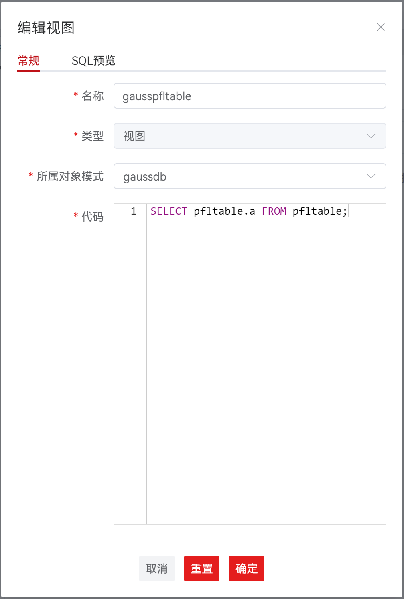

#### 5.5.5 导出视图 DDL

​               执行以下步骤导出视图 DDL：

**步骤 1：** 在 "**数据库列表**" 窗格中，右键单击视图名称，选择 "**导出 DDL**"。 

​                **说明：** 导出文件为 sql 文件。


### 5.6 同义词

#### 5.6.1 创建同义词

​               执行以下步骤创建同义词：

**步骤 1：** 在 "**数据库列表**" 窗格中，右键 "**同义词**"，选择 "**创建同义词**"，弹出 "**创建同义词**" 对话框。

**步骤 2：** 选择 "**基本**"，设置如下参数，创建同义词。

​			   **说明：** 所有必选参数均需要填写。必填参数用星号（*）标识。

​			             单击 "**确定**" 将创建并保存更新后的同义词信息。

​                         单击 "**重置**" 即可重置 "**创建同义词**"对话框中的所有字段。

​                         单击 "**取消**" 即可退出本次对话框操作。

| 配置项           | 必填 | 组件   | 数据类型限制 | 配置说明                                                     |
| ---------------- | ---- | ------ | ------------ | ------------------------------------------------------------ |
| 名称             | 是   | 输入框 | 文本         | 用于定义同义词名称；默认为空                                 |
| 对象所有者       | 是   | 下拉框 | -            | 用于指定同义词归属者；默认为空，选项为所有用户模式           |
| 对象类型         | 是   | 下拉框 | -            | 用于指定同义词对象类型；默认为all，选项为all、函数/过程、视图、普通表 |
| 对象名称         | 是   | 下拉框 | -            | 用于指定同义词对象类型下的名；默认为空，选项为所选对象类型下的子项 |
| 替换已存在同义词 | 否   | 开关   | -            | 用于替换已存在的同义词；默认为关闭，即不替换                 |


**步骤 3：** 选择 "**SQL预览**"，可基于创建同义词的配置信息进行 SQL 预览。

​               **说明：** 若未填写 "**基本**" 必填项，将无法通过校验进入 "**SQL预览**" 界面。

​                         "**SQL预览**" 界面的编辑框仅支持查看，不支持编辑。

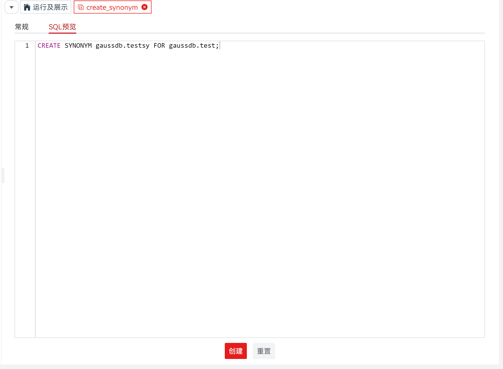

#### 5.6.2 删除同义词

​	           执行以下步骤删除同义词：

**步骤 1：** 在 "**数据库列表**" 窗格中，右键同义词列表，选择 "**删除同义词**"，弹出 "**删除同义词**" 确认框。

**步骤 2：** 单击 "**确定**" 即可继续，或单击 "**取消**" 即可退出操作。

​               **说明：** 单击 "**确定**" 将删除并更新同义词信息，此操作不可逆。

​                         单击 "**取消**" 即可退出本次对话框操作。


#### 5.6.3 查看同义词属性

​	           执行以下步骤查看同义词属性：

**步骤 1：** 在 "**数据库列表**" 窗格中，单击同义词列表，将显示同义词属性。


### 5.7 SQL 终端

#### 5.7.1 打开多个 "SQL 终端" 页签

​	            可在中打开多个 “SQL 终端” 页签。通过该功能，可在当前 “SQL 终端”页签执行查询时使用多个 SQL 查询。执行如下步骤打开新“SQL 终端”页签：

**步骤** **1**： 在页签栏中，单击 “**新建终端**”，即可显示新的 "SQL终端" 页签。

​                **说明：**"SQL终端" 命名规则为：终端图标+数据库名+@+连接名称+(自增数)，如

​                            "**新建终端**" 连接至最近打开连接的数据库。


#### 5.7.2 使用 SQL 查询

##### 5.7.2.1 使用 SQL 单条查询

​               执行如下步骤，执行函数/过程或 SQL 查询：

**步骤** **1**：在 “SQL 终端” 页签输入函数/过程或 SQL 语句，单击 “SQL 终端” 页签的 "**执行**"。

**步骤** **2**：在 SQL 编辑器下方将出现结果栏。

​               **说明：** 结果栏分别由消息栏和结果集组成，默认显示结果集 "结果" 页面。


##### 5.7.2.2 执行多条函数/过程或查询

​               执行以下步骤，执行多条函数/过程：

**步骤** **1**：在 “SQL 终端” 页签中，在函数/过程定义之后插入 “/” 。

**步骤** **2**：在下一行添加新的函数/过程语句。

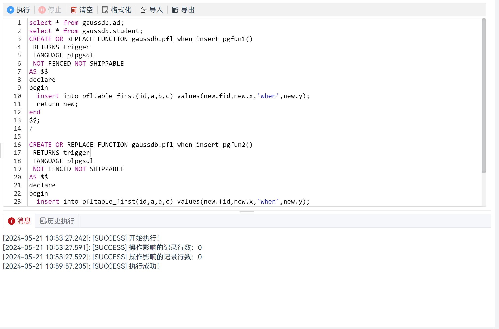

​              执行如下步骤执行多条 SQL 查询：

**步骤** **1**：在 “SQL终端” 页签中输入多个SQL查询，如下所示：

**步骤** **2**：在 “SQL终端” 页签中单击 "**执行**"。

​               **说明：** 默认显示结果集最后返回的 "结果" 页面，非最后执行语句对应的结果。


##### 5.7.2.3 注释/取消注释

​	            注释/取消注释选项用于注释或取消注释行或整段。

​                按照以下步骤在 “PL/SQL Viewer” 或 “SQL 终端” 中注释/取消注释行：

**步骤** **1**： 选择目标行。

**步骤** **2**：使用快捷键 “Ctrl+/” 单独注释/取消注释每个选中的行。


​                按照以下步骤在 “PL/SQL Viewer” 或 “SQL 终端” 中注释/取消注释整段：

**步骤** **1**： 选择目标行或整段内容。

**步骤** **2**：使用快捷键 “Ctrl+/” 单独注释/取消注释选中的行或整段内容。


##### 5.7.2.4 插入空格/取消插入空格

​				按照以下步骤在 “PL/SQL Viewer” 或 “SQL 终端” 中缩进/取消缩进：

**步骤 1**： 选中目标行。

**步骤 2**： 按下 Tab 键缩进，按下 “Shift+Tab” 键取消缩进。


##### 5.7.2.5 格式化

​				按照以下步骤在  “SQL 终端” 中格式化执行语句：

**步骤 1**： 选择需要格式化的SQL语句。

**步骤 2**： 在工具栏中单击 "**格式化**"。


### 5.8 函数/过程

#### 5.8.1 创建函数/过程

​               执行如下步骤创建函数、过程和 SQL 函数：

**步骤 1**：在 "**数据库列表**" 窗格中，右键单击 "**函数/过程**"，按照要求选择“**创建函数**”、“**创建过程**”、“**创建** **SQL** **函数**”。

​              将在新页签中显示所选模板。


**步骤 2**：选择 “**创建函数**” 。系统打开新的页签。

**步骤 3**：编辑代码。

**步骤 4**：右键单击 "编译"，编译该过程。

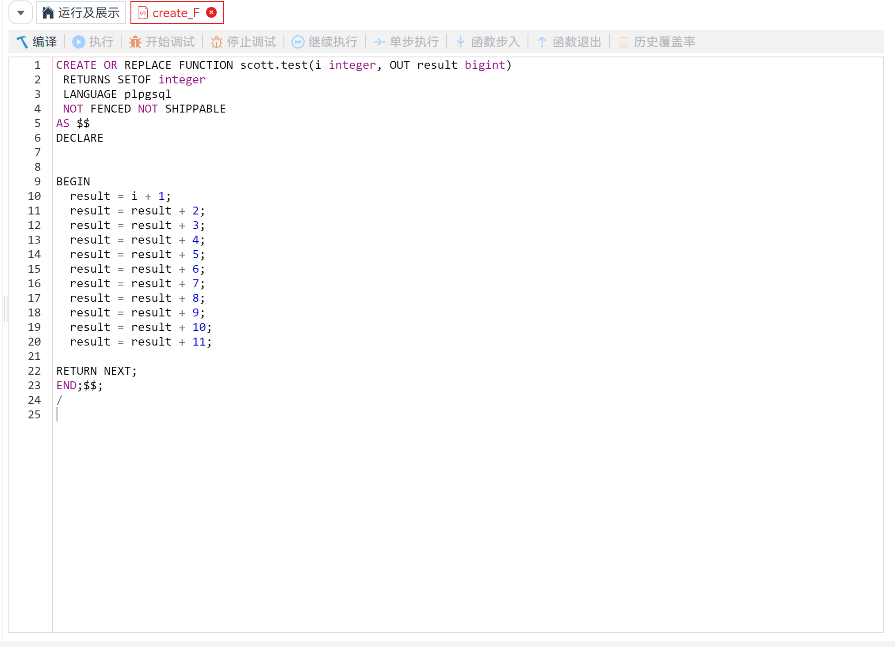

**步骤 5**：编译成功，该创建的函数将被保存。

​               状态栏需要刷新才能显示已完成操作的状态。


#### 5.8.2 使用函数/过程

##### 5.8.2.1 执行函数/过程

​              执行如下步骤执行 PL/SQL 程序或 SQL 函数：

**步骤** **1**：双击打开 PL/SQL 程序或 SQL 函数。

**步骤** **2**：在工具栏单击 "执行"。

**步骤** **3**： 若该 PL/SQL 程序或 SQL 函数需要入参，则弹出的 “**调试函数/过程**” 对话框提示您输入信息。

**步骤 4**：填写入参后，点击 "确定" ，即可执行该 PL/SQL 程序或 SQL 函数。


##### 5.8.2.2 删除函数/过程

​               执行如下步骤删除函数/过程或 SQL 函数对象：

**步骤** **1**：在 "**数据库列表**" 窗格中，右键单击函数/过程对象，选择 “**删除函数/过程**” 。

**步骤** **2**：提示确认该操作窗口中，单击 “**是**” 完成该操作。

##### 5.8.2.3 导出函数/过程 DDL

​               执行以下步骤导出函数/过程 DDL：

**步骤 1：** 在 "**数据库列表**" 窗格中，右键单击函数/过程名称，选择 "**导出 DDL**"。 

​                **说明：** 导出文件为 sql 文件。


#### 5.8.3 调试函数/过程/匿名块

​	调试操作期间，如果连接丢失，但数据库列表中仍存在该数据库连接，建议刷新浏览器并重启调试操作。

​    **说明：** SQL 语言函数不支持调试操作，仅 plpgsql 语言支持调试操作。

 函数/过程调试左键点击左侧连接中对应的“函数/过程”，进行调试。匿名块调试右键点击连接下的“函数/过程”父目录，然后左键点击“匿名块”，进行匿名块编辑/调试。

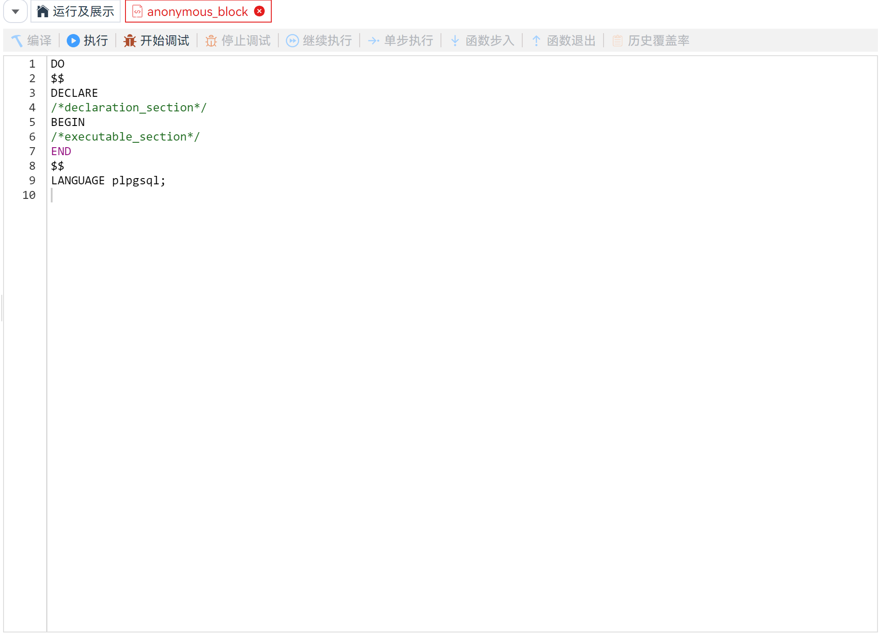

##### 5.8.3.1 使用断点

​	断点用于暂停其所在行中的 PL/SQL 程序的执行，可用断点控制执行并调试过程。

- 设置并启用断点后，PL/SQL 程序会在该断点所在的行停止执行，此时用户可以进行其他调试操作。支持以下断点操作：
  - 为某行设置或创建断点。
  - 启用或禁用某行的断点。
  - 删除某行的断点。
- 禁用断点后，PL/SQL 程序不会在断点处暂停执行。

​			   执行如下步骤调试 PL/SQL 程序：

**步骤** **1**：在需要 PL/SQL 程序暂停执行的行设置断点。

**步骤** **2**：启动调试会话。

​			   达到断点所在行时，监视调试窗口中应用程序的状态，然后继续执行程序。

**步骤** **3**： 关闭调试会话。

**使用 "断点" 窗格**

​	            在 “**断点**” 窗格中可查看已有断点。

​	           “**断点**” 窗格会列出每一个断点所在行的行号、调试对象的名称以及断点是否可用。

​	           在 “**断点**” 窗格中，勾选断点复选框，可以进行断点启用、禁用操作。

​               **说明：** 禁用断点后，程序不会在该断点处暂停执行，但该断点仍会保留（以备将来启用）。

**设置或添加断点**

​			   执行以下步骤在某行中添加断点：

**步骤** **1**：打开需要添加断点的 PL/SQL 函数。

**步骤** **2**：步骤在“**PL/SQL Viewer**”窗格中，双击行号字段左侧，设置断点，断点标志 [] 表示操作成功。

​              **说明：** 如果函数在调试过程中不会间断或停止执行，则说明其设置的断点不会生效。

**启用或禁用断点**

​	          设置断点后，再次单击断点，暂时禁用该断点[]。“**PL/SQL Viewer**”窗格中，禁用的断点的状态列显示断点的状态为 禁用。

​              若要启用已禁用的断点，再次单击对应断点。

**删除断点**

​              用户可删除不再使用的断点。其方法与断点创建的方法相同，双击行号字段左侧的断点即可。

**使用断点测试 PL/SQL 程序**

​               执行以下步骤使用断点测试 PL/SQL 程序：

**步骤** **1**：打开 PL/SQL 程序，在要调试的行创建断点。

**步骤** **2**：在弹出的 “**函数执行入参**” 对话框中，输入参数信息。

​              **说明：** 如果无需输入参数，则 “**函数执行入参**” 对话框不会弹出。


**步骤** **3**：输入信息，单击 “**确定**” 。

​              可以看到箭头指向断点所在行[]，同时所在行高亮。箭头所指的行号，即为继续执行程序时的起始行号。

​              **说明：** 用户可继续执行、单步执行跳过代码。


**步骤** **4**：单击 继续执行至下一断点（如有）。“结果” 页签中显示执行 PL/SQL 程序的结果， “调用堆栈” 和 “变量” 窗格将被清除。


##### 5.8.3.2 控制执行

​	    本节描述控制调试执行相关操作。


**开始调试**

​	    在 “**数据库列表**” 窗格中选择需调试的函数。单击工具栏中的 "**开始调试**"。

​       如果没有设置断点，或者设置的断点无效，则不会停止任何语句、进行调试操作，而仅会执行对象并显示结果（如有）。

**继续执行 PL/SQL 函数**

​		调试执行函数时，用户可使用工具栏中 “**继续执行**”。通过进行断点间控制，可逐行调试程序。“**继续执行**” 是指从一个断点跳到下一个断点。断点执行一条语句后，可以在其他调试窗口中查看执行结果。

**单步执行 PL/SQL 函数**

​	    调试执行函数时，用户可使用工具栏中 “**单步执行**”。通过进行单步控制，可逐行调试程序。如果进行单步操作时遇到断点，则该单步操作会停止，程序也会暂停执行。“**单步**” 是指一次执行一条语句。单步执行一条语句后，可以在其他调试窗口中查看执行结果。

**步入 PL/SQL 函数(step in)**

​		在主函数调试程序中调试执行子函数时，用户可使用工具栏中 “**函数步入**”。操作 "**函数步入**"，自动打开新的子函数窗口，可对子函数进行逐行调试程序。子函数窗口仅支持 "**继续执行**"、"**单步执行**"、"**函数步入**"、"**函数退出**"。


​        **说明：** 进入子函数后，主函数的操作栏除 "停止调试" 启用状态外，其余操作均为禁用状态。

**退出 PL/SQL 函数(step out)**

​		调试执行子函数时，用户可使用工具栏中 “**函数退出**”。点击“函数退出”，会退出子函数窗口，并返回到上一级函数或者存储过程的窗口的下一行。子函数窗口仅支持 "**继续执行**"、"**单步执行**"、"**函数步入**"、"**函数退出**"。

**查看调用堆栈信息**

​		“**调用堆栈**” 窗格展示调用过程时的过程链。近的过程在顶部，早的在底部。

**停止调试**

​		单击工具栏中的 "**停止调试**"，即可终止调试。


##### 5.8.3.3 查看堆栈信息

​         使用时，可通过一些调试窗口查看调试信息。本节介绍可用于检查调试信息的操作：

**变量操作**

​		“**变量**” 窗格用于监视信息或估算值。可从小化窗口窗格中打开 “**变量**” 窗格。通过这个窗格，可以估算或者修改 PL/SQL 过程中的变量或参数。执行代码时，一些本地变量可能被修改，值发生变化的参数会出现黄色标记，可以通过 “**变量**” 窗格观察参数的变化。


**查看结果**

​		“**结果**” 页签显示 PL/SQL 调试会话的结果。只有出现执行 PL/SQL 程序的结果时，“**结果**” 页签才会自动弹出。


#### 5.8.4 覆盖率统计

​	        本节介绍在执行调试函数/过程操作后，如何使用函数历史调试结果统计功能。覆盖率统计可以将函数执行时执行到的行号等信息存储到历史表，可以查看执行到的行号，执行行数百分比并可对生成的报告进行删除或导出为html 文件。

​            **说明：** 此功能支持 opengauss3.0 及以上版本数据库。

##### 5.8.4.1 显示覆盖率

​             按照 5.8.3 调试函数/过程后，点击图标，弹出覆盖率信息。


##### 5.8.4.2 导出覆盖率报表

​			 选中需要查看的调试记录，点击 "**导出**"  ，导出 html 文件。

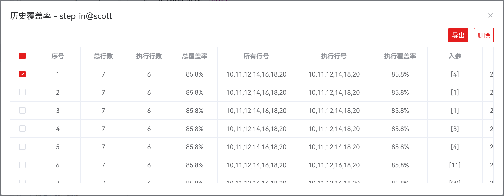

​           打开所导出的函数覆盖率报告文件，显示内容包含执行语句及调试信息列表，具体如图：


​            **说明：** 调试信息系统会自动在“数据库--public--普通表”中生成his_coverage中。

| **字段**   | **说明**                       |
| ---------- | ------------------------------ |
| 序号       | 用于展示覆盖率执行记录序号     |
| 总行数     | 用于展示执行函数过程的总行数   |
| 执行行数   | 用于展示执行函数过程的执行行数 |
| 总覆盖率   | 用于展示执行函数过程的总覆盖率 |
| 所有行号   | 用于展示函数过程所有行号       |
| 执行行号   | 用于展示执行函数过程执行行号   |
| 执行覆盖率 | 用于展示执行函数过程执行覆盖率 |
| 入参       | 用于展示执行函数过程入参       |
| 更新时间   | 用于展示执行函数过程执行时间   |

##### 5.8.4.3 删除覆盖率记录

​			 选中需要删除的调试记录，点击 "**删除**"  ，即可删除所选调试记录。

### 5.9 数据库

#### 5.9.1 创建数据库

​               执行如下步骤创建数据库：

**步骤 1：** 在 "**数据库列表**" 窗格中，右键单击连接名称，选择 "**创建数据库**" ，弹出 "**创建数据库**" 对话框。 

​               **说明：** 只有当至少存在一个已建立的连接时才能执行此操作。

**步骤 2：** 设置如下参数，创建数据库连接。

​			    **说明：** 所有必选参数均需要填写。必填参数用星号（*）标识。

| **配置项** | **必填** | **组件形式** | **数据类型限制** | **配置说明**                                                 |
| ---------- | -------- | ------------ | ---------------- | ------------------------------------------------------------ |
| 数据库名称 | 是       | 输入框       | 文本             | 1）该配置项用于定义数据库名称，默认为空2）若为空，则配置项组件标红且提示“数据库名称不能为空” |
| 数据库编码 | 是       | 下拉框       | -                | 1）该配置项用于配置数据库编码，默认为 UTF-82）通用选项为：UTF-8、GBK、LATIN1、SQL_ASCII |
| 兼容类型   | 是       | 下拉框       | -                | 1）该配置项用于配置兼容的数据库的类型，默认为 A，即表示兼容 O2）通用选项为：A、B、C、PG，分别表示兼容O、MY、TD和POSTGRES |
| 排序规则   | 否       | 下拉框       | -                | 1）该配置项用于配置数据库的排序规则，默认为空，后端使用模板数据库template0的字符类型en_US.UTF-82）通用选项为：C、POSIX、en_US.UTF-8 |
| 字符类型   | 否       | 下拉框       | -                | 1）该配置项用于配置数据库的字符类型，默认为空，后端使用模板数据库template0的字符类型en_US.UTF-82）通用选项为：C、POSIX、en_US.UTF-8 |
| 连接限制   | 是       | 输入框       | >=-1的整数       | 1）该配置项用于配置数据库可以接受的并发连接数，默认为-1，表示无限制2）取值范围：>=-1的整数，建议填写1~50的整数 |
| 连接数据库 | 否       | 开关         | -                | 1）该配置项用于是否在创建数据库成功后打开该数据库连接，默认为关闭 |


#### 5.9.2 断开所有连接

​               执行如下步骤断开某一连接下的所有数据库：

**步骤 1：** 在 "**数据库列表**" 窗格中，右键单击连接名称，选择 "**断开所有连接**" ，弹出 "**断开所有连接**" 确认框。 

​               **说明：** 该操作仅能在已连接的数据库上执行。

**步骤 2：** 单击 "**确定**" 即可继续，或单击 "**取消**" 即可退出操作。

​               **说明：** 单击 "**确定**" 将断开当前连接下的所有数据库的连接，操作成功后将更新当前连接状态。

​                         单击 "**取消**" 即可退出本次对话框操作。


#### 5.9.3 打开连接

​               执行如下步骤打开数据库连接：

**步骤 1：** 在 "**数据库列表**" 窗格中，右键单击数据库名称，选择 "**打开连接**"，操作成功后将更新数据库连接状态。 

​               **说明：** 该操作仅能在断连的数据库上执行。

#### 5.9.4 断开连接

​               执行如下步骤断开数据库连接：

**步骤 1：** 在 "**数据库列表**" 窗格中，右键单击数据库名称，选择 "**断开连接**"，弹出 "**断开连接**" 确认框。 

​               **说明：** 该操作仅能在已连接的数据库上执行。

**步骤 2：** 单击 "**确定**" 即可继续，或单击 "**取消**" 即可退出操作。

​               **说明：** 单击 "**确定**" 将断开当前数据库的连接，操作成功后将更新当前连接状态。

​                         单击 "**取消**" 即可退出本次对话框操作。


#### 5.9.5 编辑数据库属性

​               执行如下步骤编辑数据库属性：

**步骤 1：** 在 "**数据库列表**" 窗格中，右键单击数据库名称，选择 "**编辑数据库属性**"，弹出 "**编辑数据库属性**" 对话框。 

​               **说明：** 该操作仅能在断连的数据库上执行。

**步骤 2：** 设置如下参数，编辑数据库属性。

​                 **说明：** 所有必选参数均需要填写。必填参数用星号（*）标识。

| **配置项** | **是否支持修改** | **必填** | **组件形式** | **数据类型限制** | **配置说明**                                                 |
| ---------- | ---------------- | -------- | ------------ | ---------------- | ------------------------------------------------------------ |
| 数据库名称 | 是               | 是       | 输入框       | 文本             | 1）该配置项用于定义数据库名称，默认为回显数据2）若为空，则配置项组件标红且提示“数据库名称不能为空” |
| 数据库编码 | 否               | 是       | 下拉框       | -                | 1）该配置项用于配置数据库编码，默认为回显数据2）通用选项为：UTF-8、GBK、LATIN1、SQL_ASCII |
| 兼容类型   | 否               | 是       | 下拉框       | -                | 1）该配置项用于配置兼容的数据库的类型，默认为回显数据2）通用选项为：A、B、C、PG，分别表示兼容O、MY、TD和POSTGRES |
| 排序规则   | 否               | 否       | 下拉框       | -                | 1）该配置项用于配置数据库的排序规则，默认为回显数据2）通用选项为：C、POSIX、en_US.UTF-8 |
| 字符类型   | 否               | 否       | 下拉框       | -                | 1）该配置项用于配置数据库的字符类型，默认为回显数据2）通用选项为：C、POSIX、en_US.UTF-8 |
| 连接限制   | 是               | 否       | 输入框       | >=-1的整数       | 1）该配置项用于配置数据库可以接受的并发连接数，默认为回显数据2）取值范围：>=-1的整数，建议填写1~50的整数 |
| 连接数据库 | 是               | 否       | 开关         | -                | 1）该配置项用于是否在创建数据库成功后打开该数据库连接，默认为关闭 |


#### 5.9.6 删除数据库

​               执行如下步骤删除数据库：

**步骤 1：** 在 "**数据库列表**" 窗格中，右键单击数据库名称，选择 "**删除数据库**"，弹出 "**删除数据库**" 确认框。 

​               **说明：** 该操作仅能在断连的数据库上执行。

**步骤 2：** 单击 "**确定**" 即可继续，或单击 "**取消**" 即可退出操作。

​               **说明：** 单击 "**确定**" 将删除并更新连接信息，此操作不可逆。

​                          单击 "**取消**" 即可退出本次对话框操作。


#### 5.9.7 查看数据库属性

​               执行如下步骤查看数据库属性：

**步骤 1：** 在 "**数据库列表**" 窗格中，右键单击数据库名称，选择 "**查看数据库属性**"，对话框将显示所选数据库的属性。 

​               **说明：** 该操作仅能在已连接的数据库上执行。


#### 5.9.8 打开新终端

​               执行如下步骤打开新终端：

**步骤 1：** 在 "**数据库列表**" 窗格中，右键单击数据库名称，选择 "**打开新终端**"，新终端将连接目标数据库。 

​               **说明：** 该操作仅能在已连接的数据库上执行。

​                           "**打开新终端**" 连接至目标数据库，"**新建终端**" 的终端默认连接详见 **5.7.1** 。

### 5.10 模式

​              数据库模式分为系统模式和用户模式。

​              本节介绍如何创建、编辑与删除用户模式；导出数据库模式 DDL、导出 DDL 和数据。

#### 5.10.1 创建模式

​               在关系型数据库技术中，模式提供数据库对象的逻辑分类，一个模式可能包含如下数据库对象：函数/过程、表、视图、序列和索引。 执行如下步骤定义模式：

**步骤 1：** 在 "**数据库列表**" 窗格中，右键单击数据库名称，选择 "**创建模式**" ，弹出 "**创建模式**" 对话框。 

​                **说明：** 仅在数据库为连接状态时，可创建用户模式。

**步骤 2：** 设置如下参数，创建用户模式。

​                **说明：** 所有必选参数均需要填写。必填参数用星号（*）标识。

| **配置项** | **必填** | **组件形式** | **限制** | **配置说明**                                                 |
| ---------- | -------- | ------------ | -------- | :----------------------------------------------------------- |
| 模式名称   | 是       | 输入框       | 字符串   | 用于定义模式名称，默认为空；若为空，则配置项组件标红且提示“模式名称不能为空” |
| 数据库     | 否       | 置灰字体     | 字符串   | 用于显示模式所属数据库，默认为当前数据库，不支持更改         |
| 所有者     | 是       | 下拉框       | 单选     | 用于定义模式所有者，默认为当前创建用户，所有者下拉选项由后端返回非系统的用户/角色选项；若为空，则配置项组件标红且提示“所有者不能为空” |
| 描述       | 否       | 文本框       | 字符串   | 用于说明模式信息，默认为空                                   |


#### 5.10.2 编辑模式

​                执行如下步骤编辑用户模式：

**步骤 1：** 在 "**数据库列表**" 窗格中，右键单击用户模式名称，选择 "**编辑模式**"，弹出 "**编辑模式**" 对话框。 

​               **说明：** 仅在数据库为连接状态时，可编辑用户模式。

**步骤 2：** 设置如下参数，编辑用户模式。

​                 **说明：** 所有必选参数均需要填写。必填参数用星号（*）标识。

| **配置项** | **是否支持修改** | **必填** | **组件形式** | **限制** | **配置说明**                                                 |
| ---------- | ---------------- | -------- | ------------ | -------- | ------------------------------------------------------------ |
| 模式名称   | 是               | 是       | 输入框       | 字符串   | 用于定义模式名称，默认数据回显；若为空，则配置项组件标红且提示“模式名称不能为空” |
| 数据库     | 否               | 否       | 置灰字体     | 字符串   | 用于显示模式所属数据库，默认数据回显，不支持更改             |
| 所有者     | 否               | 是       | 下拉框       | 单选     | 用于定义模式所有者，默认数据回显，不支持更改                 |
| 描述       | 是               | 否       | 文本框       | 字符串   | 用于说明模式信息，默认数据回显                               |


#### 5.10.3 删除模式

​               执行如下步骤删除用户模式：

**步骤 1：** 在 "**数据库列表**" 窗格中，右键单击用户模式名称，选择 "**删除模式**"，弹出 "**删除模式**" 确认框。 

​               **说明：** 仅在数据库为连接状态时，可删除用户模式。

**步骤 2：** 单击 "**确定**" 即可继续，或单击 "**取消**" 即可退出操作。

​               **说明：** 单击 "**确定**" 将删除并更新连接信息，此操作不可逆。

​                            单击 "**取消**" 即可退出本次对话框操作。


#### 5.10.4 导出模式 DDL

​               可通过导出 DDL 导出该模式下函数/过程、表、序列和视图的DDL。执行以下步骤导出模式 DDL：

**步骤 1：** 在 "**数据库列表**" 窗格中，右键单击模式名称，选择 "**导出 DDL**"。 

​                **说明：** 导出文件为 sql 文件。


#### 5.10.5 导出模式 DDL 和数据

​			   通过导出模式的 DDL 和数据，可导出该模式下的函数/过程的 DDL、表的 DDL 和数据、视图的 DDL、序列的 DDL 和数据。执行以下步骤导出模式的 DDL 和数据：

**步骤 1：** 在 "**数据库列表**" 窗格中，右键单击模式名称，选择 "**导出 DDL 和数据**"。    

​                **说明：** 导出文件为 sql 文件。


## 6 FAQS

1、多表和多函数/过程无法同时执行。

原因：目前仅支持多表查询、多函数/过程创建，部分多条同时执行的语句尚不支持，请耐心等待版本升级。

2、DDL 回显为空。

原因：请确保当前登录用户存在查看权限。

3、调试功能不支持 C 语言，SQL 语言的调试。

原因：调试语言由内核决定，目前仅支持基于 plpgsql 语言函数/过程调试。

4、调试停留十几分钟后自动断开连接。

原因：调试停留时间由数据库配置的超时时间决定，数据库默认设置的超时时间为 900s（15min），如需修改调试停留时间，用户设定数据库配置的 pldebugger_timeout 数值为目标停留时间（单位为s）即可。

```
ALTER DATABASE postgres SET pldebugger_timeout TO 86400;
```

5、新建连接或打开数据库连接时提示超出限制。

原因：建立连接数限制为 100，超出将无法继续建立新的连接。

6、调试过程中子函数进入子函数出现报错提示。

原因：调试功能目前仅支持主函数调试单个子函数/多个子函数，不支持子函数进入子函数，请耐心等待版本升级。

7、出现终端页面执行无响应，停止按钮失灵。

原因：平台token过期，需调整心跳时间小于token过期时间，重新打包安装规避问题。
调整心跳方法：在`plugins/data-studio/web-ui/src/config/index.ts`修改配置心跳时间（单位：毫秒）

```javascript
// websocket心跳时间
export const wsHeartbeatTime = 1000 * 30;
// http心跳时间
export const httpHeartbeatTime = 1000 * 30;
```

8、分区表数据无法编辑。

原因：目前仅支持普通表数据的修改功能，分区表数据的修改功能尚不支持，请耐心等待版本升级。

9、无法查看分区表的分区属性。

原因：目前仅支持查看分区表除分区属性外的其他属性，分区表的分区属性尚不支持查看，请耐心等待版本升级。

10、使用非规范式命名，数据库提示报错。

原因：数据库不支持直接使用非规范式命名，如纯数字，保留大小写，数字与特殊符号开头等，若需要使用非规范式命名，需要用户在命名内容前后加上双引号才可创建成功。
