# 业务开发-用户操作手册


## 1 介绍

​	业务开发是一个基于 Browser/Server 通用集成开发环境，它以插件形式安装部署于 openGauss 一体化平台，简化了openGauss 数据库的开发和管理。

​	帮助数据库开发人员便捷地构建应用程序，以图形化界面形式提供数据库关键特性。它允许数据库开发人员仅需掌握少量的编程知识，即可使用该工具进行数据库对象操作，如：

- 创建和管理数据库对象

- 执行 SQL 语句或 SQL 脚本

- 编辑和执行 PL/SQL 语句

  

## 2 前言

### 2.1 概述

​	本章介绍手册相关信息。


### 2.2 读者对象

​	本手册主要适用于以下人员：

- 数据库开发人员
- 数据库管理员


### 2.3 修订记录

| 日期       | 版本   | 变更说明                                                     | 作者 | 检视   |
| ---------- | ------ | ------------------------------------------------------------ | ------ | ------ |
| 2022/12/15 | v1.0.0 | 1230 版本：新增新建连接、视图、同义词、序列、SQL终端、函数/过程、查看表等 | 曾色亮 | 杨子浩 |
| 2023/03/15 | v1.1.0 | 330 版本：新增连接信息-删除连接、数据库；优化调试函数/过程、新建连接支持筛选 | 曾色亮 | 杨子浩 |
| 2023/06/05 | v1.2.0 | 630 版本：新增模式、覆盖率统计、导出DDL、创建表、管理表/表数据、查看表-一般 | 曾色亮 | 罗梦   |
| 2023/09/01 | v1.3.0 | 930 版本：新增SQL助手、查询执行历史、用户/角色；优化窗口、package包调试等 | 曾色亮 | 王雪君 |
| 2023/12/01 | v1.4.0 | 1230 版本：新增外表、表空间、触发器、定时任务；增强用户/角色、数据库重连等 | 曾色亮 | 彭斐灵 |
| 2024/03/01 | v1.5.0 | 330版本：新增批量导出；优化导航菜单、标签等；覆盖率统计数据适配内核表等 | 曾色亮 | 张成   |
| 2024/06/30 | v1.6.0 | 630 版本：新增测试连接；优化数据库和终端的入口、消息日志；优化标签窗口展示信息；优化sql执行历史的错误信息展示等 | 张成   |  彭斐灵 |


### 2.4 文档约定

​	本节描述了本手册的（内容、符号、GUI 和文本）约定。 

**图形化界面格式约定**

​	本手册中可能出现下列图形化界面格式约定，它们所代表的含义如下。

| 格式 | 说明                                                         |
| ---- | ------------------------------------------------------------ |
| 粗体 | 按钮、菜单、参数、页签、窗口及对话框标题均使用粗体并用引号括起来。例如，单击“**确定**”。 |


### 2.5 第三方许可证

​	本节包含适用于该插件的第三方许可证。

​	**表2-1 第三方软件列表**

| 第三方软件     |
| -------------- |
| 木兰宽松许可证 |


### 2.6 参考文档

​	使用可参考下表中文档：

​	**表2-2 参考文档**

| 文档名称           | 目的       |
| ------------------ | ---------- |
| openGauss 产品文档 | 数据库参考 |


## 3 简介

### 3.1 概述

​	通过提供图形化界面来展示数据库的主要功能，简化了数据库开发和应用构建任务。

​	数据库开发人员可以使用所提供的特性：

- 创建和管理数据库对象

- 执行 SQL 语句或 SQL 脚本

- 编辑和执行 PL/SQL 语句

   管理数据库对象包括：

   - 函数
   - 存储过程
   - 表
   - 序列
   - 视图
   - 同义词
   - 用户/角色
   - ......


### 3.2 项目结构

下载 DataKit 项目代码

```
git clone https://gitee.com/opengauss/openGauss-workbench.git
```

项目结构如下图所示：


项目结构说明如下：

| 文件夹/文件 | 说明                   |
| ----------- | ---------------------- |
| src         | 保存后端代码及资源文件 |
| web-ui      | 保存前端代码           |
| .gitignore  | 提交git忽略的目录      |
| pom.xml     | 后端依赖项             |
| LICENSE     | 许可证                 |


### 3.3 系统要求

​	本节介绍使用的最低系统要求。

**浏览器兼容性**

| 内置对象 \ 浏览器及版本                                      | Chrome | Edge | Firefox | Opera | Safari |
| :----------------------------------------------------------- | :----: | :--: | :-----: | :---: | :----: |
| `Proxy`                                                      |   49   |  12  |   18    |  36   |   10   |
| [`Proxy()` constructor](https://developer.mozilla.org/en-US/docs/Web/JavaScript/Reference/Global_Objects/Proxy/Proxy) |   49   |  12  |   18    |  36   |   10   |
| [`revocable`](https://developer.mozilla.org/en-US/docs/Web/JavaScript/Reference/Global_Objects/Proxy/revocable) |   63   |  12  |   34    |  50   |   10   |

**软件要求**

| 软件 | 规格         |
| ---- | ------------ |
| Java | jdk 11及以上 |

**数据库版本要求**

| 数据库    | 版本                             |
| --------- |--------------------------------|
| openGauss | 所有（debug功能需3.0.0以上），企业版不支持创建函数 |


## 4 集成开发环境

​	 本章详细介绍如何将业务开发以插件的形式部署至 DataKit 平台以及单独启动项目。

​     前端技术栈：Vue3.0 + TS + Element plus

​     后端技术栈：Java + Spring boot

### 4.1 编译与部署

**前置条件：** ① 安装 node.js，建议使用 v16 以上版本  ② 安装Java jdk （建议使用v11及以上版本） 和 maven 3.X

**步骤 1：** 检查自动构建前端项目的配置是否为false

```
在 plugins > data-studio > pom.xml 下将以下值设为false：
<web.build.skip>false</web.build.skip>
<web.clean.skip>false</web.clean.skip>
```

**步骤 2：** 启动打包命令

```
mvn clean package -P prod
```

**步骤 3：** 在target目录下找到生成的jar，安装到一体化平台


### 4.2 本地启动

​          下面介绍如何在本地启动项目进行开发调试。

​          **说明：** 目前插件依赖平台插件运行，暂不支持本地调试。

#### 4.2.1 启动后端

**前置条件：** 安装Java jdk （建议使用v11及以上版本） 和 maven 3.X。

**步骤 1：** 使用idea打开项目，并配置好maven

**步骤 2：** 通过启动后端命令与前端命令的方式进入，此方式受限制，详情请参见 3.3 约束和限制

​                **步骤 2-1：** 找到 DataStudioPluginApplication 类，执行 main 函数


​             **步骤2-2：** 启动前端项目，请参见 4.2.2 启动前端。


#### 4.2.2 启动前端

**前置条件：** 安装 node.js，建议使用 v16 以上版本。

**步骤 1：** 下载依赖包 

```
 任选以下一种命令：
 npm install
 cnpm install
 yarn 
```

**步骤 2：** 启动前端项目

```
 根据package.json配置任选以下一种命令：
 npm run dev
 npm run lint
 npm run lint:prettier
```

**步骤 3：** 根据启动提示进入对应的URL地址，如下图所示：


## 5 openGauss 数据库管理使用指导

### 5.1 概述

​         本版本支持管理 openGauss 数据库。

​	     本章详细介绍如何使用业务开发管理 openGauss 数据库的功能。建立有效的数据库连接后，方可对数据库执行操作。

#### 5.1.1 支持的功能

对 openGauss 数据库提供的功能如下：

<table>
    <tr>
        <th>功能模块</th>
        <th>子功能模块</th>
    </tr>   
    <tr>
        <td>连接信息</td>
        <td>新建连接、编辑连接、查看连接属性、删除连接记录</td>
    </tr>
    <tr>
        <td rowspan="4">表</td>
        <td>查看表：查看DDL、查看常规、查看列、查看约束、查看索引、查看数据、查看分区</td>
    </tr>
    <tr>
        <td>创建表：管理列、管理约束、管理索引</td>
    </tr>
    <tr>
        <td>管理表：查询相关序列、重建索引、清理表、截断表、设置表模式、设置表空间、设置表描述、重命名表、删除表</td>
    </tr>
    <tr>
        <td>管理表数据：操作表数据、导出表数据、导出表DDL和数据、导入表数据</td>
    </tr>
    <tr>
        <td>序列</td>
        <td>创建序列、删除序列、查看DDL、导出序列DDL、导出序列DDL和数据</td>
    </tr>
    <tr>
        <td>视图</td>
        <td>创建视图、删除视图、查看视图、编辑视图、导出视图DDL</td>
    </tr>
    <tr>
        <td>同义词</td>
        <td>创建同义词、删除同义词、删除同义词属性</td>
    </tr>
    <tr>
        <td rowspan="6">SQL终端</td>
        <td>打开多个"SQL终端"页签</td>
    </tr>
    <tr>
        <td>执行SQL：执行单条/多条SQL查询/插入/删除/修改、执行单个函数/过程</td>
    </tr>
    <tr>
        <td>使用SQL编辑器：注释/取消注释、插入空格/取消插入空格、清空、格式化、导入、导出</td>
    </tr>
    <tr>
        <td>重命名SQL终端</td>
    </tr>
    <tr>
        <td>SQL助手</td>
    </tr>
    <tr>
        <td>SQL查询执行历史</td>
    </tr>
    <tr>
        <td rowspan="4">函数/过程</td>
        <td>创建函数/过程</td>
    </tr>
    <tr>
        <td>使用函数/过程：执行函数/过程、删除函数/过程、导出函数/过程DDL、编辑函数/过程</td>
    </tr>
    <tr>
        <td>调试函数/过程/匿名块：使用断点、控制执行、查看堆栈信息</td>
    </tr>
    <tr>
        <td>覆盖率统计：显示覆盖率、导出覆盖率报告、删除覆盖率记录</td>
    </tr>
    <tr>
        <td>数据库</td>
        <td>创建数据库、断开所有连接、打开连接、断开连接、编辑数据库属性、删除数据库、查看数据库属性、打开新终端</td>
    </tr>
    <tr>
        <td>模式</td>
        <td>创建模式、编辑模式、删除模式、导出模式DDL、导出模式DDL和数据</td>
    </tr>
    <tr>
        <td>用户/角色</td>
        <td>创建用户/角色、编辑用户/角色、修改用户/角色密码、删除用户/角色</td>
    </tr>
    <tr>
        <td>外表</td>
        <td>创建外表、编辑外表、删除外表</td>
    </tr>
    <tr>
        <td>表空间</td>
        <td>创建表空间、编辑表空间、删除表空间</td>
    </tr>
    <tr>
        <td>触发器</td>
        <td>创建触发器、查看触发器、重命名触发器、启用/禁用触发器、删除触发器</td>
    </tr>
    <tr>
        <td>定时任务</td>
        <td>查看定时任务、创建定时任务、编辑定时任务、启用/禁用定时任务、删除定时任务</td>
    </tr>
     <tr>
        <td rowspan="2">通用管理</td>
        <td>复制数据库对象：复制/高级复制数据、复制DDL</td>
    </tr>
    <tr>
        <td>批量导出：批量导出DDL（模式、普通表、函数/过程、序列、视图）、批量导出DDL和数据（模式、普通表、序列）</td>
    </tr>
</table>


#### 5.1.2 约束和限制

**函数/过程**

在“**SQL** **终端**”或“**创建函数**/**过程**”向导创建的函数/过程须以“/”结尾，表示函数/过程的结尾。函数/过程随后输入的语句结尾如果没有“/”，语句会被视为单条查询，执行过程中可能会报错。


**调试**

前置条件：① 安装openGauss3.1.0  ② 安装 pldebugger 插件

仅支持plpgsql语言的调试


**项目运行**

本项目依赖主平台的web-socket，若需要使用本项目所有功能，只能通过编译成 jar 包的形式作为插件运行在主平台上，操作步骤详见 **4.1 编译与部署** 。若需单独运行将影响 SQL 终端语句执行、调试函数/过程等功能的使用。


#### 5.1.3 数据库导航栏

​            连接数据库后，进入数据库管理界面。左侧为数据库导航栏，提供过滤数据库对象以及数据库导航功能。

##### 5.1.3.1 过滤数据库对象

**步骤 1：**输入数据库对象名称，若存在过滤的筛选对象则自动展开至对应子项，若不存在则显示”暂无数据”。

​               **说明：** 所有搜索内容基于已加载过节点数据（通过展开节点操作）过滤，若所搜索的内容在未加载的节点数据中，将无法匹配。

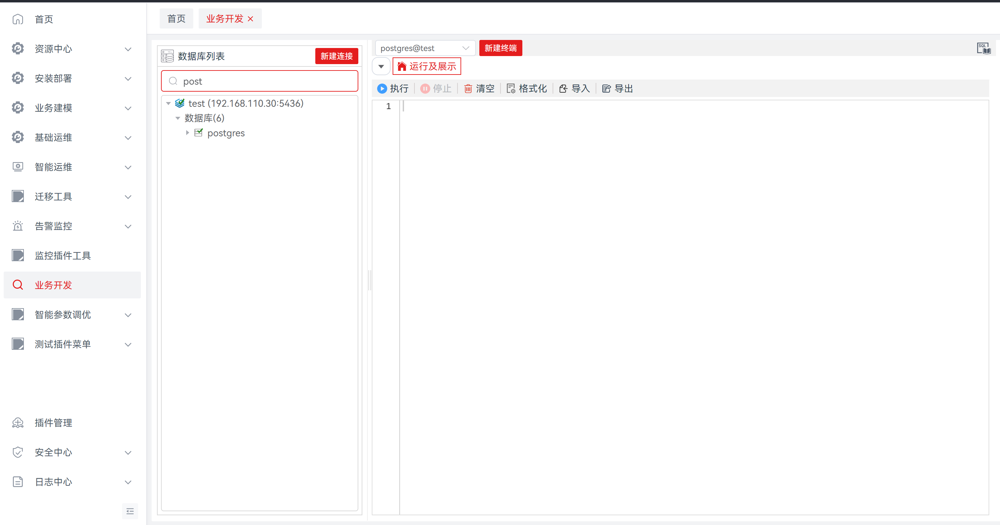


##### 5.1.3.2 数据库导航菜单

​             对 openGauss 数据库支持导航菜单如下：

<table>
    <tr>
        <th>一级菜单</th>
        <th>二级菜单</th>
        <th>三级菜单</th>
        <th>四级菜单</th>
        <th>五级菜单</th>
        <th>六级菜单</th>
        <th>说明</th>
    </tr>   
    <tr>
        <td rowspan="10">【连接状态图标】+ 连接名称(主机地址:端口号)</td>
        <td rowspan="7">数据库</td>
        <td rowspan="7">【连接状态图标】+ 数据库名称</td>
        <td rowspan="7">模式名称</td>
        <td>【图标】+普通表（子级总数）</td>
        <td>普通/分区表文件名称</td>
        <td rowspan="7">一 ~ 五级菜单均支持单独刷新</td>
    </tr>
    <tr>
        <td>【图标】+外表(子级总数)</td>
        <td>外表文件名称</td>
    </tr>
    <tr>
        <td>【图标】+触发器(子级总数)</td>
        <td>触发器文件名称</td>
    </tr>
    <tr>
        <td>【图标】+函数/过程(子级总数)</td>
        <td>函数/过程文件名称</td>
    </tr>
    <tr>
        <td>【图标】+序列(子级总数)</td>
        <td>序列文件名称</td>
    </tr>
    <tr>
        <td>【图标】+视图(子级总数)</td>
        <td>视图文件名称</td>
    </tr>
    <tr>
        <td>【图标】+同义词(子级总数)</td>
        <td>同义词文件名称</td>
    </tr>
    <tr>
        <td>用户/角色</td>
        <td colspan="4">用户/角色名称</td>
        <td rowspan="2">一级菜单支持单独刷新</td>
    </tr>
    <tr>
        <td>表空间</td>
        <td colspan="4">表空间名称</td>
    </tr>
    <tr>
        <td>定时任务</td>
        <td colspan="4">当前连接下的所有数据库定时任务信息查看入口</td>
    </tr>
</table>
<<<<<<< HEAD
=======

>>>>>>> 9280972a7be2acd4d606ae62e639af0bc0ae72bb
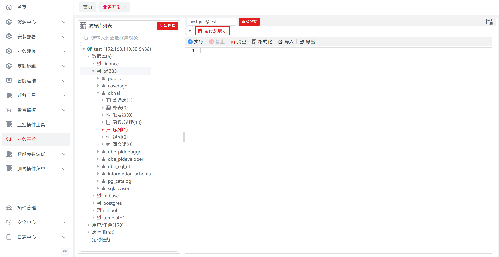


#### 5.1.4 数据库对象编辑栏

##### 5.1.4.1 便携入口
| 功能项 / 入口 | 功能项描述                                                   |
| ------------- | ------------------------------------------------------------ |
| 新建连接按钮  | 打开新建连接窗口                                             |
| 数据库选择框  | 选择已建立连接的数据库名称，点击新建终端按钮，打开的新终端指向所选数据库名称<br/>注：仅存在已建立的连接时显示 |
| 新建终端按钮  | 打开新终端<br/>注：仅存在已建立的连接时显示                  |


##### 5.1.4.2 标签

​             本节描述标签命名规则、标签右键操作以及标签搜索窗口。

​             标签命名规则如下：

​             **说明：** 标签显示图标+对象名称（宽度max/min：200px/1em），悬停标签显示完整标签信息。

<table>
    <tr>
        <th>类型</th>
        <th>标签类型</th>
        <th>标签命名规则</th>
        <th>完整标签命名规则</th>
        <th>说明</th>
    </tr>   
    <tr>
        <td rowspan="7">数据库对象</td>
        <td>普通表</td>
        <td>图标+普通表名称</td>
        <td>普通表/分区表：表名称<br/>模式：模式名称<br/>数据库：数据库名称<br/>连接：连接名称</td>
        <td rowspan="11">悬停标签显示完整标签名称</td>
    </tr>
    <tr>
        <td>外表</td>
        <td>图标+外表名称</td>
        <td>外表：外表名称<br/>模式：模式名称<br/>数据库：数据库名称<br/>连接：连接名称</td>
    </tr>
    <tr>
        <td>触发器</td>
        <td>图标+触发器名称</td>
        <td>触发器：触发器名称<br/>模式：模式名称<br/>数据库：数据库名称<br/>连接：连接名称</td>
    </tr>
    <tr>
        <td>函数/过程</td>
        <td>图标+函数或存储过程名称</td>
        <td>函数/过程：函数或存储过程名称<br/>模式：模式名称<br/>数据库：数据库名称<br/>连接：连接名称</td>
    </tr>
    <tr>
        <td>序列</td>
        <td>图标+序列名称</td>
        <td>序列：序列名称<br/>模式：模式名称<br/>数据库：数据库名称<br/>连接：连接名称</td>
    </tr>
    <tr>
        <td>视图</td>
        <td>图标+视图名称</td>
        <td>视图：视图名称<br/>模式：模式名称<br/>数据库：数据库名称<br/>连接：连接名称</td>
    </tr>
    <tr>
        <td>同义词</td>
        <td>图标+同义词名称</td>
        <td>同义词：同义词名称<br/>模式：模式名称<br/>数据库：数据库名称<br/>连接：连接名称</td>
    </tr>
    <tr>
        <td rowspan="4">其他</td>
        <td>用户/角色</td>
        <td>图标+用户或角色名称</td>
        <td>用户/角色：用户或角色名称<br/>连接：连接名称</td>
    </tr>
    <tr>
        <td>表空间</td>
        <td>图标+表空间名称</td>
        <td>表空间：表空间名称<br/>连接：连接名称</td>
    </tr>
    <tr>
        <td>定时任务</td>
        <td>图标+定时任务名称</td>
        <td>定时任务：定时任务名称<br/>连接：连接名称</td>
    </tr>
    <tr>
        <td>SQL终端</td>
        <td>图标+SQL终端名称</td>
        <td>终端：SQL终端名称<br/>数据库：数据库名称<br/>连接：连接名称</td>
    </tr>
</table>

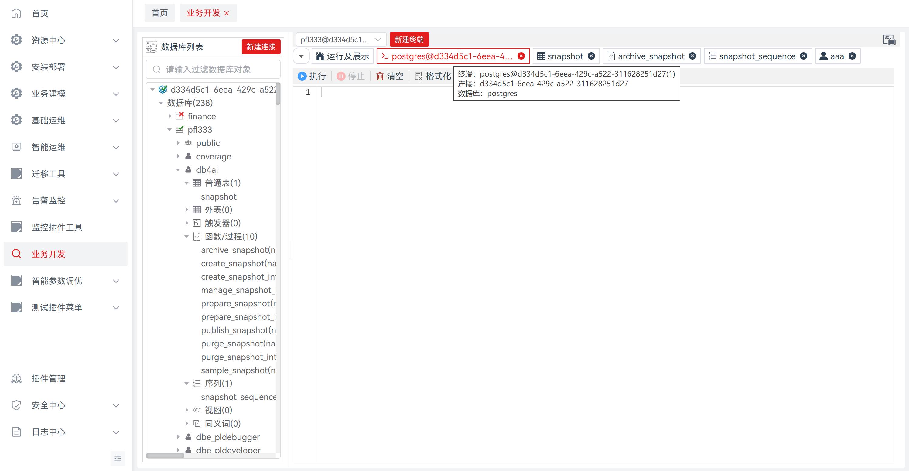

​            标签右键支持刷新、重命名、关闭等操作，具体功能如下：

<table>
    <tr>
        <th>功能项</th>
        <th>描述</th>
    </tr>   
    <tr>
        <td>(右键标签) 刷新当页</td>
        <td>仅普通表标签页面支持刷新当前标签页面数据</td>
    </tr>
    <tr>
        <td>(右键标签) 重命名终端</td>
        <td>仅SQL终端窗口支持重命名终端</td>
    </tr>
    <tr>
        <td>(右键标签) 新建终端</td>
        <td>仅SQL终端窗口支持基于当前终端创建一个相同对象的终端窗口</td>
    </tr>
    <tr>
        <td>(右键标签) 关闭标签</td>
        <td>当前标签页面关闭，自动显示下一个标签页页面信息</td>
    </tr>
    <tr>
        <td>(右键标签) 关闭其他</td>
        <td>除当前标签页面和【运行及展示】外，其他所有标签页面都关闭</td>
    </tr>
    <tr>
        <td>(右键标签) 关闭所有</td>
        <td>除【运行及展示】外，其他所有标签页面都关闭</td>
    </tr>
</table>

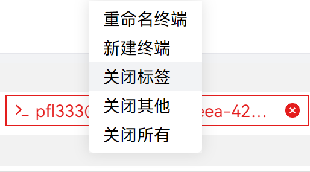

​            标签列表窗口支持搜索、跳转等操作，具体功能如下：

<table>
    <tr>
        <th>功能项</th>
        <th>描述</th>
    </tr>   
    <tr>
        <td>搜索标签页</td>
        <td>输入标签页名称，基于打开的标签页列表匹配对应的搜索数据，若存在，即可通过点击操作，面板内容切换至指定的页面信息</td>
    </tr>
    <tr>
        <td>跳转至搜索的标签页</td>
        <td>点击指定的标签页，面板内容切换至指定的页面信息</td>
    </tr>
</table>
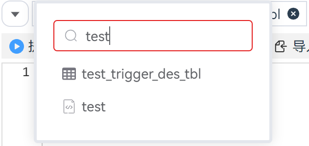


##### 5.1.4.3 功能区

​             功能区的面板布局如下：

<table>
    <tr>
        <th>面板</th>
        <th>功能</th>
        <th>描述</th>
    </tr>   
    <tr>
        <td rowspan="4">便捷区</td>
        <td>连接选择框</td>
        <td>选择目标数据库，结合新建终端一起使用，可便捷打开连接指定数据库的新终端</td>
    </tr>
    <tr>
        <td>新建连接</td>
        <td>打开新建连接弹窗</td>
    </tr>
    <tr>
        <td>新建终端</td>
        <td>打开新建终端，新终端默认连接至选择框中的目标数据库</td>
    </tr>
    <tr>
        <td>SQL助手</td>
        <td>右侧打开 openGauss SQL 助手</td>
    </tr>
    <tr>
        <td>标签区</td>
        <td>标签栏</td>
        <td>标签窗口 + 标签</td>
    </tr>
    <tr>
        <td rowspan="3">展示区</td>
        <td>SQL 窗口</td>
        <td>SQL 脚本输入窗口 + SQL 结果展示栏</td>
    </tr>
    <tr>
        <td>PL/SQL 窗口</td>
        <td>调试工具栏 + 函数/过程调试脚本 + 调试结果展示栏</td>
    </tr>
    <tr>
        <td>数据展示</td>
        <td>页面数据展示区，通常用于数据库对象的数据管理、查看等操作</td>
    </tr>
</table>
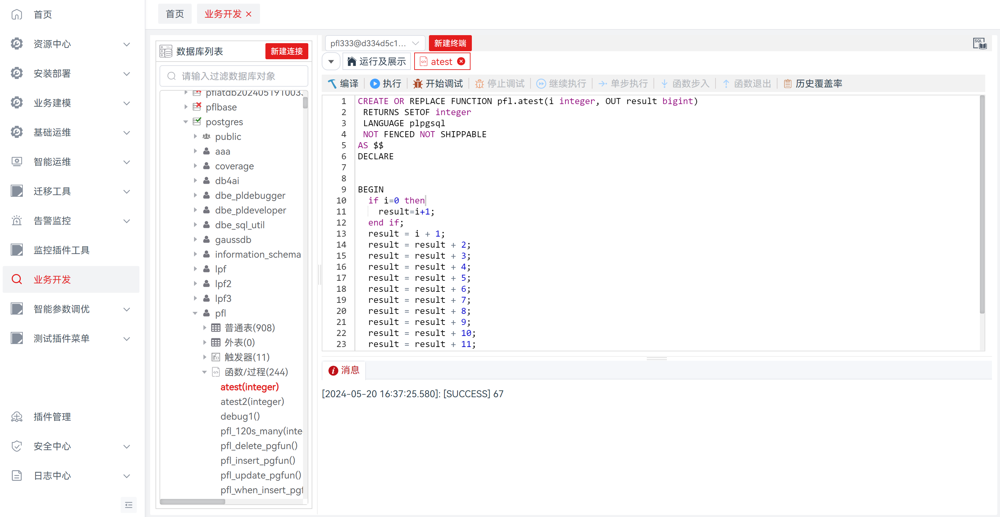


#### 5.1.5 整体功能

##### 5.1.5.1 主题色

​             支持两种主题色：亮色主题（背景色：#ffffff  /  主题色：#e41d1d）、黑暗主题（背景色：#232324  /  主题色：#fcef92)

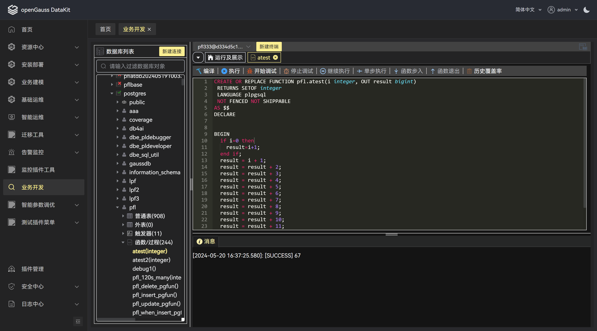


##### 5.1.5.2 窗口拖动

​             支持窗口拖动，具体描述如下：

<table>
    <tr>
        <th>拖动类型</th>
        <th>描述</th>
    </tr>   
    <tr>
        <td>数据库导航栏与数据库对象编辑栏左右拖动</td>
        <td>鼠标移至数据库导航栏和数据库对象编辑栏中间：长按鼠标往左拖动、往右拖动以调节两个窗口的宽度</td>
    </tr>
    <tr>
        <td>数据库对象编辑栏与SQL助手栏左右拖动</td>
        <td>鼠标移至数据库对象编辑栏与SQL助手栏中间：长按鼠标往左拖动、往右拖动以调节两个窗口的宽度</td>
    </tr>
    <tr>
        <td>SQL窗口的编辑器和执行结果窗口上下拖动</td>
        <td>鼠标移至SQL编辑器和执行结果窗口中间：长按鼠标往上拖动、往下拖动以调节两个窗口的高度</td>
    </tr>
    <tr>
        <td>PL/SQL窗口的编辑器和调用堆栈窗口左右拖动</td>
        <td>鼠标移至PL/SQL编辑器和调用堆栈窗口中间：长按鼠标往左拖动、往右拖动以调节两个窗口的宽度</td>
    </tr>
</table>

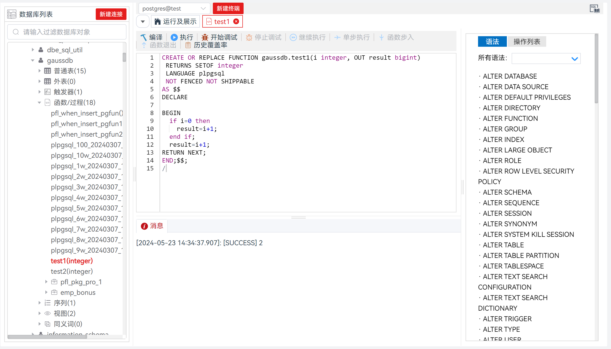


### 5.2 连接信息

​	      启动后，默认打开 **“新建连接”** 对话框。要执行数据库操作，需连接至少一个数据库。

#### 5.2.1 新建连接

**步骤 1：** 若不存在连接，默认弹出 **"新建连接"** 对话框；若已存在连接，可在工具栏中单击"**新建连接**"按钮，弹出 **"新建连接"** 对话框。 

**步骤 2：** 该连接对话框的左侧列表中显示已有的连接信息和服务器信息。

​		**说明：** 单击连接名称，可自动填充 “**名称**”、“**主机名**” 和 “**端口号**” 等连接参数。

**步骤 3：** 设置如下参数，单击 "**测试连接**" 即可对该表单参数进行测试连接。若连接成功，则消息提示"已连接，耗时xxx ms"，左下角显示"当前信息可连接"；若连接失败，则消息提示"连接错误，错误原因"，左下角显示"当前信息不可连接"。

​		**说明：** 所有必选参数均需要填写。必填参数用星号（*）标识。

​                            支持连接名称、连接信息、连接来源筛选。

​                            支持删除选中左侧连接来源为 "自定义连接" 的连接信息。

| 配置项     | 必填 | 配置说明                                                     |
| ---------- | ---- | ------------------------------------------------------------ |
| 数据库类型 | 是   | 用于选择数据库类型；默认为openGauss，不可选，置灰状态        |
| 连接名称   | 是   | 用于填写连接名称；默认为空，限制字符个数不大于30             |
| 主机地址   | 是   | 用于填写ip地址；默认为空 ，输入内容需要符合ip地址规范        |
| 端口号     | 是   | 用于填写数据库端口；默认为5432 ，输入内容需要符合端口号范围，即0-65535 |
| 数据库     | 是   | 用于填写数据库名；默认为postgres                             |
| 用户名     | 是   | 用于填写连接数据库的用户名；默认为空                         |
| 密码       | 是   | 用于填写连接数据库的密码；默认为空 ，支持显示和隐藏密码      |
| 保存密码   | 否   | 用于选择是否在建立数据库连接时保存口令；默认为仅当前会话，仅做保存密码的标识存储 |

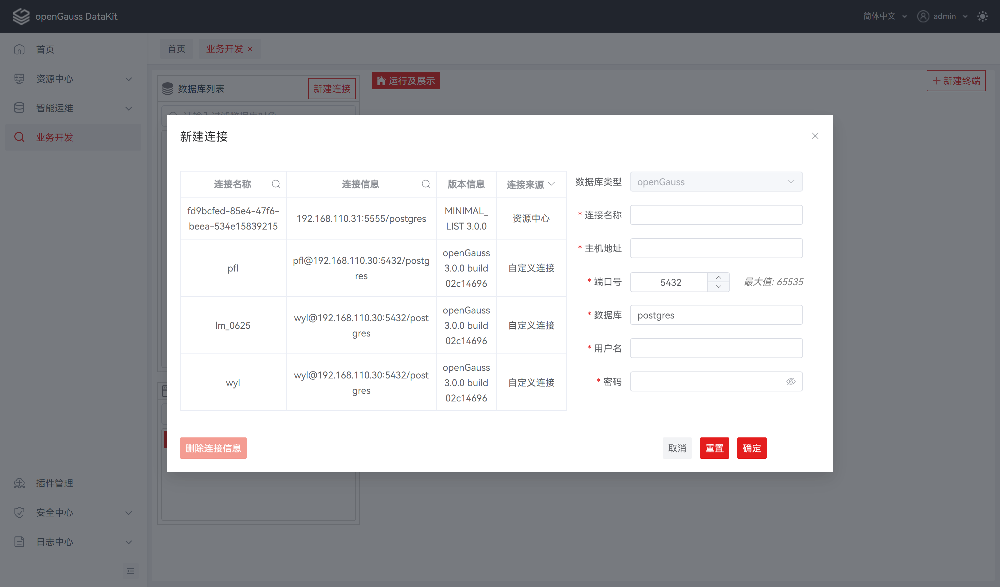

**步骤 4：** 根据测试成功连接的结果创建数据库连接。

​		**说明**：单击 "**确定**" 将保存更新后的连接信息。

​                           单击 "**重置**" 即可重置 "编辑连接"对话框中的所有字段。

​                           单击 "**取消**" 即可退出本次对话框操作。


#### 5.2.2 编辑连接

​	         执行以下步骤编辑数据库连接属性：

**步骤 1：** 在 "**数据库导航菜单**" 窗格中，右键单击连接名称，选择 "**编辑连接**" ，弹出 "**编辑连接**" 对话框。

**步骤 2：** 单击 "**确定**" 即可继续，或单击 "**取消**" 即可退出操作。

**步骤 3：** 设置参数，单击 "**测试连接**" 即可对该表单参数进行测试连接。若连接成功，则消息提示"已连接，耗时xxx ms"，左下角显示"当前信息可连接"；若连接失败，则消息提示"连接错误，错误原因"，左下角显示"当前信息不可连接"。

​		**说明**：编辑连接参数详细说明，请参见 5.2.1 添加连接。
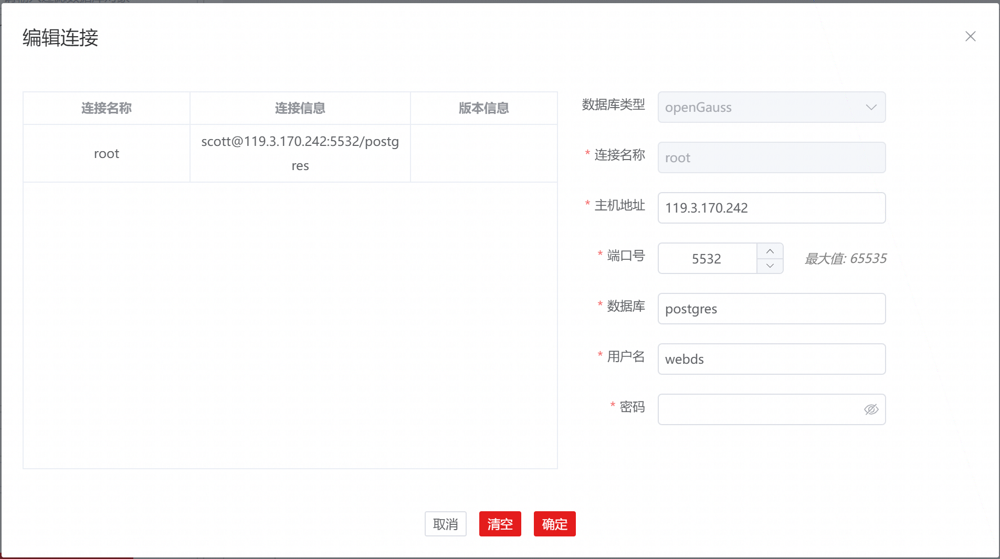

**步骤 4：** 根据测试成功连接的结果更新数据库连接。


#### 5.2.3 查看连接属性

​               执行以下步骤编辑数据库连接属性：

**步骤 1：** 在 "**数据库导航菜单**" 窗格中，右键单击连接名称，选择 "**连接属性**" ，弹出 "**连接属性**" 对话框，对话框将显示所选连接的属性。

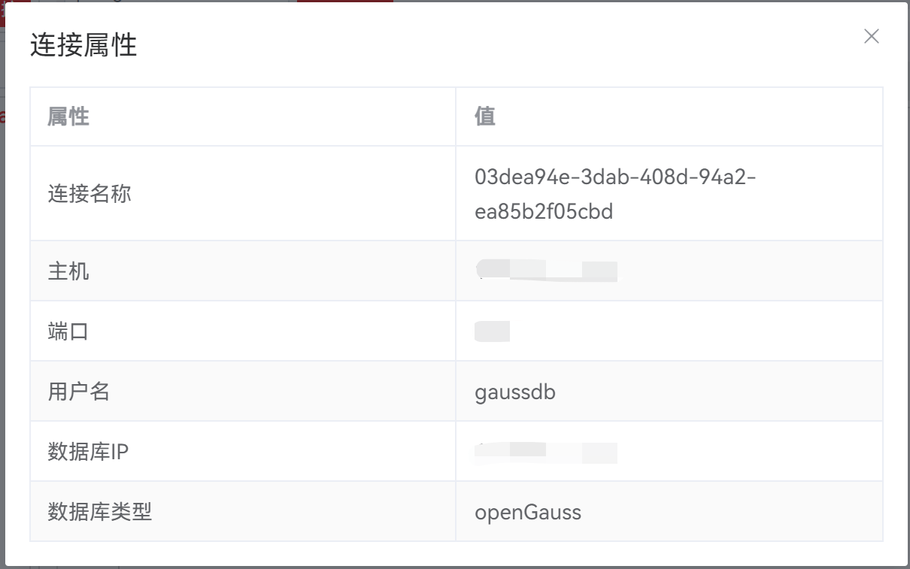


#### 5.2.4 删除连接

​               执行以下步骤删除数据库连接：

**步骤 1：** 在 "**数据库导航菜单**" 窗格中，右键单击连接名称，选择 "**删除连接**" ，弹出确认对话框。

**步骤 2：** 单击 "**确定**" 删除连接。

​              状态栏显示已完成操作的状态。

​              此操作将从 "数据库导航菜单" 中删除与当前服务器的连接，任何未保存的数据将会丢失。

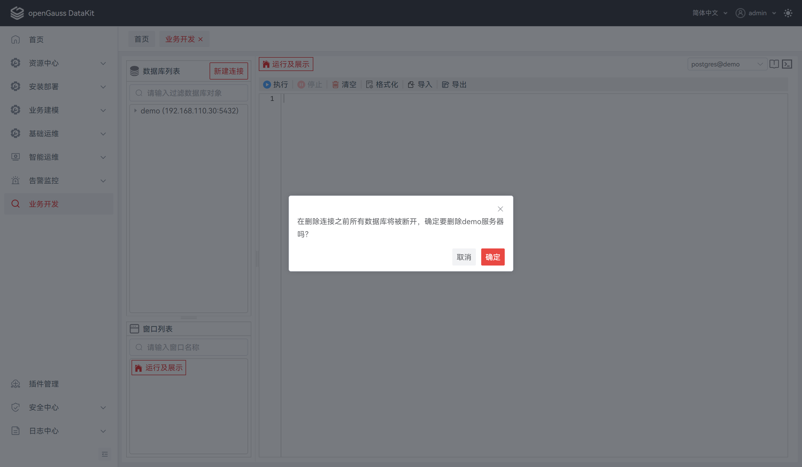


### 5.3 表

#### 5.3.1 查看表 

​             支持查看表属性，查看内容包含 DDL、常规、列、约束、索引、数据，若所选表为分区表，查看内容还将包含分区属性。

##### 5.3.1.1 查看 DDL

​             执行以下步骤查看 DDL：

**步骤 1：** 在 "**数据库导航菜单**" 窗格中，单击普通表列表，将显示所选表对应的属性与数据，选中 "**DDL**"。

​               **说明**：当前显示数据仅在首次加载时自动获取，若需更新数据请点击刷新按钮。

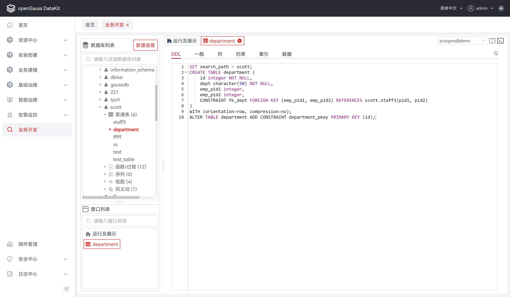


##### 5.3.1.2 查看常规

​               执行以下步骤查看列：

**步骤 1：** 在 "**数据库导航菜单**" 窗格中，单击普通表列表，将显示所选表对应的属性与数据，选中 "**常规**"。

​               **说明**：当前显示数据仅在首次加载时自动获取，若需更新数据请点击刷新按钮。


##### 5.3.1.3 查看列

​               执行以下步骤查看列：

**步骤 1：** 在 "**数据库导航菜单**" 窗格中，单击普通表列表，将显示所选表对应的属性与数据，选中 "**列**"。

​               **说明**：当前显示数据仅在首次加载时自动获取，若需更新数据请点击刷新按钮。

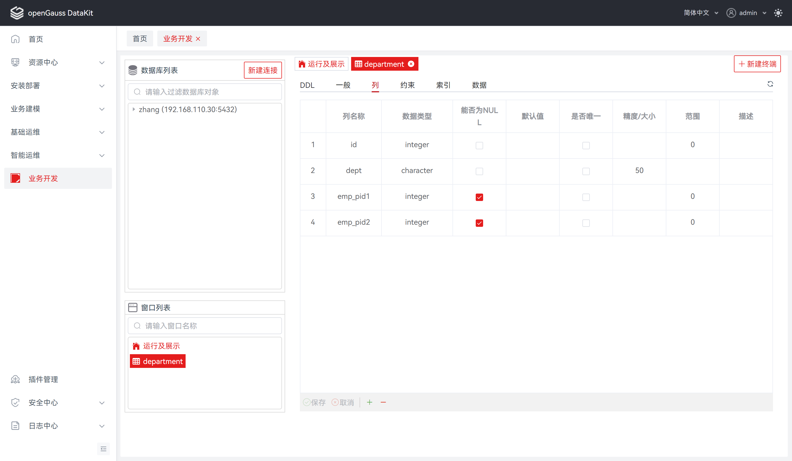


##### 5.3.1.4 查看约束

​               执行以下步骤查看约束：

**步骤 1：** 在 "**数据库导航菜单**" 窗格中，单击普通表列表，将显示所选表对应的属性与数据，选中 "**约束**"。

​               **说明**：当前显示数据仅在首次加载时自动获取，若需更新数据请点击刷新按钮。

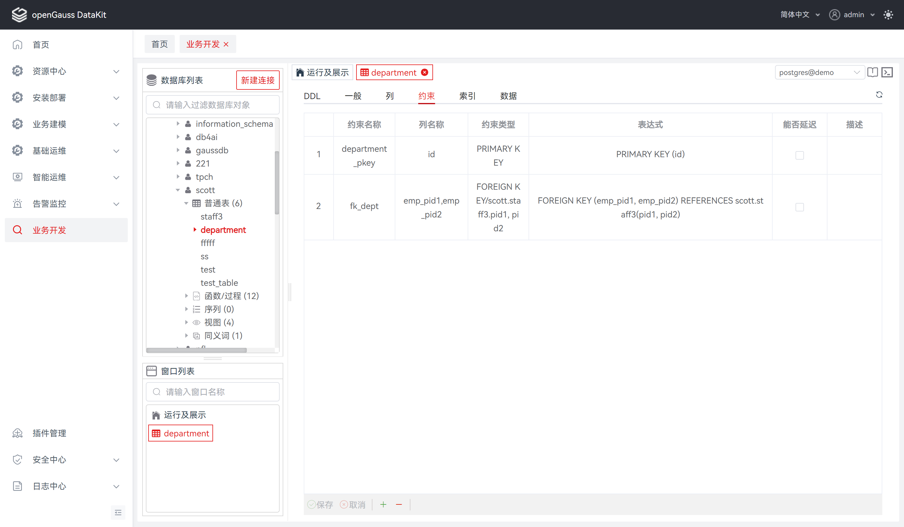


##### 5.3.1.5 查看索引

​               执行以下步骤查看索引：

**步骤 1：** 在 "**数据库导航菜单**" 窗格中，单击普通表列表，将显示所选表对应的属性与数据，选中 "**索引**"。

​               **说明**：当前显示数据仅在首次加载时自动获取，若需更新数据请点击刷新按钮。

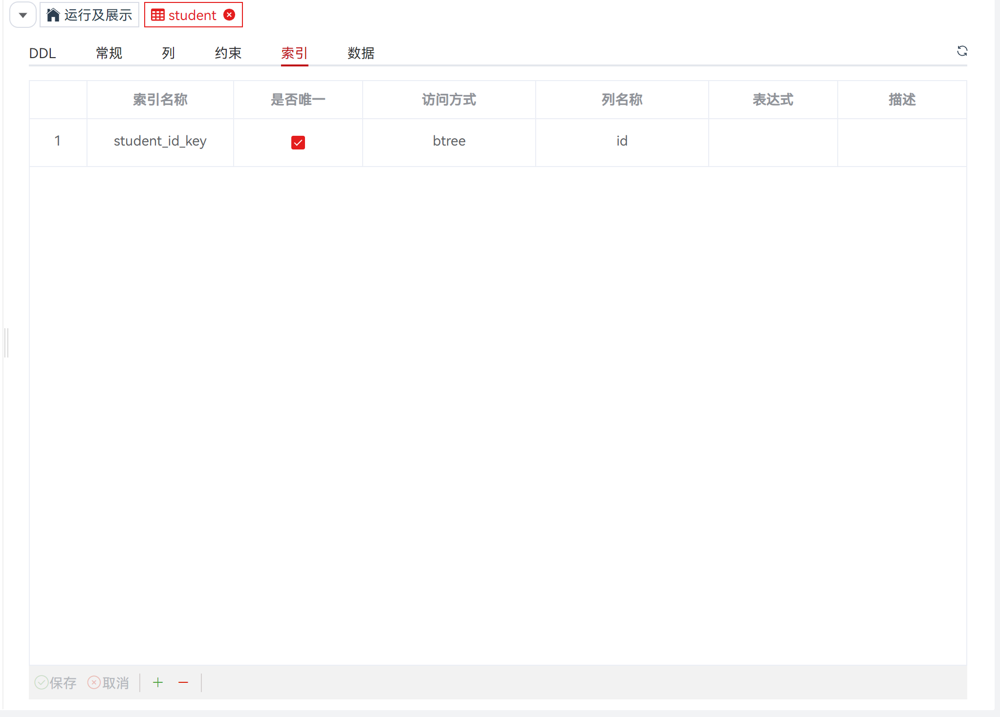


##### 5.3.1.6 查看数据

​              执行以下步骤查看数据：

**步骤 1：** 在 "**数据库导航菜单**" 窗格中，单击普通表列表，将显示所选表对应的属性与数据，选中 "**数据**"。

​               **说明：** 当前显示数据仅在首次加载时自动获取，若需更新数据请点击刷新按钮。

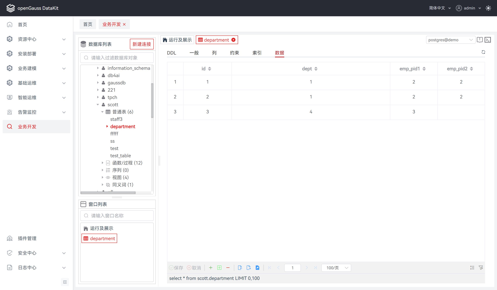


##### 5.3.1.7 查看分区

​              执行以下步骤查看分区属性：

**步骤 1：** 在 "**数据库导航菜单**" 窗格中，单击普通表列表，若所选表为分区表，将显示分区属性，选中 "**分区**"。

​               **说明：** 当前显示数据仅在首次加载时自动获取，若需更新数据请点击刷新按钮。

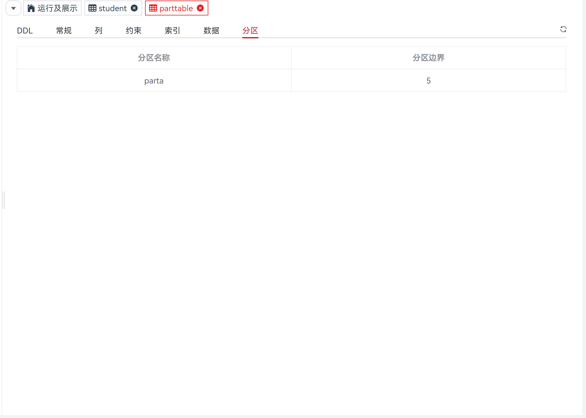


#### 5.3.2 创建表

​			执行如下步骤在数据库中定义表：

**步骤 1：** 在 "**数据库导航菜单**" 窗格中，右键单击数据库中的 "**普通表**" ，选择 "**创建表**" ，跳转到 "**创建表**" 页面。 

**步骤 2：** 点击 "**常规**" ，定义表基本信息，如表名称、表空间、表类型等。详情请参见 **定义常规** 。

**步骤 3：** 点击 "**列**" ，定义列相关信息，如列名、数据类型模式、数据类型、列约束等。详情请参见 **定义列** 。

**步骤 4：** 点击 "**约束**" ，为不同约束类型定义列约束。约束类型包含主键（PRIMARY KEY）、唯一（UNIQUE）、检查（CHECK）、外键（FOREIGN KEY）。详情请参见 **定义约束** 。

**步骤 5：** 点击 "**索引**" ，定义表索引信息，如索引名称、访问方法、表空间等。详情请参见 **定义索引** 。

**步骤 6：** 若在 "**常规**" 勾选 "**是否分区表**" 则可点击 "**分区**" ，定义分区表信息，如表分区类型、间隔值、分区名称、表空间等。详情请参见 **定义分区** 。

**步骤 7：** 点击 "**DDL 预览**" ，查看输入所自动生成的 SQL 查询。详情请参见 **DDL 预览** 。


**创建**

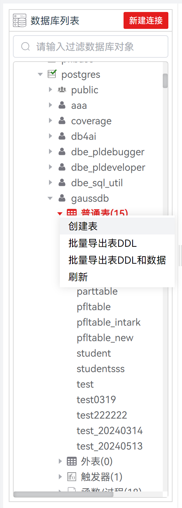


**定义常规**

​        设置如下参数：

​        **说明：** 所有必选参数均需要填写。必填参数用星号（*）标识。

​                     若点击 "**创建**" ，tab 将自动切换至   "**列**" ，待补全列信息后才可执行创建操作。

| 配置项     | 必填 | 配置说明                                                     |
| ---------- | ---- | ------------------------------------------------------------ |
| 表名       | 是   | 用于定义表名称                                               |
| 如果不存在 | 否   | 用于定义表是否判断是否已存在，如果不存在则进行创建操作       |
| 表类型     | 否   | 用于定义表类型，选项分别为常规/UNLOGGED                      |
| 带OIDS     | 否   | 用于定义表是否带有oids                                       |
| 表空间     | 否   | 用于定义表所在表空间                                         |
| 填充因子   | 否   | 用于定义填充因子                                             |
| 存储方式   | 否   | 用于定义表存储方式，选项分别为ROW、COLUMN                    |
| 是否分区表 | 否   | 用于定义是否为分区表，默认不勾选为普通表，勾选后需要在”分区”栏填写分区信息 |
| 描述       | 否   | 用于说明列信息                                               |

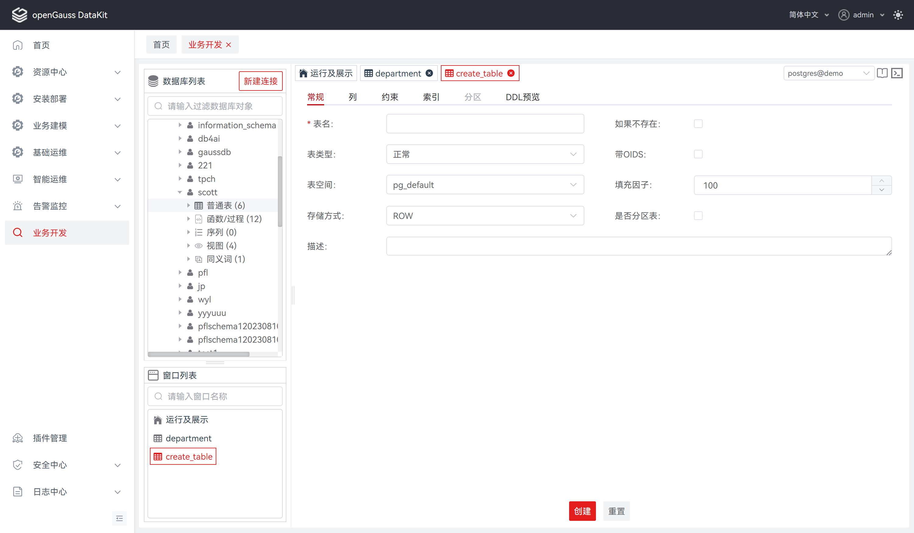


**定义列**

​        设置如下参数：

| **配置项** | **配置说明**                                         |
| ---------- | ---------------------------------------------------- |
| 列名称     | 用于定义列名称                                       |
| 数据类型   | 用于配置数据库常用数据类型，默认为第一个数据类型     |
| 能否非空   | 用于定义列约束，指该列不能包含空值                   |
| 默认值     | 用于定义列约束，指定该列未定义值的情况下使用的默认值 |
| 是否唯一   | 用于定义列约束，指列可能仅包含唯一值                 |
| 精度/大小  | 用于定义数据类型的精度/大小                          |
| 范围       | 用于定义数据类型的范围                               |
| 描述       | 用于说明列信息                                       |

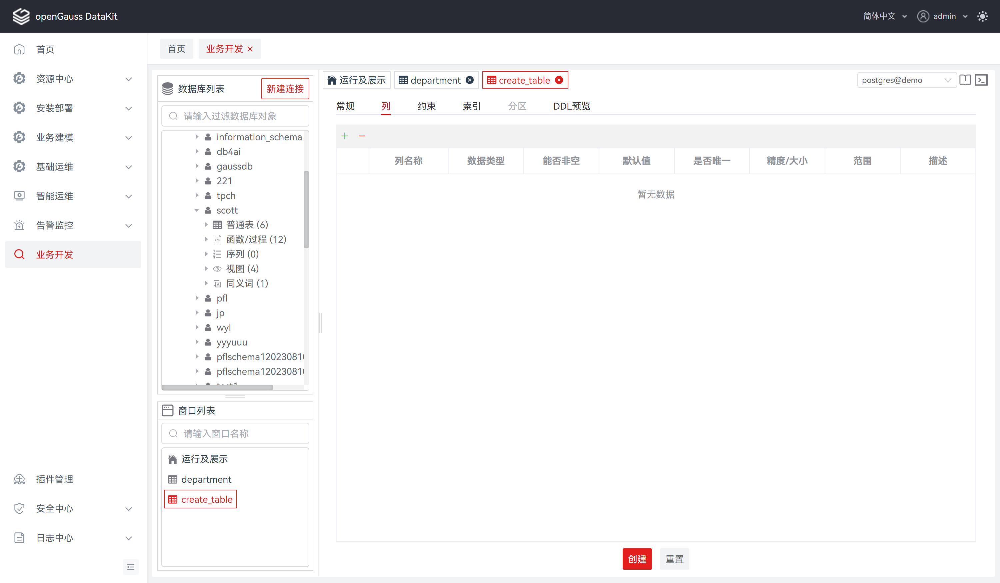


**定义约束**

​        设置如下参数：

<table>
    <tr>
        <th>配置项</th>
        <th>配置说明</th>
    </tr>   
    <tr>
        <td>约束名称</td>
        <td>用于定义约束名称</td>
    </tr>
    <tr>
        <td>列名称</td>
        <td>用于选择定义约束的列名称</td>
    </tr>
    <tr>
        <td>约束类型</td>
        <td>用于选择定义约束的类型；配置项：CHECK、UNIQUE、PRIMARY KEY、FOREIGN KEY、<br/>PARTIAL CLUSTER KEY，以上数据由前端固定配置，其中FOREIGN KEY选项下一级分别需要配置命名空间、<br/>表、列，对应数据由后端返回；如果选择多个列，配置项中的FOREIGN KEY选项置灰不可选，一个外键只能<br/>设置一个列</td>
    </tr>
    <tr>
        <td>表达式</td>
        <td>用于定义约束的表达式</td>
    </tr>
    <tr>
        <td>能否延迟</td>
        <td>用于定义约束延迟检查功能，设置延迟类型为IMMEDIATE</td>
    </tr>
    <tr>
        <td>描述</td>
        <td>用于定义约束信息</td>
    </tr>
</table>
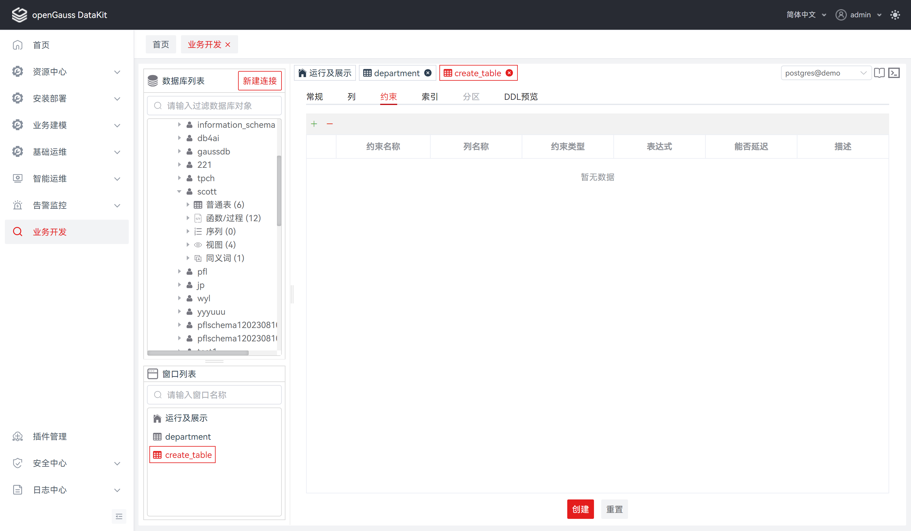


**定义索引**

​        设置如下参数：

| **配置项** | **配置说明**               |
| ---------- | -------------------------- |
| 索引名称   | 用于定义索引名称           |
| 是否唯一   | 用于定义索引的唯一性       |
| 访问方式   | 用于选择使用的索引方法名称 |
| 列名称     | 用于选择定义索引的列名称   |
| 表达式     | 用于输入用户自定义表达式   |
| 描述       | 用于定义索引信息           |

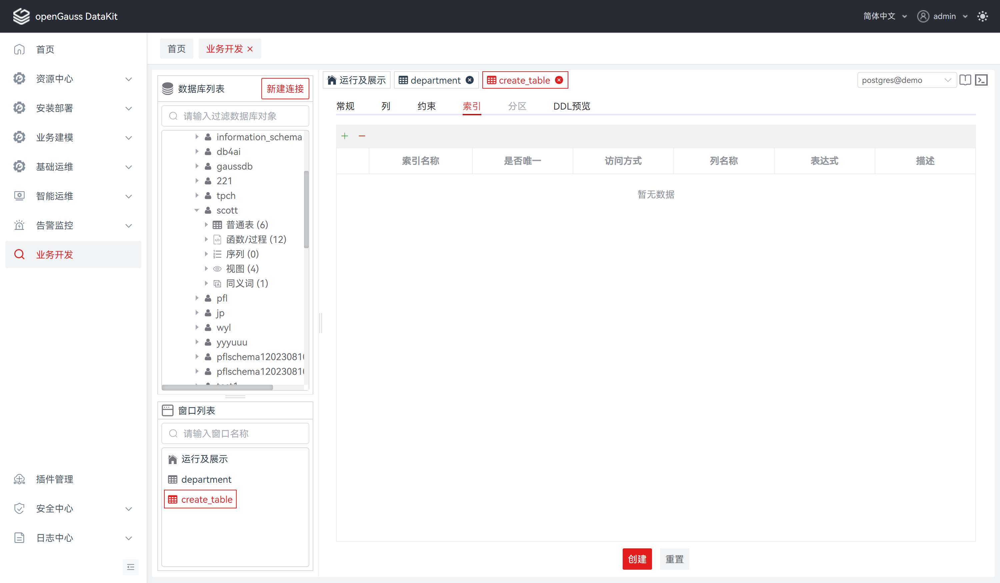


**定义分区**

​        设置如下参数：

​        **说明：** 所有必选参数均需要填写。必填参数用星号（*）标识。

| 配置项   | 必填 | 配置说明                               |
| -------- | ---- | -------------------------------------- |
| 分区类型 | 否   | 用于定义分区类型                       |
| 间隔值   | 否   | 用于配置分区类型为 interval 时的间隔值 |
| 分区名称 | 是   | 用于定义分区名称                       |
| 表空间   | 否   | 用于定义分区所在表空间                 |
| 分区列   | 是   | 用于定义分区列                         |
| 分区值   | 是   | 用于定义分区列的分区值                 |

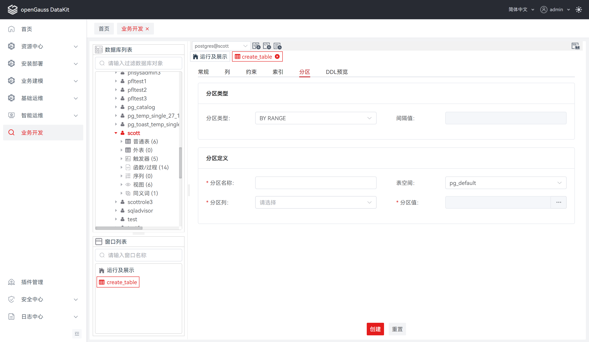


**SQL 预览**

​        按照输入的内容，生成一个SQL 语句。

​        **说明：** 该 DDL 语句仅支持查看、选择、复制，不支持编辑。

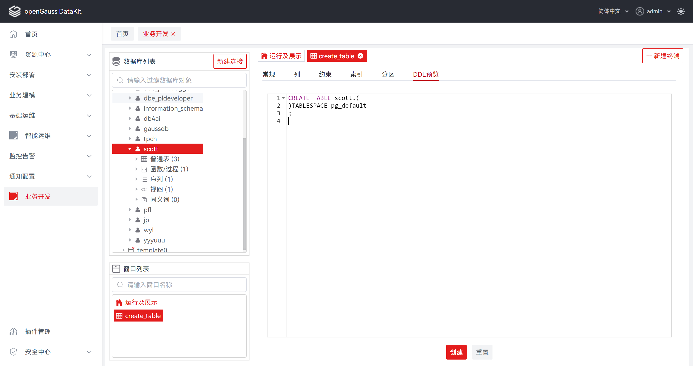


##### 5.3.2.1 管理列

​             创建表后，可以在该表中添加新的列。可对当前列执行添加、修改、删除操作。


**创建列**

​             执行以下步骤创建列：

**步骤 1：** 在 "**数据库导航菜单**" 窗格中，单击表名称，选择 "**列**"。 

**步骤 2：** 点击添加按钮 将显示新增列数据行。

**步骤 3：** 双击新增列数据行的每个表格即可启用编辑状态，定义列详情请参见 **定义列** 。

**步骤 4：** 新增列数据编辑完成后，点击  将保存新增列数据行；若点击  将关闭新增列数据行，恢复至未创建前的操作状态。


**修改列**

​             执行以下步骤修改列：

**步骤 1：** 在 "**数据库导航菜单**" 窗格中，单击表名称，选择 "**列**"。 

**步骤 2：** 双击已有列数据行的每个表格即可启用编辑状态，已修改数据背景将高亮。定义列详情请参见 **定义列** 。

**步骤 3：** 已有列数据修改完成后，点击  将保存修改列数据行；若点击  将取消修改列数据行操作，恢复至未修改前的操作状态。


**删除列**

​             执行以下步骤删除列：

**步骤 1：** 在 "**数据库导航菜单**" 窗格中，单击表名称，选择 "**列**"。 

**步骤 2：** 单击选择已有列数据行，点击  将使所需删除列数据行背景高亮。

**步骤 3：** 所需删除列数据行选择完毕后，点击  将删除所选列数据行；若点击  将取消删除列数据行操作，恢复至未修改前的操作状态。


##### 5.3.2.2 管理约束

​             创建表后，可以在该表中添加新的约束。可对当前约束执行添加、修改、删除操作。


**创建约束**

​             执行以下步骤创建约束：

**步骤 1：** 在 "**数据库导航菜单**" 窗格中，单击表名称，选择 "**约束**"。 

**步骤 2：** 点击添加按钮 将显示新增约束数据行。

**步骤 3：** 双击新增约束数据行的每个表格即可启用编辑状态，定义约束详情请参见 **定义约束** 。

**步骤 4：** 新增约束数据编辑完成后，点击  将保存新增约束数据行；若点击  将关闭新增约束数据行，恢复至未创建前的操作状态。


**修改约束**

​             执行以下步骤修改约束：

**步骤 1：** 在 "**数据库导航菜单**" 窗格中，单击表名称，选择 "**约束**"。 

**步骤 2：** 双击已有约束数据行的每个表格即可启用编辑状态，已修改数据背景将高亮。定义约束详情请参见 **定义约束** 。

**步骤 3：** 已有约束数据修改完成后，点击  将保存修改约束数据行；若点击  将取消修改约束数据行操作，恢复至未修改前的操作状态。


**删除约束**

​             执行以下步骤删除约束：

**步骤 1：** 在 "**数据库导航菜单**" 窗格中，单击表名称，选择 "**约束**"。 

**步骤 2：** 单击选择已有约束数据行，点击  将使所需删除约束数据行背景高亮。

**步骤 3：** 所需删除约束数据行选择完毕后，点击  将删除所选约束数据行；若点击  将取消删除约束数据行操作，恢复至未修改前的操作状态。


##### 5.3.2.3 管理索引

​            创建表后，可以在该表中添加新的索引。可对当前索引执行添加、修改、删除操作。


**创建索引**

​             执行以下步骤创建索引：

**步骤 1：** 在 "**数据库导航菜单**" 窗格中，单击表名称，选择 "**索引**"。 

**步骤 2：** 点击添加按钮 将显示新增索引数据行。

**步骤 3：** 双击新增索引数据行的每个表格即可启用编辑状态，定义索引详情请参见 **定义索引** 。

**步骤 4：** 新增索引数据编辑完成后，点击  将保存新增索引数据行；若点击  将关闭新增索引数据行，恢复至未创建前的操作状态。


**修改索引**

​             执行以下步骤修改索引：

**步骤 1：** 在 "**数据库导航菜单**" 窗格中，单击表名称，选择 "**索引**"。 

**步骤 2：** 双击已有索引数据行的每个表格即可启用编辑状态，已修改数据背景将高亮。定义索引详情请参见 **定义索引** 。

**步骤 3：** 已有索引数据修改完成后，点击  将保存修改索引数据行；若点击  将取消修改索引数据行操作，恢复至未修改前的操作状态。


**删除索引**

​             执行以下步骤删除索引：

**步骤 1：** 在 "**数据库导航菜单**" 窗格中，单击表名称，选择 "**索引**"。 

**步骤 2：** 单击选择已有索引数据行，点击  将使所需删除索引数据行背景高亮。

**步骤 3：** 所需删除索引数据行选择完毕后，点击  将删除所选索引数据行；若点击  将取消删除索引数据行操作，恢复至未修改前的操作状态。


#### 5.3.3 管理表

​			创建表后，可在表中执行操作。右键单击表，选择要执行的管理表操作。

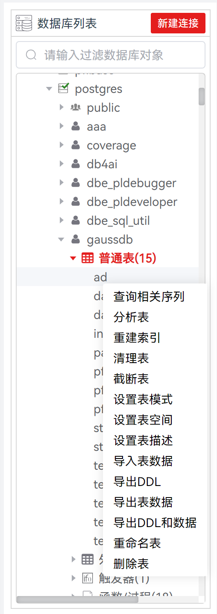

##### 5.3.3.1 查询相关序列

​             openGauss 支持显示表和序列之间的依赖关系。

​             执行以下步骤查询相关序列：

**步骤 1：** 在 "**数据库导航菜单**" 窗格中，右键单击数据库中的表名称，选择 "**查询相关序列**" ，进入显示相关序列页面。

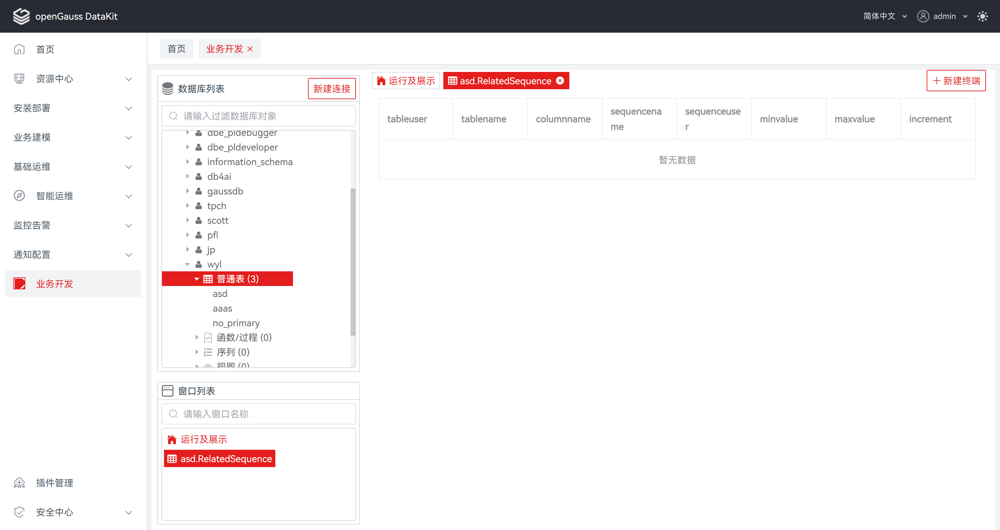


##### 5.3.3.2 重建索引

​             使用索引可帮助用户更快地查找数据。以下场景需要重建索引：

- 索引已破坏，不再包含任何有效数据。虽然理论上不会发生，但事实上，索引可能由于软件或硬件故障而被破坏重建索引提供恢复方法。
- 索引包含很多空的或几乎为空的页面，这种情况会在一些非通用访问类型下PostgreSQL 中的 B-tree 索引中出现重建索引提供一种通过写新版本的方式减少索引消耗的方法。新版本中无空页面。
- 已修改索引的存储参数（如“填充因子”），且希望保证修改完全生效。

​             执行以下步骤重建索引：

**步骤 1：** 在 "**数据库导航菜单**" 窗格中，右键单击数据库中的表名称，选择 "**重建索引**" ，弹出确认对话框。

**步骤 2：** 单击 "**确定**" 重建索引。

​               状态栏显示已完成操作的状态。


##### 5.3.3.3 清理表

​             用于收回空间，便于重复利用。

​             执行以下步骤清理表：

**步骤 1：** 在 "**数据库导航菜单**" 窗格中，右键单击数据库中的表名称，选择 "**清理表**" ，弹出确认对话框。

**步骤 2：** 单击 "**确定**" 重建索引。

​               状态栏显示已完成操作的状态。


##### 5.3.3.4 截断表

​             删除当前表的所有数据。

​             执行以下步骤截断表：

**步骤 1：** 在 "**数据库导航菜单**" 窗格中，右键单击数据库中的表名称，选择 "**截断表**" ，弹出确认对话框。

**步骤 2：** 单击 "**确定**" 截断表。

​               状态栏显示已完成操作的状态。


##### 5.3.3.5 设置表模式

​             执行以下步骤设置表模式：

**步骤 1：** 在 "**数据库导航菜单**" 窗格中，右键单击数据库中的表名称，选择 "**设置表模式**" ，弹出设置表模式对话框。

**步骤 2：** 从下拉列表中选择模式名称，单击 "**确定**" 已选表将被移动到新模式。

​                状态栏显示已完成操作的状态。

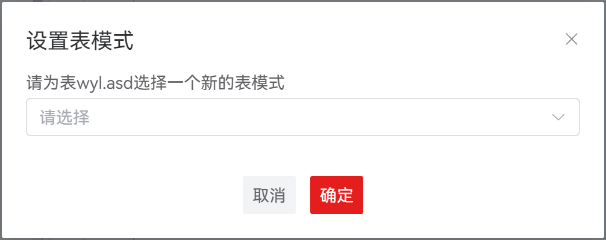


##### 5.3.3.6 设置表空间

​             执行以下步骤设置表空间：

**步骤 1：** 在 "**数据库导航菜单**" 窗格中，右键单击数据库中的表名称，选择 "**设置表空间**" ，弹出设置表空间对话框。

**步骤 2：** 从下拉列表中选择名称，单击 "**确定**" 已选表将被移动到新的表空间。

​                状态栏显示已完成操作的状态。

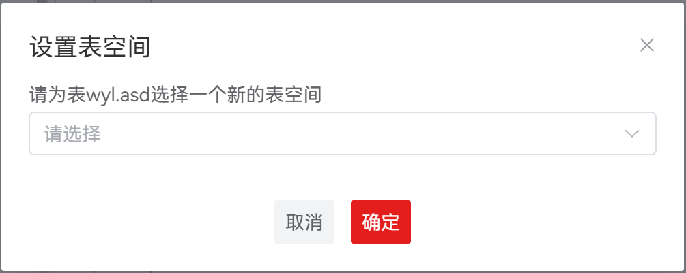


##### 5.3.3.7 设置表描述

​             执行以下步骤设置表描述：

**步骤 1：** 在 "**数据库导航菜单**" 窗格中，右键单击数据库中的表名称，选择 "**设置表描述**" ，弹出设置表描述对话框。

**步骤 2：** 根据对话框提示输入表描述，单击 "**确定**" 已选表将更新表描述。

​                状态栏显示已完成操作的状态。

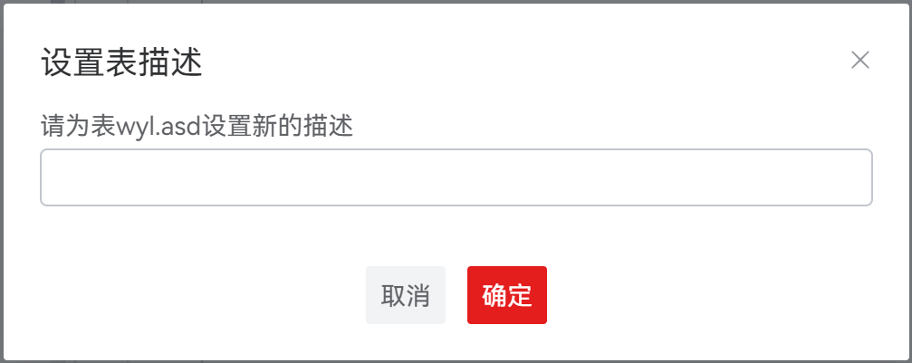

##### 5.3.3.8 重命名表

​             执行以下步骤重命名表：

**步骤 1：** 在 "**数据库导航菜单**" 窗格中，右键单击数据库中的表名称，选择 "**重命名表**" ，弹出重命名表对话框。

**步骤 2：** 根据对话框提示输入表的新名称，单击 "**确定**" 已选表将更新表名称。

​                状态栏显示已完成操作的状态。

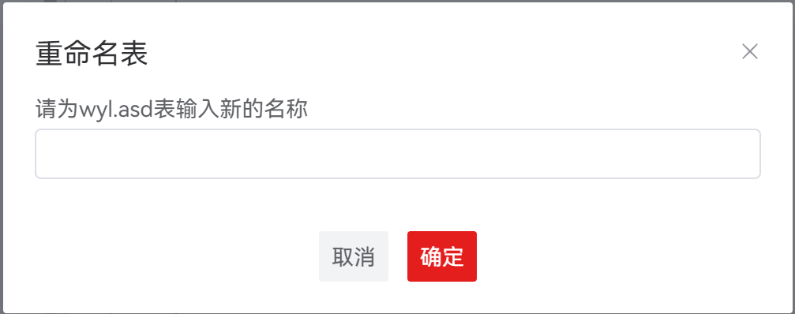


##### 5.3.3.9 删除表

​            执行以下步骤删除表：

**步骤 1：** 在 "**数据库导航菜单**" 窗格中，右键单击数据库中的表名称，选择 "**删除表**" ，弹出确认对话框。

**步骤 2：** 单击 "**确定**" 即可继续，或单击 "**取消**" 即可退出操作。

​                **说明：** 单击 "**确定**" 将删除表，此操作不可逆。


##### 5.3.3.10 分析表

​             “分析” 统计表和表索引的数据，在数据库内部表中存储统计的信息。数据库中，查询优化器可以访问信息并根据该信息制定更好的查询规划策略。

​             执行以下步骤分析表：

**步骤 1：** 在 "**数据库导航菜单**" 窗格中，右键单击数据库中的表名称，选择 "**分析表**" ，弹出确认对话框。

**步骤 2：** 单击 "**确定**" 分析表。

​               状态栏显示已完成操作的状态，分析生成最新的表统计信息存储在系统表 PG_STATISTIC 中。


#### 5.3.4 管理表数据

​			支持操作表数据、导出表 DDL、导出表 DDL 和数据、导出表数据。

##### 5.3.4.1 操作表数据

​            创建表后，可以在该表中添加新的数据。可对当前数据执行新增、修改、删除、筛选、排序、导入、导出操作，同时支持在表数据工具栏下方预览所有操作所对应的 SQL 语句。

​            **说明：** 新增数据若未保存的单元格高亮为绿色，保存后，其颜色重置为默认颜色。

​                        编辑数据若未保存的单元格高亮为浅红色 ，保存后，其颜色重置为默认颜色。

​                        删除数据若未保存的单元格高亮为深红色，保存后，其颜色重置为默认颜色。

**新增数据**

​                执行以下步骤新增数据：

**步骤 1：** 在 "**数据库导航菜单**" 窗格中，单击表名称，选择 "**数据**"。 

**步骤 2：** 点击添加按钮 将显示新增数据行。

**步骤 3：** 双击新增数据行的每个表格即可启用编辑状态。

**步骤 4：** 新增数据编辑完成后，点击  将保存新增数据行；若点击  将关闭新增数据行，恢复至未创建前的操作状态。

​               **说明：** 若所操作表未设置主键，将显示 "**自定义唯一键**" 对话框，详情请参见 **自定义唯一键** 。


**修改数据**

​               执行以下步骤修改数据：

**步骤 1：** 在 "**数据库导航菜单**" 窗格中，单击表名称，选择 "**数据**"。 

**步骤 2：** 双击已有数据行的每个表格即可启用编辑状态，已修改数据背景将高亮。

**步骤 3：** 已有数据修改完成后，点击  将保存修改数据行；若点击  将取消修改数据行操作，恢复至未修改前的操作状态。

​                **说明：** 若所操作表未设置主键，将显示 "**自定义唯一键**" 对话框，详情请参见 **自定义唯一键** 。


**删除数据**

​                执行以下步骤删除数据：

**步骤 1：** 在 "**数据库导航菜单**" 窗格中，单击表名称，选择 "**数据**"。 

**步骤 2：** 单击选择已有数据行，点击  将使所需删除数据行背景高亮。

**步骤 3：** 所需删除数据行选择完毕后，点击  将删除所选数据行；若点击  将取消删除数据行操作，恢复至未修改前的操作状态。


**自定义唯一键**

​                执行以下步骤设置自定义唯一键：

**步骤 1：** 未设置主键提示的对话框中选择 "**自定义唯一键**" 。

**步骤 2：** 勾选设置为唯一键的列，点击 "**确定**" 设置唯一键。

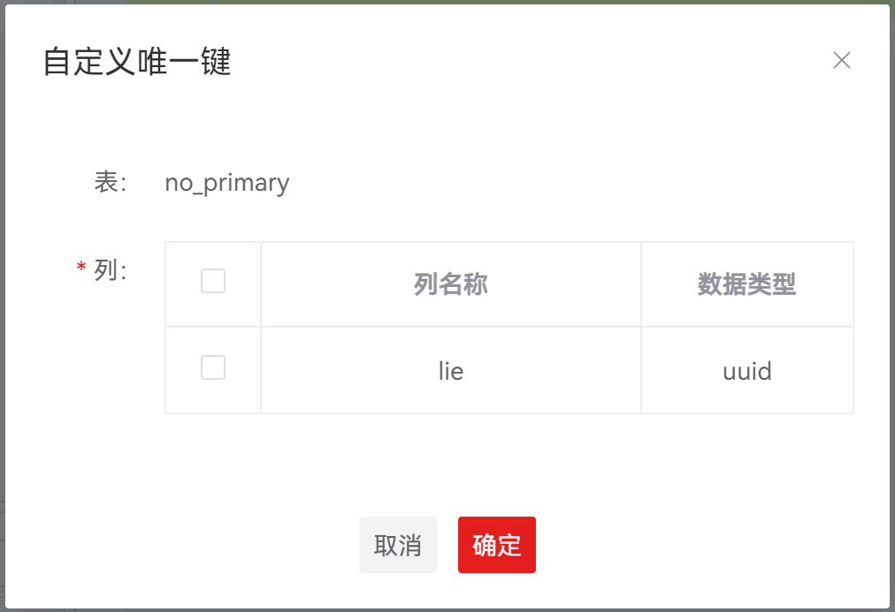


**数据筛选**

​             执行以下步骤进行数据筛选：

**步骤 1：** 在 "**数据库导航菜单**" 窗格中，单击表名称，选择 "**数据**"。 

**步骤 2：** 点击  将打开数据筛选栏，点击 或"**隐藏**" 按钮即可关闭数据筛选栏。

**步骤 3：** 在数据筛选栏中，可选择显示列，勾选表示显示，未勾选表示隐藏，默认为全选，即全部显示。

**步骤 4：** 在数据筛选栏中，筛选项操作如下：

​               为新增一组筛选项，新增后当前筛选项仅支持删除。筛选项由列、条件、值组成，点击下划线即可修改对应的下拉选项。

​               为新增一组子筛选项，新增后当前筛选项仅支持删除，子筛选项仍支持新增以及加孙筛选项，以此类推。

​               为删除当前筛选项，不包含子级筛选，超过一组筛选项支持删除。

​				**说明：** 超出一个筛选项将出现拼接的运算符，选项为and、or，默认显示值为and。

**步骤 5：** 单击 "**应用**"，所选操作项将被作为筛选条件进行查询，可查看左侧的数据变化。

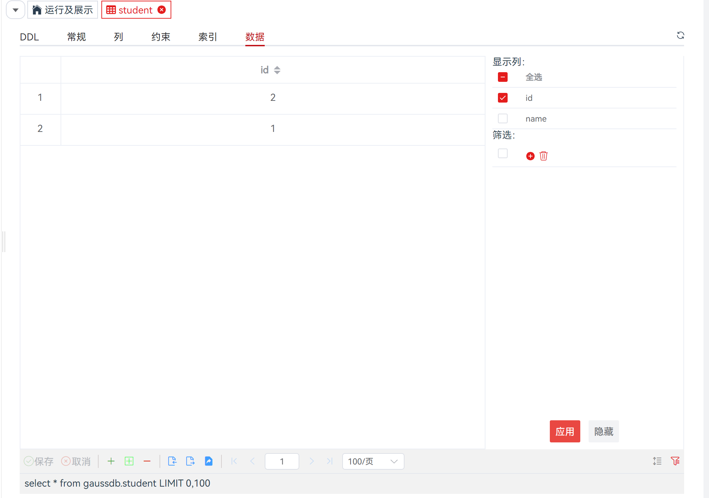


**数据排序**

​             执行以下步骤进行数据排序：

**步骤 1：** 在 "**数据库导航菜单**" 窗格中，单击表名称，选择 "**数据**"。 

**步骤 2：** 点击  将打开数据筛选栏，点击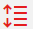 或"**隐藏**" 按钮即可关闭数据排序栏。

**步骤 3：** 在数据排序栏中，选择排序列，对应排序值的选项为ASC、DESC，其中ASC为升序，DESC为降序。

**步骤 4：** 单击 "**应用**"，所选排序列的排序值将被作为排序条件进行查询，可查看左侧的数据变化。

​               **说明：** 表格数据每列的表头新增支持单列排序，为升序状态，为降序状态，表格数据进行升序/降序操作与排序栏选项相关联。

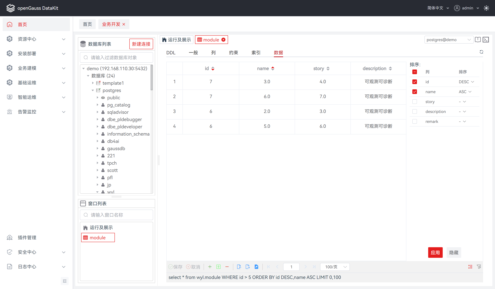


##### 5.3.4.2 导出表 DDL

​             执行以下步骤导出表 DDL：

**步骤 1：** 在 "**数据库导航菜单**" 窗格中，右键单击数据库中的表名称，选择 "**导出 DDL**" 。 

​                **说明：** 导出文件为 sql 文件。

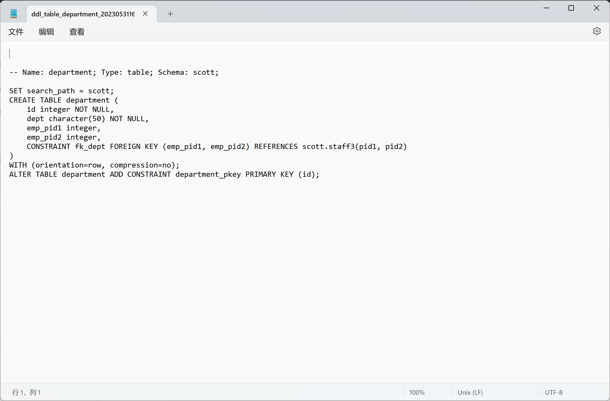


##### 5.3.4.3 导出表 DDL 和数据

​             执行以下步骤导出表 DDL 和数据：

**步骤 1：** 在 "**数据库导航菜单**" 窗格中，右键单击数据库中的表名称，选择 "**导出 DDL 和数据**"。 

​                **说明：** 导出文件为 sql 文件。

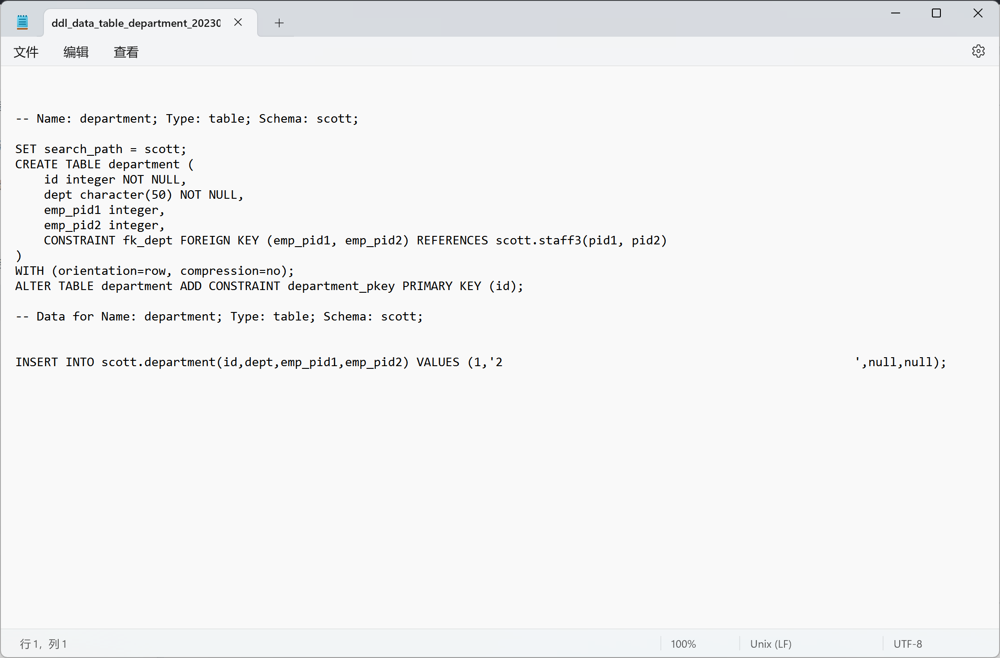


##### 5.3.4.4 导出表数据

​             创建表后，可以导出该表中的数据。支持导出该表所有数据、导出该表所有查询数据、导出该表当前页查询数据。

**导出所有数据**

​                执行以下步骤导出该表所有数据：

**步骤 1：** 在 "**数据库导航菜单**" 窗格中，右键单击数据库中的表名称，选择 "**导出表数据**" ，弹出 "**导出表数据**" 对话框。 

**步骤 2：** 设置如下参数，导出表数据。

​                **说明：** 导出文件由所配置的格式项决定。

| 配置项       | 必填 | 配置说明                                                     |
| ------------ | ---- | ------------------------------------------------------------ |
| 选择列       | 是   | 用于选择导出数据对应的列，默认全选                           |
| 格式         | 否   | 用于选择导出数据的格式，默认为Excel(xlsx)所有选项分别为：Excel(xlsx)、Excel(xls)、Text、Binary |
| 包含标题     | 否   | 用于配置导出数据中是否包含列名称，默认包含仅对Text启用修改，对Excel（xlsx/xls）和Binary格式禁用 |
| 引号         | 否   | 用于定义引号。在此字段中仅能输入单字节字符。引号不得与分隔符相同。该项默认对和文本格式启用，但不是必选。对Excel（xlsx/xls）和Binary格式禁用l 如果表数据中包含分隔符，则会使用该项中指定的符号l 如果引号出现在值中，该值不会被转义l 如果结果中包含多行值，则会用引号引用 |
| 分隔符       | 否   | 用于定义分隔符。可选择提供的分隔符，或在“分隔符”区域的“其他”字段中自定义分隔符。格式的默认分隔符为半角逗号“,”。“其他”字段中的内容最大可为 10 字节。该项对和文本格式启用，但不是必选，对Excel（xlsx/xls）和Binary格式禁用。如果“其他”字段被选中，则必须设置该字段 |
| 转义符       | 否   | 用于定义转义值。该项仅支持单字节字符。“转义符”和“引号”的值不得相同。该项对和文本格式启用，但不是必选。对Excel（xlsx/xls）和Binary格式禁用 |
| 将NULL替换为 | 否   | 可指定字符串，用于替换表中的null 值。该项不支持填入换行符或回车符，最多可填入 100 个字符。该字段的值不得与分隔符和引号值相同。该项默认对和文本格式启用，但不是必选。对 Excel（xlsx/xls）和Binary格式禁用 |
| 编码         | 否   | 用于配置导出数据的编码格式，默认为UTF-8所有选项分别为：UTF-8、GBK、LATIN1 |

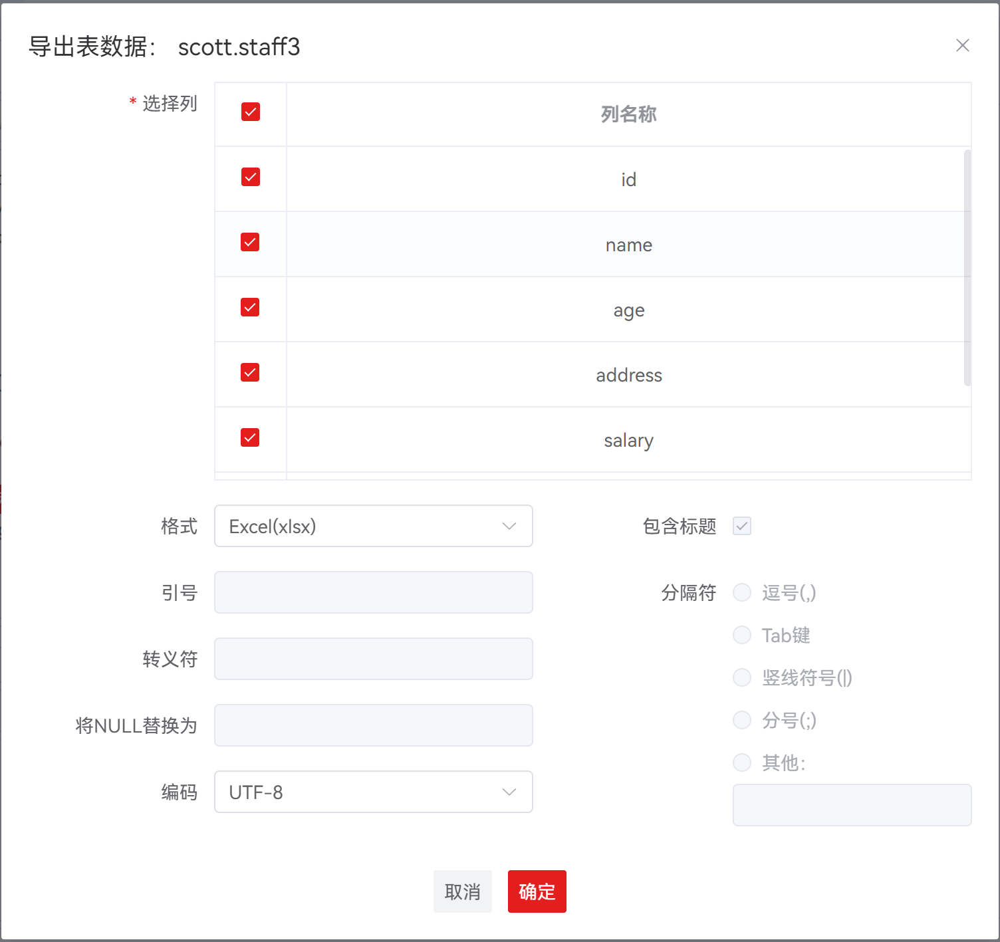


**导出所有查询数据**

​                执行以下步骤导出该表所有查询数据：

**步骤 1：** 在 "**数据库导航菜单**" 窗格中，单击表名称，选择 "**数据**"。 

**步骤 2：** 点击导出所有查询数据按钮 ，弹出导出查询数据对话框，选择导出格式，导出格式为 xlsx、xls，默认选择为 xlsx。

**步骤 3：** 单击 "**确定**" 即可继续，或单击 "**取消**" 即可退出操作。

​                **说明：** 单击 "**确定**" 将下载所有查询数据至所选格式文件。


**导出当前页查询数据**

​                执行以下步骤导出该表当前页查询数据：

**步骤 1：** 在 "**数据库导航菜单**" 窗格中，单击表名称，选择 "**数据**"。 

**步骤 2：** 点击导出当前页查询数据按钮 ，弹出导出查询数据对话框，选择导出格式，导出格式为 xlsx、xls，默认选择为 xlsx。

**步骤 3：** 单击 "**确定**" 即可继续，或单击 "**取消**" 即可退出操作。

​                **说明：** 单击 "**确定**" 将下载当前页查询数据至所选格式文件。

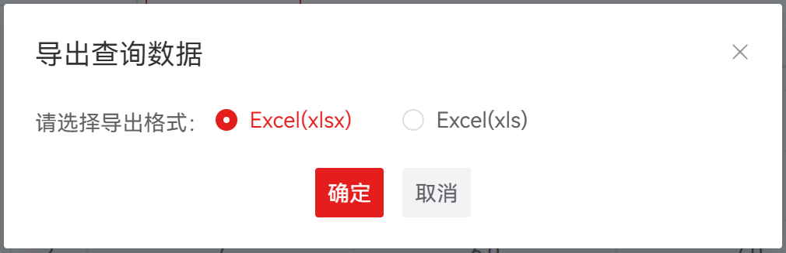


##### 5.3.4.5 导入表数据

​             执行以下步骤导入表数据：

**步骤 1：** 在 "**数据库导航菜单**" 窗格中，右键单击数据库中的表名称，选择 "**导入表数据**" 或者在表数据操作工具栏点击，弹出 "**导入表数据**" 对话框。 

**步骤 2：** 设置如下参数，导入表数据。

​                **说明：** 导入文件格局需要与所配置的格式项相符。

**步骤 3：** 单击 "**确定**" 即可继续，或单击 "**取消**" 即可退出操作。

​                **说明：** 导入成功后点击刷新按钮即可获取最新数据。

| 配置项       | 必填 | 配置说明                                                     |
| ------------ | ---- | ------------------------------------------------------------ |
| 选择列       | 是   | 用于选择导入数据对应的列，默认全选                           |
| 导入数据文件 | 是   | 用于选择导入文件，按钮默认为”选择文件”，上传文件后更改按钮为“更换文件”且显示文件名称 |
| 格式         | 否   | 用于选择导入数据的格式类型，默认为Excel(xlsx)所有选项分别为：Excel(xlsx)、Excel(xls)、CSV、Binary、Text(txt) |
| 包含标题     | 否   | 用于配置导入数据中是否包含列名称，默认包含仅对Binary禁用修改，对Excel(xlsx)、Excel(xls)、CSV、Text(txt)格式启用 |
| 引号         | 否   | 用于定义引号。在此字段中仅能输入单字节字符。引号不得与分隔符相同。该项默认对CSV、Text(txt)格式启用，但不是必选。对Excel（xlsx/xls）和Binary格式禁用l 如果表数据中包含分隔符，则会使用该项中指定的符号l 如果引号出现在值中，该值不会被转义l 如果结果中包含多行值，则会用引号引用 |
| 分隔符       | 否   | 用于定义分隔符。可选择提供的分隔符，或在“分隔符”区域的“其他”字段中自定义分隔符。格式的默认分隔符为半角逗号“,”。“其他”字段中的内容最大可为 10 字节。该项默认对CSV、Text(txt)格式启用，但不是必选。对Excel（xlsx/xls）和Binary格式禁用。如果“其他”字段被选中，则必须设置该字段 |
| 转义符       | 否   | 用于定义转义值。该项仅支持单字节字符。“转义符”和“引号”的值不得相同。该项默认对CSV、Text(txt)格式启用，但不是必选。对Excel（xlsx/xls）和Binary格式禁用 |
| 将NULL替换为 | 否   | 可指定字符串，用于替换表中的null 值。该项不支持填入换行符或回车符，最多可填入 100 个字符。该字段的值不得与分隔符和引号值相同。该项默认对CSV、Text(txt)格式启用，但不是必选。对Excel（xlsx/xls）和Binary格式禁用 |
| 编码         | 否   | 用于配置导入数据的编码格式，默认为UTF-8所有选项分别为：UTF-8、GBK、LATIN1 |
| 时间格式     | 否   | 用于配置导入数据的时间格式，默认为yyyy-MM-dd HH:mm:ss所有选项分别为：yyyy-MM-dd HH:mm:ss、yyyy-MM-dd hh:mm:ss该项仅对Excel（xlsx/xls）启用，对CSV、Binary、Text(txt) 格式禁用 |

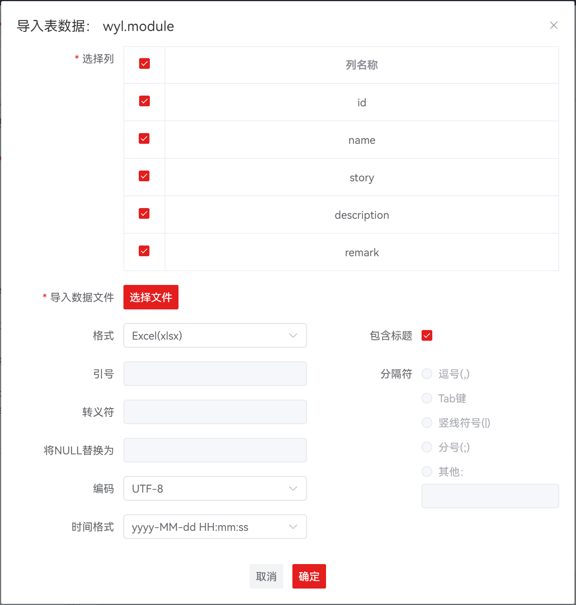


### 5.4 序列

#### 5.4.1 创建序列

​	           执行以下步骤创建序列：

**步骤 1：** 在 "**数据库导航菜单**" 窗格中，右键单击数据库中的 "**序列**"，选择 "**创建序列**"，跳转至 "**创建序列**" 页面。

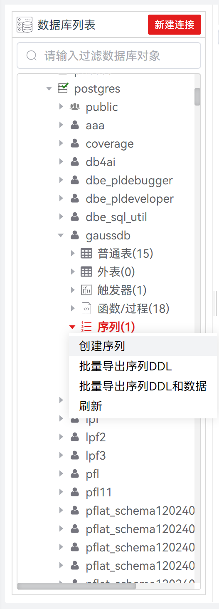

**步骤 2：** 选择 "**常规**"，设置如下参数，创建序列。

​			   **说明：** 所有必选参数均需要填写。必填参数用星号（*）标识。

​			             单击 "**确定**" 将创建并保存更新后的序列信息。

​                         单击 "**重置**" 即可重置 "**创建序列**"对话框中的所有字段。

​                         单击 "**取消**" 即可退出本次对话框操作。

| 配置项   | 必填 | 配置说明                                                     |
| -------- | ---- | ------------------------------------------------------------ |
| 名称     | 是   | 用于定义序列名称，默认为空                                   |
| 增量     | 否   | 用于定义序列的步长；默认为空，若省略，则数据库设置默认为1，若出现负值，则代表序列的值是按照此步长递减 |
| 起始值   | 否   | 用于定义序列的初始值(即产生的第一个值)；默认为空，若省略，则数据库设置默认为1 |
| 最小值   | 否   | 用于定义序列生成器能产生的最小值；默认为空，若省略，则代表没有最小值定义，这时对于递减序列，系统能够产生的最小值的取值范围应在-9223372036854775808；对于递增序列，最小值是1 |
| 最大值   | 否   | 用于定义序列生成器能产生的最大值 ；默认为空，若省略，则代表没有最大值定义，这时对于递增序列，系统能够产生的最大值是 9223372036854775807 ；对于递减序列，最大值是-1 |
| 缓存数值 | 否   | 用于定义存放序列的内存块的大小；默认为空，若省略，则数据库默认设置为20；对序列进行内存缓冲，可以改善序列的性能 |
| 循环     | 否   | 用于定义当序列生成器的值达到限制值后是否循环；默认为不循环，若循环，则当递增序列达到最大值时，循环到最小值;对于递减序列达到最小值时，循环到最大值。如果不循环，达到限制值后，继续产生新值就会发生错误。 |
| 模式     | 是   | 用于定于所属对象模式；默认为当前模式，置灰不可选             |
| 表       | 否   | 用于选择所属对象模式下对应的表；默认为空，若省略，默认仅指向上一级，即模式 |
| 列       | 否   | 用于选择所属对象模式下指定表对应的列；默认为空，若省略，默认指向指定项的上一级，即表、模式 |

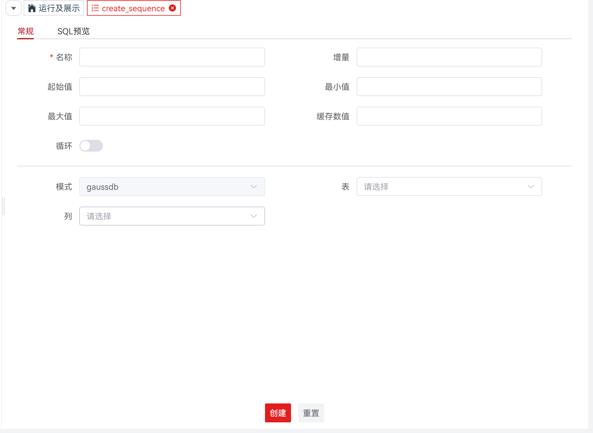

**步骤 3：** 选择 "**SQL预览**"，可基于创建序列的配置信息进行 SQL 预览。

​               **说明：** 若未填写 "**常规**" 必填项，将无法通过校验进入 "**SQL预览**" 界面。

​                          "**SQL预览**" 界面的编辑框仅支持查看，不支持编辑。

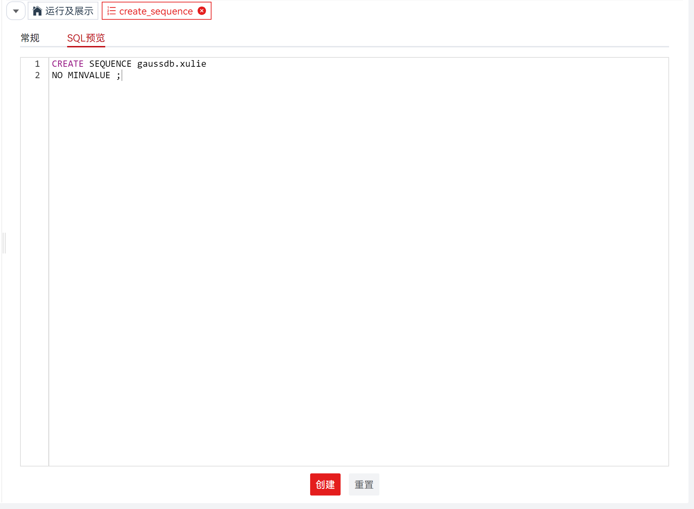


#### 5.4.2 删除序列

​	           执行以下步骤删除序列：

**步骤 1：** 在 "**数据库导航菜单**" 窗格中，右键单击数据库中的序列列表，选择 "**删除序列**"，弹出 "**删除序列**" 确认框。

**步骤 2：** 单击 "**确定**" 即可继续，或单击 "**取消**" 即可退出操作。

​                **说明：** 单击 "**确定**" 将删除并更新序列信息，此操作不可逆。

​                             单击 "**取消**" 即可退出本次对话框操作。


#### 5.4.3 查看 DDL

​	           执行以下步骤查看 DDL：

**步骤 1：** 在 "**数据库导航菜单**" 窗格中，单击序列列表，将显示序列 DDL。

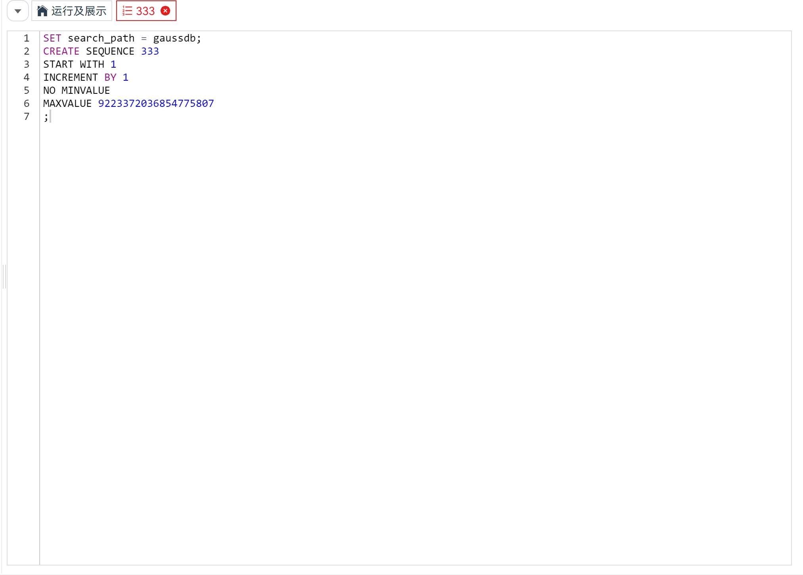


#### 5.4.4 导出序列 DDL

​               执行以下步骤导出序列 DDL：

**步骤 1：** 在 "**数据库导航菜单**" 窗格中，右键单击数据库中的序列名称，选择 "**导出 DDL**"。 

​                **说明：** 导出文件为 sql 文件。

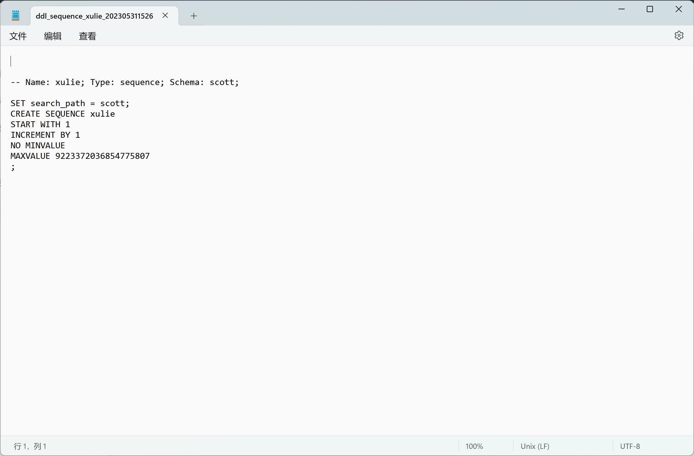


#### 5.4.5 导出序列 DDL 和数据

​               执行以下步骤导出序列 DDL 和数据：

**步骤 1：** 在 "**数据库导航菜单**" 窗格中，右键单击数据库中的序列名称，选择 "**导出 DDL 和数据**"。 

​                **说明：** 导出文件为 sql 文件。

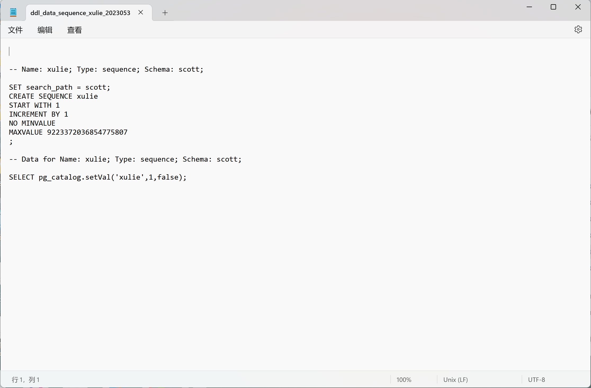


### 5.5 视图

#### 5.5.1 创建视图

​               执行以下步骤创建视图：

**步骤 1：** 在 "**数据库导航菜单**" 窗格中，右键单击数据库中的 "**视图**"，选择 "**创建视图**"，跳转至 "**创建视图**" 页面。

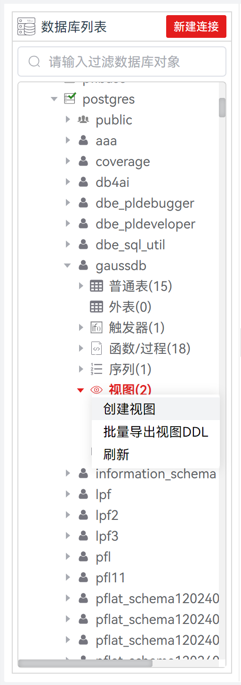

**步骤 2：** 选择 "**常规**"，设置如下参数，创建视图。

​			   **说明：** 所有必选参数均需要填写。必填参数用星号（*）标识。

​			              单击 "**确定**" 将创建并保存更新后的视图信息。

​                          单击 "**重置**" 即可重置 "**创建视图**"对话框中的所有字段。 

| 配置项       | 必填 | 配置说明                                               |
| ------------ | ---- | ------------------------------------------------------ |
| 名称         | 是   | 用于定义视图名称，默认为空                             |
| 类型         | 是   | 用于定义视图类型，类型分别为视图、物化视图，默认为视图 |
| 所属对象模式 | 是   | 用于定于所属对象模式，默认为当前模式，置灰不可选       |
| 代码         | 是   | 用于编写sql语句，默认为空                              |

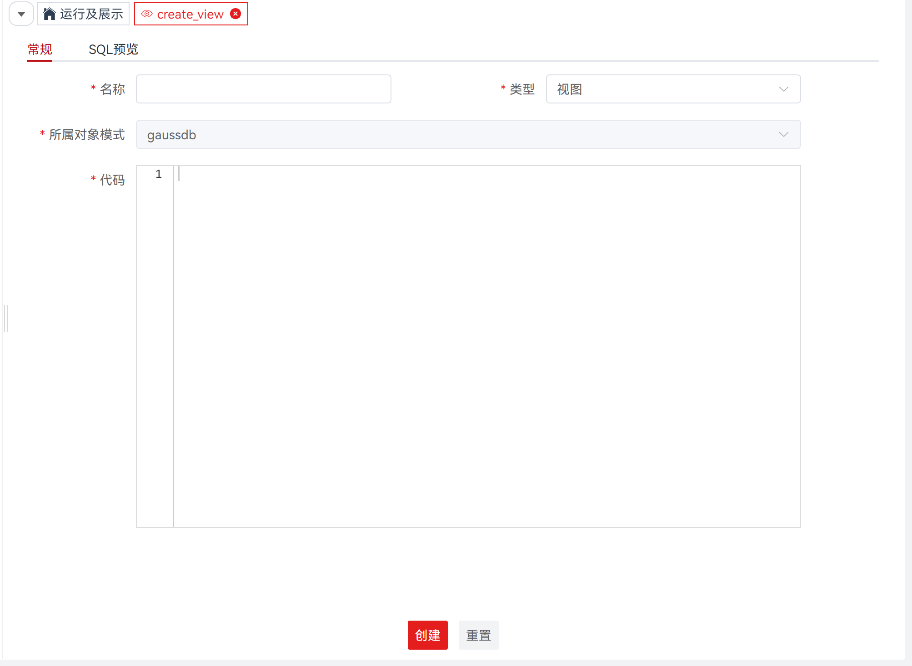

**步骤 3：** 选择 "**SQL预览**"，可基于创建视图的配置信息进行 SQL 预览。

​               **说明：** 若未填写 "**常规**" 必填项，将无法通过校验进入 "**SQL预览**" 界面。

​                         "**SQL预览**" 界面的编辑框仅支持查看，不支持编辑。

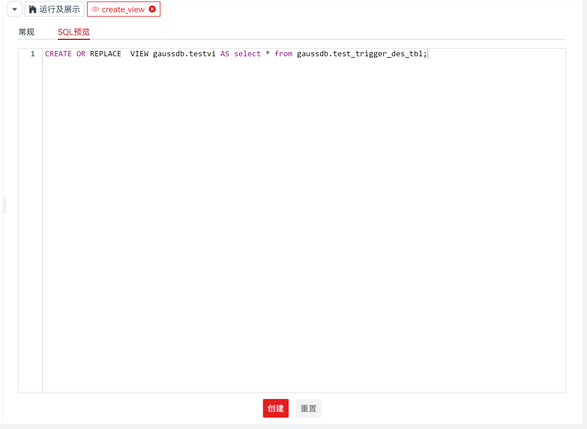


#### 5.5.2 删除视图

​	           执行以下步骤删除视图：

**步骤 1：** 在 "**数据库导航菜单**" 窗格中，右键单击数据库中的视图列表，选择 "**删除视图**"，弹出 "**删除视图**" 确认框。

**步骤 2：** 单击 "**确定**" 即可继续，或单击 "**取消**" 即可退出操作。

​               **说明：** 单击 "**确定**" 将删除并更新视图信息，此操作不可逆。

​                         单击 "**取消**" 即可退出本次对话框操作。


#### 5.5.3 查看视图

​            创建视图后，单击视图列表，支持查看该视图 DDL、一般、列、数据。

​            **说明**：当前显示数据仅在首次加载时自动获取，若需更新数据请点击刷新按钮。      

**查看 DDL**

​               执行以下步骤查看 DDL：

**步骤 1：** 在 "**数据库导航菜单**" 窗格中，单击视图列表，所选视图对应的4大维度内容，默认显示DDL。

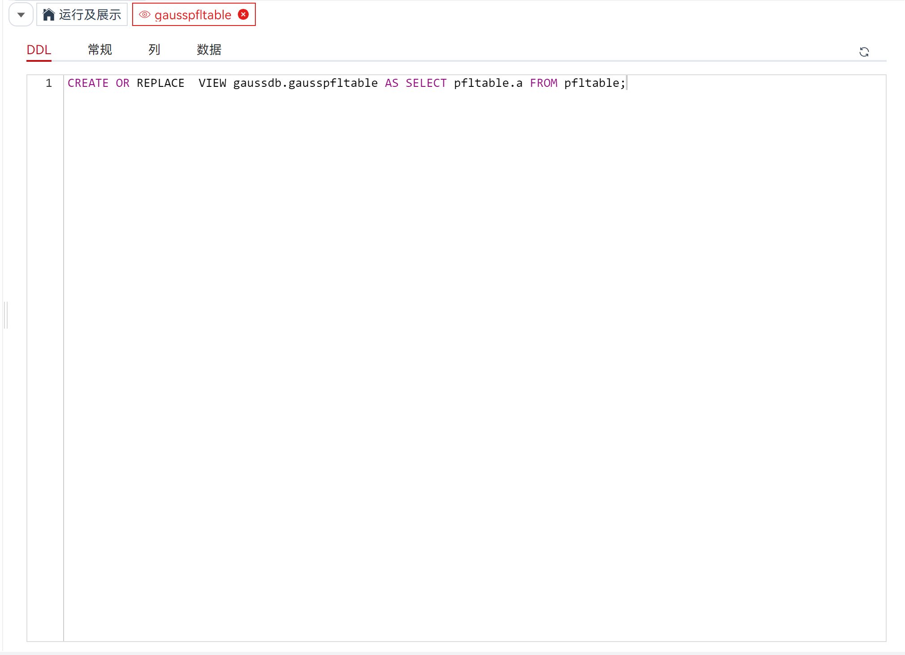


**查看常规**

​               执行以下步骤查看常规属性：

**步骤 1：** 在 "**数据库导航菜单**" 窗格中，单击视图列表，所选视图对应的4大维度内容，选中 "**常规**"。

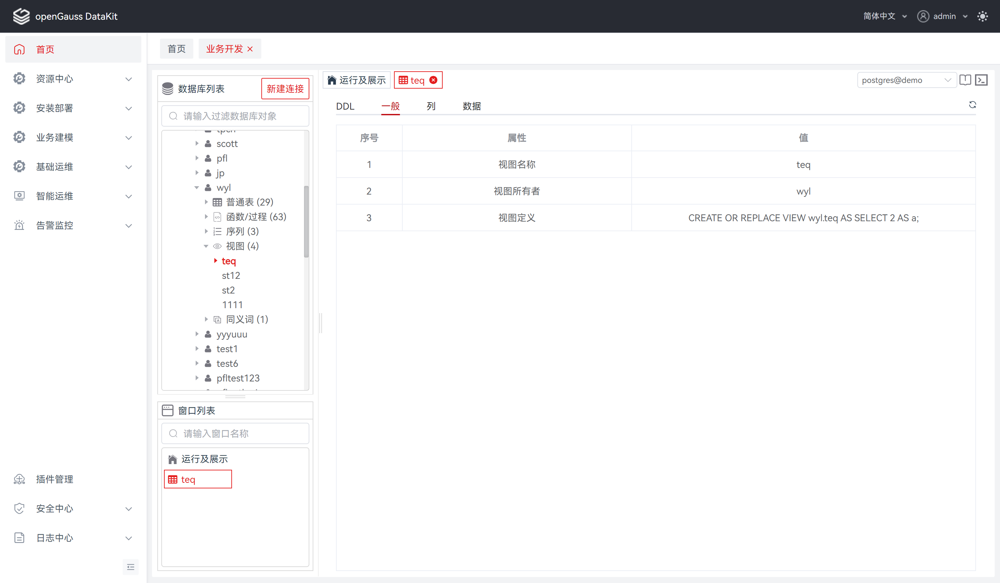


**查看列**

​               执行以下步骤查看列信息：

**步骤 1：** 在 "**数据库导航菜单**" 窗格中，单击视图列表，所选视图对应的4大维度内容，选中 "**列**"。

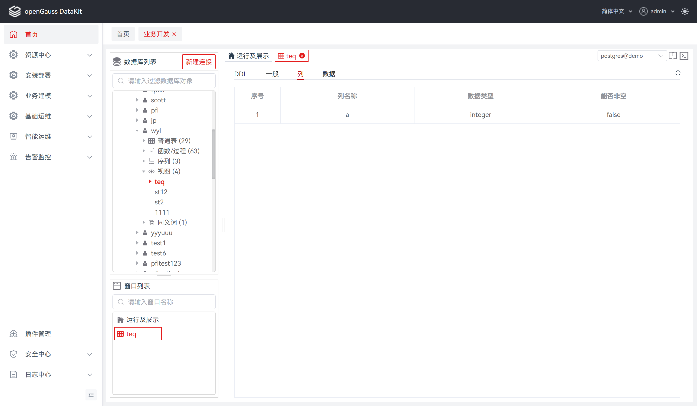


**查看数据**

​               执行以下步骤查看数据：

**步骤 1：** 在 "**数据库导航菜单**" 窗格中，单击视图列表，所选视图对应的4大维度内容，选中 "**数据**"。

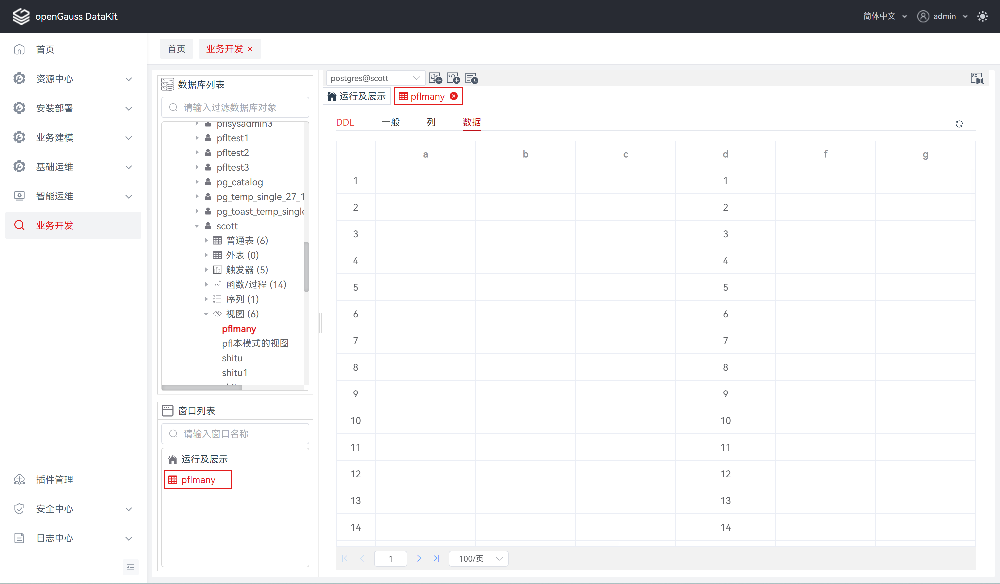


#### 5.5.4 编辑视图

​               执行以下步骤编辑视图：

**步骤 1：** 在 "**数据库导航菜单**" 窗格中，右键单击数据库中的视图名称，选择 "**编辑视图**"。 

**步骤 2：** 选择 "**基本**"，修改视图名称、所属对象模式、代码。设置如下参数。

| 配置项       | 是否支持编辑 | 配置说明                                                 |
| ------------ | ------------ | -------------------------------------------------------- |
| 名称         | 是           | 用于定义视图名称，默认数据回显                           |
| 类型         | 否           | 用于定义视图类型，类型分别为视图、物化视图，默认数据回显 |
| 所属对象模式 | 是           | 用于定于所属对象模式；默认数据回显                       |
| 代码         | 否           | 用于编写sql语句，默认数据回显                            |

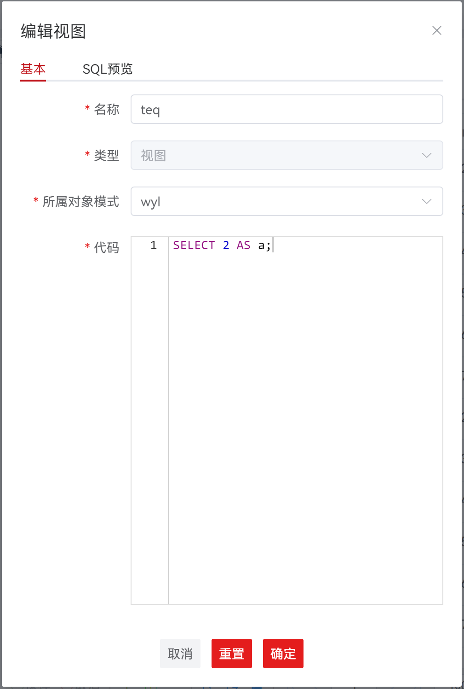


#### 5.5.5 导出视图 DDL

​               执行以下步骤导出视图 DDL：

**步骤 1：** 在 "**数据库导航菜单**" 窗格中，右键单击数据库中的视图名称，选择 "**导出 DDL**"。 

​                **说明：** 导出文件为 sql 文件。

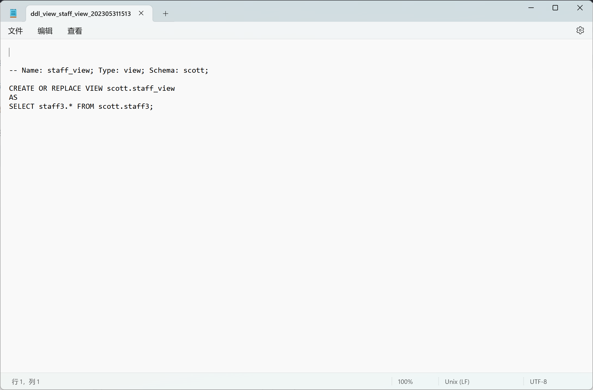


### 5.6 同义词

#### 5.6.1 创建同义词

​               执行以下步骤创建同义词：

**步骤 1：** 在 "**数据库导航菜单**" 窗格中，右键单击数据库中的 "**同义词**"，选择 "**创建同义词**"，跳转至 "**创建同义词**" 页面。

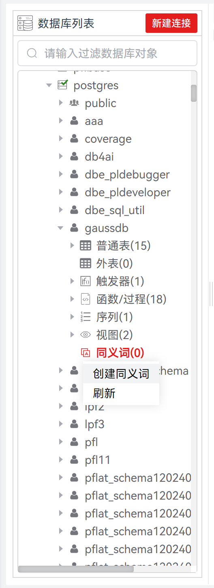

**步骤 2：** 选择 "**常规**"，设置如下参数，创建同义词。

​			   **说明：** 所有必选参数均需要填写。必填参数用星号（*）标识。

​			             单击 "**确定**" 将创建并保存更新后的同义词信息。

​                         单击 "**重置**" 即可重置 "**创建同义词**"对话框中的所有字段。

| 配置项           | 必填 | 配置说明                                                     |
| ---------------- | ---- | ------------------------------------------------------------ |
| 名称             | 是   | 用于定义同义词名称；默认为空                                 |
| 对象所有者       | 是   | 用于指定同义词归属者；默认为空，选项为所有用户模式           |
| 对象类型         | 是   | 用于指定同义词对象类型；默认为all，选项为all、函数/过程、视图、普通表 |
| 对象名称         | 是   | 用于指定同义词对象类型下的名；默认为空，选项为所选对象类型下的子项 |
| 替换已存在同义词 | 否   | 用于替换已存在的同义词；默认为关闭，即不替换                 |

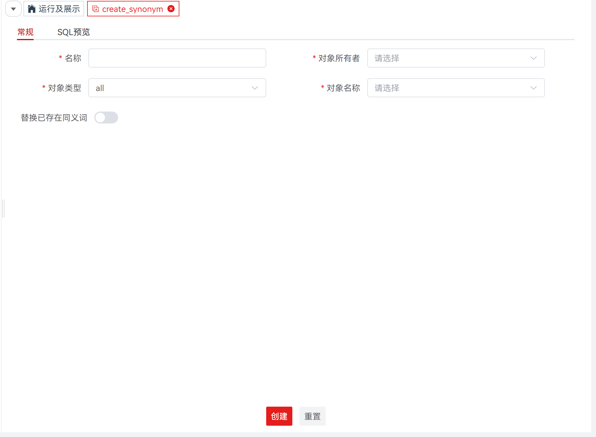

**步骤 3：** 选择 "**SQL预览**"，可基于创建同义词的配置信息进行 SQL 预览。

​               **说明：** 若未填写 "**常规**" 必填项，将无法通过校验进入 "**SQL预览**" 界面。

​                         "**SQL预览**" 界面的编辑框仅支持查看，不支持编辑。

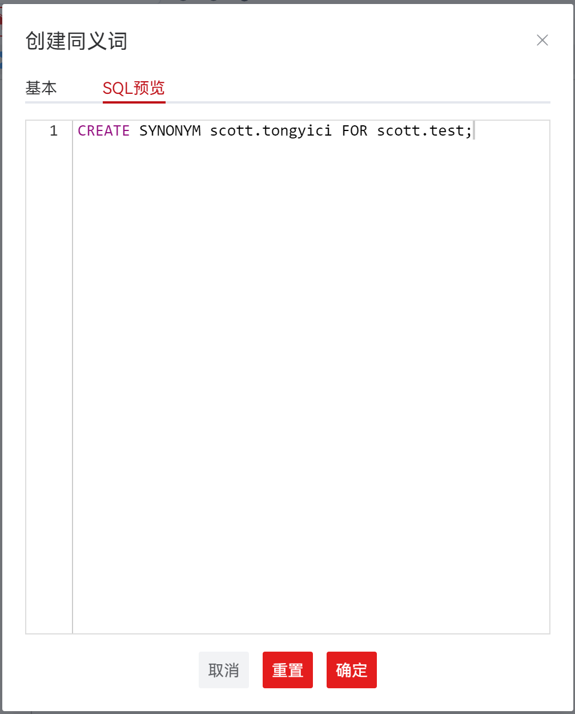


#### 5.6.2 删除同义词

​	           执行以下步骤删除同义词：

**步骤 1：** 在 "**数据库导航菜单**" 窗格中，右键单击数据库中的同义词列表，选择 "**删除同义词**"，弹出 "**删除同义词**" 确认框。

**步骤 2：** 单击 "**确定**" 即可继续，或单击 "**取消**" 即可退出操作。

​               **说明：** 单击 "**确定**" 将删除并更新同义词信息，此操作不可逆。

​                         单击 "**取消**" 即可退出本次对话框操作。


#### 5.6.3 查看同义词属性

​	           执行以下步骤查看同义词属性：

**步骤 1：** 在 "**数据库导航菜单**" 窗格中，单击同义词列表，将显示同义词属性。

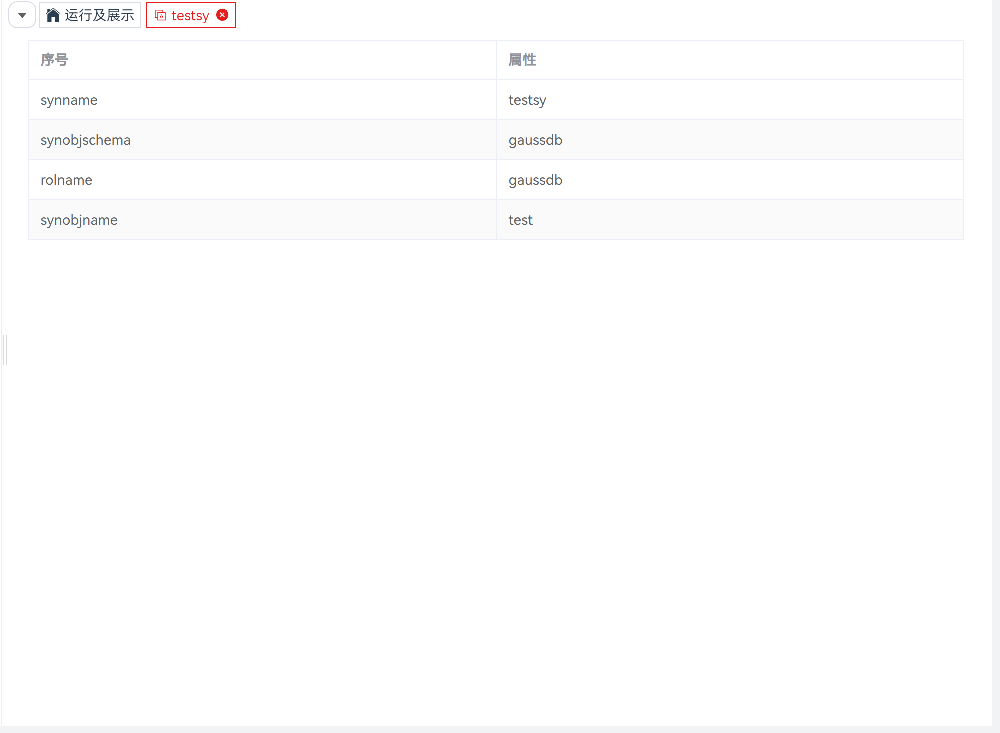


### 5.7 SQL 终端

#### 5.7.1 打开多个 "SQL 终端" 页签

​            可在页面中打开多个 “SQL 终端” 页签。通过该功能，可在当前 “SQL 终端”页签执行查询时使用多个 SQL 查询。 "SQL终端" 命名规则为：终端图标+数据库名+@+连接名称+(自增数)，如。

执行如下几个方式可打开新“SQL 终端”页签：

**方式1** ： 在页签栏的目标终端选择框中，选择目标终端，点击"新建终端"按钮，即可显示新的 "SQL终端" 页签。

​                **说明：** 目标终端的下拉选项值为所有连接中的数据库，默认为最近打开连接的数据库。

​                          

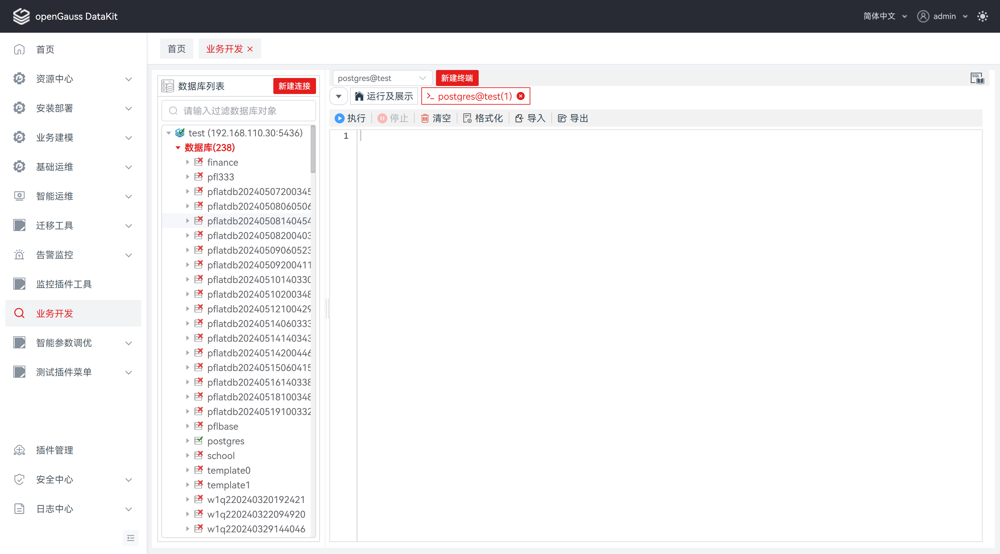

**方式2** ： 右键已连接的数据库节点，选择"打开新终端"，即可显示新的连接至当前数据库对象的"SQL终端" 页签。

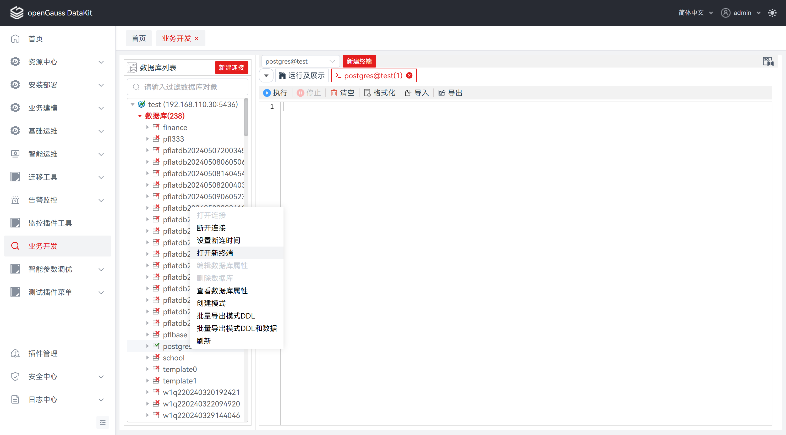

**方式3** ： 右键已存在的SQL终端页签，选择"打开新终端"，即可显示新的连接至当前数据库对象的"SQL终端" 页签。

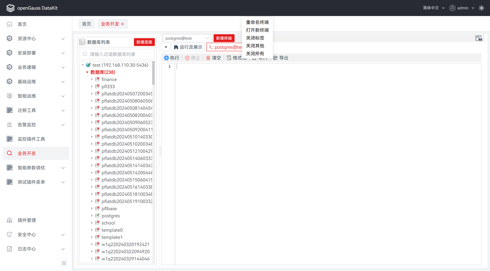


#### 5.7.2 使用 SQL 查询

##### 5.7.2.1 使用单条 SQL 查询

​               执行如下步骤，执行函数/过程或 SQL 查询：

**步骤** **1**：在 “SQL 终端” 页签输入函数/过程或 SQL 语句，单击 “SQL 终端” 页签的 "**执行**"。

**步骤** **2**：在 SQL 编辑器下方将出现结果栏。

​               **说明：** 结果栏分别由消息栏和结果集组成，默认显示结果集 "结果" 页面。

​                            结果集中的表数据列宽支持拖动调整。

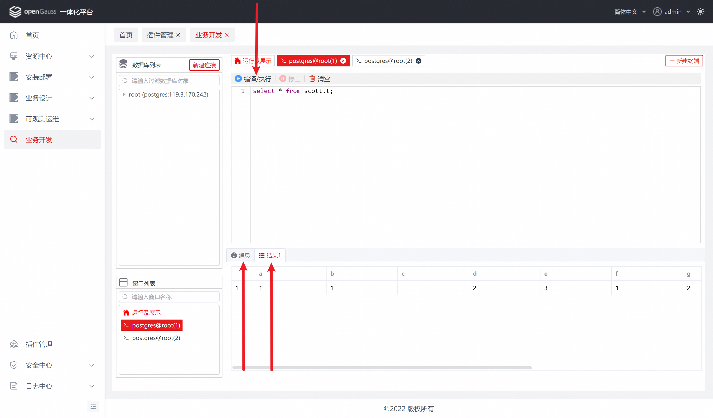


##### 5.7.2.2 执行多条 SQL 或函数/过程查询

​               执行以下步骤，执行多条函数/过程：

**步骤** **1**：在 “SQL 终端” 页签中，在函数/过程定义之后插入 “/” 。

**步骤** **2**：在下一行添加新的函数/过程语句。

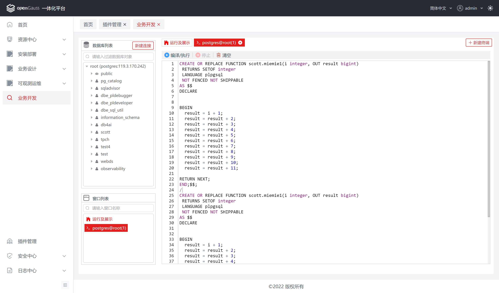

​              执行如下步骤执行多条 SQL 查询：

**步骤** **1**：在 “SQL终端” 页签中输入多个SQL查询，如下所示：

**步骤** **2**：在 “SQL终端” 页签中单击 "**执行**"。

​               **说明：** 默认显示结果集最后返回的 "结果" 页面，非最后执行语句对应的结果。

​                           支持同时查询多表，表数据的查询结果将以结果集的形式呈现，表数据列宽支持拖动调整，执行后将覆盖原先结果集。

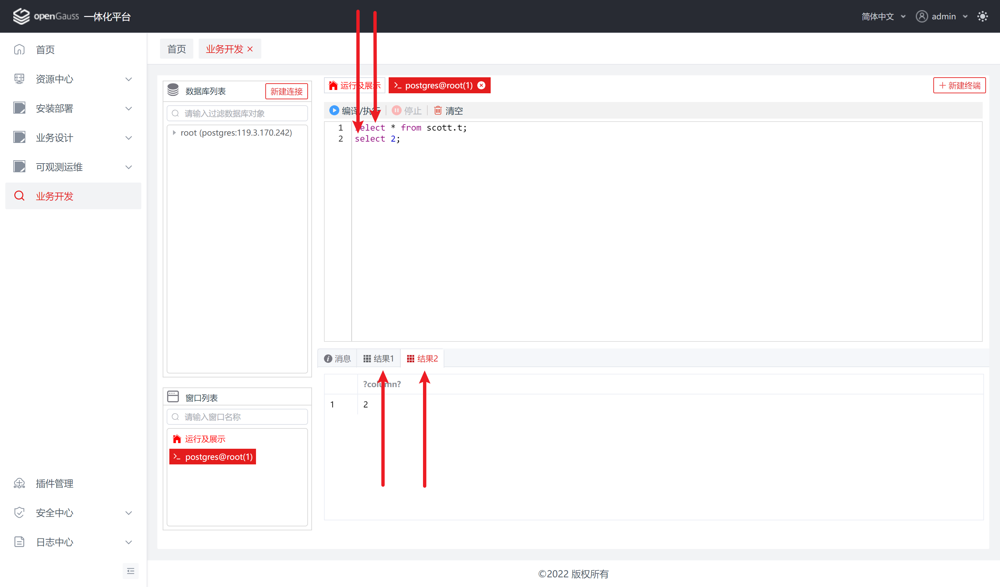


#### 5.7.3 使用 SQL 编辑器

##### 5.7.3.1 注释/取消注释

​            注释/取消注释选项用于注释或取消注释行或整段。

​                按照以下步骤在 “PL/SQL Viewer” 或 “SQL 终端” 中注释/取消注释行：

**步骤** **1**： 选择目标行。

**步骤** **2**：使用快捷键 “Ctrl+/” 单独注释/取消注释每个选中的行。


​                按照以下步骤在 “PL/SQL Viewer” 或 “SQL 终端” 中注释/取消注释整段：

**步骤** **1**： 选择目标行或整段内容。

**步骤** **2**：使用快捷键 “Ctrl+/” 单独注释/取消注释选中的行或整段内容。

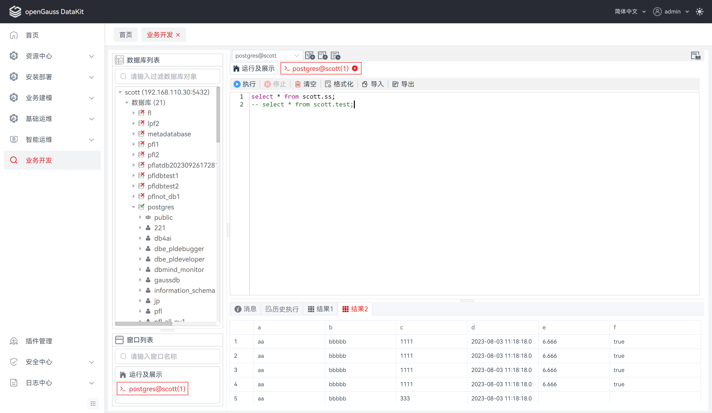


##### 5.7.3.2 插入空格/取消插入空格

​            按照以下步骤在 “PL/SQL Viewer” 或 “SQL 终端” 中缩进/取消缩进：

**步骤 1**： 选中目标行。

**步骤 2**： 按下 Tab 键缩进，按下 “Shift+Tab” 键取消缩进。

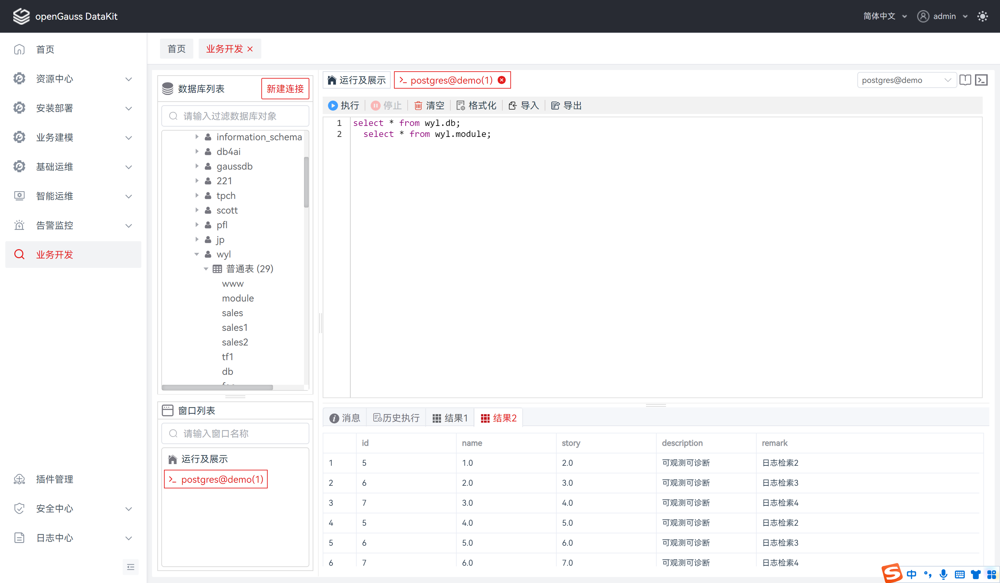


##### 5.7.3.3 清空

​            按照以下步骤在  “SQL 终端” 中清空执行语句：

**步骤 1**： 在工具栏中单击 "**清空**"。


##### 5.7.3.4 格式化

​            按照以下步骤在  “SQL 终端” 中格式化执行语句：

**步骤 1**： 选择需要格式化的SQL语句。

**步骤 2**： 在工具栏中单击 "**格式化**"。

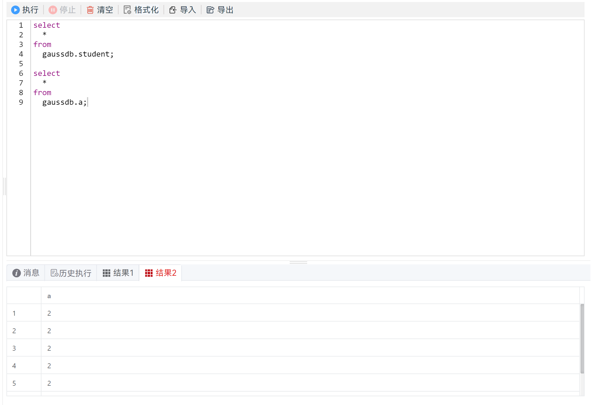


##### 5.7.3.5 导入

​            按照以下步骤在  “SQL 终端” 中导入 sql 语句：

**步骤 1**： 在工具栏中单击 "**导入**"，打开文件选择窗口。

**步骤 2**： 选择 .sql 文件并点击 "**打开**"，若当前 "SQL终端" 不存在执行语句，将直接导入所选文件中的 sql 语句；若当前 "SQL终端" 存在执行语句，将弹出选择 "**覆盖**" 或 "**附加**" 的选择窗口，点击确定，将根据用户所选操作导入所选文件中的 sql 语句。

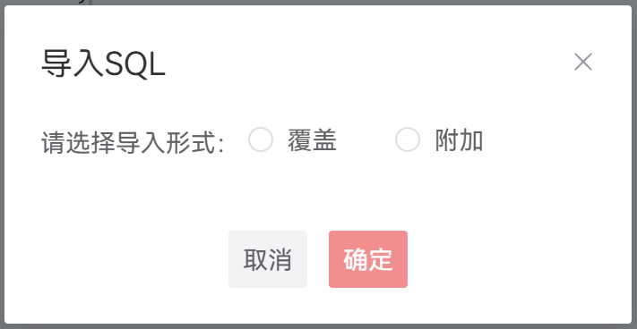


##### 5.7.3.6 导出

​            按照以下步骤在  “SQL 终端” 中导出 sql 语句：

**步骤 1**： 在工具栏中单击 "**导出**"，直接导出当前 "SQL终端" 的所有执行语句；若要导出当前 "SQL终端" 中的指定语句，在选中语句后单击 "**导出**" 即可。

​                **说明：** 导出文件为 sql 文件。

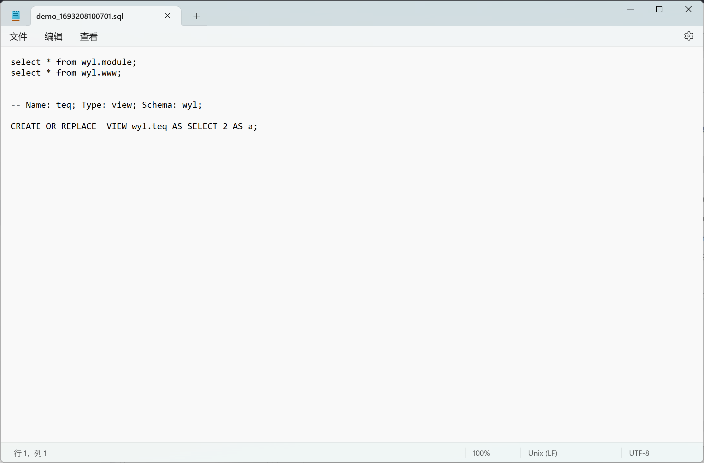


#### 5.7.4 重命名 SQL 终端

​            执行以下步骤重命名 SQL 终端：

**步骤** **1**： 在 "SQL 终端"页中，右键页签，选择 "**重命名终端**"，弹出 "**重命名终端**" 对话框。

**步骤** **2**： 填写终端新名称，单击 "**确定**" 即可继续，或单击 "**取消**" 即可退出操作。

​                **说明：** 修改终端页签名称，所修改的名称仅本次登录显示，不做保存。

​                             仅新建的SQL终端支持修改终端名称，首页中 “运行及展示” 页签不支持重命名。

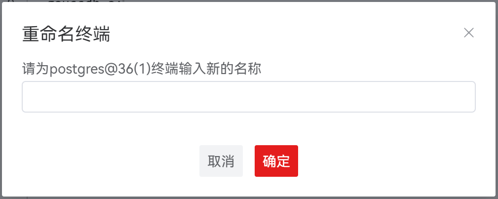


#### 5.7.5 SQL 助手

​            SQL 助手为用户在使用 SQL 终端和使用函数/过程中输入信息提供建议或参考。                

​                执行以下步骤打开 SQL 助手：

**步骤** **1**： 在任意页中，单击 ，右侧打开 "**SQL助手**" 窗口。

​                **说明：** 用户可以从 SQL 语法、操作维度使用该手册，语法。

**步骤** **2**： 选择 "**语法**" 项，将显示 openGauss SQL 语法，点击指定语法可查看详情，包括注意事项、示例、语法、函数和参数说明。

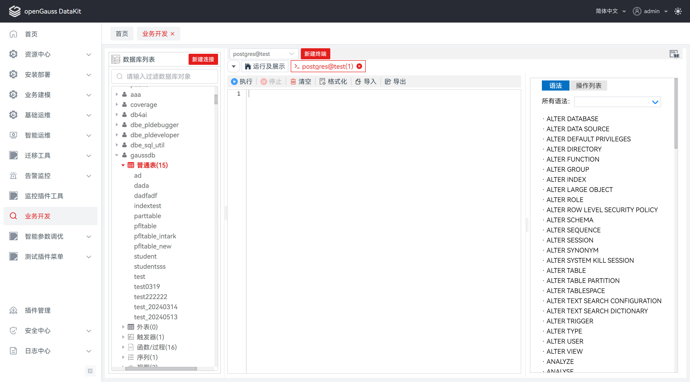

​                选择 "**操作列表**" 项，用户可以基于功能维度、场景维度、操作维度快速找到所需执行的语句。

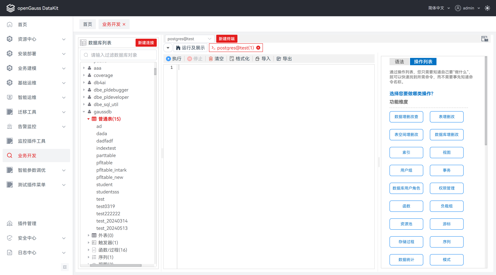


#### 5.7.6 SQL 查询执行历史

​            SQL 查询执行历史支持查看和管理频繁执行的 SQL 查询。SQL 查询执行历史只保存在 “SQL 终端” 页签中。      

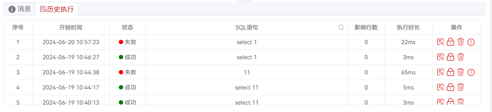          

​                执行以下步骤打开 SQL 查询执行历史：

**步骤** **1**： 在 “SQL 终端” 中，选择 "**历史执行**" 项。页面内容包含如下字段：

| **字段** | **字段说明**                                                 |
| -------- | ------------------------------------------------------------ |
| 序号     | 执行历史记录的序号                                           |
| 开始时间 | SQL查询的开始时间                                            |
| 状态     | SQL查询的执行状态：  |
| SQL语句  | SQL查询的执行语句                                            |
| 影响行数 | SQL操作所影响的行数                                          |
| 执行时间 | SQL查询的执行耗时，单位：ms                                  |
| 操作     | 预览SQL语句弹窗、锁定/取消锁定、删除、错误信息 |

**步骤** **2**： 选择 ，打开 SQL 语句预览弹窗，用于查看当前执行操作的 SQL 语句。

​                **说明：** 单击 "**加载至终端**" 将追加当前执行SQL语句至SQL编辑器中。

​                            单击 "**复制**" 将复制当前执行SQL语句，以便进行后续的粘贴操作。

​                            单击 "**取消**" 将关闭SQL语句预览弹窗。

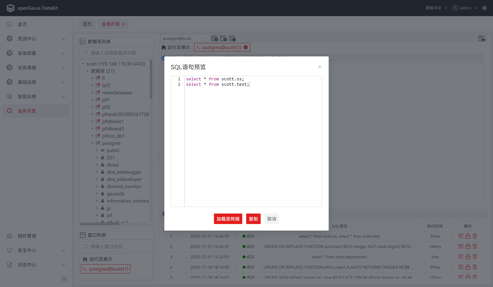

**步骤** **3**： 选择  / ，锁定 / 解锁当前执行 SQL 操作记录，用于置顶 / 取消置顶当前执行操作的 SQL 语句。

​                 **说明：**锁定：单击按钮可将当行记录锁定，锁定后置顶当行记录并置灰，序号前新增图标，不支持删除操作。

​                            取消锁定：单击按钮可将当行记录取消锁定，取消锁定后取消当行记录置顶状态，取消图标，支持删除操作。

​                            同一平台用户所操作的执行历史记录最多锁定50条，超出将显示提示语句。

**步骤** **4**： 选择 ，单击按钮将弹出确认删除弹窗，确认后可将当行记录删除，该删除操作不可逆。

**步骤** **5**：  选择 ，单击按钮将弹出错误信息弹窗。

​                **说明：** 单击 "**复制**" 将复制当前错误信息，以便进行后续的粘贴操作。

​                            单击 "**取消**" 将关闭错误信息弹窗。

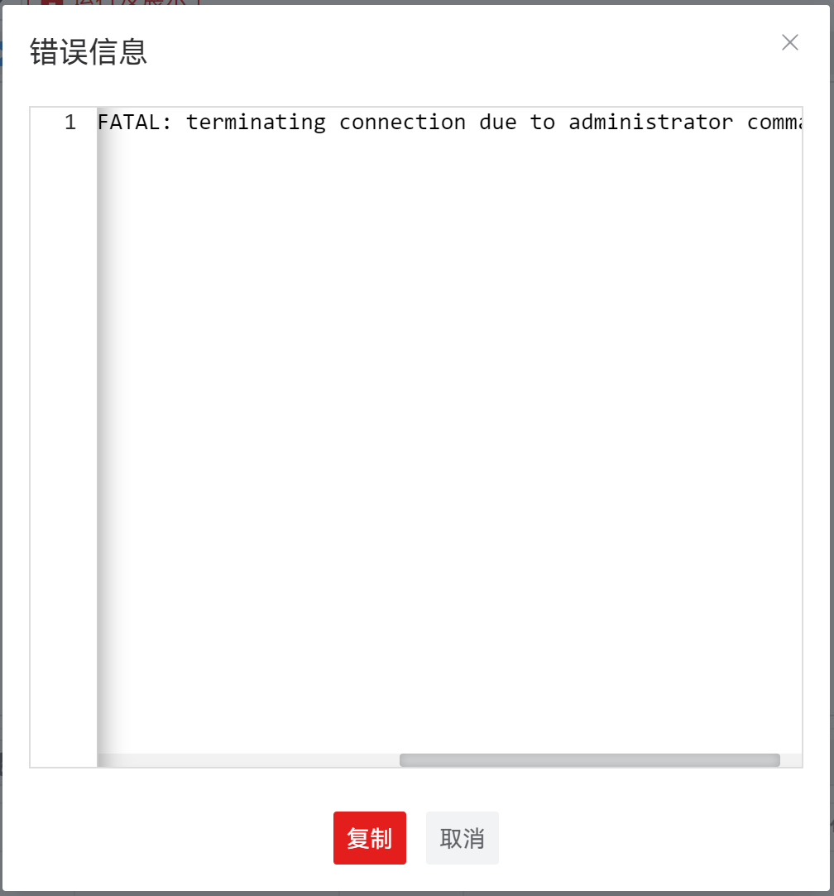

### 5.8 函数/过程

​            函数/过程支持创建函数/过程、使用函数/过程、调试函数/过程、覆盖率统计。

​         **说明：** package 包中函数/过程支持调试，不支持修改，调试详见 **5.8.3 调试函数/过程/匿名块**。

​                      函数/过程下的package包名、函数/过程名称不可相同，不同package包下的函数/过程名称可以相同。

#### 5.8.1 创建函数/过程

​            执行如下步骤创建函数、过程和 SQL 函数：

**步骤 1**：在 "**数据库导航菜单**" 窗格中，右键单击数据库中的 "**函数/过程**"，按照要求选择“**创建函数**”、“**创建过程**”、“**创建** **SQL** **函数**”、"**匿名块**"。

​              将在新页签中显示所选模板。

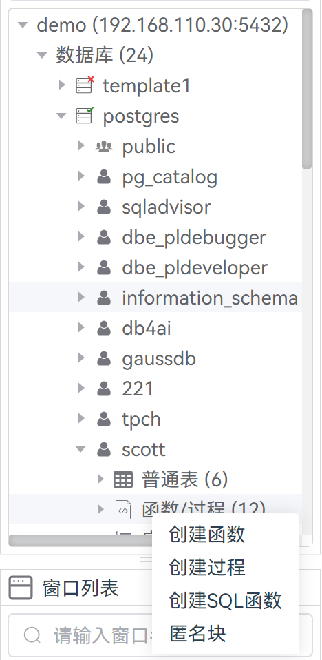

**步骤 2**：选择 “**创建函数**” 。系统打开新的页签。

**步骤 3**：编辑代码。

**步骤 4**：右键单击 "编译"，编译该过程。

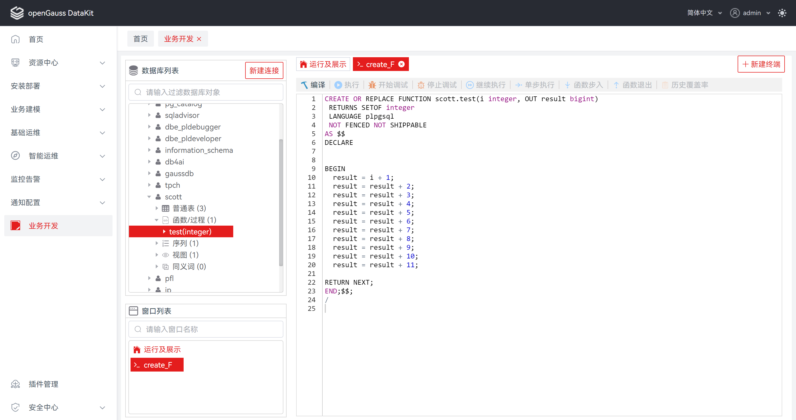

**步骤 5**：编译成功，该创建的函数将被保存。

​               状态栏需要刷新才能显示已完成操作的状态。


#### 5.8.2 使用函数/过程

##### 5.8.2.1 执行函数/过程

​              执行如下步骤执行 PL/SQL 程序或 SQL 函数：

**步骤** **1**：双击打开 PL/SQL 程序或 SQL 函数。

**步骤** **2**：在工具栏单击 "执行"。

**步骤** **3**： 若该 PL/SQL 程序或 SQL 函数需要入参，则弹出的 “**调试函数/过程**” 对话框提示您输入信息。

**步骤 4**：填写入参后，点击 "确定" ，即可执行该 PL/SQL 程序或 SQL 函数。


##### 5.8.2.2 删除函数/过程

​               执行如下步骤删除函数/过程或 SQL 函数对象：

**步骤** **1**：在 "**数据库导航菜单**" 窗格中，右键单击数据库中的函数/过程对象，选择 “**删除函数/过程**” 。

**步骤** **2**：提示确认该操作窗口中，单击 “**是**” 完成该操作。


##### 5.8.2.3 导出函数/过程 DDL

​               执行以下步骤导出函数/过程 DDL：

**步骤 1：** 在 "**数据库导航菜单**" 窗格中，右键单击数据库中的函数/过程名称，选择 "**导出 DDL**"。 

​                **说明：** 导出文件为 sql 文件。

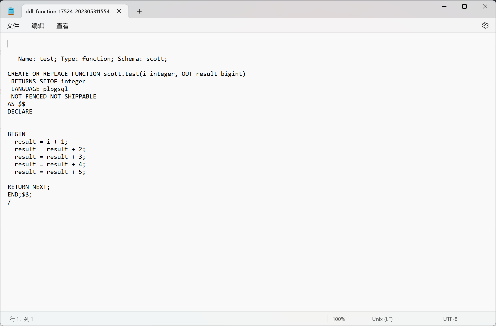


#### 5.8.3 调试函数/过程/匿名块

​	        调试操作期间，如果连接丢失，但数据库导航菜单中仍存在该数据库连接，建议刷新浏览器并重启调试操作。

​            **说明：** SQL 语言函数不支持调试操作，仅 plpgsql 语言支持调试操作。

**package 包**

​           支持修改与查看package中的源码：点击右键package包，点击【查看源码】，在package 源码中，支持修改，不支持调试。

​           支持调试 package 包内的函数/过程，不支持修改（编辑器为查看状态），调试操作详见 **5.8.3.1 使用断点 - 5.8.3.2 控制执行**。


**匿名块**

​        函数/过程调试左键点击左侧连接中对应的函数/过程，进行调试。匿名块调试右键点击连接下的函数/过程父目录，然后左键点击“**匿名块**”，进行匿名块编辑/调试。调试操作详见 **5.8.3.1 使用断点 - 5.8.3.2 控制执行**。


##### 5.8.3.1 使用断点

​	断点用于暂停其所在行中的 PL/SQL 程序的执行，可用断点控制执行并调试过程。

- 设置并启用断点后，PL/SQL 程序会在该断点所在的行停止执行，此时用户可以进行其他调试操作。支持以下断点操作：
  - 为某行设置或创建断点。
  - 启用或禁用某行的断点。
  - 删除某行的断点。
- 禁用断点后，PL/SQL 程序不会在断点处暂停执行。

​			   执行如下步骤调试 PL/SQL 程序：

**步骤** **1**：在需要 PL/SQL 程序暂停执行的行设置断点。

**步骤** **2**：启动调试会话。

​			   达到断点所在行时，监视调试窗口中应用程序的状态，然后继续执行程序。

**步骤** **3**： 关闭调试会话。


**使用 "断点" 窗格**

​	            在 “**断点**” 窗格中可查看已有断点。

​	           “**断点**” 窗格会列出每一个断点所在行的行号、调试对象的名称以及断点是否可用。

​	           在 “**断点**” 窗格中，勾选断点复选框，可以进行断点启用、禁用操作。

​               **说明：** 禁用断点后，程序不会在该断点处暂停执行，但该断点仍会保留（以备将来启用）。


**设置或添加断点**

​			   执行以下步骤在某行中添加断点：

**步骤** **1**：打开需要添加断点的 PL/SQL 函数。

**步骤** **2**：步骤在“**PL/SQL Viewer**”窗格中，双击行号字段左侧，设置断点，断点标志 [] 表示操作成功。

​              **说明：** 如果函数在调试过程中不会间断或停止执行，则说明其设置的断点不会生效。


**启用或禁用断点**

​	          设置断点后，再次单击断点，暂时禁用该断点[]。“**PL/SQL Viewer**”窗格中，禁用的断点的状态列显示断点的状态为 禁用。

​              若要启用已禁用的断点，再次单击对应断点。


**删除断点**

​              用户可删除不再使用的断点。其方法与断点创建的方法相同，双击行号字段左侧的断点即可。


**使用断点测试 PL/SQL 程序**

​               执行以下步骤使用断点测试 PL/SQL 程序：

**步骤** **1**：打开 PL/SQL 程序，在要调试的行创建断点。

**步骤** **2**：在弹出的 “**函数执行入参**” 对话框中，输入参数信息。

​              **说明：** 如果无需输入参数，则 “**函数执行入参**” 对话框不会弹出。


**步骤** **3**：输入信息，单击 “**确定**” 。

​              可以看到箭头指向断点所在行[]，同时所在行高亮。箭头所指的行号，即为继续执行程序时的起始行号。

​              **说明：** 用户可继续执行、单步执行跳过代码。


**步骤** **4**：单击 继续执行至下一断点（如有）。“结果” 页签中显示执行 PL/SQL 程序的结果， “调用堆栈” 和 “变量” 窗格将被清除。


##### 5.8.3.2 控制执行

​	    本节描述控制调试执行相关操作。

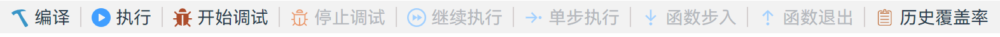

**开始调试**

​	    在 “**数据库导航菜单**” 窗格中选择需调试的函数。单击工具栏中的 "**开始调试**"。

​       如果没有设置断点，或者设置的断点无效，则不会停止任何语句、进行调试操作，而仅会执行对象并显示结果（如有）。


**继续执行 PL/SQL 函数**

​		调试执行函数时，用户可使用工具栏中 “**继续执行**”。通过进行断点间控制，可逐行调试程序。“**继续执行**” 是指从一个断点跳到下一个断点。断点执行一条语句后，可以在其他调试窗口中查看执行结果。


**单步执行 PL/SQL 函数**

​	    调试执行函数时，用户可使用工具栏中 “**单步执行**”。通过进行单步控制，可逐行调试程序。如果进行单步操作时遇到断点，则该单步操作会停止，程序也会暂停执行。“**单步**” 是指一次执行一条语句。单步执行一条语句后，可以在其他调试窗口中查看执行结果。


**步入 PL/SQL 函数(step in)**

​		在主函数调试程序中调试执行子函数时，用户可使用工具栏中 “**函数步入**”。操作 "**函数步入**"，自动打开新的子函数窗口，可对子函数进行逐行调试程序。子函数窗口仅支持 "**继续执行**"、"**单步执行**"、"**进入函数**"、"**退出函数**"。


​        **说明：** 进入子函数后，主函数的操作栏除 "停止调试" 启用状态外，其余操作均为禁用状态。


**退出 PL/SQL 函数(step out)**

​		调试执行子函数时，用户可使用工具栏中 “**函数退出**”。步入函数，打开新的子函数窗口对子函数进行逐行调试程序。子函数窗口仅支持 "**继续执行**"、"**单步执行**"、"**进入函数**"、"**退出函数**"。


**查看调用堆栈信息**

​		“**调用堆栈**” 窗格展示调用过程时的堆栈信息。


**停止调试**

​		单击工具栏中的 "**停止调试**"，即可终止调试。


##### 5.8.3.3 查看堆栈信息

​         使用时，可通过一些调试窗口查看调试信息。本节介绍可用于检查调试信息的操作：

**变量操作**

​		“**变量**” 窗格用于监视信息或估算值。可从小化窗口窗格中打开 “**变量**” 窗格。通过这个窗格，可以估算或者修改 PL/SQL 过程中的变量或参数。执行代码时，一些本地变量可能被修改，值发生变化的参数会出现黄色标记，可以通过 “**变量**” 窗格观察参数的变化。


**查看结果**

​		“**结果**” 页签显示 PL/SQL 调试会话的结果。只有出现执行 PL/SQL 程序的结果时，“**结果**” 页签才会自动弹出。

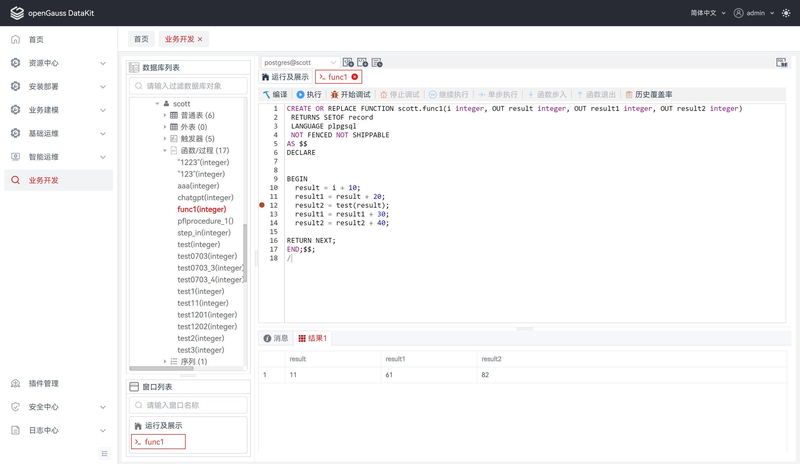


#### 5.8.4 覆盖率统计

​	        本节介绍在执行调试函数/过程操作后，如何使用函数历史调试结果统计功能。覆盖率统计基于函数或存储过程调试时被汇总至 coverage.proc_coverage 表的数据（执行到的行号、执行行数百分比等信息）提取到覆盖率历史表，且可对记录进行删除或导出为html 文件的报告。

​            **说明：** 仅 opengauss 3.0 及以上版本数据库支持调试函数或存储过程。

​                        仅 opengauss 5.1.0 b011及以上版本数据库支持查看 coverage.proc_coverage 表。

​                        仅调试前将参数 [enable_proc_coverage ](https://docs-opengauss.osinfra.cn/zh/docs/latest/docs/DatabaseReference/其它选项.html#section14683125861213)为on时才会将函数或存储过程调试记录存储至 coverage.proc_coverage 表，且仅特定用户（初始用户和 monadmin 用户）有访问权限。

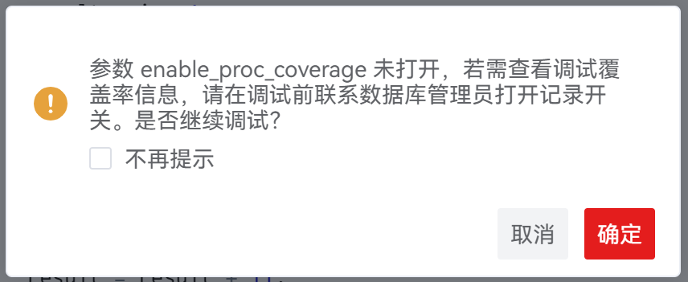

##### 5.8.4.1 显示覆盖率

​             按照 5.8.3 调试函数/过程后，点击图标，弹出覆盖率信息。


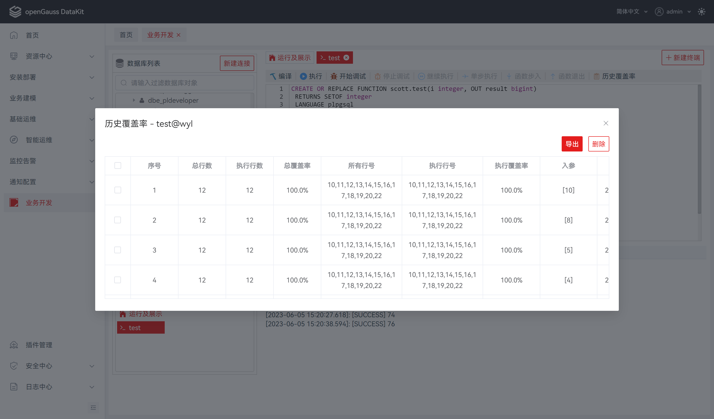


##### 5.8.4.2 导出覆盖率报表

​			 选中需要查看的调试记录，点击 "**导出**"  ，导出 html 文件。

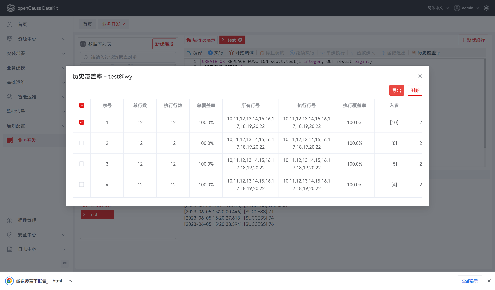

​           打开所导出的函数覆盖率报告文件，显示内容包含执行语句及调试信息列表，具体如图：

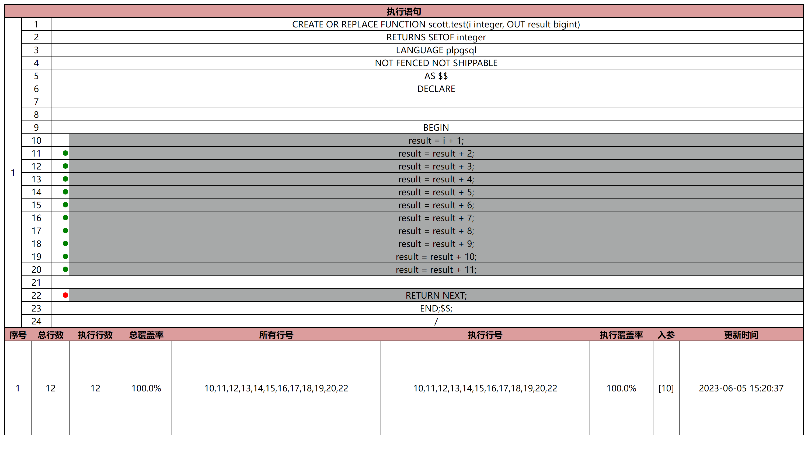

​            **说明：** 调试信息系统会自动在“数据库--public--普通表”中生成his_coverage中。

| **字段**   | **说明**                       |
| ---------- | ------------------------------ |
| 序号       | 用于展示覆盖率执行记录序号     |
| 总行数     | 用于展示执行函数过程的总行数   |
| 执行行数   | 用于展示执行函数过程的执行行数 |
| 总覆盖率   | 用于展示执行函数过程的总覆盖率 |
| 所有行号   | 用于展示函数过程所有行号       |
| 执行行号   | 用于展示执行函数过程执行行号   |
| 执行覆盖率 | 用于展示执行函数过程执行覆盖率 |
| 入参       | 用于展示执行函数过程入参       |
| 更新时间   | 用于展示执行函数过程执行时间   |


##### 5.8.4.3 删除覆盖率记录

​			 选中需要删除的调试记录，点击 "**删除**"  ，即可删除所选调试记录。


### 5.9 数据库

#### 5.9.1 创建数据库

​               执行如下步骤创建数据库：

**步骤 1：** 在 "**数据库导航菜单**" 窗格中，右键单击连接名称下的 "**数据库**" ，选择 "**创建数据库**" ，弹出 "**创建数据库**" 对话框。 

​               **说明：** 只有当至少存在一个已建立的连接时才能执行此操作。

**步骤 2：** 设置如下参数，创建数据库连接。

​			    **说明：** 所有必选参数均需要填写。必填参数用星号（*）标识。

| 配置项     | 必填 | 配置说明                                                     |
| ---------- | ---- | ------------------------------------------------------------ |
| 数据库名称 | 是   | 用于定义数据库名称，默认为空                                 |
| 数据库编码 | 是   | 用于配置数据库编码，默认为 UTF-8；通用选项为：UTF-8、GBK、LATIN1、SQL_ASCII |
| 兼容类型   | 是   | 用于配置兼容的数据库的类型，默认为 A，即表示兼容 O；通用选项为：A、B、C、PG，分别表示兼容O、MY、TD和POSTGRES |
| 排序规则   | 否   | 用于配置数据库的排序规则，默认为空，后端使用模板数据库template0的字符类型en_US.UTF-8；通用选项为：C、POSIX、en_US.UTF-8 |
| 字符类型   | 否   | 用于配置数据库的字符类型，默认为空，后端使用模板数据库template0的字符类型en_US.UTF-8；通用选项为：C、POSIX、en_US.UTF-8 |
| 连接限制   | 是   | 用于配置数据库可以接受的并发连接数，默认为-1，表示无限制；取值范围：>=-1的整数，建议填写1~50的整数 |
| 连接数据库 | 否   | 用于是否在创建数据库成功后打开该数据库连接，默认为关闭       |


#### 5.9.2 断开所有连接

​               执行如下步骤断开某一连接下的所有数据库：

**步骤 1：** 在 "**数据库导航菜单**" 窗格中，右键单击连接名称，选择 "**断开所有连接**" ，弹出 "**断开所有连接**" 确认框。 

​               **说明：** 该操作仅能在已连接的数据库上执行。

**步骤 2：** 单击 "**确定**" 即可继续，或单击 "**取消**" 即可退出操作。

​               **说明：** 单击 "**确定**" 将断开当前连接下的所有数据库的连接，操作成功后将更新当前连接状态。

​                         单击 "**取消**" 即可退出本次对话框操作。


#### 5.9.3 打开连接

​               执行如下步骤打开数据库连接：

**步骤 1：** 在 "**数据库导航菜单**" 窗格中，右键单击数据库中的数据库名称，选择 "**打开连接**"，操作成功后将更新数据库连接状态。 

​               **说明：** 该操作仅能在断连的数据库上执行。


#### 5.9.4 断开连接

​               执行如下步骤断开数据库连接：

**步骤 1：** 在 "**数据库导航菜单**" 窗格中，右键单击数据库中的数据库名称，选择 "**断开连接**"，弹出 "**断开连接**" 确认框。 

​               **说明：** 该操作仅能在已连接的数据库上执行。

**步骤 2：** 单击 "**确定**" 即可继续，或单击 "**取消**" 即可退出操作。

​               **说明：** 单击 "**确定**" 将断开当前数据库的连接，操作成功后将更新当前连接状态。

​                         单击 "**取消**" 即可退出本次对话框操作。


#### 5.9.5 编辑数据库属性

​               执行如下步骤编辑数据库属性：

**步骤 1：** 在 "**数据库导航菜单**" 窗格中，右键单击数据库中的数据库名称，选择 "**编辑数据库属性**"，弹出 "**编辑数据库属性**" 对话框。 

​               **说明：** 该操作仅能在断连的数据库上执行。

**步骤 2：** 设置如下参数，编辑数据库属性。

​                 **说明：** 所有必选参数均需要填写。必填参数用星号（*）标识。

| 配置项     | 是否支持修改 | 必填 | 配置说明                                                     |
| ---------- | ------------ | ---- | ------------------------------------------------------------ |
| 数据库名称 | 是           | 是   | 用于定义数据库名称，默认为回显数据                           |
| 数据库编码 | 否           | 是   | 用于配置数据库编码，默认为回显数据；通用选项为：UTF-8、GBK、LATIN1、SQL_ASCII |
| 兼容类型   | 否           | 是   | 用于配置兼容的数据库的类型，默认为回显数据；通用选项为：A、B、C、PG，分别表示兼容O、MY、TD和POSTGRES |
| 排序规则   | 否           | 否   | 用于配置数据库的排序规则，默认为回显数据；通用选项为：C、POSIX、en_US.UTF-8 |
| 字符类型   | 否           | 否   | 用于配置数据库的字符类型，默认为回显数据；通用选项为：C、POSIX、en_US.UTF-8 |
| 连接限制   | 是           | 否   | 用于配置数据库可以接受的并发连接数，默认为回显数据；取值范围：>=-1的整数，建议填写1~50的整数 |
| 连接数据库 | 是           | 否   | 用于是否在创建数据库成功后打开该数据库连接，默认为关闭       |


#### 5.9.6 删除数据库

​               执行如下步骤删除数据库：

**步骤 1：** 在 "**数据库导航菜单**" 窗格中，右键单击数据库中的数据库名称，选择 "**删除数据库**"，弹出 "**删除数据库**" 确认框。 

​               **说明：** 该操作仅能在断连的数据库上执行。

**步骤 2：** 单击 "**确定**" 即可继续，或单击 "**取消**" 即可退出操作。

​               **说明：** 单击 "**确定**" 将删除并更新连接信息，此操作不可逆。

​                          单击 "**取消**" 即可退出本次对话框操作。


#### 5.9.7 查看数据库属性

​               执行如下步骤查看数据库属性：

**步骤 1：** 在 "**数据库导航菜单**" 窗格中，右键单击数据库中的数据库名称，选择 "**查看数据库属性**"，对话框将显示所选数据库的属性。 

​               **说明：** 该操作仅能在已连接的数据库上执行。


#### 5.9.8 打开新终端

​               执行如下步骤打开新终端：

**步骤 1：** 在 "**数据库导航菜单**" 窗格中，右键单击数据库中的数据库名称，选择 "**打开新终端**"，新终端将连接目标数据库。 

​               **说明：** 该操作仅能在已连接的数据库上执行。

​                           "**打开新终端**" 连接至目标数据库，"**新建终端**" 的终端默认连接详见 **5.7.1** 。


#### 5.9.9 设置数据库断连时间

​               执行如下步骤设置数据库断连时间：

**步骤 1：** 在 "**数据库导航菜单**" 窗格中，右键单击数据库中的数据库名称，选择 "**设置断连时间**"，弹出 "**设置数据库自动断连时间**" 对话框。 

​               **说明：** 默认 2 小时内用户未执行数据库操作将自动断开，取值区间为 2 ~ 24 的正整数。

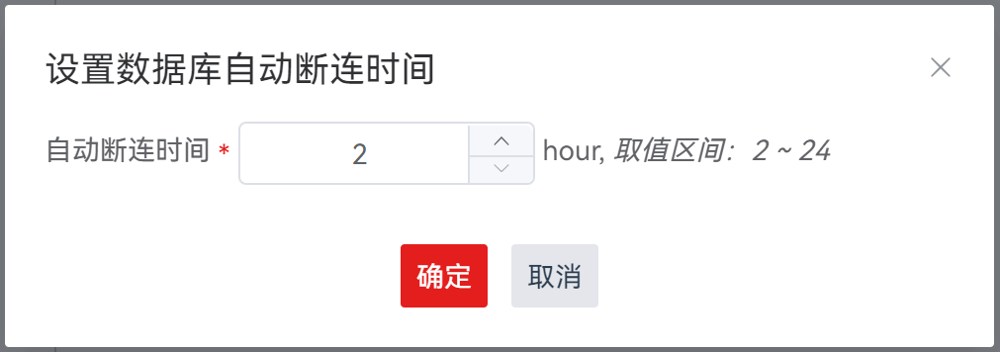


#### 5.9.10 数据库连接失效重连

​               数据库连接失效重连功能可在数据库连接失效后，通过用户再次执行数据库操作时根据建立数据库连接时口令保存情况，重新建立数据库连接。在执行管理数据库对象等操作时，通过当前数据库状态判断并做出不同的交互操作：

| 数据库连接状态                                   | 界面显示                             |
| ------------------------------------------------ | ------------------------------------ |
| 数据库正常连接时                                 | 正常执行数据库操作                   |
| 数据库连接失效且在建立数据库连接时选择未保存口令 | 弹出重新输入密码弹窗                 |
| 数据库连接失效且在建立数据库连接时选择保存口令   | 自动重连数据库后可正常执行数据库操作 |


### 5.10 模式

​              数据库模式分为系统模式和用户模式。

​              本节介绍如何创建、编辑与删除用户模式；导出数据库模式 DDL、导出 DDL 和数据。

#### 5.10.1 创建模式

​               在关系型数据库技术中，模式提供数据库对象的逻辑分类，一个模式可能包含如下数据库对象：函数/过程、表、视图、序列和索引。 执行如下步骤定义模式：

**步骤 1：** 在 "**数据库导航菜单**" 窗格中，右键单击数据库中的数据库名称，选择 "**创建模式**" ，弹出 "**创建模式**" 对话框。 

​                **说明：** 仅在数据库为连接状态时，可创建用户模式。

**步骤 2：** 设置如下参数，创建用户模式。

​                **说明：** 所有必选参数均需要填写。必填参数用星号（*）标识。

| 配置项   | 必填 | 配置说明                                                     |
| -------- | ---- | ------------------------------------------------------------ |
| 模式名称 | 是   | 用于定义模式名称，默认为空                                   |
| 数据库   | 否   | 用于显示模式所属数据库，默认为当前数据库，不支持更改         |
| 所有者   | 是   | 用于定义模式所有者，默认为当前创建用户，所有者下拉选项由后端返回非系统的用户/角色选项 |
| 描述     | 否   | 用于说明模式信息，默认为空                                   |

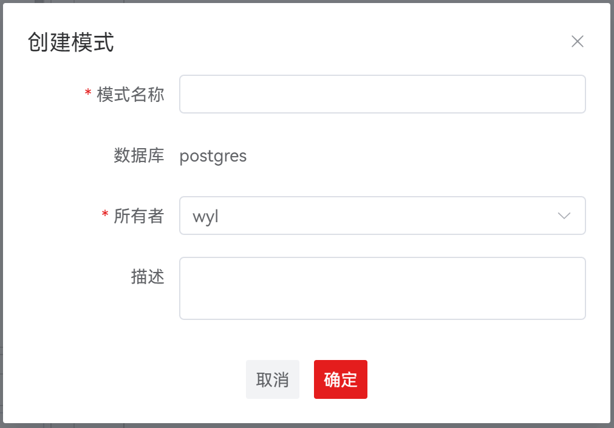


#### 5.10.2 编辑模式

​                执行如下步骤编辑用户模式：

**步骤 1：** 在 "**数据库导航菜单**" 窗格中，右键单击数据库中的模式名称，选择 "**编辑模式**"，弹出 "**编辑模式**" 对话框。 

​               **说明：** 仅在数据库为连接状态时，可编辑用户模式。

**步骤 2：** 设置如下参数，编辑用户模式。

​                **说明：** 所有必选参数均需要填写。必填参数用星号（*）标识。

| 配置项   | 是否支持修改 | 必填 | 配置说明                             |
| -------- | ------------ | ---- | ------------------------------------ |
| 模式名称 | 是           | 是   | 用于定义模式名称，默认数据回显       |
| 数据库   | 否           | 否   | 用于显示模式所属数据库，默认数据回显 |
| 所有者   | 否           | 是   | 用于定义模式所有者，默认数据回显     |
| 描述     | 是           | 否   | 用于说明模式信息，默认数据回显       |

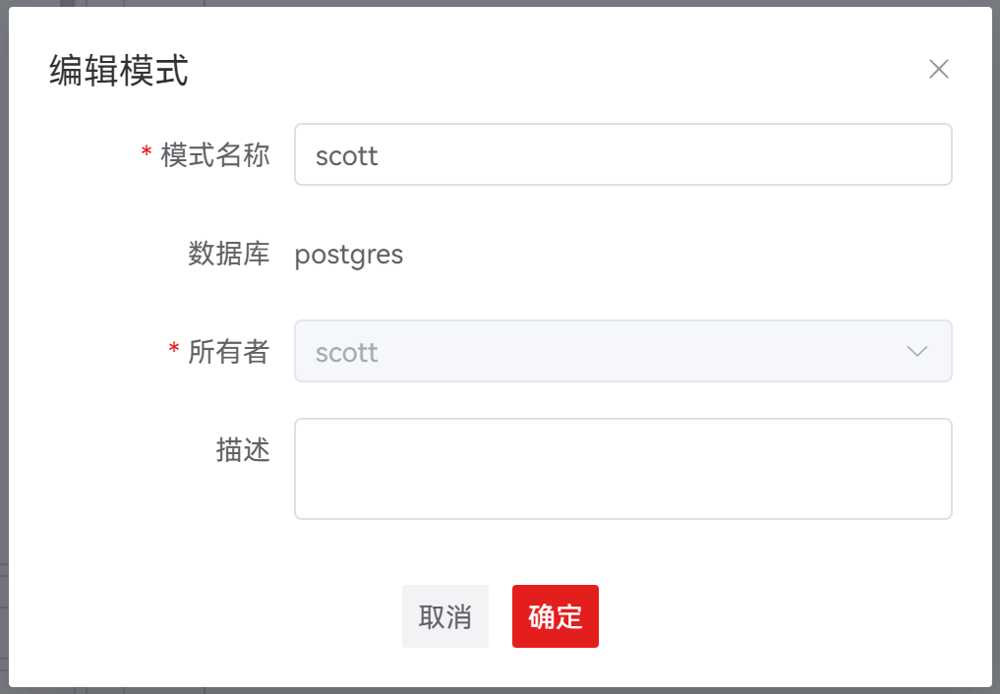


#### 5.10.3 删除模式

​               执行如下步骤删除用户模式：

**步骤 1：** 在 "**数据库导航菜单**" 窗格中，右键单击数据库中的模式名称，选择 "**删除模式**"，弹出 "**删除模式**" 确认框。 

​               **说明：** 仅在数据库为连接状态时，可删除用户模式。

**步骤 2：** 单击 "**确定**" 即可继续，或单击 "**取消**" 即可退出操作。

​               **说明：** 单击 "**确定**" 将删除并更新连接信息，此操作不可逆。

​                            单击 "**取消**" 即可退出本次对话框操作。


#### 5.10.4 导出模式 DDL

​               可通过导出 DDL 导出该模式下函数/过程、表、序列和视图的DDL。执行以下步骤导出模式 DDL：

**步骤 1：** 在 "**数据库导航菜单**" 窗格中，右键单击数据库中的模式名称，选择 "**导出 DDL**"。 

​                **说明：** 导出文件为 sql 文件。

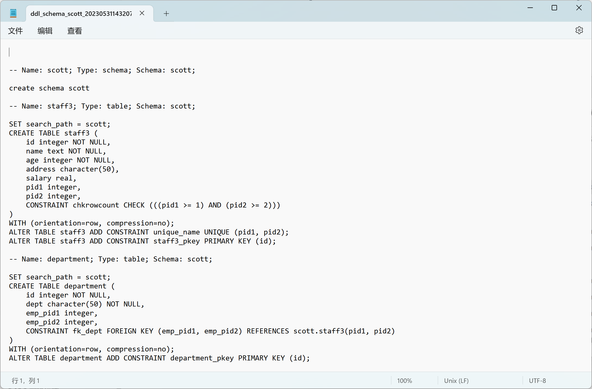


#### 5.10.5 导出模式 DDL 和数据

​			   通过导出模式的 DDL 和数据，可导出该模式下的函数/过程的 DDL、表的 DDL 和数据、视图的 DDL、序列的 DDL 和数据。执行以下步骤导出模式的 DDL 和数据：

**步骤 1：** 在 "**数据库导航菜单**" 窗格中，右键单击数据库中的模式名称，选择 "**导出 DDL 和数据**"。    

​                **说明：** 导出文件为 sql 文件。

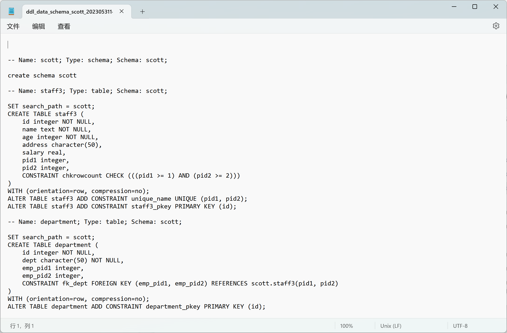


### 5.11 用户/角色

​             多个用户可以使用同一数据库，为了方便管理，需要将用户进行分组。一个数据库角色代表一个或一组数据库用户。

​             在数据库中，用户和角色的概念类似。实际应用中，建议使用角色来进行权限管理而不是直接访问数据库。

​             **用户** - 数据库用户的集合。这些用户与操作系统用户不同，可以为其他用户分配权限以访问数据库对象。

​             **角色** - 根据用途的不同，可以将角色分为用户或用户组。角色是集群级别的定义，适用于集群中的所有数据库。

#### 5.11.1 创建用户/角色

​              执行如下步骤在数据库中定义用户/角色：

**步骤 1：** 在 "**数据库导航菜单**" 窗格中，右键单击连接名称下的 "**用户/角色**" ，选择 "**创建用户/角色**" ，跳转至 "**创建用户/角色**" 页面。 

**步骤 2：** 点击 "**常规**" ，定义用户/角色基本信息，如名称、密码、类型、连接限制、权限等。详情请参见 **定义常规** 。

**步骤 3：** 点击 "**成员属性**" ，定义成员所有者等。详情请参见 **定义成员属性** 。

**步骤 4：** 点击 "**DDL 预览**" ，查看输入所自动生成的 SQL 查询。详情请参见 **DDL 预览** 。


**创建**

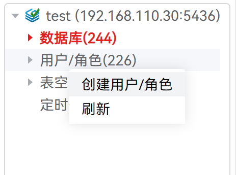


**定义常规**

​        设置如下参数：

​        **说明：** 所有必选参数均需要填写。必填参数用星号（*）标识。

​                     若点击 "**创建**" ，tab 将自动切换至   "**常规**" ，待补全信息后才可执行创建操作。

| 配置项   | 必填 | 配置说明                                                     |
| -------- | ---- | ------------------------------------------------------------ |
| 名称     | 是   | 用于定义用户/角色名称，默认为空                              |
| 类型     | 否   | 用于定义所创建的类型，默认为用户                             |
| 密码     | 是   | 用于定义用户/角色密码，默认为空                              |
| 确认密码 | 是   | 用于二次确认用户/角色密码，默认为空                          |
| 开始日期 | 否   | 用于为该用户/角色密码指定有效开始时间，默认为空。若为空，则表示创建后立即生效 |
| 结束日期 | 否   | 用于为该用户/角色密码指定有效结束时间，默认为空。若为空，则表示永久有效。在有效时间范围内，该角色可以正常使用；超出有效时间范围后，该角色将被自动禁用，并无法再使用 |
| 连接限制 | 否   | 用于指定该用户/角色支持的并发连接数，默认为-1表无限制        |
| 资源池   | 否   | 用于为该用户/角色选择资源池，默认为空。                      |
| 权限     | 否   | 用于为该用户/角色指定权限，默认为空                          |
| 描述     | 否   | 用于为该用户/角色指定描述，默认为空                          |

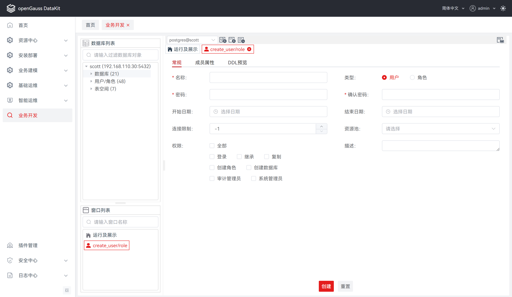


**定义成员属性**

​        设置如下参数：

| **配置项** | **必填** | **配置说明**                                                 |
| ---------- | -------- | ------------------------------------------------------------ |
| 角色组     | 否       | 用于指定该用户/角色的角色组，默认为空；若为空，该用户/角色默认不归属于任何人。即该用户/角色不是任何其他角色或用户的子集，其权限和访问范围由角色本身的权限和授权决定 |
| 管理员组   | 否       | 用于指定该用户/角色的管理员组，默认为空；若为空，该用户/角色默认不归属于任何人。即该用户/角色不是任何其他角色或用户的子集，其权限和访问范围由角色本身的权限和授权决定 |

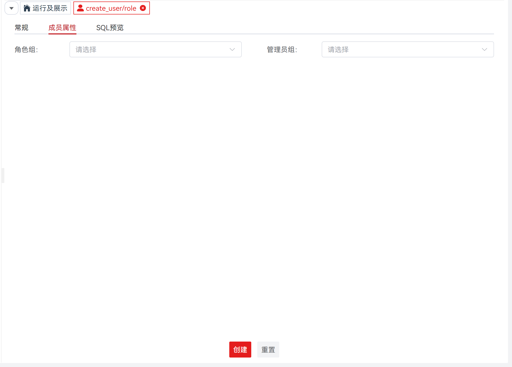


**DDL 预览**

​        按照输入的内容，生成一个DDL 语句。

​        **说明：** 该 DDL 语句仅支持查看、选择、复制，不支持编辑。

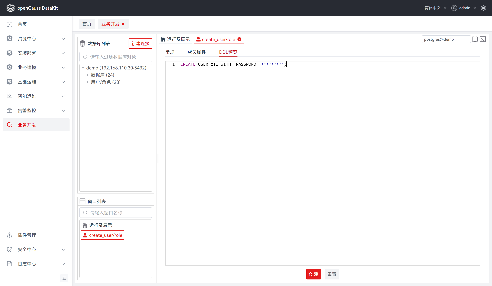


#### 5.11.2 编辑用户/角色

​               执行如下步骤编辑用户/角色：

**步骤 1：** 在 "**数据库导航菜单**" 窗格中，单击用户/角色列表，跳转至用户/角色查看与编辑页面。 

**步骤 2：** 支持查看DDL、查看与修改常规信息以及成员属性信息，详情请见下方说明。


**修改常规**

​        设置如下参数：

​        **说明：** 所有必选参数均需要填写。必填参数用星号（*）标识。

| **配置项** | **是否支持修改** | **配置说明**                                                 |
| ---------- | ---------------- | ------------------------------------------------------------ |
| 名称       | 是               | 用于定义用户/角色名称，默认数据回显                          |
| OID        | 否               | 返回对应的用户/角色OID                                       |
| 类型       | 否               | 返回创建时所选的用户/角色类型                                |
| 开始日期   | 是               | 用于为该用户/角色密码指定有效开始时间，默认数据回显；若为空，则表示立即生效；不支持由已有日期设置为空 |
| 结束日期   | 是               | 用于为该用户/角色密码指定有效结束时间，默认数据回显；若为空，则表示永久有效；在有效时间范围内，该角色可以正常使用；超出有效时间范围后，该角色将被自动禁用，并无法再使用；不支持由已有日期设置为空 |
| 连接限制   | 是               | 用于指定该用户/角色支持的并发连接数，默认数据回显            |
| 资源池     | 是               | 用于为该用户/角色选择资源池，默认数据回显                    |
| 权限       | 是               | 用于为该用户/角色指定权限，默认数据回显                      |
| 描述       | 是               | 用于为该用户/角色指定描述，默认数据回显                      |

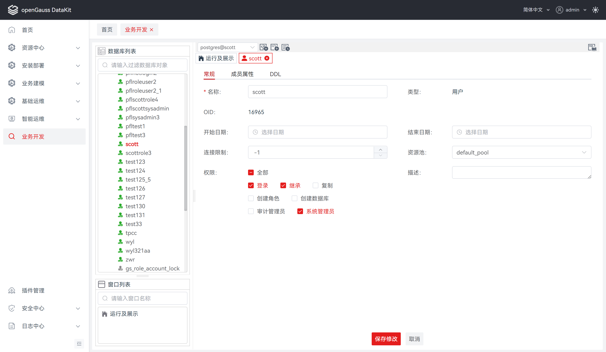


**修改成员属性**

​        设置如下参数：

​        **说明：** 所有必选参数均需要填写。必填参数用星号（*）标识。

| **配置项** | **是否支持修改** | **配置说明**                                                 |
| ---------- | ---------------- | ------------------------------------------------------------ |
| 角色组     | 否               | 用于指定该用户/角色的角色组，默认为空；若为空，该用户/角色默认不归属于任何人。即该用户/角色不是任何其他角色或用户的子集，其权限和访问范围由角色本身的权限和授权决定 |
| 管理员组   | 否               | 用于指定该用户/角色的管理员组，默认为空；若为空，该用户/角色默认不归属于任何人。即该用户/角色不是任何其他角色或用户的子集，其权限和访问范围由角色本身的权限和授权决定 |
| 属于       | 是               | 用 GRANT 赋权，表示当前用户/角色  是该字段填写的用户/角色的成员，默认为空 |

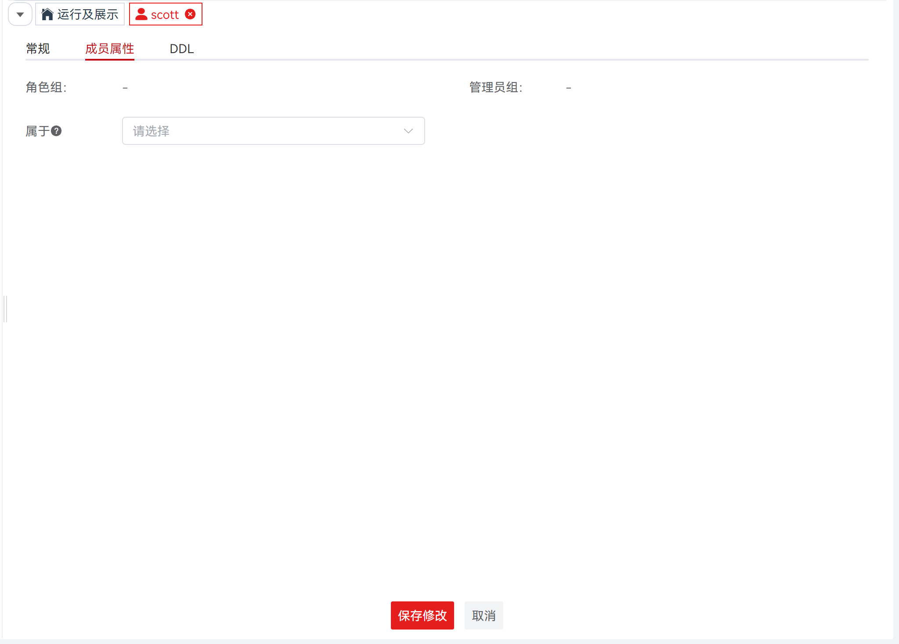


**查看 DDL**

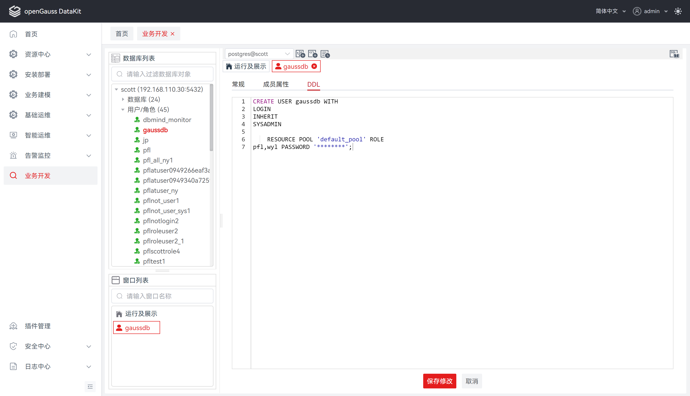


#### 5.11.3 修改用户/角色密码

​              执行如下步骤在数据库中修改用户/角色密码：

**步骤 1：** 在 "**数据库导航菜单**" 窗格中，右键单击连接名称下的用户/角色名称，选择 "**修改密码**"，弹出 "**修改用户/角色密码**" 对话框。

**步骤 2：** 设置如下参数，修改用户/角色密码。

​                **说明：** 所有必选参数均需要填写。必填参数用星号（*）标识。

​                            除了初始用户外其他管理员或普通用户修改自己的密码需要输入正确的旧密码。只有初始用户、系统管理员（sysadmin）或拥有创建用户（CREATEROLE）权限的用户才可以重置普通用户密码，无需输入旧密码。初始用户可以重置系统管理员的密码，系统管理员不允许重置其他系统管理员的密码。

| **配置项**   | **必填** | **配置说明**                                       |
| ------------ | -------- | -------------------------------------------------- |
| 原密码       | 是       | 用于填写用户/角色旧密码                            |
| 新密码       | 是       | 用于填写用户/角色新密码                            |
| 确认新密码   | 是       | 用于填写用户/角色新密码                            |
| 操作用户密码 | 是       | 用于填写当前操作用户的密码，用于验证数据库用户身份 |

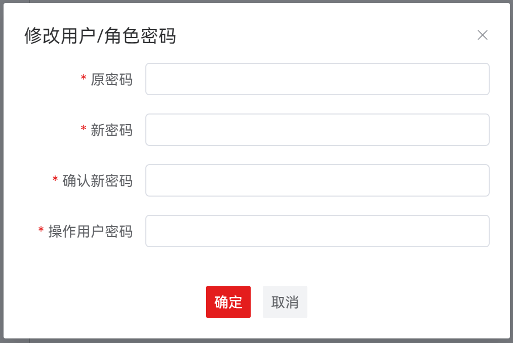


#### 5.11.4 删除用户/角色

​               执行如下步骤删除用户/角色：

**步骤 1：** 在 "**数据库导航菜单**" 窗格中，右键单击连接名称下的用户/角色名称，选择 "**删除用户/角色**"，弹出 "**删除用户/角色**" 确认框。 

**步骤 2：** 单击 "**确定**" 即可继续，或单击 "**取消**" 即可退出操作。

​                **说明：** 单击 "**确定**" 将删除用户/角色，此操作不可逆。

​                             单击 "**取消**" 即可退出本次对话框操作。


### 5.12 外表

​             外部表是一种特殊类型的表，它表示数据库中的一个虚拟表，其数据存储在数据库外部的数据源中，而不是数据库本身的存储介质中。

#### 5.12.1 创建外表

​              执行如下步骤在数据库中定义外表：

**步骤 1：** 在 "**数据库导航菜单**" 窗格中，右键单击数据库中的 "**外表**" ，选择 "**创建外表**" ，跳转至 "**创建外表**" 页面。 

​                **说明：** 创建外表前，请提前安装好所选外部数据源类型指定的拓展，否则可能导致外表创建失败！

**步骤 2：** 点击 "**外部**" ，定义外部表信息，如外部表名、外部数据库类型、外部服务器等。详情请参见 **定义外部** 。

​                **说明：** 外部服务器支持创建和删除，详情请参见 **定义外部服务器** 。

**步骤 3：** 点击 "**列**" ，定义外表列信息，如列名称、数据类型、能否非空、默认值等。详情请参见 **定义列** 。


**创建**

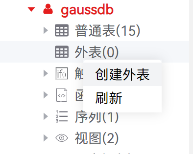


**定义外部**

​        设置如下参数：

​        **说明：** 所有必选参数均需要填写。必填参数用星号（*）标识。

​                     若点击 "**创建**" ，tab 将自动切换至   "**外部**" ，待补全信息后才可执行创建操作。

| **配置项**     | **必填** | **配置说明**                                                 |
| -------------- | -------- | ------------------------------------------------------------ |
| 外部表名       | 是       | 用于定义所创建外部表的名称                                   |
| 如果不存在     | 否       | 条件语句，勾选则表示添加 "IF NOT EXISTS" 语句，添加后可以确保在对象已存在的情况下不会重新创建该对象，从而防止因重复创建而引发错误 |
| 外部数据源类型 | 是       | 用于指定外部数据源类型，默认为 openGauss。当前版本仅支持openGauss，Oracle、MySQL尚未支持 |
| 外部服务器     | 是       | 用于定义所连接远程服务器名称，默认未选择。选项为当前用户已创建的外部服务器列表。外部服务器支持新建和删除，创建和删除具体说明详见下方 **定义外部服务器** 。 |
| 外部数据库     | 是       | 用于指定外部表所在的数据库，默认为当前数据库，不可更改       |
| 外部模式       | 是       | 用于指定外部表所在的模式，默认为当前模式，不可更改           |
| 远端schema     | 否       | 用于填写远端的schema名称。如果不指定的话，将使用外表自身的schema名称作为远端的schema名称 |
| 远端表         | 否       | 用于填写远端的表名。如果不指定的话，将使用外表自身的表名作为远端的表名 |
| 描述           | 否       | 用于定义所外部表的描述                                       |

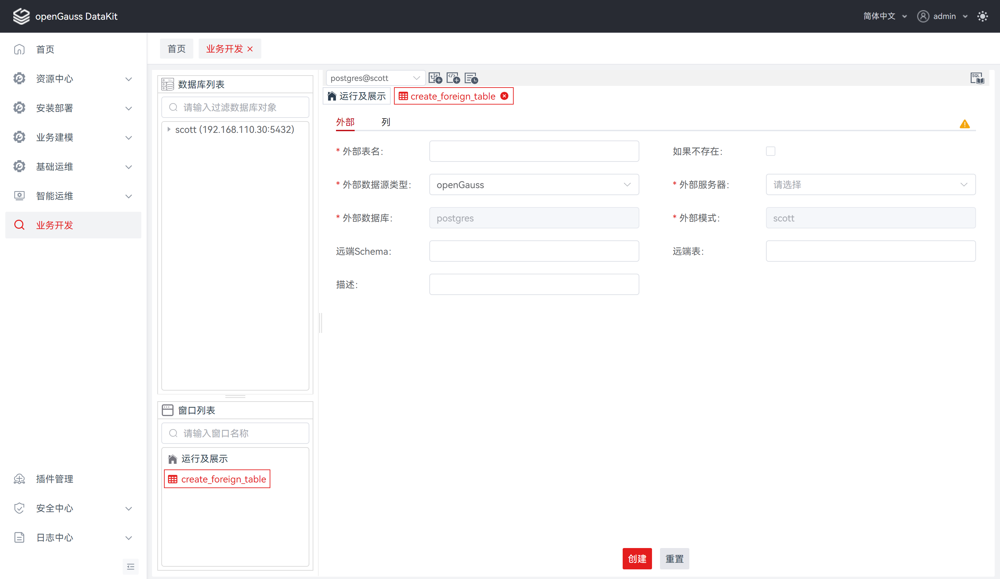


**定义外部服务器**

​        外部服务器支持新建和删除。

**创建外部服务器**

​               执行如下步骤删除外部服务器：

**步骤 1：** 在 "**外表**" 页面中，单击 "**外部服务器**" 选择框，点击 "**+新建**"  ，弹出 "**创建外部服务器**" 对话框。 

**步骤 2：** 单击 "**确定**" 或 "**确定**" 即可继续，或单击 "**取消**" 即可退出操作。

​                **说明：** 所有必选参数均需要填写。必填参数用星号（*）标识。

​                            单击 "**确定**" 即可继续，创建后，外表页面的外部服务器选项选中最新创建成功的外部服务器。

​                            单击 "**测试远端连接**" 即可发送建立远端表连接的测试请求。

​                            单击 "**取消**" 即可退出操作。

| **配置项**       | **必填** | **配置说明**                                 |
| ---------------- | -------- | -------------------------------------------- |
| 外部服务器       | 是       | 用于定义所连接远程服务器名称                 |
| 远端服务器主机   | 是       | 用于填写所连接远程服务器数据库主机ip         |
| 远端服务器端口号 | 是       | 用于填写所连接远程服务器数据库端口号         |
| 远端数据库       | 是       | 用于填写所连接远程服务器数据库名称           |
| 用户映射         | 是       | 用于赋予指定用户具备读写权限，默认为当前用户 |
| 远端数据库用户名 | 是       | 用于填写所连接远程服务器数据库用户名         |
| 远端数据库密码   | 是       | 用于填写所连接远程服务器数据库密码           |

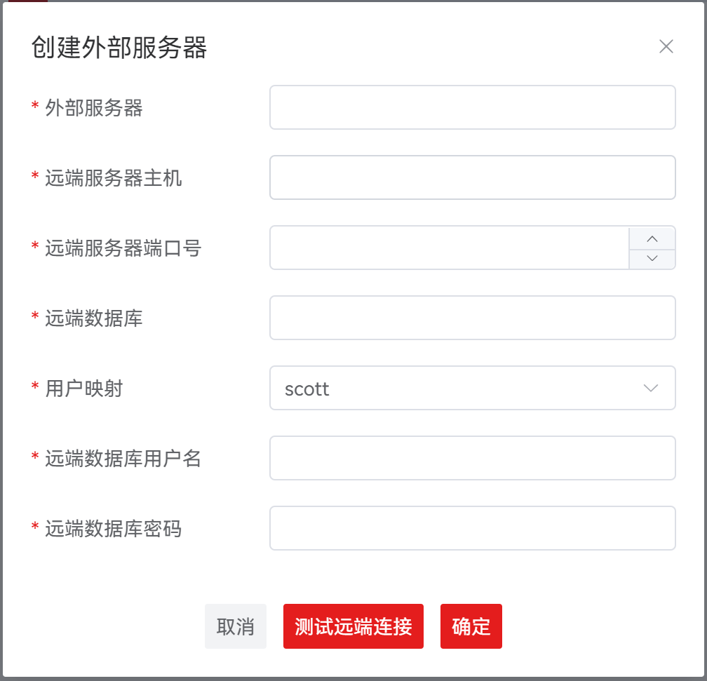

**删除外部服务器**

​               执行如下步骤删除外部服务器：

**步骤 1：** 在 "**外表**" 页面中，单击 "**外部服务器**" 选择框，移入下拉列表并点击  ，弹出 "**删除外部服务器**" 确认框。 

**步骤 2：** 单击 "**确定**" 即可继续，或单击 "**取消**" 即可退出操作。

​               **说明：** 单击 "**确定**" 将删除并更新外部服务器列表，此操作不可逆。

​                            单击 "**取消**" 即可退出本次对话框操作。


**定义列**

​        设置如下参数：

| **配置项** | **必填** | **配置说明**                                                 |
| ---------- | -------- | ------------------------------------------------------------ |
| 列名称     | 是       | 用于定义列名称                                               |
| 数据类型   | 是       | 用于配置数据库常用数据类型，默认为第一个数据类型。配置项数据由后端返回 |
| 能否非空   | 否       | 用于定义列约束，指该列不能包含空值                           |
| 默认值     | 否       | 用于定义列约束，指定该列未定义值的情况下使用的默认值         |
| 是否唯一   | 否       | 用于定义列约束，指列可能仅包含唯一值                         |
| 精度/大小  | 否       | 用于定义数据类型的精度/大小                                  |
| 范围       | 否       | 用于定义数据类型的范围                                       |
| 描述       | 否       | 用于说明列信息                                               |

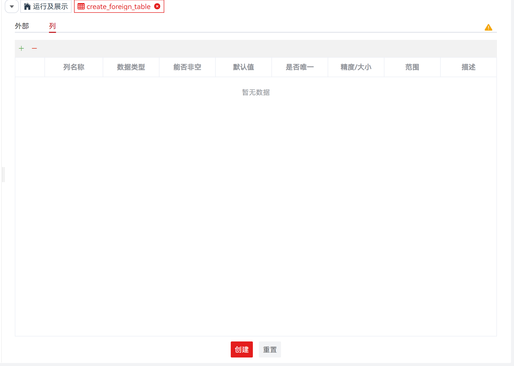


#### 5.12.2 编辑外表

​               执行如下步骤编辑外表：

**步骤 1：** 在 "**数据库导航菜单**" 窗格中，展开数据库中的外表列表，单击外表列表，跳转至外表查看与编辑页面。 

**步骤 2：** 支持查看DDL/外部、查看与修改列/数据，详情请见下方说明。


**查看 DDL**

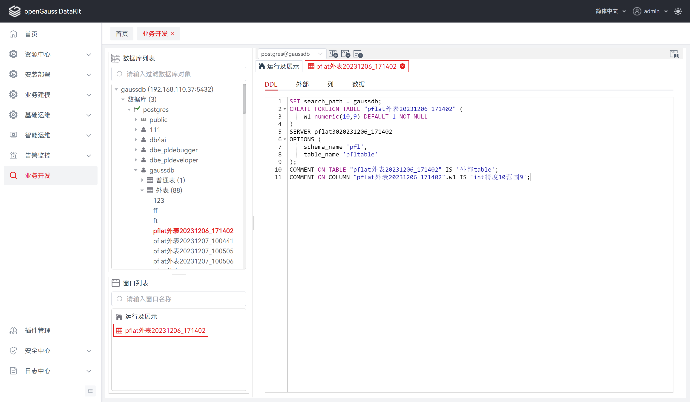


**查看外部**

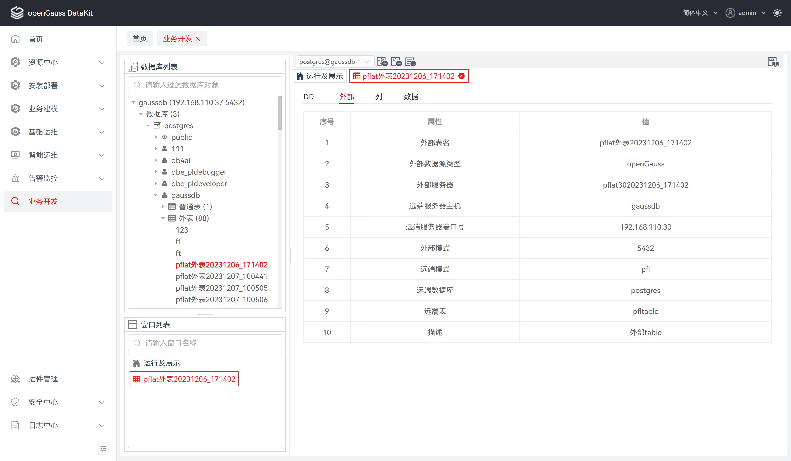


**修改列**

​        与普通表管理列同，详情请参见 **5.3.2.1 管理列**

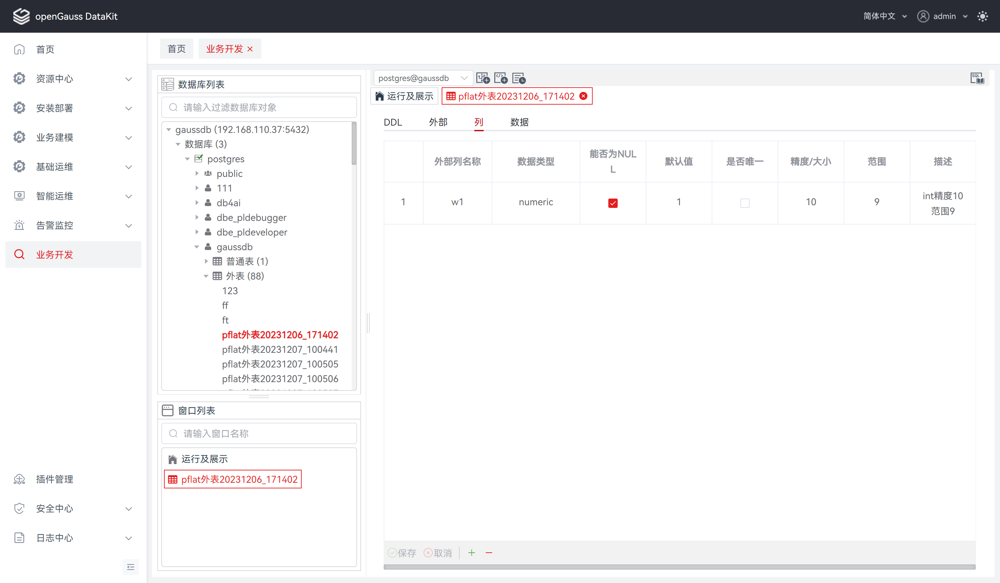


**修改数据**

​        除外表不支持自定义唯一键外，其他操作与普通表操作表数据同，详情请参见 **5.3.4.1 操作表数据**

​        **说明：** 外表数据操作内核不支持添加约束，故无法设置自定义唯一键，待内核完善后补齐该功能。

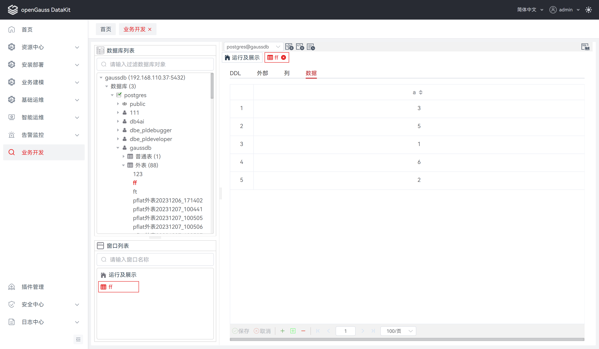


#### 5.12.3 删除外表

​               执行如下步骤删除外表：

**步骤 1：** 在 "**数据库导航菜单**" 窗格中，右键单击数据库中的外表名称，选择 "**删除表**"，弹出 "**删除表**" 确认框。 

**步骤 2：** 单击 "**确定**" 即可继续，或单击 "**取消**" 即可退出操作。

​                **说明：** 单击 "**确定**" 将删除外表，此操作不可逆。

​                             单击 "**取消**" 即可退出本次对话框操作。


### 5.13 表空间

​             表空间是一个逻辑划分，其功能主要在于控制一个数据库的磁盘布局。它是数据库的逻辑划分，一个表空间只能属于一个数据库，所有的数据库对象（例如表、索引等）都存放在指定的表空间中。

​             openGauss 自带了两个表空间：pg_default 和 pg_global。默认表空间 pg_default 用来存储非共享系统表、用户表、用户表 index、临时表、临时表 index、内部临时表的默认表空间，对应存储目录为实例数据目录下的 base 目录。共享表空间 pg_global 用来存放共享系统表的表空间，对应存储目录为实例数据目录下的 global 目录。需要注意的是，在 HCS 等场景下一般不建议用户使用自定义的表空间。

#### 5.13.1 创建表空间

​              执行如下步骤在数据库中定义表空间：

**步骤 1：** 在 "**数据库导航菜单**" 窗格中，右键单击连接名称下的 "**表空间**" ，选择 "**创建表空间**" ，跳转至 "**创建表空间**" 页面。 

**步骤 2：** 点击 "**常规**" ，定义表空间基本信息，如表空间名称、所有者、位置、最大存储容量等。详情请参见 **定义常规** 。

**步骤 3：** 点击 "**DDL 预览**" ，查看输入所自动生成的 SQL 查询。详情请参见 **DDL 预览** 。


**创建**

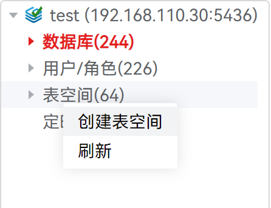

**定义常规**

​        设置如下参数：

​        **说明：** 所有必选参数均需要填写。必填参数用星号（*）标识。

​                    若点击 "**创建**" ，tab 将自动切换至   "**常规**" ，待补全信息后才可执行创建操作。

| **配置项**         | **必填** | **配置说明**                                                 |
| ------------------ | -------- | ------------------------------------------------------------ |
| 表空间名称         | 是       | 用于定义所创建表空间的名称                                   |
| 表空间所有者       | 否       | 用于定义所创建表空间的所有者，若为空，数据库默认为创建者，可选项由后端数据回显 |
| 表空间位置         | 是       | 用于创建表空间的位置，默认对应绝对路径                       |
| 相对路径           | 否       | 与表空间位置相关联，若勾选，则表空间位置为相对路径           |
| 最大存储容量       | 否       | 用于指定表空间的最大存储容量，若为空，数据库默认为不限制单位选项分别为：KB、MB、GB、TB、PB，默认为KB |
| 顺序磁盘页面开销   | 否       | 用于指定按照物理存储顺序（从磁盘上连续的位置）读取或写入数据的成本 |
| 非顺序磁盘页面开销 | 否       | 用于指定按照物理存储顺序之外的方式（非连续）读取或写入数据的成本 |
| 描述               | 否       | 用于定义所创建表空间的描述                                   |

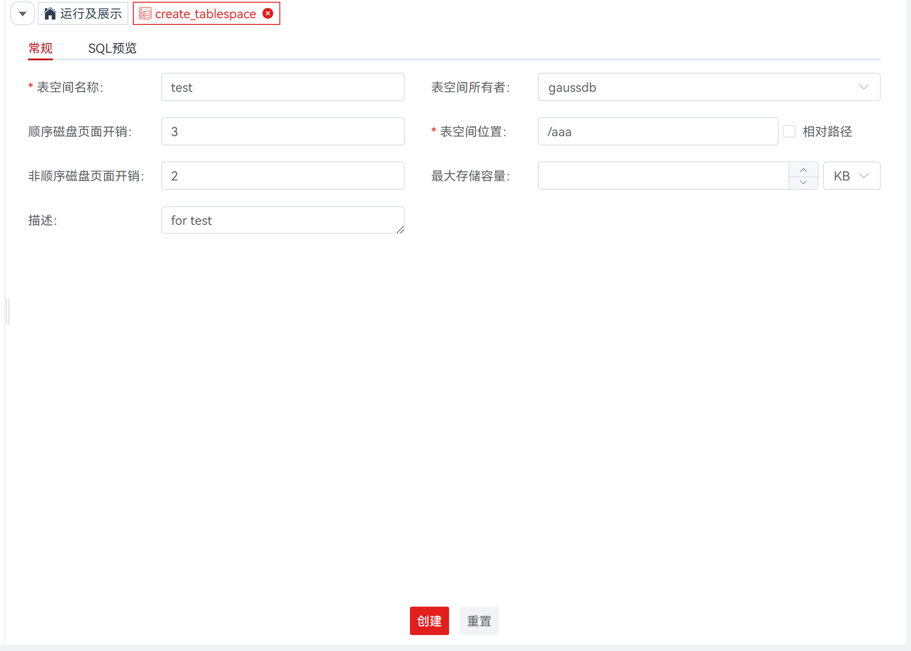


**DDL 预览**

​        按照输入的内容，生成一个DDL 语句。

​        **说明：** 该 DDL 语句仅支持查看、选择、复制，不支持编辑。

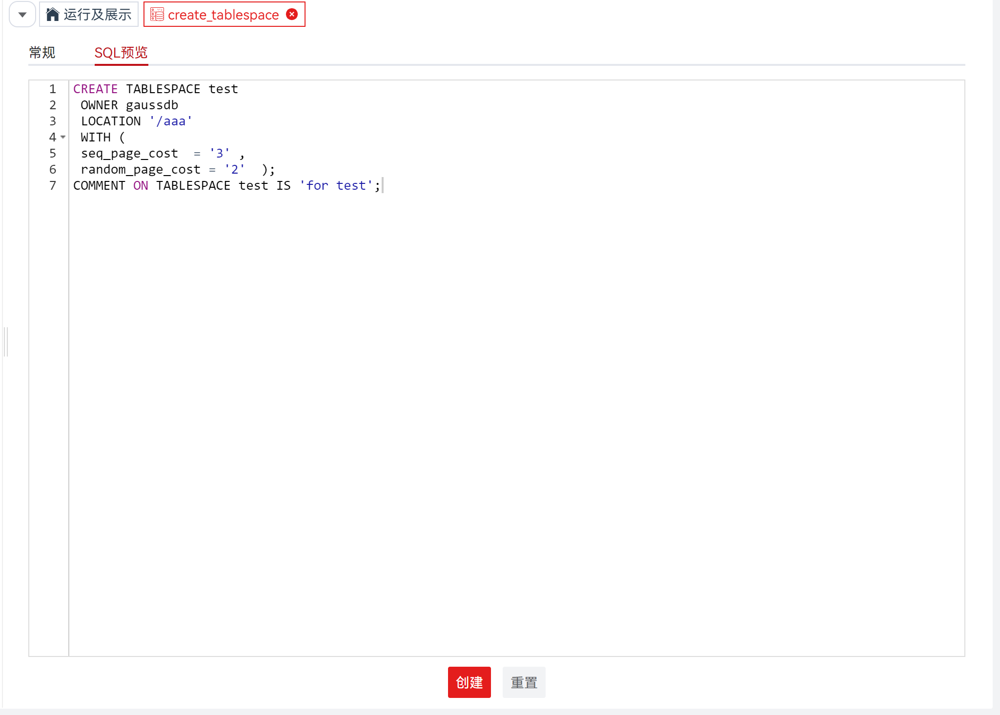


#### 5.13.2 编辑表空间

​               执行如下步骤编辑表空间：

**步骤 1：** 在 "**数据库导航菜单**" 窗格中，单击表空间列表，跳转至表空间查看与编辑页面。 

**步骤 2：** 支持查看DDL、查看与修改常规信息，详情请见下方说明。


**修改常规**

​        设置如下参数：

​        **说明：** 所有必选参数均需要填写。必填参数用星号（*）标识。

| **配置项**         | **是否支持修改** | **配置说明**                                                 |
| ------------------ | ---------------- | ------------------------------------------------------------ |
| 表空间名称         | 是               | 用于定义所创建表空间的名称，默认数据回显                     |
| 表空间所有者       | 是               | 用于定义所创建表空间的所有者，默认数据回显，可选项由后端数据回显 |
| 表空间位置         | 否               | 用于创建表空间的位置，默认数据回显                           |
| 相对路径           | 否               | 与表空间位置相关联，默认数据回显                             |
| 最大存储容量       | 是               | 用于指定表空间的最大存储容量，默认数据回显单位选项分别为：KB、MB、GB、TB、PB |
| 顺序磁盘页面开销   | 是               | 用于指定按照物理存储顺序（从磁盘上连续的位置）读取或写入数据的成本，默认数据回显 |
| 非顺序磁盘页面开销 | 是               | 用于指定按照物理存储顺序之外的方式（非连续）读取或写入数据的成本，默认数据回显 |
| 描述               | 是               | 用于定义所创建表空间的描述，默认数据回显                     |

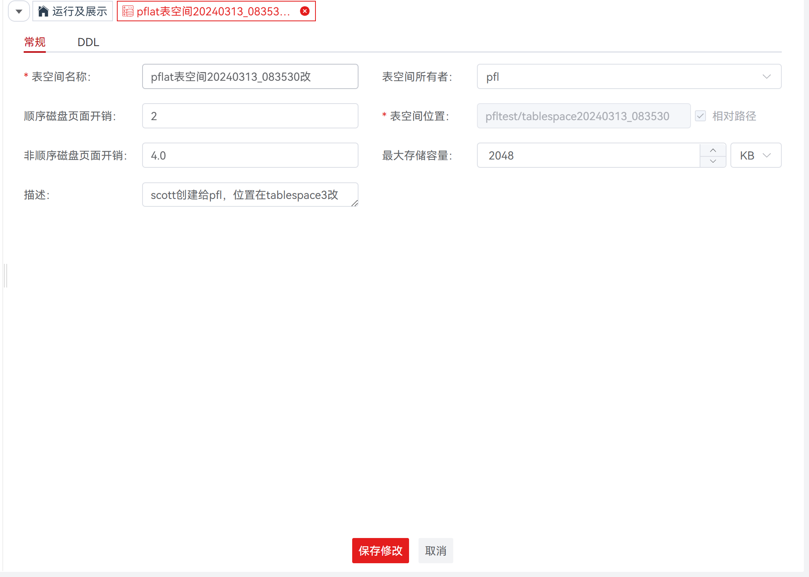


**查看 DDL**

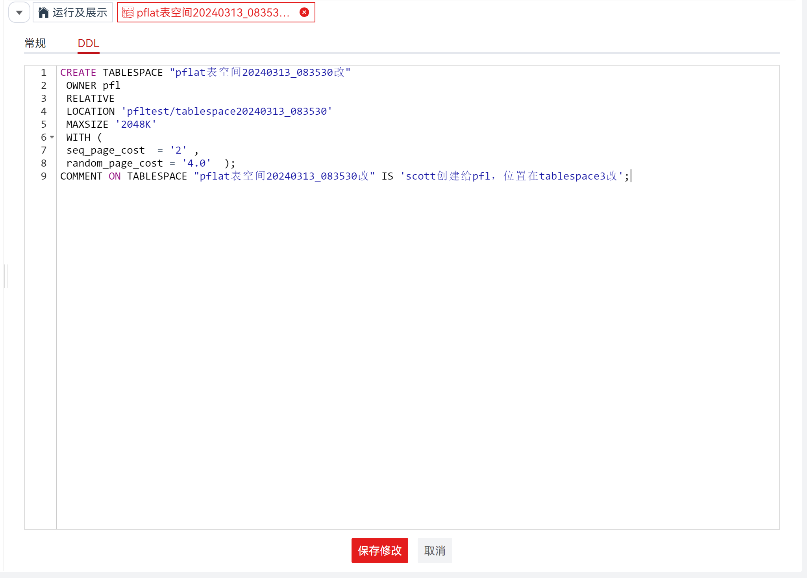


#### 5.13.3 删除表空间

​               执行如下步骤删除表空间：

**步骤 1：** 在 "**数据库导航菜单**" 窗格中，右键单击连接名称下的表空间名称，选择 "**删除表空间**"，弹出 "**删除表空间**" 确认框。 

**步骤 2：** 单击 "**确定**" 即可继续，或单击 "**取消**" 即可退出操作。

​                **说明：** 单击 "**确定**" 将删除表空间，此操作不可逆。

​                             单击 "**取消**" 即可退出本次对话框操作。


### 5.14 触发器

​             触发器是一种数据库对象，它与特定的表相关联，并在表上的指定事件发生时自动触发一系列操作。当满足预定义的触发条件时，触发器可以执行各种操作，比如插入、更新或删除数据，或者触发其他的数据库操作、函数或过程。

#### 5.14.1 创建触发器

​              执行如下步骤在数据库中定义触发器：

**步骤 1：** 在 "**数据库导航菜单**" 窗格中，右键单击数据库中的 "**触发器**" ，选择 "**创建触发器**" ，跳转至 "**创建触发器**" 页面。 

**步骤 2：** 点击 "**常规**" ，定义触发器基本信息，如触发器名称、状态、时间、频率等。详情请参见 **定义常规** 。

**步骤 3：** 点击 "**DDL 预览**" ，查看输入所自动生成的 SQL 查询。详情请参见 **DDL 预览** 。


**创建**

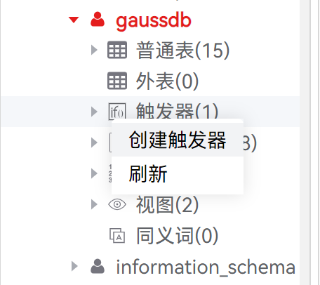


**定义常规**

​        设置如下参数：

​        **说明：** 所有必选参数均需要填写。必填参数用星号（*）标识。

​                    若点击 "**创建**" ，tab 将自动切换至   "**常规**" ，待补全信息后才可执行创建操作。

| **配置项**      | **必填** | **配置说明**                                                 |
| --------------- | -------- | ------------------------------------------------------------ |
| 触发器名称      | 是       | 用于定义所创建触发器的名称                                   |
| 触发器状态      | 否       | 用于指定触发器创建成功后的状态，默认为禁用；选项为：启用、禁用 |
| 触发器类型      | 是       | 用于指定所创建触发器的类型，默认为表；选项为：表、视图       |
| 触发表/触发视图 | 是       | 用于指定触发的表名、视图名                                   |
| 触发频率        | 是       | 用于指定所创建触发器的触发频繁，默认为STATEMENT，约束触发器只能指定为FOR EACH ROW；选项为：ROW、STATEMENT； ROW：指该触发器是受触发事件影响的每一行触发一次；STATEMENT：指该触发器是每个SQL语句只触发一次 |
| 触发时间        | 是       | 用于指定触发器函数的触发时间，默认为BEFORE；选项为：BEFORE、AFTER、INSTEAD OF BEFORE：触发器函数是在触发事件发生前执行；AFTER：触发器函数是在触发事件发生后执行；INSTEAD OF：触发器函数直接替代触发事件 |
| 触发事件        | 是       | 用于指定启动触发器的事件，默认为未选择；选项为：INSERT、DELETE、TRUNCATE、UPDATE。 |
| UPDATE字段      | 否       | 用于指定 UPDATE 字段，默认为全选。仅触发器类型为表且触发事件为 UPDATE 时显示 |
| 触发函数        | 是       | 用于指定用户定义的函数，且该函数必须声明为不带参数并返回类型为触发器，默认为未选择 |
| 触发条件        | 否       | 用于指定触发器的触发条件，用于填写关键字 WHEN 后的 SQL 条件语句 |
| 描述            | 否       | 用于定义所创建触发器的描述                                   |

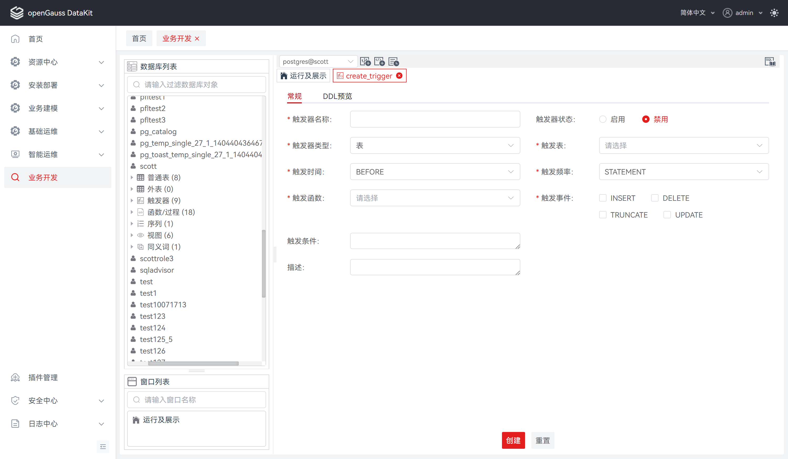


**DDL 预览**

​        按照输入的内容，生成一个DDL 语句。

​        **说明：** 该 DDL 语句仅支持查看、选择、复制，不支持编辑。

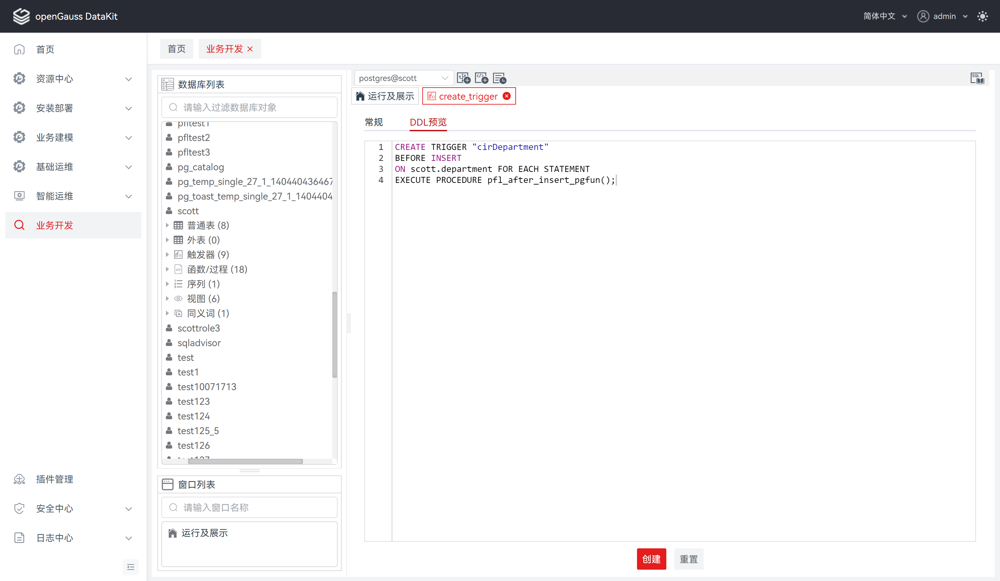


#### 5.14.2 查看触发器

​              执行如下步骤在数据库中查看触发器信息：

**步骤 1：** 在 "**数据库导航菜单**" 窗格中，展开数据库中的触发器列表，单击触发器名称，跳转至触发器查看与编辑页面。

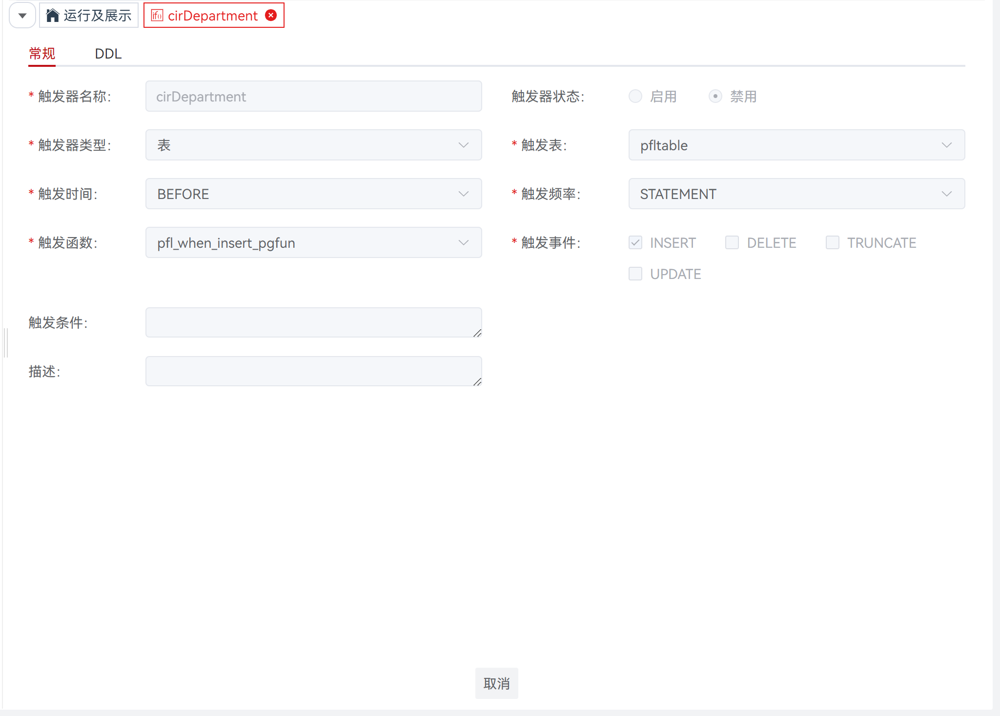


#### 5.14.3 重命名触发器

​               执行如下步骤重命名触发器：

**步骤 1：** 在 "**数据库导航菜单**" 窗格中，右键单击数据库中的触发器名称，选择 "**重命名触发器**" ，弹出重命名触发器对话框。

**步骤 2：** 根据对话框提示输入触发器的新名称，单击 "**确定**" 将更新触发器名称。

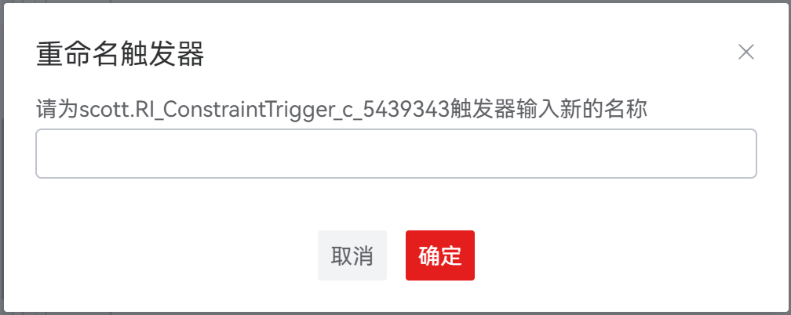


#### 5.14.4 启用/禁用触发器

​               执行如下步骤修改触发器状态：

**步骤 1：** 在 "**数据库导航菜单**" 窗格中，右键单击数据库中的触发器名称，选择 "**启用触发器**" 或 "**禁用触发器**" ，弹出修改触发器状态确认框。

​               **说明：**  "**启用触发器**" 操作仅在已禁用的触发器上执行。

​                            "**禁用触发器**" 操作仅在已启用的触发器上执行。

**步骤 2：** 单击 "**确定**" 即可继续，或单击 "**取消**" 即可退出操作。


#### 5.14.5 删除触发器

​               执行如下步骤删除触发器：

**步骤 1：** 在 "**数据库导航菜单**" 窗格中，右键单击数据库中的触发器名称，选择 "**删除触发器**"，弹出 "**删除触发器**" 确认框。 

**步骤 2：** 单击 "**确定**" 即可继续，或单击 "**取消**" 即可退出操作。

​                **说明：** 单击 "**确定**" 将删除触发器，此操作不可逆。

​                             单击 "**取消**" 即可退出本次对话框操作。


### 5.15 定时任务

​             支持通过编写SQL脚本形式（自定义SQL语句或者调用已有的函数/存储过程）的任务内容并设定任务执行时间，数据库将在任务时间内执行对应的任务内容，以达到自动化执行任务的效果。

#### 5.15.1 查看定时任务

​              执行如下步骤在连接实例中查看实例下所有数据库的定时任务信息：

**步骤 1：** 在 "**数据库导航菜单**" 窗格中，单击连接名称下的 "**定时任务**" ，跳转至定时任务列表页面。

​                **说明：** 点击定时任务页面操作栏中的，可刷新定时任务列表信息。

​                            点击定时任务页面操作栏中的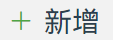，可创建定时任务，详情请参见 **5.15.2 创建定时任务**。

​                            点击定时任务页面列表中的任务ID，如，可编辑定时任务，详情请参见 **5.15.3 编辑定时任务**。

​                            点击定时任务页面列表中的操作，如"**启用**"或"**禁用**"，可修改定时任务状态，详情请参见 **5.15.4 启用/禁用定时任务**。

​                            点击定时任务页面列表中的操作，如"**删除**"，可删除定时任务，详情请参见 **5.15.5 删除定时任务**。

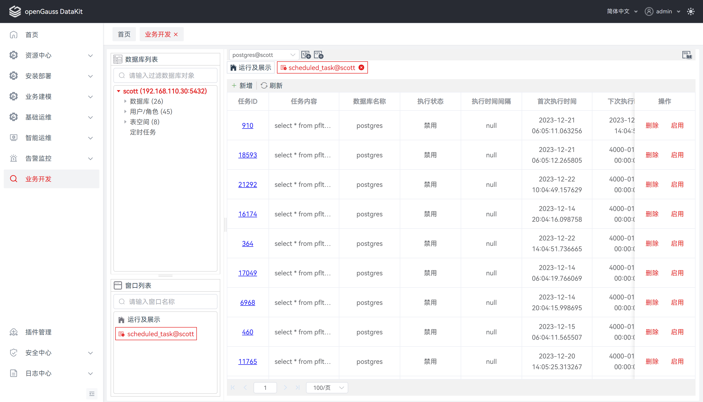


#### 5.15.2 创建定时任务

​              执行如下步骤定义数据库中的定时任务：

**步骤 1：** 在 "**数据库导航菜单**" 窗格中，单击连接名称下的 "**定时任务**" ，跳转至定时任务列表页面。

**步骤 2：** 点击定时任务页面操作栏中的，弹出 "**创建定时任务**" 对话框。

**步骤 3：** 设置如下参数，创建定时任务。

​                **说明：** 所有必选参数均需要填写。必填参数用星号（*）标识。

| **配置项**       | **必填** | **配置说明**                                                 |
| ---------------- | -------- | ------------------------------------------------------------ |
| 数据库           | 否       | 用于指定定时任务所对应的数据库。默认为当前连接实例对应的数据库，下拉选项为当前连接实例所有已连接的数据库 |
| 任务内容         | 是       | 用于填写要执行的SQL语句。支持一个或多个‘DML’，‘匿名块’，‘调用存储过程的语句’或3种混合的场景 |
| 下次作业运行时间 | 是       | 用于指定下次作业运行时间，默认值为当前系统时间（sysdate）。如果是过去时间，在提交作业时表示立即执行 |
| 时间表达式       | 否       | 用于计算下次作业运行时间的时间表达式，可以是interval表达式，也可以是sysdate加上一个numeric值（例如：sysdate+1.0/24）。如果为空值或字符串"null"表示只执行一次，执行后 JOB 状态 STATUS 变成'd' 不再执行 |

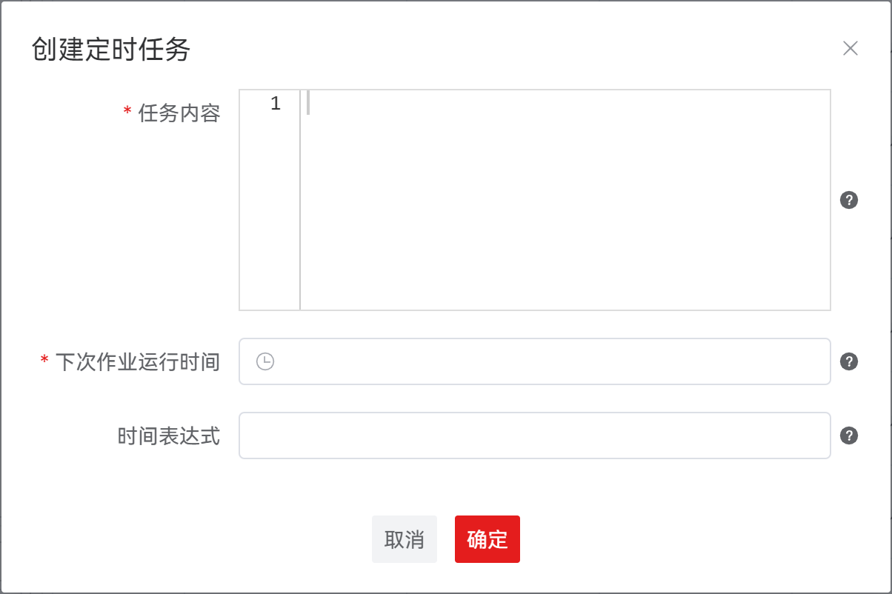


#### 5.15.3 编辑定时任务

​              执行如下步骤编辑数据库中的定时任务：

**步骤 1：** 在 "**数据库导航菜单**" 窗格中，单击连接名称下的 "**定时任务**" ，跳转至定时任务列表页面。

**步骤 2：** 定时任务页面列表中的任务ID，如，弹出 "**编辑定时任务**" 对话框。

**步骤 3：** 设置如下参数，编辑定时任务。

​                **说明：** 所有必选参数均需要填写。必填参数用星号（*）标识。

​                            该操作仅支持在非正在执行的定时任务上执行。

| **配置项**       | **是否支持修改** | **配置说明**                                                 |
| ---------------- | ---------------- | ------------------------------------------------------------ |
| 任务内容         | 是               | 用于填写要执行的SQL语句，默认数据回显。支持一个或多个‘DML’，‘匿名块’，‘调用存储过程的语句’或3种混合的场景 |
| 下次作业运行时间 | 是               | 用于指定下次作业运行时间，默认数据回显。如果是过去时间，在提交作业时表示立即执行 |
| 时间表达式       | 是               | 用于计算下次作业运行时间的时间表达式，默认数据回显。可以是interval表达式，也可以是sysdate加上一个numeric值（例如：sysdate+1.0/24）。如果为空值或字符串"null"表示只执行一次，执行后JOB状态STATUS变成'd' 不再执行 |

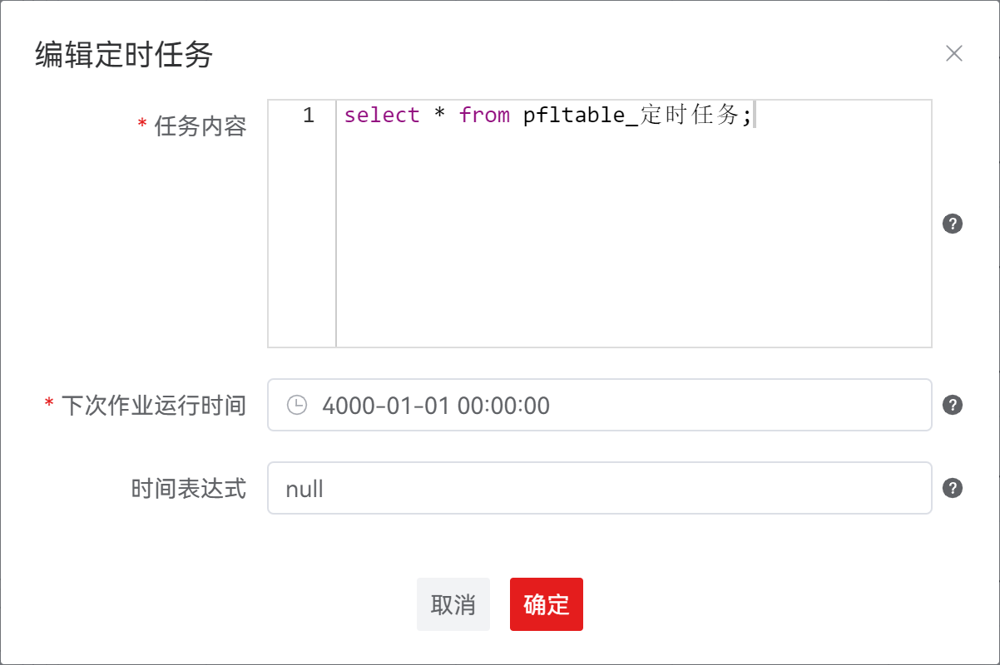


#### 5.15.4 启用/禁用定时任务

​               执行如下步骤修改数据库中的定时任务状态：

**步骤 1：** 在 "**数据库导航菜单**" 窗格中，单击连接名称下的 "**定时任务**" ，跳转至定时任务列表页面。

**步骤 2：** 点击定时任务页面列表中的"**启用**"或"**禁用**"操作，弹出修改定时任务状态确认框。

​               **说明：** "**启用**" 操作仅支持在已禁用的定时任务上执行。

​                            "**禁用**" 操作仅支持在已启用且非正在执行的定时任务上执行。

**步骤 3：** 单击 "**确定**" 即可继续，或单击 "**取消**" 即可退出操作。


#### 5.15.5 删除定时任务

​              执行如下步骤删除数据库中的定时任务：

**步骤 1：** 在 "**数据库导航菜单**" 窗格中，单击连接名称下的 "**定时任务**" ，跳转至定时任务列表页面。

**步骤 2：** 点击定时任务页面列表中的"**删除**"操作，弹出 "**删除定时任务**" 确认框。

**步骤 3：** 单击 "**确定**" 即可继续，或单击 "**取消**" 即可退出操作。

​                **说明：** 单击 "**确定**" 将删除定时任务，此操作不可逆。

​                             单击 "**取消**" 即可退出本次对话框操作。

​                             该操作仅支持在非正在执行的定时任务上执行。


### 5.16 通用管理

#### 5.16.1 复制数据库对象

​               支持复制数据库对象（表、视图、函数/过程、触发器、索引、用户/角色）的 DDL 以及数据。

**复制 DDL**

| 支持的数据库对象                                             | 操作入口                                        | 功能描述                             |
| ------------------------------------------------------------ | ----------------------------------------------- | ------------------------------------ |
| 表、视图、序列、触发器、函数/过程、用户/角色以及其他相关的DDL | 选择对应的数据库对象的 DDL 语句，右键选择“复制” | 复制所选 DDL 语句并保留对应的DDL格式 |

**复制数据**

| 支持的数据库对象   | 操作入口                                           | 功能描述                       |
| ------------------ | -------------------------------------------------- | ------------------------------ |
| 表、视图以及特殊表 | 点击左侧序号以选中需要复制的数据行，右键选择“复制” | 复制当前数据并保留对应数据格式 |

**高级复制**

| 支持的数据库对象                                            | 操作入口                                               | 功能描述                             |
| ----------------------------------------------------------- | ------------------------------------------------------ | ------------------------------------ |
| 表相关（数据/列/索引/约束）、视图（数据、列）以及特殊表相关 | 点击左侧序号以选中需要复制的数据行，右键选择“高级复制” | 复制当前列名、数据并保留对应数据格式 |


#### 5.16.2 批量导出

​               批量导出窗口说明如下：（以批量导出模式DDL为例）

| **字段** | **说明**                                               |
| -------- | ------------------------------------------------------ |
| 数据库   | 显示当前数据库名称，不可编辑                           |
| 名称     | 回显当前数据库下所有模式的名称，支持多选、支持前端搜索 |

##### 5.16.2.1 批量导出 DDL

| **功能**              | **操作入口**                                                 |
| --------------------- | ------------------------------------------------------------ |
| 批量导出模式DDL       | 右键连接状态数据库名称，选择批量导出DDL，打开所选数据库的模式名称选择窗口 |
| 批量导出普通表 DDL    | 右键普通表，选择批量导出DDL，打开普通表文件的名称选择窗口    |
| 批量导出函数/过程 DDL | 右键函数/过程，选择批量导出DDL，打开函数/过程的名称选择窗口  |
| 批量导出序列 DDL      | 右键序列，选择批量导出DDL，打开序列的名称选择窗口            |
| 批量导出视图 DDL      | 右键视图，选择批量导出DDL，打开视图的名称选择窗口            |

**以批量导出模式 DDL 为例：**

**步骤 1：** 在 "**数据库导航菜单**" 窗格中，右键单击数据库中的数据库名称，选择 "**批量导出模式DDL**"，弹出 "**选择名称**" 对话框。

**步骤 2：** 勾选所需导出的模式名称。名称支持搜索。

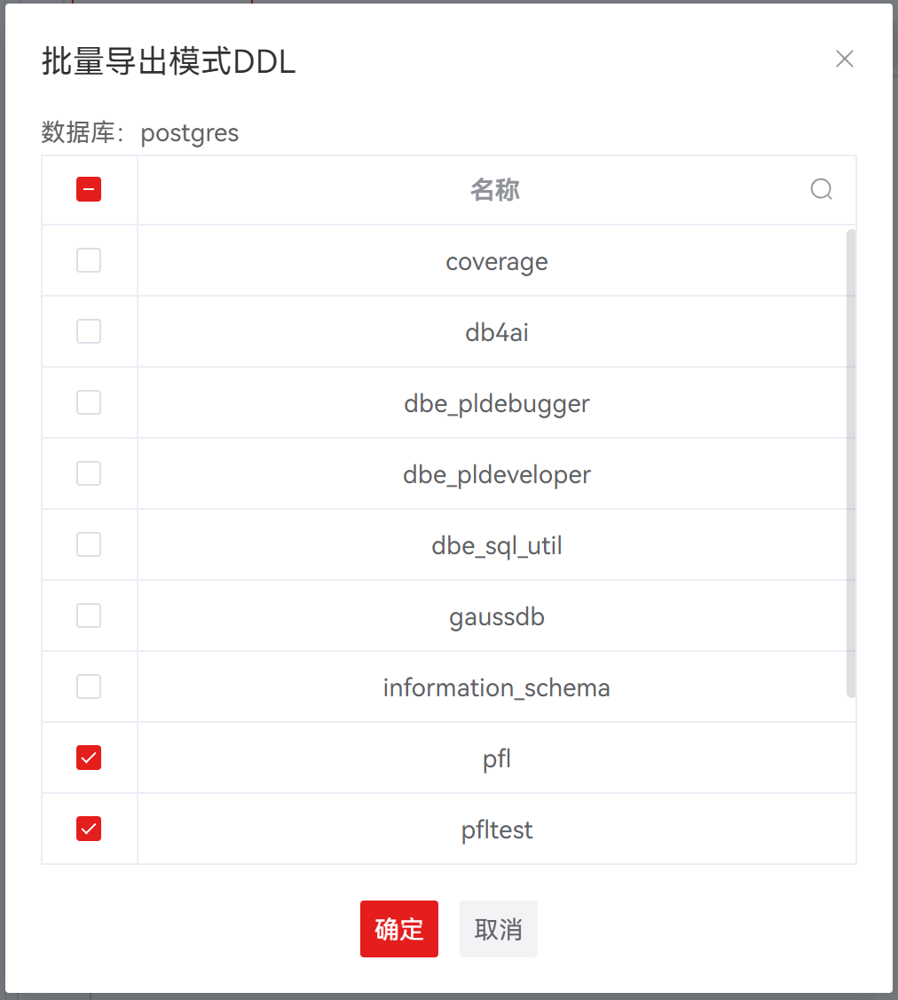

**步骤 3：** 单击 "**确定**" 即可继续，或单击 "**取消**" 即可退出操作。

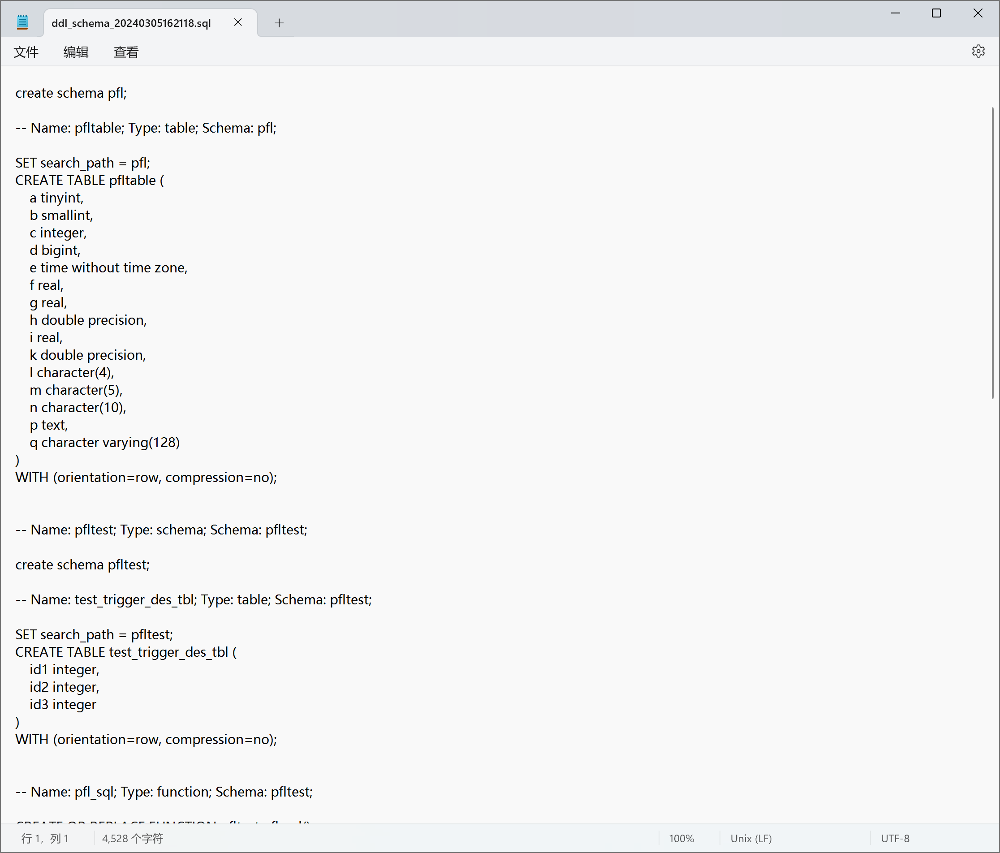


##### 5.16.2.2 批量导出 DDL 和数据

| **功能**                | **操作入口**                                                 |
| ----------------------- | ------------------------------------------------------------ |
| 批量导出模式DDL和数据   | 右键连接状态数据库名称，选择批量导出DDL和数据，打开所选数据库的模式名称选择窗口 |
| 批量导出普通表DDL和数据 | 右键普通表，选择批量导出DDL和数据，打开普通表文件的名称选择窗口 |
| 批量导出序列 DDL和数据  | 右键序列，选择批量导出DDL和数据，打开序列的名称选择窗口      |

**以批量导出模式 DDL 和数据为例：**

**步骤 1：** 在 "**数据库导航菜单**" 窗格中，右键单击数据库中的数据库名称，选择 "**批量导出模式DDL和数据**"，弹出 "**选择名称**" 对话框。

**步骤 2：** 勾选所需导出的模式名称。名称支持搜索。

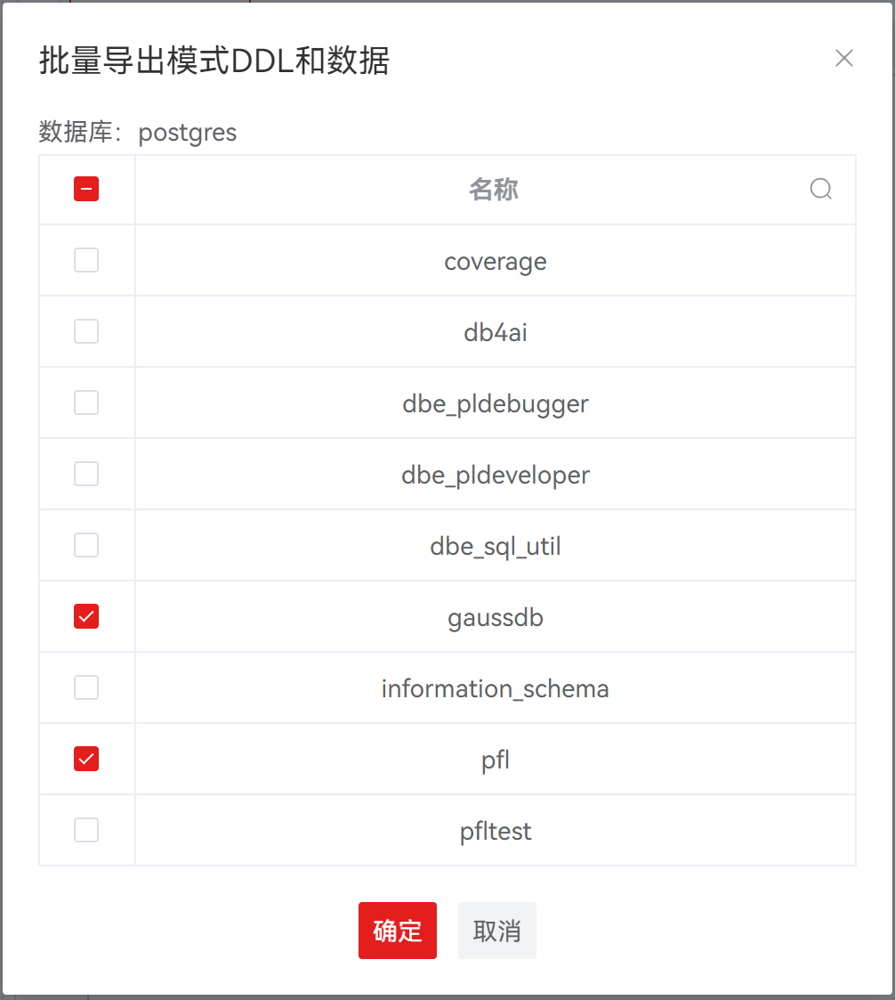

**步骤 3：** 单击 "**确定**" 即可继续，或单击 "**取消**" 即可退出操作。

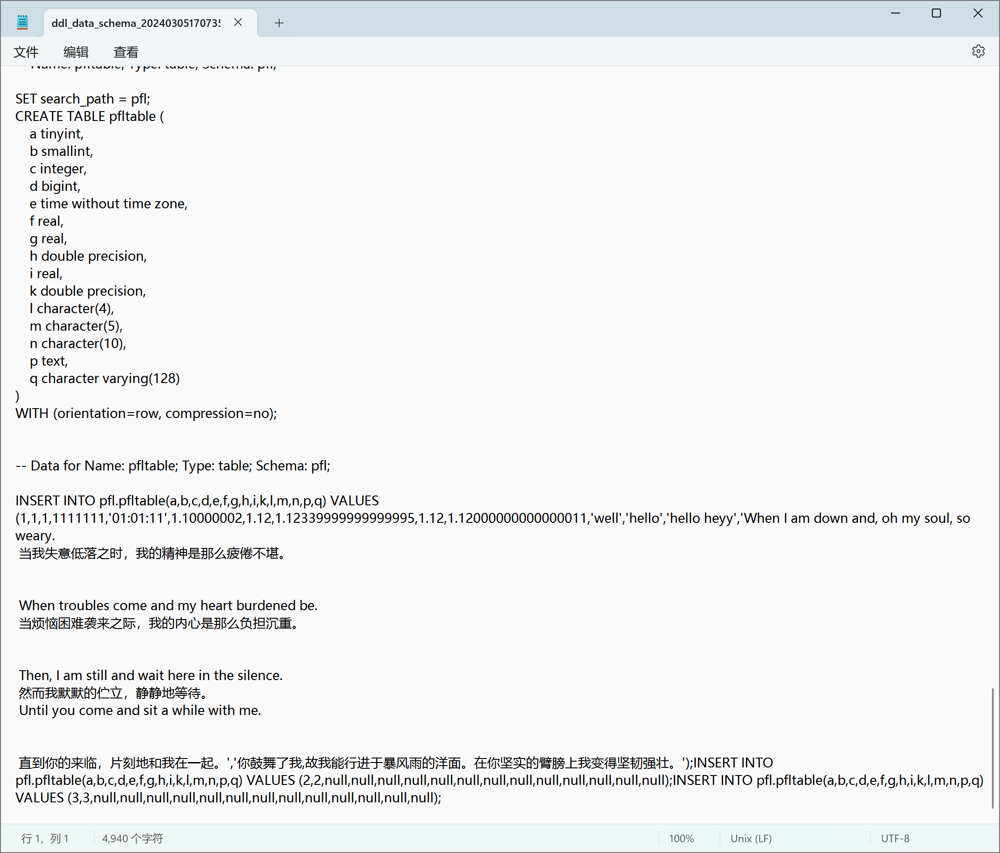


### 5.17 FAQS

1、DDL 回显为空。

原因：请确保当前登录用户存在查看权限。

2、调试功能不支持 C 语言，SQL 语言的调试。

原因：调试语言由内核决定，目前仅支持基于 plpgsql 语言函数/过程调试。

3、调试停留十几分钟后自动断开连接。

原因：调试停留时间由数据库配置的超时时间决定，数据库默认设置的超时时间为 900s（15min），如需修改调试停留时间，用户设定数据库配置的 pldebugger_timeout 数值为目标停留时间（单位为s）即可。

```
ALTER DATABASE postgres SET pldebugger_timeout TO 86400;
```

4、新建连接或打开数据库连接时提示超出限制。

原因：建立连接数限制为 100，超出将无法继续建立新的连接。

5、出现终端页面执行无响应，停止按钮失灵。

原因：平台token过期，需调整心跳时间小于token过期时间，重新打包安装规避问题。
调整心跳方法：在`plugins/data-studio/web-ui/src/config/index.ts`修改配置心跳时间（单位：毫秒）

```javascript
// websocket心跳时间
export const wsHeartbeatTime = 1000 * 30;
// http心跳时间
export const httpHeartbeatTime = 1000 * 30;
```

6、使用非规范式命名，数据库提示报错。

原因：数据库不支持直接使用非规范式命名，如纯数字，保留大小写，数字与特殊符号开头等，若需要使用非规范式命名，需要用户在命名内容前后加上双引号才可创建成功。

7、无法创建外表数据源类型为 Oracle、MySQL 的外部表。

原因：目前仅支持创建外部数据源类型为 openGauss 的外部表，Oracle、MySQL 将在后续版本支持。

8、无法编辑触发器信息。

原因：目前仅支持创建、查看、删除触发器，编辑触发器将在后续版本支持。

9、覆盖率统计中，无法在主函数的调试界面导出所有子函数的调试信息。

原因：目前 proc_coverage 表中没有记录主函数和子函数的关系，所以主函数和子函数的覆盖率报告都是单独管理，在主函数调试界面仅显示和导出主函数的调试信息，进入单个子函数可以导出子函数的调试信息。
