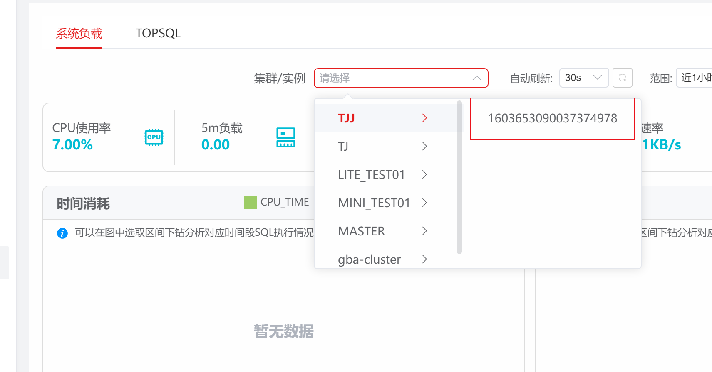
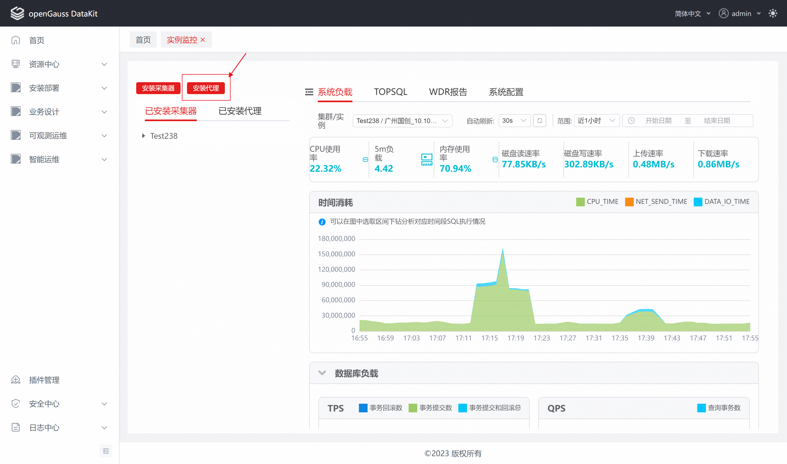
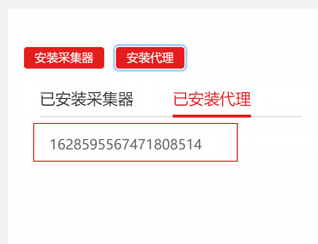
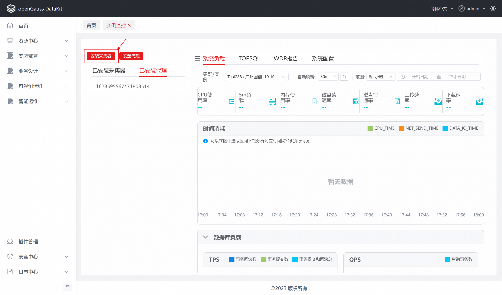
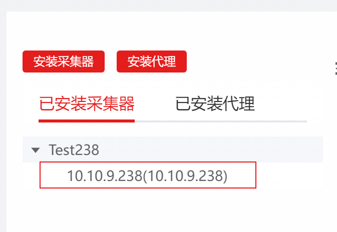
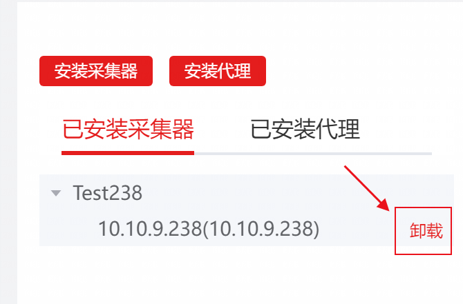
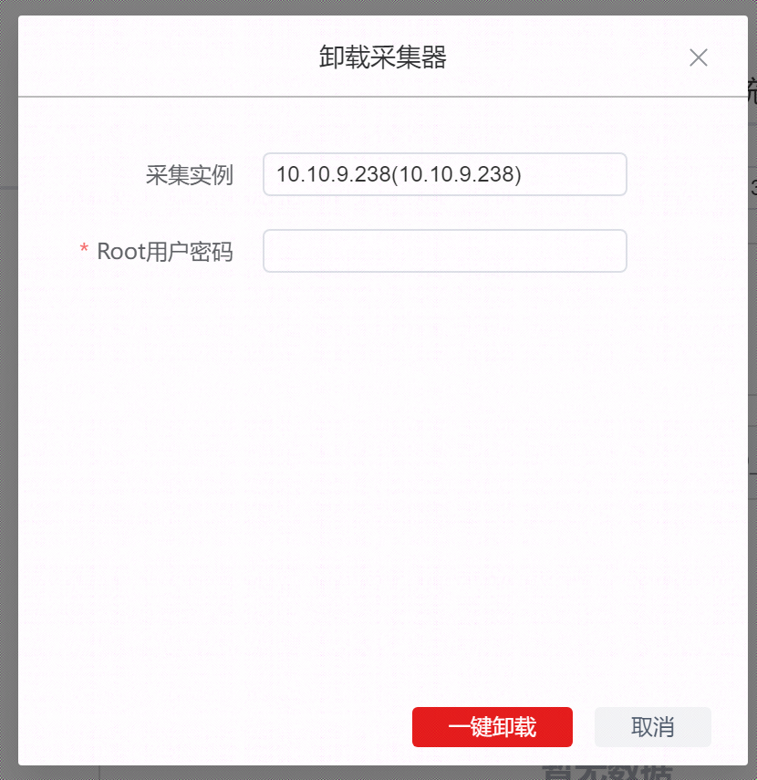

# 实例监控插件介绍


## 版本介绍

observability-instance 项目目前版本为 1.0.0，主要目的是为 openGauss 用户提供实例监控能力。

它作为一体化平台的可插拔插件开发，本特性依赖于openGauss一体化平台的插件特性。


## 项目背景

实例监控支持监控 openGauss 数据库以及数据库所在服务器，本特性主要关注数据库和操作系统监控指标，以及 TOPSQL 捕获和分析。

与其他需求及特性的交互分析：支持关联 SQL 诊断功能，进入 TOPSQL 详情页面，用户可触发创建诊断任务，对 TOPSQL 进行诊断分析。


## 功能特性介绍


<table>
    <tr>
        <th>特性名称</th>
        <th>特性描述</th>
        <th>备注</th>
    </tr>
    <tr>
        <td>实例监控</td>
        <td>支持openGauss数据库实例监控关键信息监控能力</td>
        <td>无</td>  
    </tr>
</table>


## 版本使用注意事项

- observability-instance 项目是作为 openGauss 一体化平台插件进行开发，使用本项目必须依赖一体化平台。
- observability-instance 为一个 Java 应用，在构建时需确保配置 Java 11+的JDK

## 安装说明

```
#下载源码：
git clone git@gitee.com:opengauss/openGauss-workbench.git
#进入根目录
cd plugins/observability-instance
#执行maven命令打包
mvn clean package -P prod
```

- 打包完成后在plugins/observability-instance 目录中找到observability-instance-1.0.x-SNAPSHOT-repackage.jar即为插件安装包。
- 打开并登陆openGauss一体化平台，点击插件管理-安装插件，将上诉步骤获得的安装包上传并安装。
- 刷新页面可在右侧菜单栏看到”智能运维”一级菜单下的“实例监控”二级菜单即为安装成功。

## 数据采集部署说明

### 一、部署数据采集代理

1. 点击“实例监控”插件首页左上角的折叠按钮，打开“安装部署”侧边栏

   

2. 点击“安装代理”按钮，弹出安装框

   

3. 选择对应物理机，输入Root密码，点击“一键部署”即可完成安装

   

4. 安装完成后，即可在“已安装代理”TAB中看到对应采集代理的信息

   

### 二、部署数据采集器

1. 点击“安装采集器”按钮，弹出安装框

   

2. 选择对应数据库实例，输入Root密码，点击“一键部署”即可完成安装

   

3. 安装完成后，即可在“已安装采集器”TAB中看到对应采集采集器的信息

   

### 三、查看数据

1. 实例对应的采集器安装完成后，即可通过“实例监控“插件中各功能的“集群/实例”控件，过滤查看对应的实例的数据

   

### 四、卸载

1. 在“已安装采集器”和“已安装代理”列表中，鼠标悬停后会显示“卸载”按钮，点击卸载按钮，打开卸载窗口

   

2. 输入Root密码后，点击“一键卸载”，即可进行卸载操作

   

## 使用说明

- 具体使用方式见使用文档


# 参与贡献

**参与贡献**

作为openGauss用户，你可以通过多种方式协助openGauss社区。参与社区贡献的方法请参见[社区贡献](https://opengauss.org/zh/contribution.html)，这里简单列出部分方式供参考。

**特别兴趣小组**

openGauss将拥有共同兴趣的人们聚在一起，组成了不同的特别兴趣小组（SIG）。当前已有的SIG请参见[SIG列表](https://opengauss.org/zh/contribution.html)。

我们欢迎并鼓励你加入已有的SIG或创建新的SIG，创建方法请参见[SIG管理指南](https://opengauss.org/zh/contribution.html)。

**邮件列表和任务**

欢迎你积极地帮助用户解决在[邮件列表](https://opengauss.org/zh/community/mails.html)和issue任务（包括[代码仓任务](https://gitee.com/organizations/opengauss/issues)） 中提出的问题。另外，我们也欢迎你提出问题。这些都将帮助openGauss社区更好地发展。

**文档**

你不仅可以通过提交代码参与社区贡献，我们也欢迎你反馈遇到的问题、困难，或者对文档易用性、完整性的改进建议等。例如获取软件或文档过程中的问题，使用系统过程中的难点。欢迎关注并改进openGauss社区的文档模块。

**IRC**

openGauss也在IRC开辟了频道，作为提供社区支持和交互的额外渠道。详情请参见[openGauss IRC](https://opengauss.org/zh/community/onlineCommunication.html)。

# 开源的资料文档应附有对应的文档许可证

本文档遵循[知识共享许可协议CC 4.0](https://creativecommons.org/licenses/by/4.0/) (http://creativecommons.org/Licenses/by/4.0/)。