# 实例监控插件(observability instance) 用户手册


## 1 简介

​		实例监控插件主要目的是为 openGauss 用户提供实例监控能力。它作为一体化平台的可插拔插件开发，本特性依赖于openGauss一体化平台的插件特性。

​		实例监控支持监控 openGauss 数据库以及数据库所在服务器，本特性主要关注数据库和操作系统监控指标，以及 TOPSQL 捕获和分析。

​		与其他需求及特性的交互分析：支持关联 SQL 诊断功能，进入 TOPSQL 详情页面，用户可触发创建诊断任务，对 TOPSQL 进行诊断分析。


## 2 前言


### 2.1 概述

​	本章介绍手册相关信息。


### 2.2 读者对象

​	本手册主要适用于以下人员：

- 数据库开发人员
- 数据库管理员


### 2.3 修订记录

| 日期       | 版本   | 变更说明                                                     | 修改人 | 审核人 |
| ----------------- | ------------- | ------------------------------------------------------------ | ------------- | ------------- |
| 2023/03/13 | v1.0.0 | 新增编译初版                                                 | 巫悦彬 | 曾色亮 |
| 2023/06/08        | v2.0.0        | 新增实例监控,资源监控,实例指标,会话监控,SQL详情等待事件,采集器模块说明 | 刘鹏飞        | 曾色亮        |
| 2023/10/16 | v3.0.0 | 首页新增实例信息、实例SQL详情、会话数量优化、WDR报告匹配快照、等待事件等功能；CPU页面Top部分展示完整command、识别gaussdb、CPU使用率补充、TOP数据库线程关联会话id和sqlid；TOPSQL新增IO_TIME tab页面；新增ASP页面优化采样活跃会话数量和ASP分析；删除会话监控功能 | 巫悦彬 | 曾色亮 |
| 2023/12/14 | v5.1.1 | 更新新界面原型图；增加集群统计信息、切换记录、拓扑图页面说明；增加指标存储时长配置，采集间隔配置说明；增加代理器支持外部部署及一对多采集说明。 | 杨子浩 | 杨子浩 |


### 2.4 文档约定

​	本节描述了本手册的（内容、符号、GUI 和文本）约定。

**图形化界面格式约定**

​    	本手册中可能出现下列图形化界面格式约定，它们所代表的含义如下。

| 格式 | 说明                                                         |
| ---- | ------------------------------------------------------------ |
| 粗体 | 按钮、菜单、参数、页签、窗口及对话框标题均使用【】括起来。例如，单击【确定】。 |


### 2.5 第三方许可证

​	本节包含适用于该插件的第三方许可证。

​	**表2-1 第三方软件列表**

| 第三方软件     |
| -------------- |
| 木兰宽松许可证 |


### 2.6 参考文档

无


## 3 简介


### 3.1 概述

​	实例监控插件主要目的是为 openGauss 用户提供实例监控能力。它作为一体化平台的可插拔插件开发，本特性依赖于openGauss一体化平台的插件特性。

​	实例监控功能主要分系统负载、TOPSQL、WDR报告、ASP、系统配置、采集配置、代理端和服务端安装卸载功能等功能。


### 3.2 支持的功能

​	实例监控插件提供的功能如下：

| 功能模块                 | 功能说明                                                     |
| ------------------------ | ------------------------------------------------------------ |
| **首页**                 | 展示系统资源统计图<br />展示活跃会话数量图<br />展示实时TOPSQL、阻塞会话、长事务、等待事件等表格 |
| **资源监控**             | CPU：展示CPU使用率图、CPU平均负载图、TOP操作系统进程表、TOP数据库线程表<br />内存：展示内存使用率图、内存使用表、交互区使用情况图、交互区使用表、TOP操作系统进程表、TOP数据库线程表<br />IO：展示磁盘分区IO统计表、IOPS图、每秒读/写字节数图、I/O队列长度图、I/O使用率图、平均IO响应时间图<br />网络：展示网络流量(流入)图、网络流量(流出)、网卡丢包数量、网络socket连接信息、TCP socket数量统计、UDP socket数量统计、网卡传输统计表 |
| **实例指标**             | 展示实例的TPS图、QPS图、连接数图、慢SQL数图                  |
| **TOPSQL**               | 可查看按不同维度（DB_TIME、CPU_TIME、、EXEC_TIME、IO_TIME）排列前十的 sql 语句 |
| **WDR报告**              | 支持快照管理和生成<br />展示WDR报告列表，支持WDR报告的增删改查 |
| **系统配置**             | 展示系统配置参数和数据库配置参数，支持参数的查询和刷新       |
| **代理和服务端安装卸载** | 支持代理（agent）和服务端（prometheus）的安装和卸载          |
| **ASP**                  | 采样活跃会话数量 <br />ASP分析                               |
| **集群监控**             | 集群列表与统计信息<br />主备延迟列表 <br />集群详情与集群拓扑<br />切换记录 |
| **采集配置**             | 支持对不同实例，不同指标进行采集间隔配置                     |


### 3.3 约束和限制

**WDR报告生成**

WDR报告基于快照生成，而且必须至少要有两个不同版本的快照才能生成。当没有快照时，需先进行快照生成，再进行WDR报告生成。

**代理安装**

前置条件：服务端不存在时，先安装服务端。

**服务端安装**

只能安装一个服务端。

**项目运行**

本项目依赖一体化主平台，若需要使用本项目所有功能，只能通过编译成 jar 包的形式作为插件运行在主平台上。


### 3.4 实例监控插件项目结构

下载实例监控插件项目代码：

```
git clone https://gitee.com/opengauss/openGauss-workbench
```

实例监控插件项目结构如下图所示：


<center>图3.1 实例监控插件项目结构

实例监控插件项目结构说明如下：

<center>表3.1 实例监控插件项目结构

| 文件夹/文件      | 说明                   |
| ---------------- | ---------------------- |
| src              | 保存后端代码及资源文件 |
| web-ui           | 保存前端代码           |
| InstanceExporter | 保存采集器源码         |
| .gitignore       | 提交git忽略的目录      |
| pom.xml          | 后端依赖项             |
| LICENSE          | 许可证                 |


### 3.5 系统要求

​	本节介绍使用实例监控插件的最低系统要求。

**浏览器兼容性**

| 内置对象 \ 浏览器及版本                                      | Chrome | Edge | Firefox | Opera | Safari |
| :----------------------------------------------------------- | :----: | :--: | :-----: | :---: | :----: |
| `Proxy`                                                      |   49   |  12  |   18    |  36   |   10   |
| [`Proxy()` constructor](https://developer.mozilla.org/en-US/docs/Web/JavaScript/Reference/Global_Objects/Proxy/Proxy) |   49   |  12  |   18    |  36   |   10   |
| [`revocable`](https://developer.mozilla.org/en-US/docs/Web/JavaScript/Reference/Global_Objects/Proxy/revocable) |   63   |  12  |   34    |  50   |   10   |

**系统要求**

| 操作系统 | 版本           |
| -------- | -------------- |
| windows  | windows7及以上 |

**软件要求**

| 软件 | 规格         |
| ---- | ------------ |
| Java | jdk 11及以上 |

**数据库版本要求**

| 数据库    | 版本 |
| --------- | ---- |
| openGauss | 所有 |


## 4 部署实例监控插件

​	 本章详细介绍如何部署实例监控插件。

​     前端技术栈：Vue3.0 + TS + Element plus

​     后端技术栈：Java + Spring boot


### 4.1 编译项目并部署至一体化平台

**前置条件：** ① 安装 node.js，建议使用 v16 以上版本；

​                   ② 安装Java jdk （建议使用v11及以上版本） 和 maven 3.X。

**步骤 1：**  检查自动构建前端项目的配置是否为false；

```
在 plugins > observability-instance > pom.xml 下将以下值设为false：
<web.build.skip>false</web.build.skip>
<web.clean.skip>false</web.clean.skip>
```

**步骤 2：**  启动打包命令；

```
mvn clean package -P prod
```

**步骤 3：** 在target目录下找到生成的jar，安装到一体化平台。


<center>图4.1 界面示例


### 4.2 启动后端项目

暂不支持本地调试。


## 5 使用指导


### 5.1 概述

​	本章详细介绍如何使用实例监控插件的功能。


### 5.2  代理和服务端的安装和卸载

代理（agent）主要是实时采集数据库实例的系统资源和数据库相关指标数据;服务端（prometheus）主要是定时拉取代理采集的数据，并存储起来，用于页面展示和数据分析。下面主要介绍代理和服务端的安装和卸载。

#### 5.2.1 代理和服务端的安装

**步骤 1：** 点击左边菜单【智能运维】-【实例监控】，打开【实例监控】tab,点击tab内容的左上角的收缩按钮，如下图：

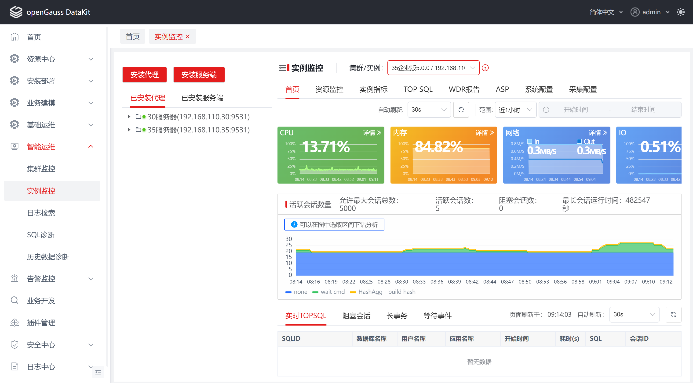

<center>图5.1 安装按钮

**步骤 2：** 安装代理/服务端：点击【安装代理】按钮或者【安装服务端】按钮。

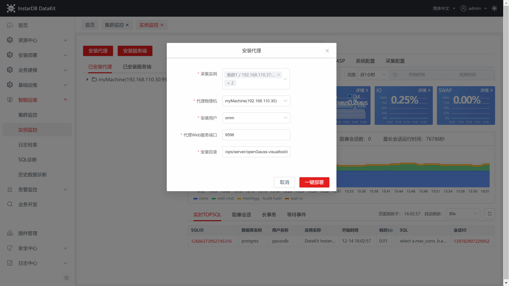

<center>图5.2 安装代理

选择离线时，若安装包不存在，则需要上传安装包：

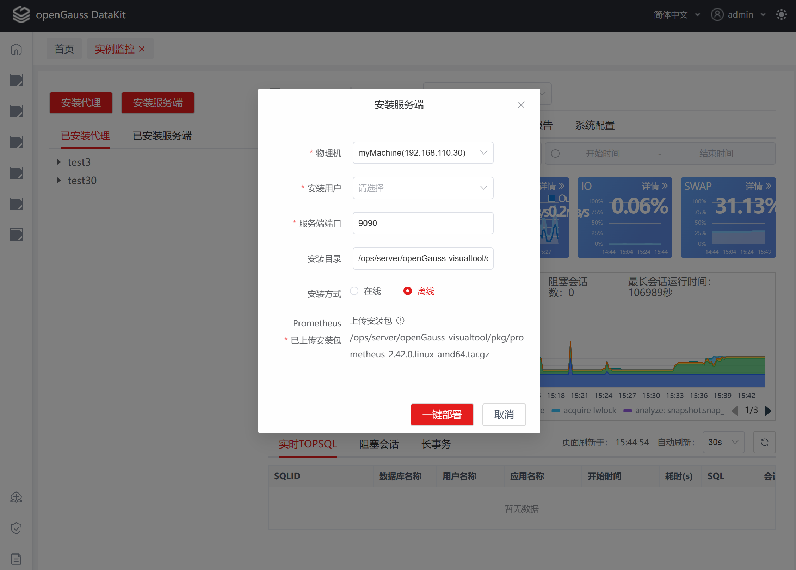

<center>图5.3 离线安装服务端

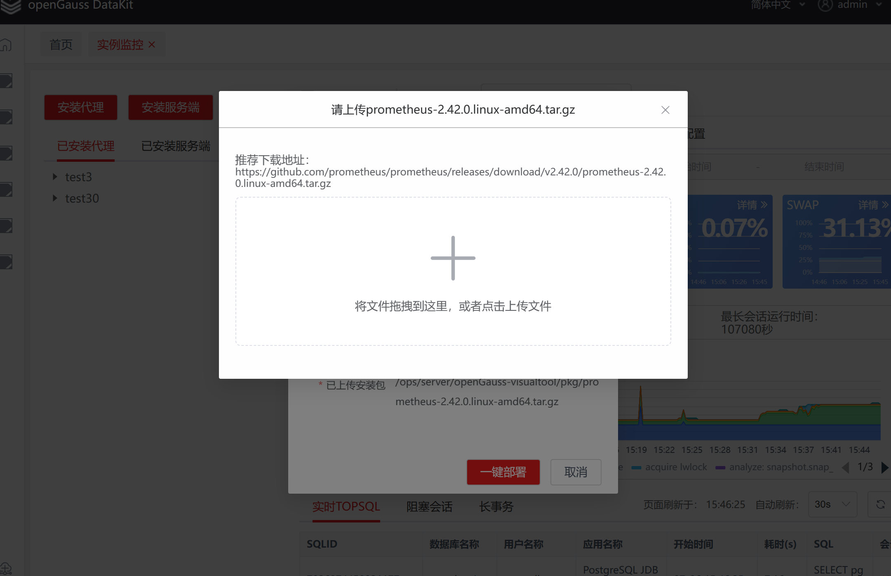

<center>图5.4 上传prometheus安装包

**步骤 3：** 填写表单，点击一键部署。

​			   **说明：** 所有必选参数均需要填写。必填参数用星号（*）标识。

<center>表5.1 代理安装配置项

| 配置项              | 必填 | **组件形式** | 配置说明                                                     |
| ---------------------- | --------- | ------------- | ---------------------------------------------------------- |
| 采集实例        | 是 | 多选下拉框 | 平台已安装的实例，从其中选择需要安装代理器并监控的具体实例 |
| 代理物理机      | 是 | 下拉框 | 选择代理需要安装到哪台物理机                        |
| 安装用户        | 是 | 下拉框 | 选择安装代理器的物理机用户                          |
| 代理web服务端口 | 是 | 输入框 | 默认9596，供服务端拉取指标数据使用                  |
| 安装目录        | 是 | 输入框 | 代理器安装的目录                                    |

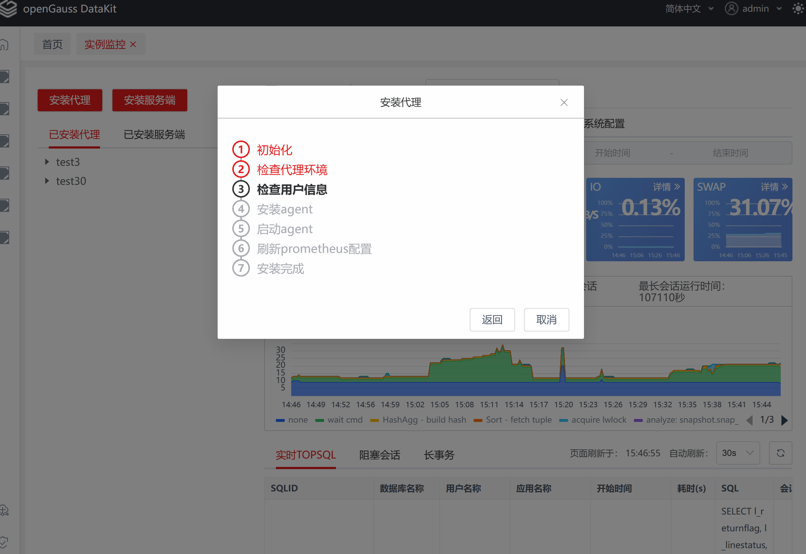

<center>图5.5 代理安装流程

<center>表5.2 服务端安装配置项

| 配置项       | 必填 | **组件形式** | 配置说明                                                     |
| ------------------- | --------- | ------------- | ------------------------------------------------------------ |
| 物理机       | 是 | 下拉框 | 平台可用的服务器设备，默认选第一个                    |
| 安装用户     | 是 | 下拉框 | 安装服务端的用户名                                    |
| 服务端端口 | 是 | 输入框 | 默认9090                                              |
| 安装目录     | 是 | 输入框 | 输入服务端的安装的目录                                |
| 数据存储时长 | 是 | 输入框 | 指标数据在服务端保留的时长，超出时长数据会被清理      |
| 安装方式 | 是 | 输入框 | 分【在线】和【离线】，默认选在线                      |
| Prometheus | 否 | 文件上传框 | Prometheus安装包上传路径。安装方式为【离线】时，必填。根据提示，上传Prometheus安装包，上传完成后，显示安装路径 |

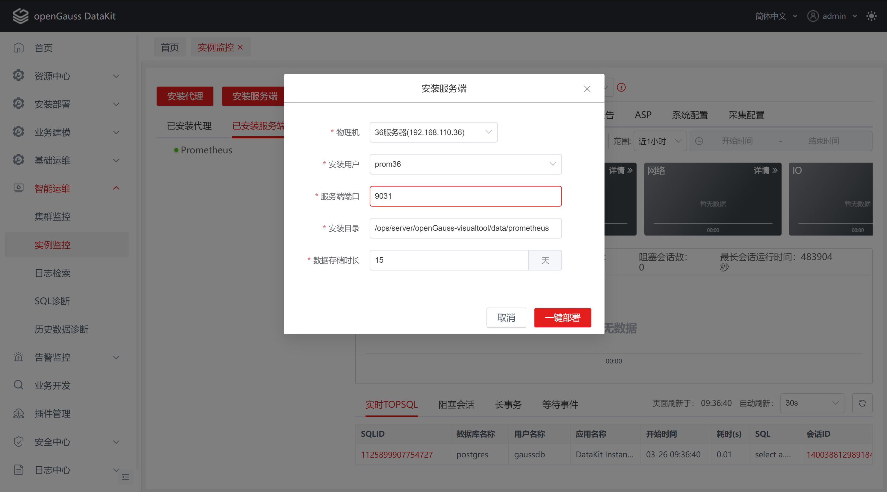

<center>图5.6 安装服务端

#### 5.2.2 代理的编辑


1、点击左边菜单【智能运维】-【实例监控】，打开【实例监控】tab,点击tab内容的左上角的收缩按钮，点击【已安装代理】，可查看当前安装的代理；

2、方式1：树状图第1层表示的是代理，鼠标悬浮后，会显示【编辑】按钮，点击编辑按钮打开编辑界面；

3、方式2：树状图第2层表示集群，第3层表示数据库实例，鼠标在第3层悬浮后，会显示【删除】按钮，点击删除按钮也会打开编辑代理界面，默认将点击删除的实例排除；

4、在弹出的编辑代理界面，可按需修改【采集实例】，点击【一键部署】按钮即可修改代理采集设置。

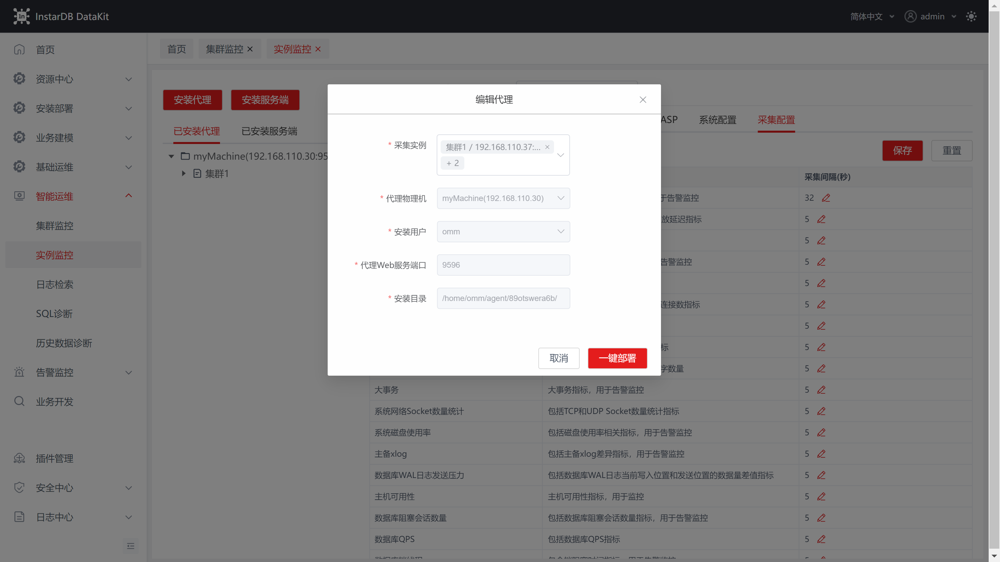

<center>图5.7 编辑代理界面

#### 5.2.3 代理和服务端的卸载

1、 点击左边菜单【智能运维】-【实例监控】，打开【实例监控】tab,点击tab内容的左上角的收缩按钮

2、点击【已安装代理】或者【已安装服务端】，展开对应的安装菜单，继续点击菜单，将鼠标移到对应的实例。

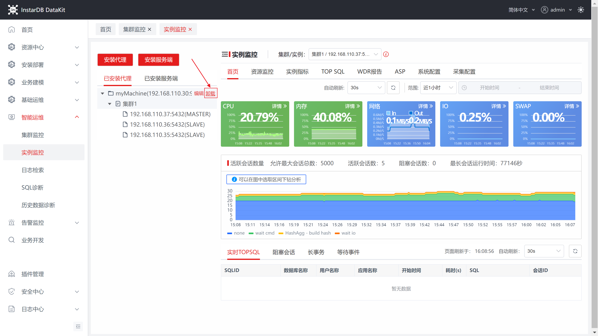

<center>图5.7 代理和服务端的卸载
3、 点击【卸载】，填写表单，点击【一键卸载】，完成卸载。

​				**说明：** 所有必选参数均需要填写。必填参数用星号（*）标识。

<center>表5.3 【代理卸载】配置项

| 配置项   | 必填 | **组件形式** | 配置说明                       |
| -------- | ---- | ------------ | -------------------------------- |
| 代理信息 | 是   | 输入框       | 不可修改，显示需要卸载的代理信息 |

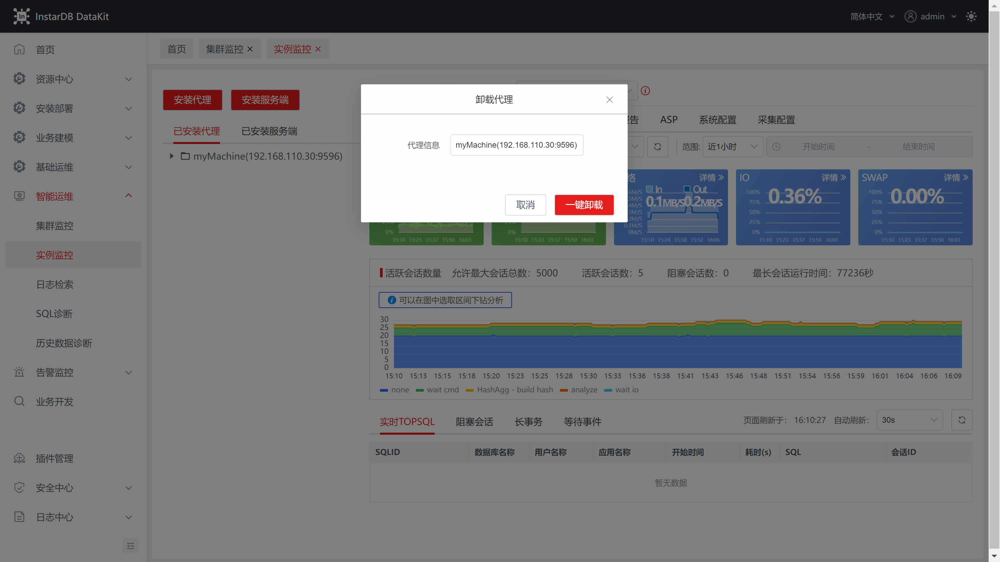

<center>图5.8 卸载代理

<center>表5.4【服务端卸载】配置项

| 配置项 | 必填 | **组件形式** | 配置说明                         |
| ------ | ---- | ------------ | ---------------------------- |
| 物理机 | 是   | 输入框       | 不可修改，显示物理机相应信息 |

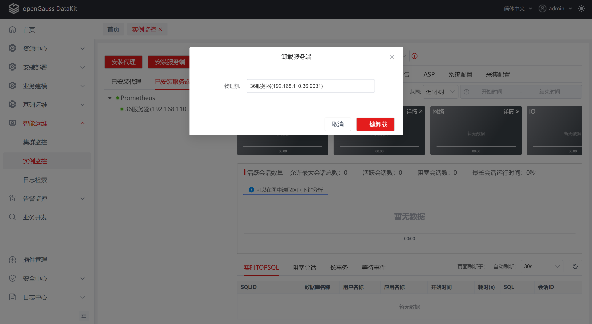

<center>图5.9 卸载服务端


### 5.3 首页

首页主要是展示实例的总体状态，包括实例信息、CPU、内存、网络、IO、SWAP、活跃会话数量、实时TOPSQL、阻塞会话、长事务、等待事件等信息，支持对活跃会话数量、实时TOPSQL、阻塞会话、长事务、等待事件的分析。下面是对首页进行介绍：

进入插件后，默认选择【首页】 tab，展示数据库实例的CPU、内存、网络、IO、SWAP的总体情况；展示数据库实例的活跃会话情况，支持对其进行分析（TOP_SQL、智能诊断、WDR分析）；展示数据库实时TOPSQL、阻塞会话、长事务、等待事件。

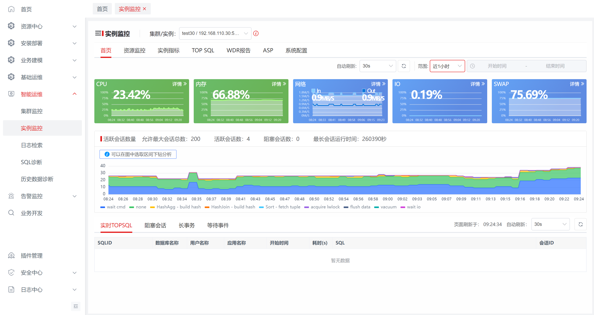

<center>图5.10 首页

在活跃会话中选取区间，可对会话进行一步分析（TOP_SQL、智能诊断、WDR分析）：点击【TOP_SQL】跳转到【TOP_SQL】tab，可查看该时间段的实例前十的TOP SQL详细信息；点击【智能诊断】跳转到【历史数据诊断】页面，可对实例进行诊断；点击【WDR分析】，跳转到【WDR报告】tab,可对实例的WDR进行进一步分析。


<center>图5.11 会话下钻分析


### 5.4 系统负载

​	【资源监控】包括【CPU】，【内存】，【IO】，【网络】部分。

####  5.4.1 CPU

实时展示实例的CPU相关指标数据、操作系统前十进程的CPU使用详细情况、数据库前十线程的CPU使用详细情况。

【CPU】tab包含CPU使用率、CPU平均负载、TOP操作系统进程、TOP数据库线程，支持TOP CPU SQL、智能诊断、WDR分析等功能

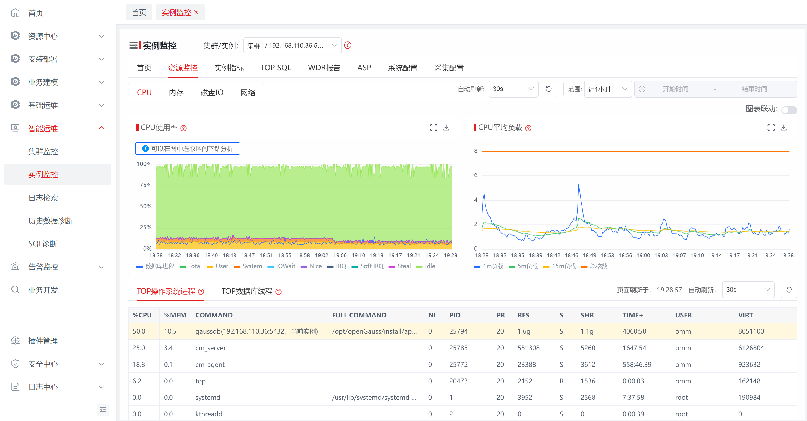

<center>图5.12 CPU


#### 5.4.2内存

实时展示实例的内存相关指标数据、内存使用情况、交互区使用情况、操作系统前十进程的详细情况、数据库前十线程的详细情况

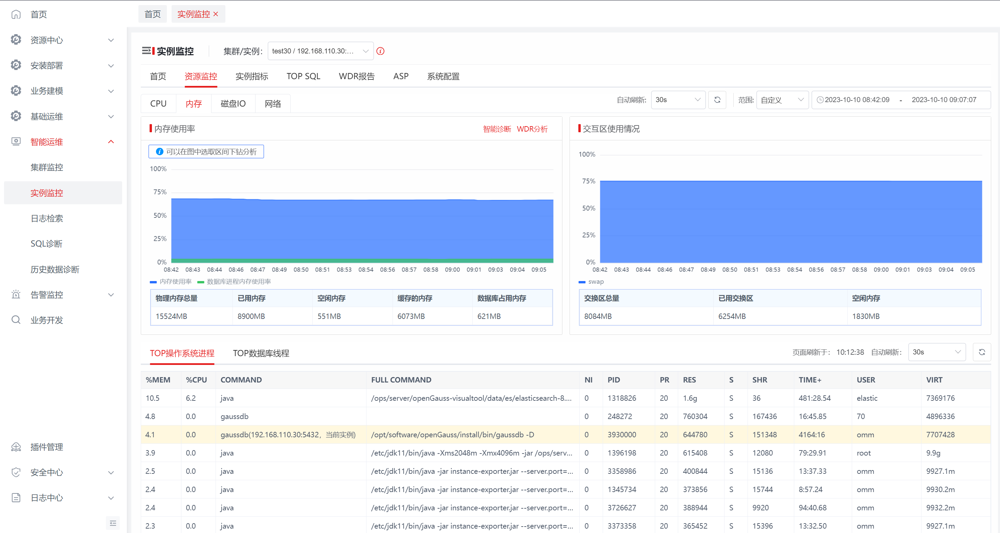

<center>图5.13 内存


#### 5.4.3 IO

实时展示实例的磁盘分区IO统计数据、IO相关指标数据：展示磁盘分区IO统计、IOPS、磁盘每秒读/写字节数、I\O队列长度、I\O使用率、平均IO响应时间，支持TOP CPU SQL、智能诊断、WDR分析等功能

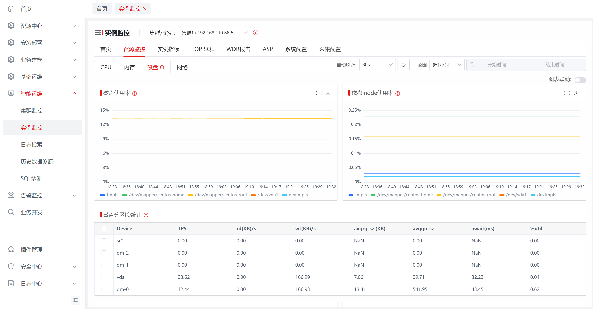

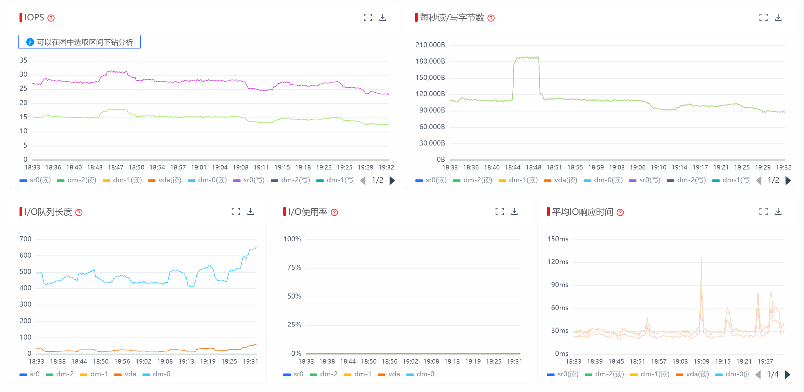

<center>图5.14 磁盘IO


#### 5.4.4网络

实现对实例的网络情况进行监控，展示网络流量（流入）、网络流量（流出）、网卡丢包数量、网络socket连接信息、TCP socket数量统计、UDP socket数量统计、网卡传输统计等，支持智能诊断、WDR分析


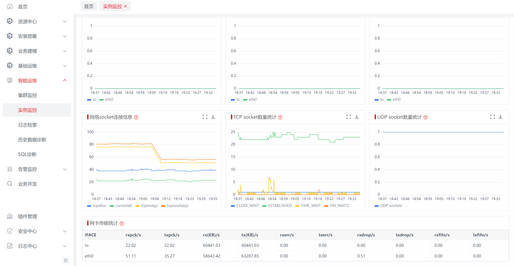

<center>图5.15 网络


### 5.5 实例指标

【实例指标】主要是分为【实例概况】、【实例负载】和【实例空间】三个TAB。

#### 5.5.1实例概况

展示数据库实例的缓存命中率表格、连接数、慢SQL数、平均SQL响应时间、每秒读取磁盘数据量。

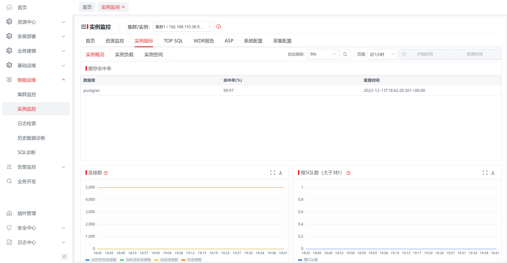

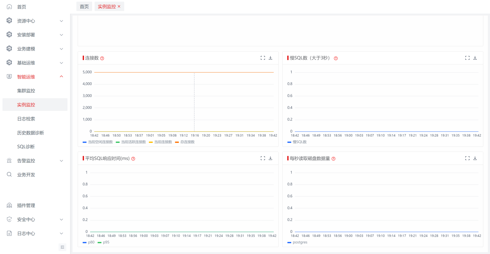

<center>图5.16 实例概况

#### 5.5.2实例负载

展示数据库实例TPS、QPS、每秒插入数据量、每秒更新数据量、每秒删除数据量、每秒全表扫描数据量、每秒索引扫描回表数据量、每秒清除脏块数据量

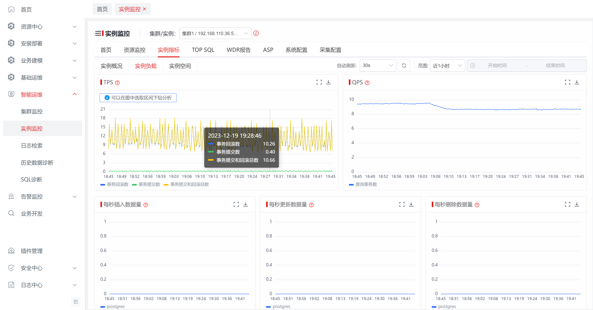

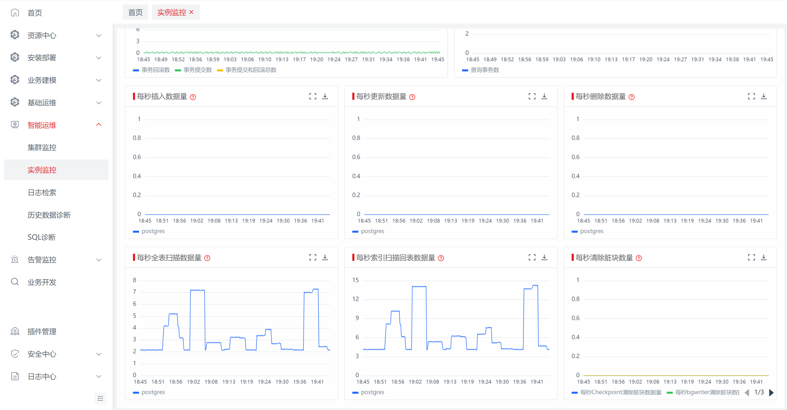

<center>图5.17 实例负载

#### 5.5.3实例空间

展示表空间概况、表空间使用总量、容量前十的表、容量前十的索引、容量前十的死元组、前十建议vacuum的表

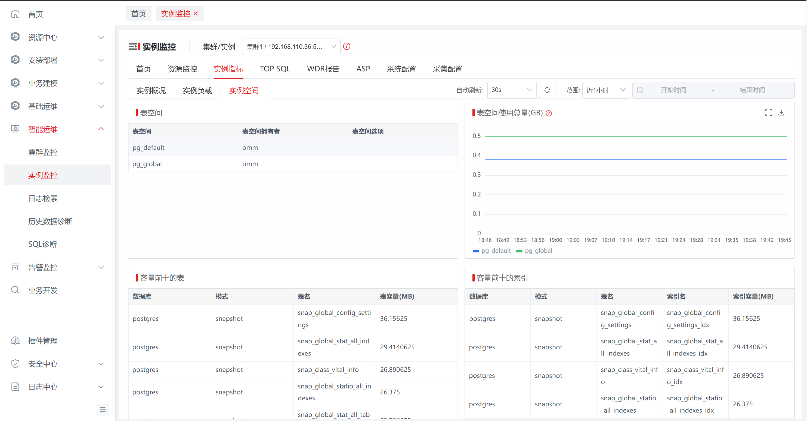

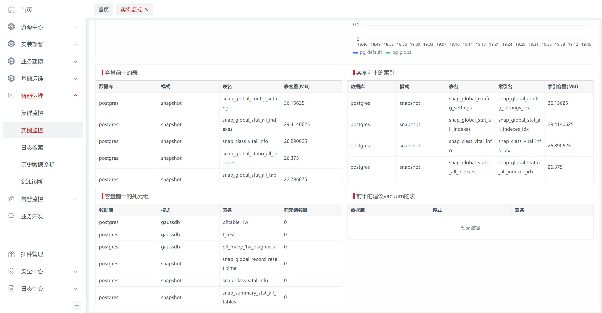

<center>图5.18 实例空间


### 5.6 TOPSQL

 【TOPSQL】主要是对执行总耗时、CPU耗时、执行耗时、IO耗时靠前的SQL进行展示，同时支持对TOPSQL的分析，包括对SQL语句的基本信息统计、执行信息统计、耗时统计、执行计划分析、SQL语句的资源监控、索引建议、等待事件分析（930新增）、SQL诊断等功能分析。

​	选择 【TOPSQL】 tab可查看按不同维度（DB_TIME、CPU_TIME、、EXEC_TIME、IO_TIME）排列前十的 sql 语句 。

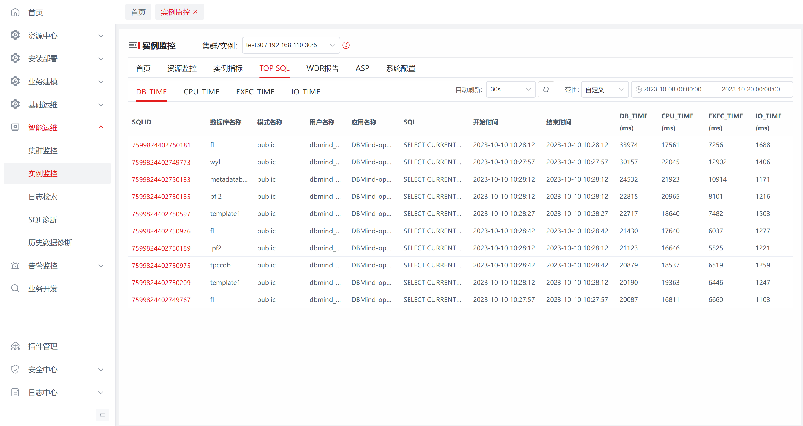

<center>图5.19 TOPSQL


可点击 【SQLID】 进入详情页面。

【实例监控详情】：

（1）点击【 SQLID 】进入详情页面，默认展示统计信息页。

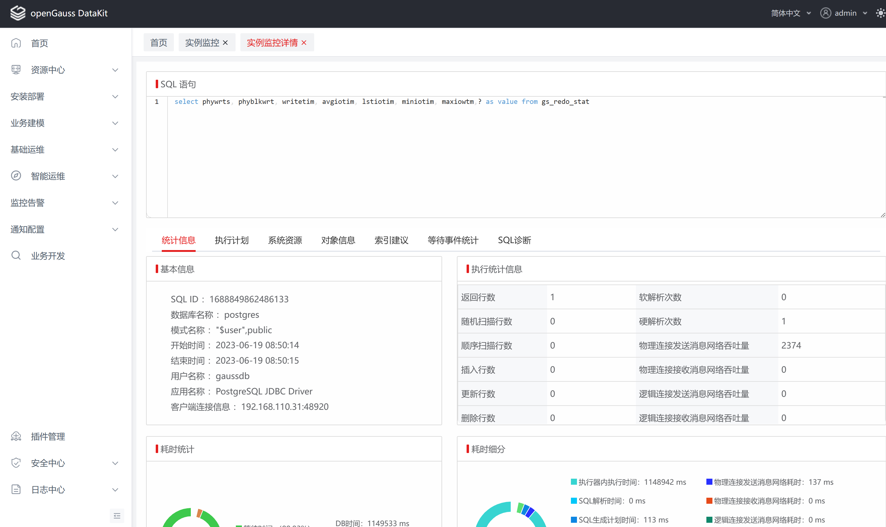

<center>图5.20 sql详情页


完整的【统计信息】部分：


<center>图5.21 sql统计信息


（2）执行计划：

展示可视化的【执行计划】数据，点击右侧按钮可高亮显示对应的行。


<center>图5.22 执行计划
（3）系统资源：


<center>图5.23 系统资源
（4）对象信息

【对象信息】tab下，可选择对应的对象，右侧展示涉及到的【基本信息】，【对象结构】，【索引信息】。


<center>图5.24 对象信息
（5）索引建议

根据建议规则给出 sql 对应的【索引建议】。


<center>图5.25 索引建议
（6）等待事件统计

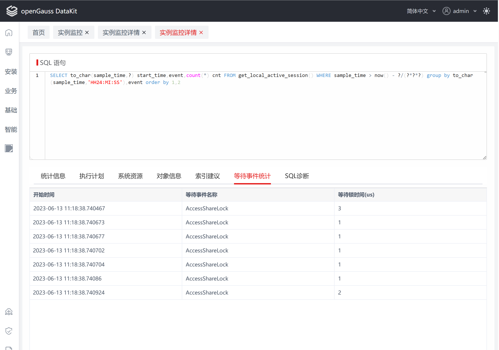

<center>图5.26 等待事件统计
（7）sql 诊断

在这里可以对当前的sql进行诊断分析，通过点击可跳转至【诊断详情】。


<center>图5.27 sql诊断


### 5.7 WDR报告

WDR是一个监控openGauss数据库特性的衍生品，通过分析时间范围内的保存的性能快照数据，生成WDR报告，帮助用户及时发现数据库异常、问题诊断以及优化数据库性能等。

#### 5.7.1 WDR报告列表显示

点击【WDR报告】tab，进入WDR报告页面，选择【集群名称】，点击【查询】按钮，显示WDR报告列表。

​			   **说明：**【集群名称】、【报告范围】、【报告类型】选项为必选，其他查询条件可选；

​			              单击 【查询】将根据条件查询数据；

​                          单击 【重置】 即可重置列表。

<center>表5.5 WDR报告搜索

| 配置项   | 必填 | 组件形式   | 数据类型限制 | 配置说明                                                     |
| -------- | ---- | ---------- | ------------ | ------------------------------------------------------------ |
| 集群名称 | 是   | 下拉框     | -            | 平台已安装的实例，默认为空。                                 |
| 报告范围 | 是   | 下拉框     | -            | 分【集群】和【节点】，默认【集群】。                         |
| 报告类型 | 是   | 下拉框     | -            | 分【明细】、【汇总】和【全部】，默认明细。                   |
| 生产时间 | 否   | 时间下拉框 | 时间类型     | yyyy-MM-dd HH:mm:ss,可为空，默认当天00:00:00到当天23:59:59。 |

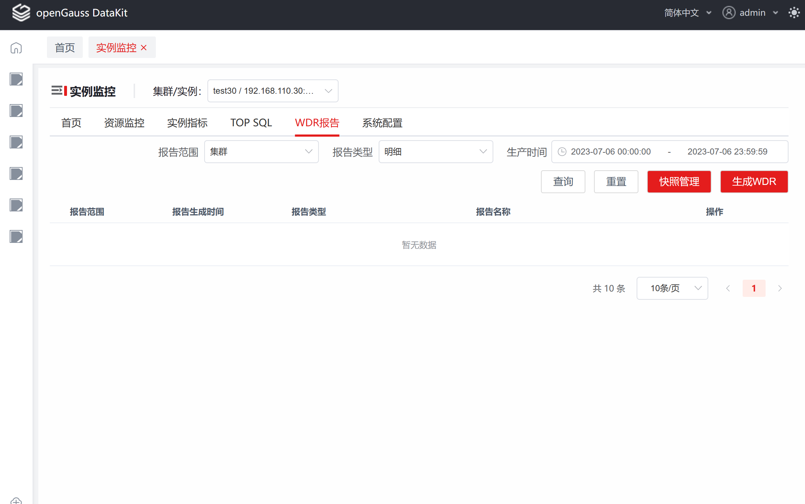

<center>图5.28 WDR报告


#### 5.7.2 快照管理

点击【快照管理】按钮，进入快照管理页面。

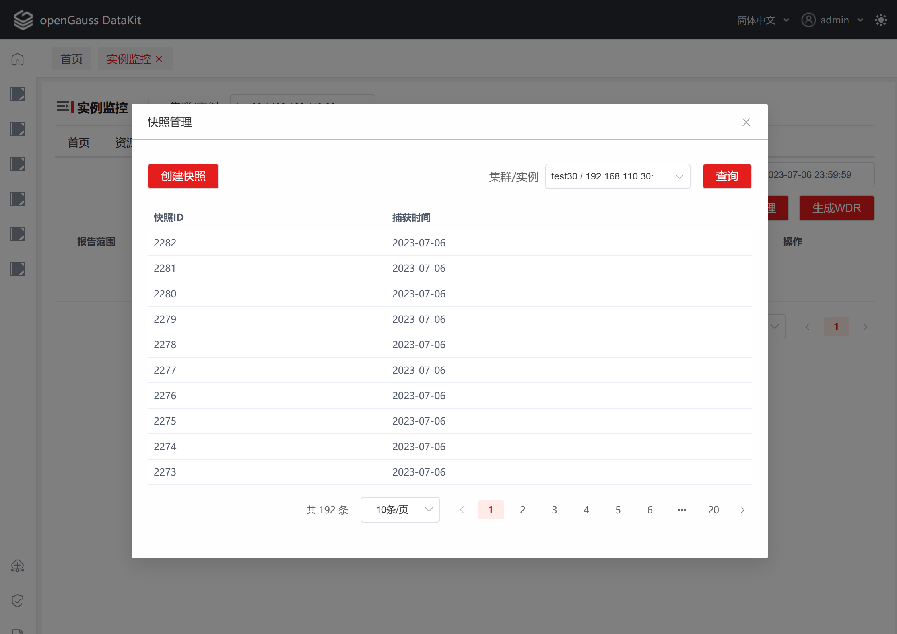

<center>图5.29 快照管理
    <center>表5.5 快照筛选
| 配置项    | 必填 | 组件形式 | 数据类型限制 | 配置说明     |
| --------- | ---- | -------- | ------------ | ------------ |
| 集群/实例 | 是   | 下拉框   | -            | 默认选第一个 |


#### 5.7.3 创建快照

​               选择【集群/实例】，点击【创建快照】，生成新的快照。

​              **说明**：由于创建快照有延迟，需要手动点击【查询】来刷新数据。


#### 5.7.4 生成WDR

​              在主页面点击【生成WDR】，进入【生成WDR】编辑页面，填写表单，点击【生成】。

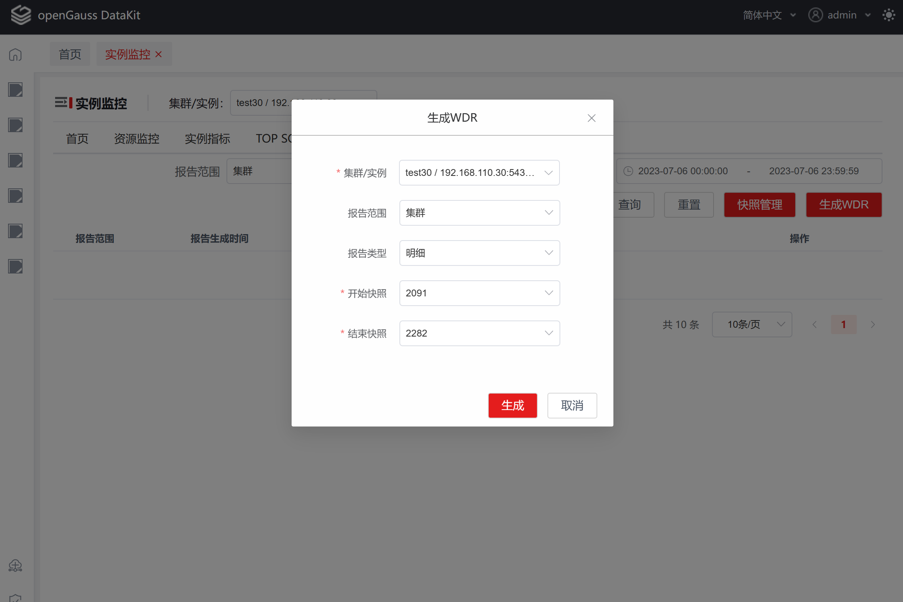

<center>图5.30 生成WDR
<center>表5.6 生成WDR

| 配置项    | 必填 | 组件形式 | 数据类型限制 | 配置说明                                                    |
| --------- | ---- | -------- | ------------ | ----------------------------------------------------------- |
| 集群/实例 | 是   | 下拉框   | -            | 平台已安装的实例，默认为空。                                |
| 报告范围  | 是   | 下拉框   | -            | 分【集群】和【节点】，默认【集群】。                        |
| 报告类型  | 是   | 下拉框   | -            | 分【明细】、【汇总】和【全部】，默认明细。                  |
| 开始快照  | 是   | 下拉框   | -            | 默认为倒数第20个快照，如果快照不足20条，将默认是第1条快照。 |
| 结束快照  | 是   | 下拉框   | -            | 默认为最后一个快照。                                        |

#### 5.7.5 查看快照

​              点击WDR报告列表中的某一个数据的【查看】操作按钮，将打开新页面，展示该数据的WDR报告详情。


<center>图5.31 查看快照
#### 5.7.6 WDR报告下载

​	           点击WDR报告列表中的某一个数据的【下载】操作按钮，下载该数据的WDR报告。

#### 5.7.7 WDR报告删除

​	          点击WDR报告列表中的某一个数据的【删除】操作按钮，弹出删除提示，选择【确定】，将删除该WDR报告。


<center>图5.32 WDR报告删除


### 5.8 系统配置

统一查看与数据库相关的OS、数据库参数信息以及调优建议。

#### 5.8.1 系统配置查询

​	           点击【系统配置】tab,分【数据库配置】和【系统配置】tab,默认显示【数据库配置】tab；选择【集群/实例】，输入【显示推荐者】/【全部】、【参数类型】、【参数名称】，点击【查询】，可查询对应的数据。

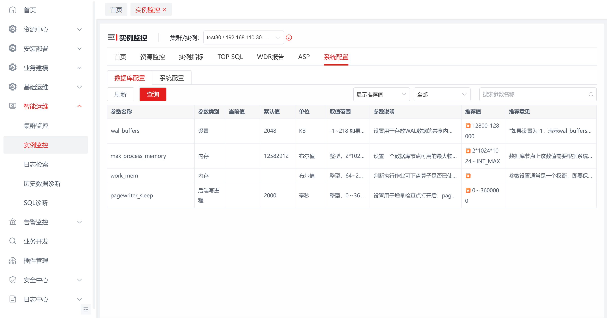

<center>图5.33 数据库配置查询


<center>图5.34 系统配置查询
#### 5.8.2 系统配置刷新

​               选择【集群/实例】，点击【刷新】，填写root密码，点击【确定】，可以刷新数据库配置参数或者系统配置参数。

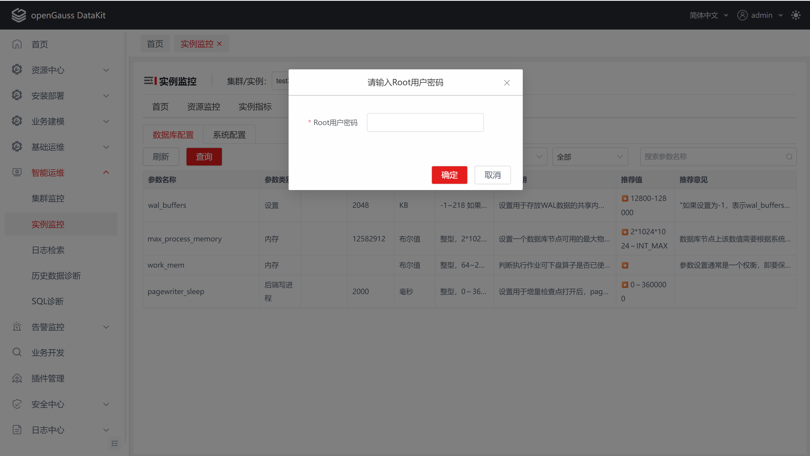

<center>图5.35 参数配置刷新


### 5.9 ASP

#### 5.9.1 采样活跃会话数量

​               点击【ASP】tab,选择【集群/实例】
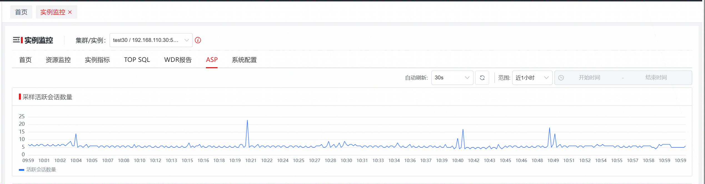

<center>图5.36 采样活跃会话数量

#### 5.9.2 ASP分析

​               点击【ASP】tab,选择【集群/实例】，选择【分析指标】
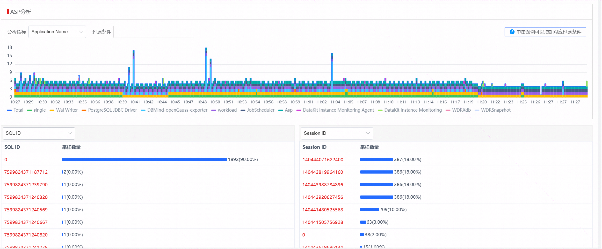

<center>图5.37 ASP分析

【分析指标】下拉框选项：Wait Status、Event、Database ID、Application Name
单击图例可以增加对应【过滤条件】


### 5.10 集群监控

#### 5.10.1 集群列表

​               点击菜单【集群监控】,选择【集群列表】tab
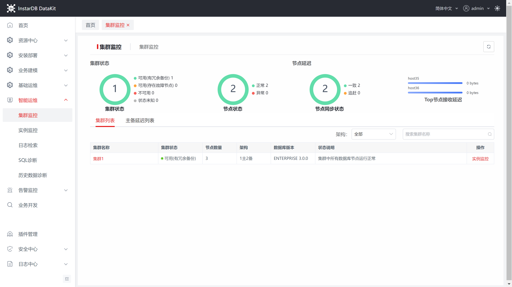

<center>图5.38 集群列表
点击操作中的【实例监控】，可跳转到主节点的实例监控

#### 5.10.2 主备延迟列表

​               点击菜单【集群监控】,选择【主备延迟列表】tab
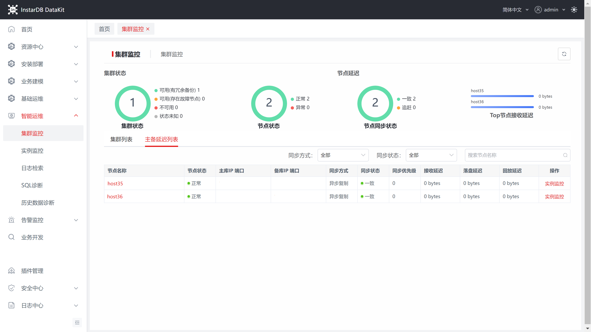

<center>图5.39 主备延迟列表

- 点击操作中的【实例监控】，可跳转到对应节点的实例监控
- 点击节点名称，可以跳转到对应节点的集群详情

#### 5.10.3 集群详情

​               点击菜单【集群监控】,选择【集群列表】tab，点击任一集群名称
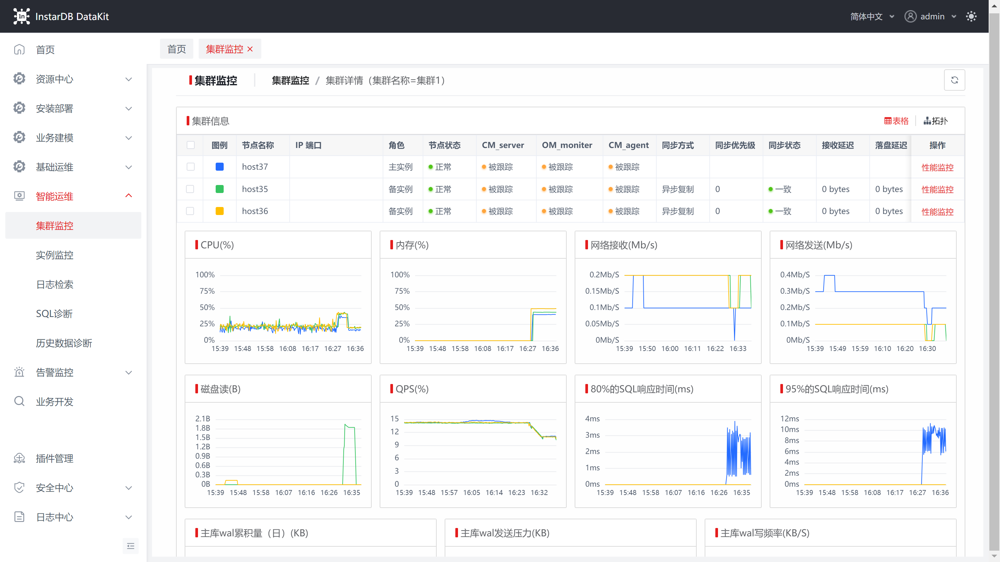

<center>图5.40 集群详情1

点击操作中的【性能监控】，可跳转到对应节点的实例监控

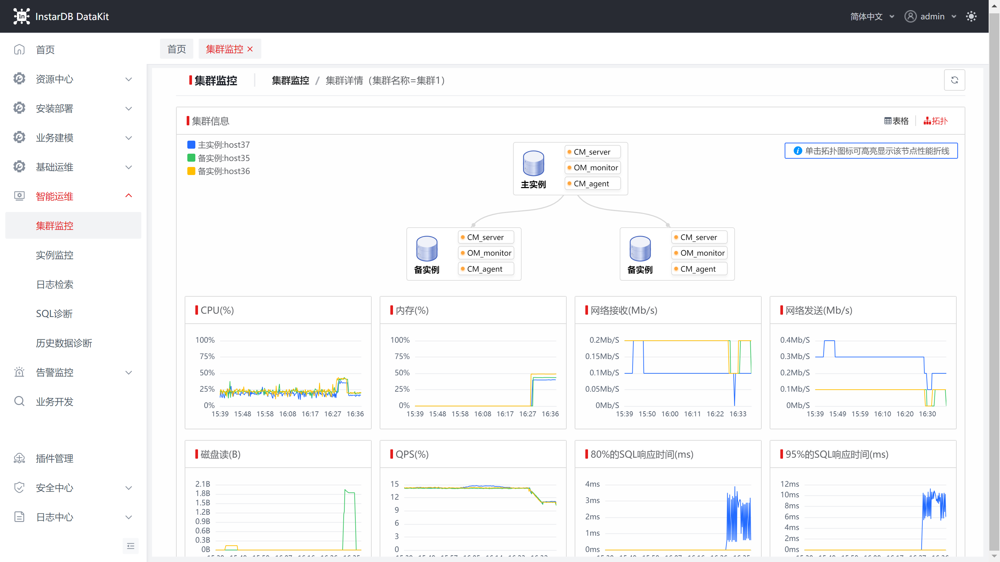

<center>图5.41 集群拓扑</center>

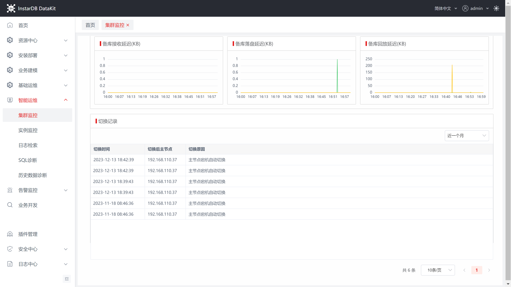

<center>图5.42 切换记录</center>


### 5.11 采集配置

#### 5.11.1 修改采集配置

1、点击菜单【实例监控】,选择【采集配置】tab；

2、点击【修改】按钮修改对应指标的采集间隔；

3、点击【保存】按钮，保存修改后的结果，提示“采集配置更新成功！”代表配置生效；

4、点击【重置】按钮，可将所有指标的采集间隔重置为默认采集间隔15s。

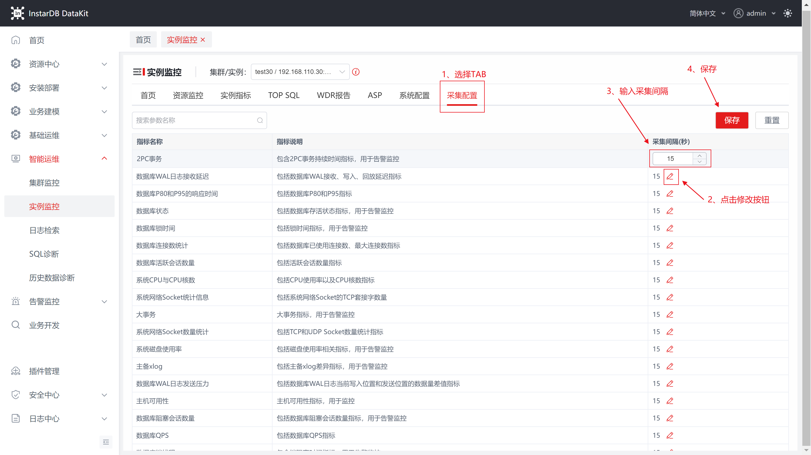

<center>图5.43 修改采集间隔


## 6 FAQS

1、使用在线安装代理或服务端时，安装界面卡住不动。

原因：服务器下载速度过慢或下载异常会发生此情况，可尝试使用离线安装的方式进行安装。

2、安装过程中错误信息提示yum install -y unzip zip 。

原因：需在服务器提前配置yum可用或者安装unzip和zip命令。

3、由于平台限制了上传文件大小，可能导致安装包上传失败，需要修改平台配置。


<center>图6.1 安装包上传

解决方案：修改平台配置文件/ops/server/openGauss-visualtool/config/application-cus.yml中对上传文件的大小限制大于安装包大小，然后重启平台。

```
spring.servlet.multipart:
  max-file-size: 1000MB
  max-request-size: 1000MB
```


