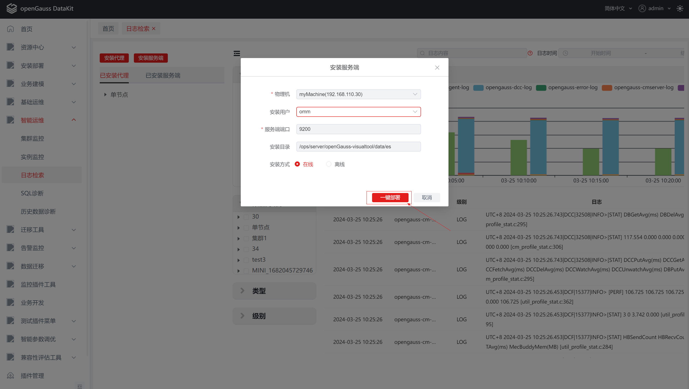
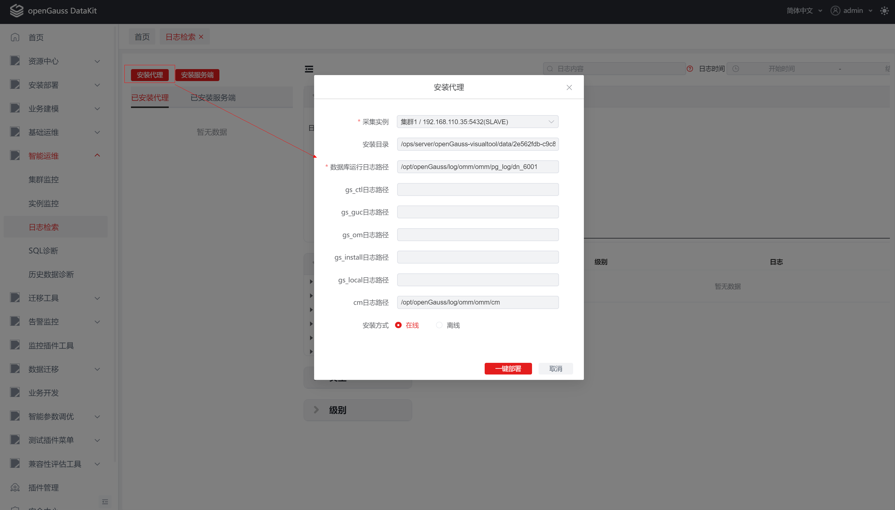

# 1日志检索插件(observability log search) 用户手册


## 1日志检索插件(observability log search)用户手册

​		日志检索插件主要目的是为用户提供OS日志、数据库操作日志、CM日志等统一检索入口。它作为一体化平台的可插拔插件开发，依赖于openGauss一体化平台的插件特性。

## 2 前言


### 2.1 概述

​	本章介绍日志检索插件相关信息。


### 2.2 读者对象

​	本手册主要适用于以下人员：

- 数据库开发人员
- 数据库管理员


### 2.3 修订记录

| 日期       | 版本   | 变更说明                                         | 修改人 | 审批人 |
| ---------- | ------ | ------------------------------------------------ | ------ | ------ |
| 2022/12/19 | v1.0.0 | 新增编译初版                                     | 巫悦彬 | 曾色亮 |
| 2023/12/7  | V1.1.0 | 补充新增特性安装部署优化、支持Lucene语法搜索说明 | 罗梦   | 曾色亮 |
| 2024/3/25  | V1.2.0 | 安装部署整体流程优化                             | 罗梦   | 彭斐灵 |


### 2.4 文档约定

​	本节描述了本手册的（内容、符号、GUI 和文本）约定。

**图形化界面格式约定**

​    本手册中可能出现下列图形化界面格式约定，它们所代表的含义如下。

| 格式 | 说明                                                         |
| ---- | ------------------------------------------------------------ |
| 粗体 | 按钮、菜单、参数、页签、窗口及对话框标题均使用【】括起来。例如，单击【确定】”。 |


### 2.5 第三方许可证

​	本节包含适用于该插件的第三方许可证。

​	**表2-1 第三方软件列表**

| 第三方软件     |
| -------------- |
| 木兰宽松许可证 |


### 2.6 参考文档

无。


## 3日志检索插件简介


### 3.1 概述

​	openGuass用户以往查看日志，需要登录服务器查看或者下载对应日志文件，操作繁琐且不支持复杂的查询过滤，查找效率慢。日志检索插件支持统一Web页面检索日志相关内容，能提高用户解决生产问题的效率。

​	日志检索插件支持使用FileBeat采集数据库操作日志、CM日志、系统运行日志等上传到ElasticSearch中，然后在Web端对存储在ElasticSearch中的日志进行统一检索。


### 3.2 支持的功能

​	日志检索插件提供的功能如下：

- 日志全文检索
- 日志分布图
- 日志上下文查询
- 代理和服务端安装卸载


### 3.3 约束和限制

**代理安装**

​	前置条件：服务端不存在时，先安装服务端。


**服务端安装**

​	只能安装一个服务端。


**项目运行**

​	本项目依赖一体化主平台，若需要使用本项目所有功能，只能通过编译成 jar 包的形式作为插件运行在主平台上。


### 3.4 日志检索插件项目结构

​	下载日志检索插件项目代码：

```
git clone https://gitee.com/opengauss/openGauss-workbench
```

​	日志检索插件项目结构如下图所示：


​	日志检索插件项目结构说明如下：

| 文件夹/文件 | 说明                   |
| ----------- | ---------------------- |
| src         | 保存后端代码及资源文件 |
| web-ui      | 保存前端代码。         |
| .gitignore  | 提交git忽略的目录      |
| pom.xml     | 后端依赖项。           |
| LICENSE     | 许可证                 |

### 3.5 系统要求

​	本节介绍使用日志检索插件的最低系统要求。

**系统要求**

| 操作系统 | 版本           |
| -------- | -------------- |
| windows  | windows7及以上 |

**软件要求**

| 软件 | 规格         |
| ---- | ------------ |
| Java | jdk 11及以上 |

**数据库版本要求**

| 数据库    | 版本 |
| --------- | ---- |
| openGauss | 所有 |


## 4 部署日志检索插件

​	 本章详细介绍如何部署日志检索插件。

​     前端技术栈：Vue3.0 + TS + Element plus

​     后端技术栈：Java + Spring boot

### 4.1 编译项目并部署至一体化平台

**前置条件：** ① 安装 node.js，建议使用 v16 以上版本；

​                   ② 安装Java jdk （建议使用v11及以上版本） 和 maven 3.X。

**步骤 1：** 检查自动构建前端项目的配置是否为false；

```
在 plugins > observability-instance > pom.xml 下将以下值设为false：
<web.build.skip>false</web.build.skip>
<web.clean.skip>false</web.clean.skip>
```

**步骤 2：** 启动打包命令；

```
mvn clean package -P prod
```

**步骤 3：** 在target目录下找到生成的observability-log-search-6.0.0-repackage，安装到一体化平台。


### 4.2 启动后端项目

**前置条件**：安装Java jdk （建议使用v11及以上版本） 和 maven 3.X。

**步骤 1：** 使用idea打开项目，并配置好maven；

**步骤 2：** 通过启动后端命令与前端命令的方式进入，此方式受限制，详情请参见 3.3 约束和限制。

​	**步骤 2-1：** 找到 ObservabilityPluginApplication类，执行 main 函数；


 	**步骤2-2：** 启动前端项目，请参见 4.3 启动前端项目。

**注**：项目基于spring-brick-bootstrap插件开发，目前项目只能以jar的形式运行于主平台，无法单独启动。若需要进行本地启动，需要修改ObservabilityPluginApplication类，参考https://www.yuque.com/starblues/spring-brick-3.0.0/xgf98o。


### 4.3 启动前端项目

**前置条件：** 安装 node.js，建议使用 v16 以上版本。

**步骤 1：** 下载依赖包

```
 任选以下一种命令：
 npm install
 yarn install
```

**步骤 2：** 启动前端项目

```
 根据package.json配置执行以下命令启动项目：
 npm run dev
```

**步骤 3：** 根据启动提示进入对应的URL地址，如下图所示：


## 5 日志检索插件

### 5.1 概述

​	日志检索插件主要有安装部署和日志查询功能。

​	安装部署主要包括服务端和代理的安装、卸载、启动、停止、状态监控以及自动拉起功能，需先部署服务端后才可以部署代理，部署代理时会根据已部署好的服务端配置的IP和端口进行通信。服务端可以部署在满足服务端所需配置的，且可以跟数据库服务器通信的任何一台服务器，代理需要部署在对应的数据库服务器。目前只支持部署一个服务端，可以部署多个代理，但一台服务器只能部署一个代理。

​	日志查询主要包括全文检索和上下文检索，需先部署好服务端和代理才可以使用日志查询功能。

### 5.2 部署服务端

#### 5.2.1安装服务端

​	1、点击【日志检索】插件首页左上角的折叠按钮，打开【安装部署】侧边栏。


​	2、点击【安装服务端】按钮，弹出安装框。


​	3、选择物理机，选择安装用户（非root用户），自定义修改服务端端口、安装目录、安装方式，点击【一键部署】即可开始安装，点击【取消】按钮可取消安装。

**说明：** 所有必选参数均需要填写。必填参数用星号（*）标识。

| 配置项     | 必填 | 组件形式   | 配置说明                                       |
| ---------- | ---- | ---------- | ---------------------------------------------- |
| 物理机     | 是   | 下拉框     | 平台纳入管理的集群/实例                        |
| 安装用户   | 是   | 下拉框     | 部署服务端的实例用户                           |
| 服务端端口 | 是   | 文本输入框 | 服务端的端口号，默认为9200，非法输入会出现异常 |
| 安装目录   | 是   | 文本输入框 | 服务端安装在服务器上的绝对路径，有默认值       |
| 安装方式   | 是   | 单选框     | 支持在线和离线安装                             |

在线安装：



离线安装：


离线安装-上传安装包：


​	4、点击完【一键部署】按钮后，会弹出安装过程窗口，安装完成后，可以点击【返回】按钮，跳转到安装代理窗口，点击【取消】关闭安装窗口。

**说明：**安装过程中会涉及到如下操作

（1）检测数据库实例是否存在，不存在会提示异常信息；

（2）检测安装目录是否为空，不为空会提示异常信息；

（3）检测端口是否被占用，被占用会提示异常信息；

（4）检测系统参数是否满足配置，不满足会提示异常信息；

（5）检测平台下服务端安装包是否存在，不存在会在线下载，无法连接外网会提示异常信息；

（6）SSH上传服务端安装包、服务端配置文件、启动脚本。


​	5、在安装过程界面中可以查看安装异常信息。


​	6、安装完成后，即可在【已安装服务端】TAB中看到对应服务端的信息。

**说明：** 

（1）默认展示集群名称，点击【集群名称】可查看集群下已安装服务端的实例；

（2）安装成功会在实例前显示绿色圆点，表示代理正在运行中，且状态健康；

（3）运行中的代理可以停止以及卸载。


#### 5.2.2停止服务端

​	1、在【已安装服务端】TAB中，当鼠标悬停在实例上时，可以看到实例后有【停止】以及【卸载】按钮，点击【停止】按钮会在实例前显示蓝色圆点，表示服务端正在停止中。

**说明：** 仅能停止运行状态健康的服务端。


​	2、停止成功会在实例前显示黄色圆点，表示服务端已经停止。


​	3、停止失败在实例前显示红色圆点以及红色感叹号，表示服务端停止异常，当鼠标悬停在红色感叹上可以看到异常信息。


#### 5.2.3启动服务端

​	1、在【已安装服务端】TAB中，当当鼠标悬停在实例上时，可以看到实例后有【启动】以及【卸载】按钮，点击【启动】按钮会在实例前显示蓝色圆点，表示服务端正在启动中。

**说明：** 仅能启动运行状态不健康的服务端。


​	2、启动成功会在实例前显示绿色圆点，表示服务端已经启动。


​	3、启动失败在实例前显示红色圆点以及红色感叹号，表示服务端启动异常，当鼠标悬停在红色感叹上可以看到异常信息。


#### 5.2.4卸载服务端

​	1、在【已安装服务端】TAB中，当鼠标悬停在实例上时，可以看到实例后有【卸载】按钮，点击【卸载】按钮，弹出卸载窗口。


​	2、点击【一键卸载】按钮，开始卸载操作，点击【取消】按钮，关闭卸载窗口。

**注：**卸载过程不可逆，卸载完成后将会清除该服务端所有有关的数据，请谨慎卸载！


​	3、点击【一键卸载】按钮后，会弹出卸载过程窗口，卸载完成后，可以点击【返回】按钮，跳转到卸载服务端窗口，点击【取消】关闭卸载窗口。


​	4、卸载服务端完成后，会在【已安装服务端】TAB中删除一条数据。

#### 5.2.5服务端状态监控、自动拉起

通过定时器每隔1分钟检测服务端运行状态、当服务端运行不健康时会触发自动拉起操作。

### 5.3 部署代理

#### 5.3.1安装代理

​	1、点击【日志检索】插件首页左上角的折叠按钮，打开【安装部署】侧边栏。


​	2、在首页点击【安装代理】按钮，弹出安装代理窗口。



​	3、选择对应数据库实例，点击【一键部署】按钮开始安装，点击【取消】按钮可取消安装。

**说明：** 所有必选参数均需要填写。必填参数用星号（*）标识。

| 配置项             | 必填 | 组件形式   | 配置说明                                 |
| ------------------ | ---- | ---------- | ---------------------------------------- |
| 采集实例           | 是   | 下拉框     | 平台纳入管理的集群/实例                  |
| 安装目录           | 是   | 文本输入框 | 代理安装在服务器上的绝对路径，有默认值   |
| 数据库运行日志路径 | 是   | 文本输入框 | 数据库pg_log日志，自动回显               |
| gs_ctl日志路径     | 否   | 文本输入框 | 数据库gs_ctl日志                         |
| gs_guc日志路径     | 否   | 文本输入框 | 数据库gs_guc日志                         |
| gs_om日志路径      | 否   | 文本输入框 | 数据库gs_om日志                          |
| gs_install日志路径 | 否   | 文本输入框 | 数据库gs_install日志                     |
| gs_local日志路径   | 否   | 文本输入框 | 数据库gs_local日志                       |
| cm日志路径         | 否   | 文本输入框 | 数据库cm日志，如果存在cm日志就会自动回显 |
| 安装方式           | 是   | 单选框     | 支持在线和离线安装                       |

在线安装：


离线安装：


离线安装-上传安装包：


​	4、点击完【一键部署】按钮后，会弹出安装过程窗口，安装完成后，可以点击【返回】按钮，跳转到安装代理窗口，点击【取消】关闭安装窗口。

**说明：**安装过程中会涉及到如下操作

（1）检测数据库实例是否存在，不存在会提示异常信息；

（2）检测安装目录是否为空，不为空会提示异常信息；

（3）检测服务端是否已经安装，未安装会提示异常信息；

（5）检测平台下代理安装包是否存在，不存在会在线下载，无法连接外网会提示异常信息；

（6）SSH上传代理安装包、代理配置文件、启动脚本。


​	5、在安装过程界面中可以查看安装异常信息。


​	6、安装代理完成后，会在【已安装代理】TAB中新增一条数据。

**说明：** 

（1）默认展示集群名称，点击【集群名称】可查看集群下已安装代理的实例；

（2）安装成功会在实例前显示绿色圆点，表示代理正在运行中，且状态健康；

（3）运行中的代理可以停止以及卸载。


#### 5.2.3停止代理

​	1、在【已安装代理】TAB中，当鼠标悬停在实例上时，可以看到实例后有【停止】以及【卸载】按钮，点击【停止】按钮会在实例前显示蓝色圆点，表示代理正在停止中。

**说明：** 仅能停止运行状态健康的代理。


​	2、停止成功会在实例前显示黄色圆点，表示代理已经停止。


​	3、停止失败在实例前显示红色圆点以及红色感叹号，表示代理停止异常，当鼠标悬停在红色感叹上可以看到异常信息。


#### 5.3.4 启动代理

​	1、在【已安装代理】TAB中，当当鼠标悬停在实例上时，可以看到实例后有【启动】以及【卸载】按钮，点击【启动】按钮会在实例前显示蓝色圆点，表示代理正在启动中。

**说明：** 仅能启动运行状态不健康的代理。


​	2、启动成功会在实例前显示绿色圆点，表示代理已经启动。


​	3、启动失败在实例前显示红色圆点以及红色感叹号，表示代理启动异常，当鼠标悬停在红色感叹上可以看到异常信息。


#### 5.2.5 卸载代理

​	1、在【已安装代理】TAB中，当鼠标悬停在实例上时，可以看到实例后有【卸载】按钮，点击【卸载】按钮，弹出卸载窗口。


​	2、点击【一键卸载】按钮，开始卸载操作，点击【取消】按钮，关闭卸载窗口。

**注：**卸载过程不可逆，卸载完成后将不会再采集该实例的日志，请谨慎卸载！


​	3、点击【一键卸载】按钮后，会弹出卸载过程窗口，卸载完成后，可以点击【返回】按钮，跳转到卸载代理窗口，点击【取消】关闭卸载窗口。


​	4、卸载代理完成后，会在【已安装代理】TAB中删除一条数据。

#### 5.3.5代理端状态监控、自动拉起

通过定时器每隔1分钟检测代理端运行状态、当代理端运行不健康时会触发自动拉起操作。

### 5.5 日志及日志上下文查询

​	1、在【日志检索】页面，输入对应的查询条件，点击【查询】，显示【日志分布图】和【日志列表】；查询支持输入Lucene语法进行全文检索操作。


​	2、选择某个【集群/实例】、【类型】、【级别】（可单选），将查询该实例的日志。


​	3、将鼠标移到列表中的日志，将在该日志右边显示【上下文】按钮图标，点击该图标，将打开新页面，查询该日志上下文。

说明：在日志上下文中，该日志高亮。


## 6 FAQS

1、使用在线安装代理或服务端时，安装界面卡住不动。

原因：服务器下载速度过慢或下载异常会发生此情况，可尝试使用离线安装的方式进行安装。

2、服务器端启动失败。


问题原因：系统资源不足会导致Elasticsearch启动失败，具体可查看Elasticsearch安装目录下的logs文件夹下的日志信息。

解决方案：在/etc/security/limits.conf系统配置文件中添加* soft nofile 65536 * hard nofile 65536。

