<h2 align="center" style="margin: 30px 0 30px; font-weight: bold;">openGauss数据库监控插件生成工具 v1.0.0</h2>
<h4 align="center">基于 Vue/Element UI 和 Java 前后端分离的快速开发框架</h4>

### openGauss数据库监控插件工具简介

不同的客户在使用openGauss数据库过程中，可能会使用不同的监控平台来实现对数据库的监控，为帮助行业客户更放心、更快速使openGauss数据库，因此开发一款通用的监控插件生成工具。

* 可以根据客户自定义的监控SQL来生成Prometheus、Zabbix以及Nagios平台的监控插件。
* 内置50个通用的监控插件指标，可直接部署在已有平台上来实现对openGauss的全链路监控，这50个通用指标覆盖了openGauss的连接数、动态内存、共享内存、TPS、QPS、长连接等常用指标监控
* 为减少不同平台的兼容性，工具所有插件均使用Java语言进行适配。支持在Linux、Windows上运行
* 采用前后端不分离的模式,前端(基于 Vue/Element UI)，通过前端页面实现数据库配置、监控平台配置、SQL语句的校验、指标文件生成、指标发布等功能。

### openGauss数据库监控插件工具特性支持如下

* 配置openGauss数据库连接信息
* 支持sql指标生成
* 支持单条sql指标发布,多条sql指标,多主机批量发布。
* sql预览,支持查看历史sql详情,修改和删除历史sql
* 发送上报监控平台
* 在监控平台可以查看监控指标。

### openGauss数据库监控插件工具的使用限制
* 本项目是作为openGauss一体化平台插件进行开发，使用本项目必须依赖一体化平台。
* 用户需要具有数据库的操作权限,权限配置为只读权限,配置正确的数据源信息,数据库支持openGauss
* ,只支持ssql语句仅限于DQL语句select查询语句
* 在Prometheus服务端需要配置exporter的信息
* 使用Zabbix监控平台需要配置Zabbix监控平台的数据库连接信息
* 使用Nagios监控平台需要配置Nagios客户端和服务端连接信息
* 本项目部署环境需要和监控平台在同一个网段,网络互通,网络中断导致指标发布失败
* 系统支持windows、linux
* 插件重启,zabbix需要重新连接客户端,需要2分钟
* 用户权限需要MONADMIN管理员属性(su - omm ;gsql -d postgres -p 5432;ALTER USER JIM MONADMIN),jim为所添加权限的用户

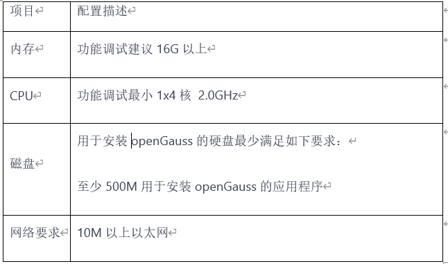

### 系统模块

~~~
openGauss-tools-monitor
├── image                               // 项目图片资源    
├── monitor-tools                       // 子项目         
        └── java
              └──common                 // 项目公共资源
              └──config                 // spring基础配置
              └──controller             // 用户访问控制层
              └──entity                 // 实体类信息
              └──exception              // 异常处理类
              └──manager                // 异步处理类
              └──mapper                 // 数据持久层
              └──preloading             // 项目初始化加载类
              └──prometheustools        // prometheus工具类
              └──quartz                 // 定时任务管理类
              └──util                   // 工具类
              └──MonitorPluginStart     // 项目启动类
         └── resources
                 └── static             // 项目静态资源
                 └── application.yaml   // 项目基础配置文件               
~~~

### 架构图

 yh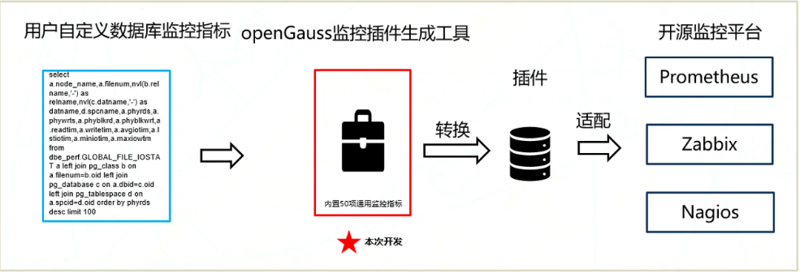

### 工具的安装windows

#### 1.安装jdk

* Oracle官方下载:https://www.oracle.com/java/technologies/downloads/
* 双击打开下载好的jdk,点击下一步,安装完成后进行java环境变量的配置
* 右键我的电脑,点击属性,点击高级系统设置,点击环境变量。
* 在系统变量中新建JAVA_HONE,变量值为java的安装路径
* 在path写入bin所在的路径,如图所示;
* 打开cmd命令执行java -version,结果为java version "java版本号",安装成功。

<table>
    <tr>
        <td>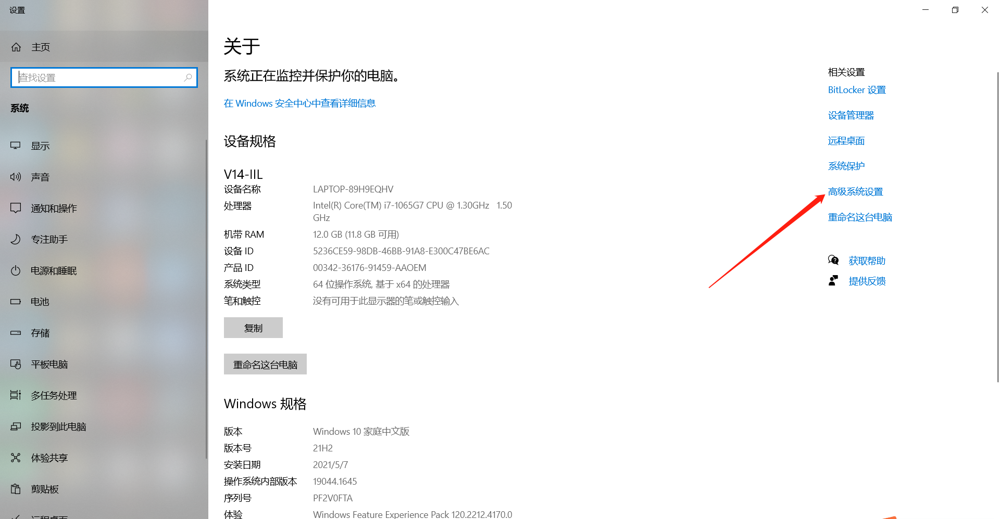</td>
        <td>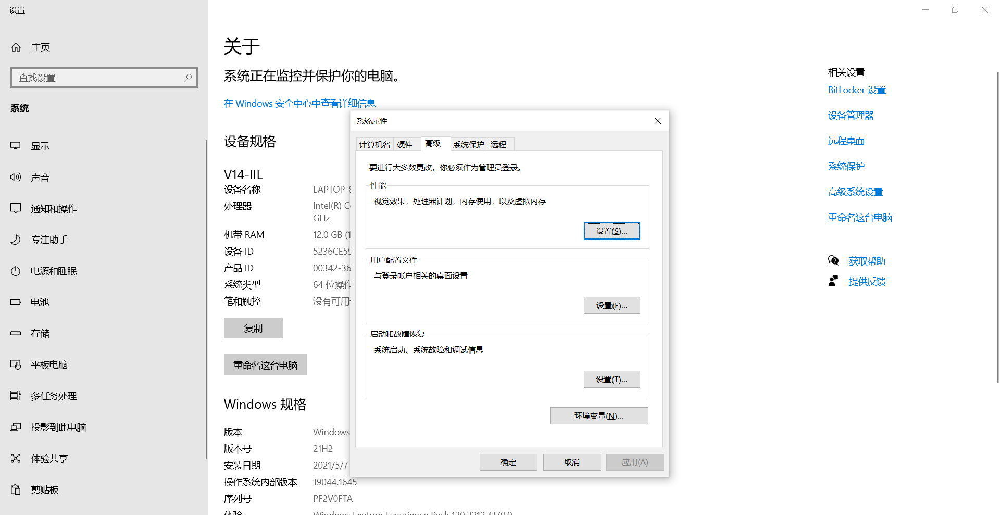</td>
    </tr>
    <tr>
        <td>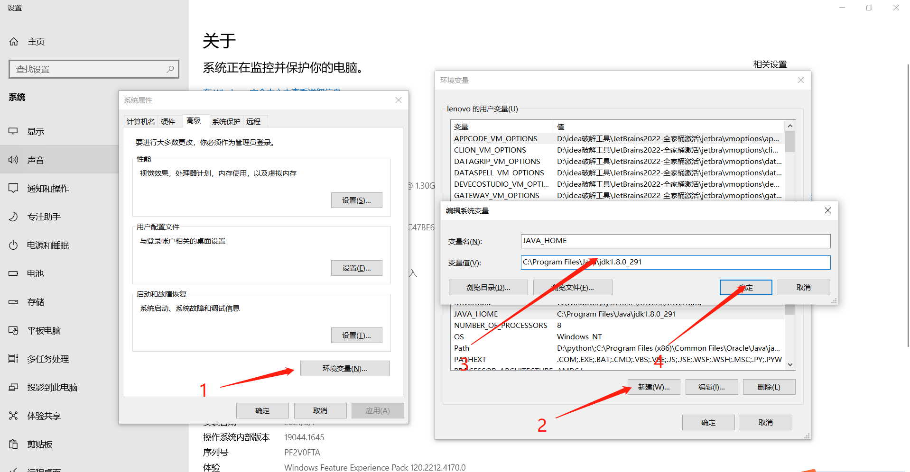</td>
        <td>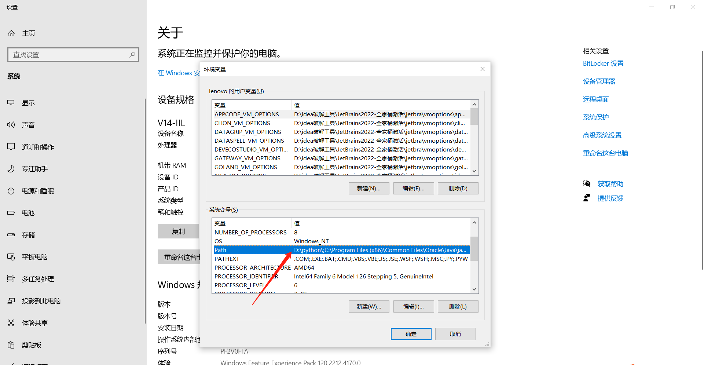</td>
    </tr>
    <tr>
        <td>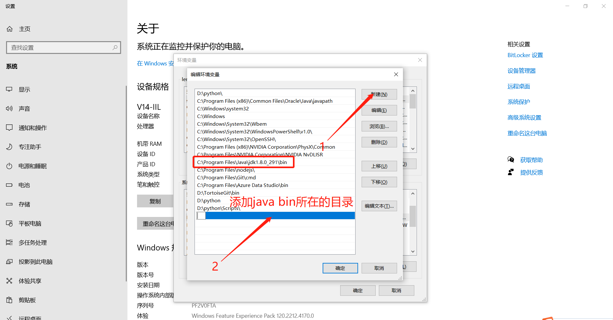</td>
        <td></td>
    </tr>
</table>

### 工具的安装linux-Centos7

#### 1.安装jdk

* 进入oracle官网下载linux版本jdk8,地址:https://www.oracle.com/java/technologies/downloads/#java8
* cd /usr/local (注:目录自定义);
* mkdir jdk
* 上传jdk到目录/usr/local/jdk
* 执行tar -zxcv jdk-8u341-linux-x64.tar.gz
* 配置成功后,进行环境变量的配置
* vim /etc/profile
* 添加如下命令
* export JAVA_HOME=/usr/local/jdk/jdk1.8.0_341
* export CLASSPATH=$:CLASSPATH:$JAVA_HOME/lib/
* export PATH=$PATH:$JAVA_HOME/bin
* 刷新环境变量:执行source /etc/profile
* 查看java版本:执行java -version

<table>
    <tr>
        <td>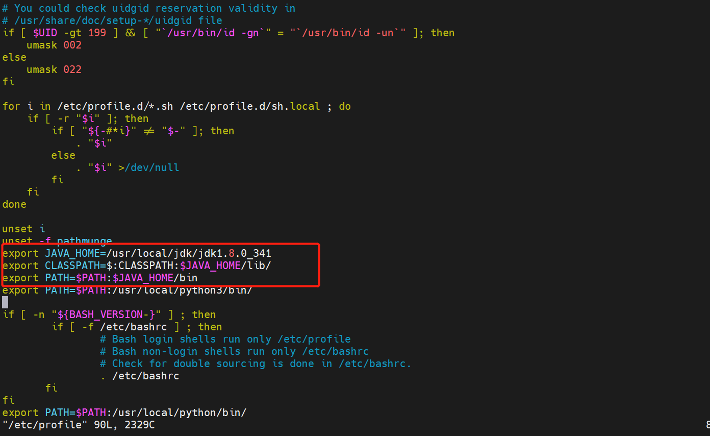</td>
        <td>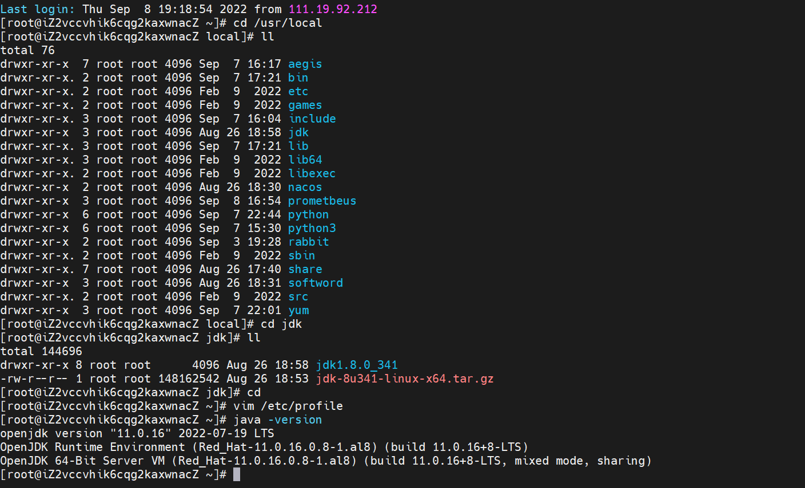</td>
    </tr>
</table>

### openGauss数据库监控插件工具使用说明
* 环境的准备,安装jdk1.8(参考工具的安装windows)。
* 以idea为例参考下图
* 下载项目:git clone git@gitee.com:opengauss/openGauss-workbench.git
* 使用maven打包编译
* 打包完成后在openGauss-workbench\plugins\openGauss-tools-monitor\monitor-tools\target目录中找到monitor-tools-7.0.0-RC2-repackage.jar即为插件安装包。
* 打开并登陆openGauss一体化平台，点击插件管理-安装插件，将上述步骤获得的安装包上传并安装。
* 刷新页面可在右侧菜单栏看到监控插件工具菜单即为安装成功。

<table>
    <tr>
        <td>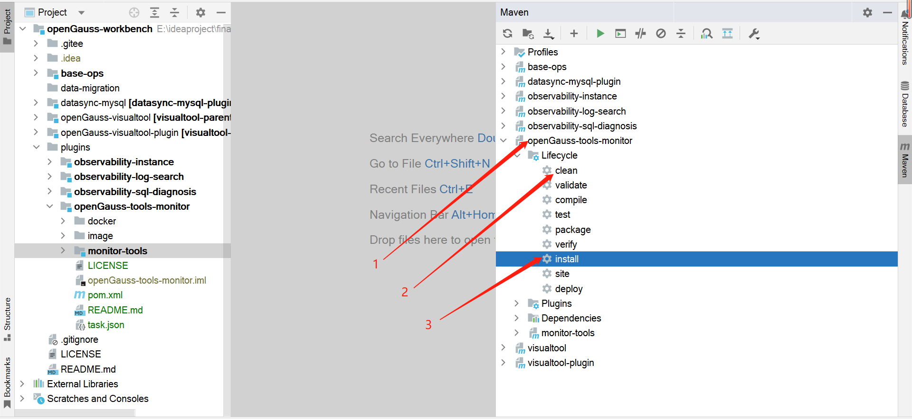</td>
        <td>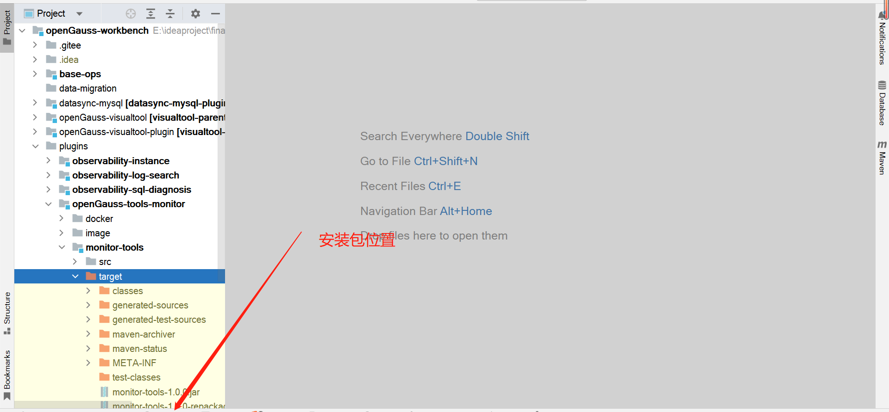</td>
    </tr>
</table>

### 演示图

<table>
    <tr>
        <td>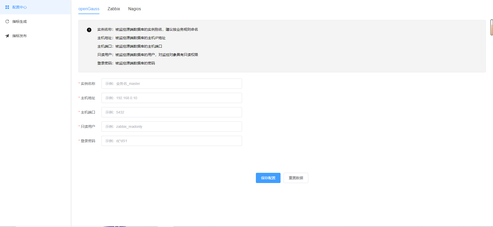</td>
        <td></td>
    </tr>
    <tr>
        <td>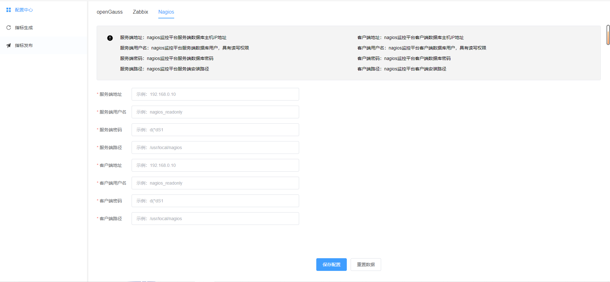</td>
        <td>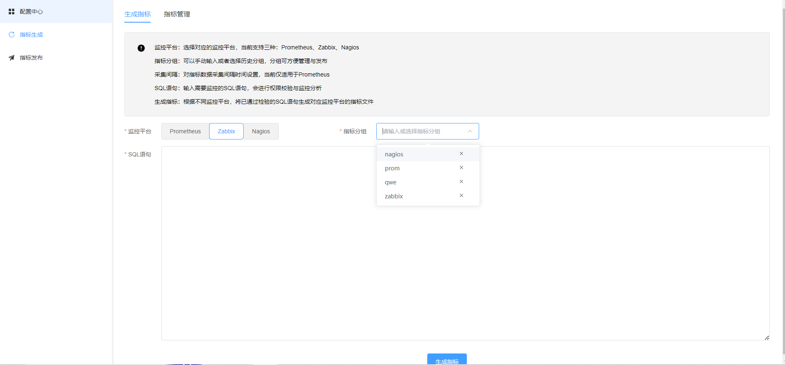</td>
    </tr>
    <tr>
        <td>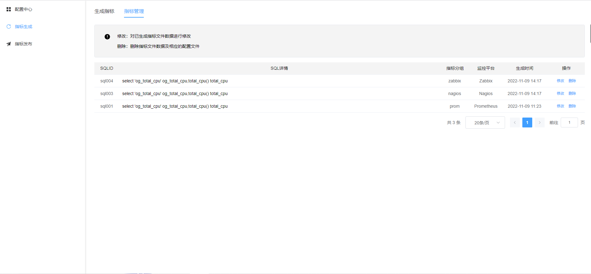</td>
        <td>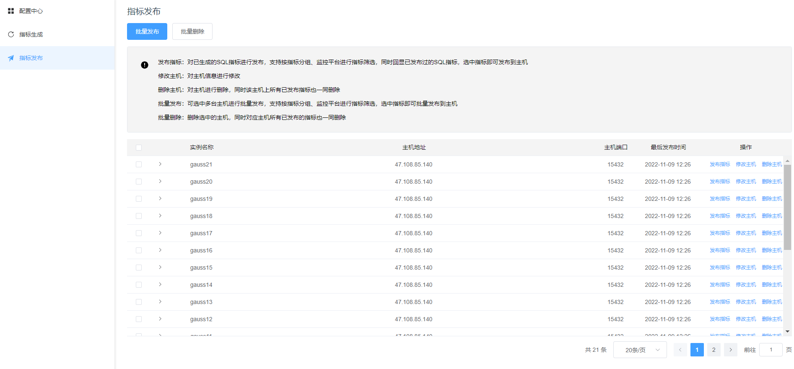</td>
    </tr>
</table>

